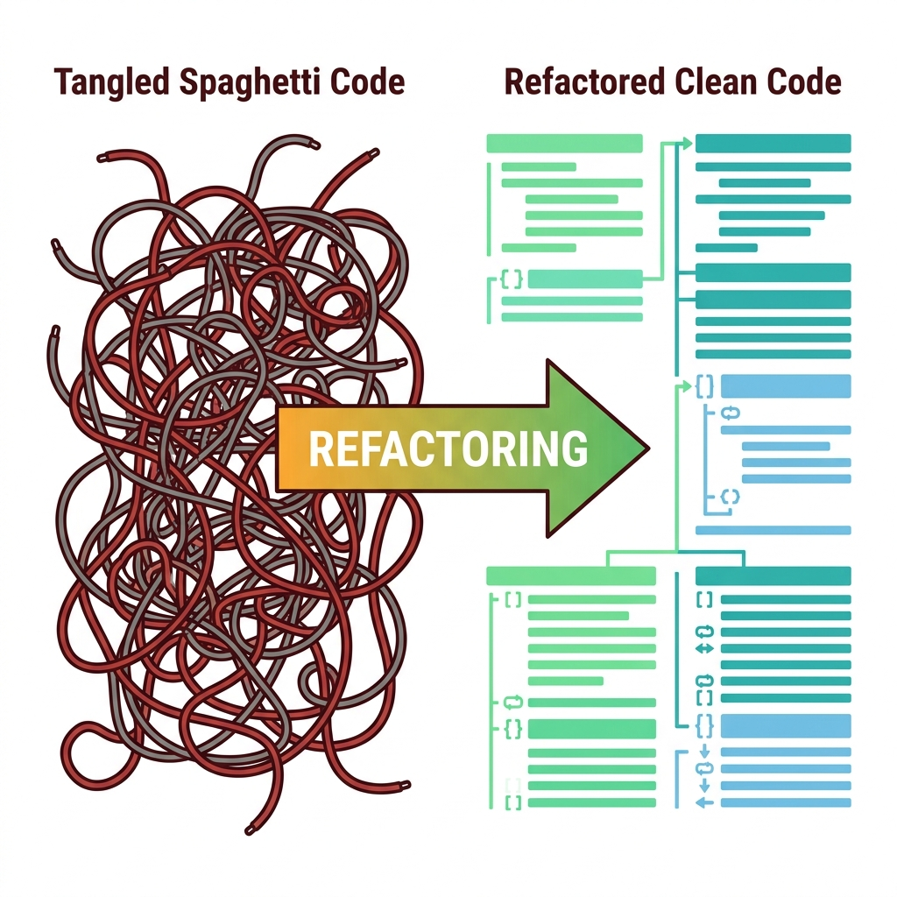

# ✂️ Refactoring

> **Nguồn gốc:** Nội dung tổng hợp và tham khảo từ [Refactoring.Guru](https://refactoring.guru/) — Tác giả: **Alexander Shvets**, Minh họa: **Dmitry Zhart**. Đây là tài liệu tổng hợp lại cho mục đích học tập, mọi quyền thuộc về tác giả gốc.

**Refactoring** là quá trình cải thiện code có hệ thống mà **KHÔNG tạo ra chức năng mới**. Nó biến đổi code lộn xộn thành clean code và thiết kế đơn giản.

Mục tiêu của refactoring là giữ cho codebase luôn sạch sẽ, dễ hiểu và dễ bảo trì — giúp team phát triển nhanh hơn và ít bug hơn theo thời gian.

---

## 📚 Nội dung

### 1. [What is Refactoring](./01-What-is-Refactoring/01-clean-code.md)

Hiểu bản chất của refactoring — từ khái niệm clean code đến cách thực hiện:

| # | Chủ đề | Mô tả |
|---|--------|--------|
| 01 | [Clean Code](./01-What-is-Refactoring/01-clean-code.md) | Mục tiêu cuối cùng của refactoring — code sạch, rõ ràng |
| 02 | [Technical Debt](./01-What-is-Refactoring/02-technical-debt.md) | Nợ kỹ thuật — lý do tại sao cần refactoring |
| 03 | [When to Refactor](./01-What-is-Refactoring/03-when-to-refactor.md) | Thời điểm phù hợp để refactor |
| 04 | [How to Refactor](./01-What-is-Refactoring/04-how-to-refactor.md) | Quy trình thực hiện refactoring an toàn |

### 2. [Code Smells](./02-Code-Smells/00-code-smells-overview.md)

Nhận diện các dấu hiệu cho thấy code cần được refactor:

- **Bloaters** — Code, method, class phình to quá mức
- **Object-Orientation Abusers** — Áp dụng OOP sai cách
- **Change Preventers** — Code khó thay đổi, sửa một chỗ phải sửa nhiều chỗ
- **Dispensables** — Code thừa, không cần thiết
- **Couplers** — Các class liên kết quá chặt với nhau

### 3. [Refactoring Techniques](./03-Refactoring-Techniques/00-techniques-overview.md)

Các kỹ thuật refactoring cụ thể để xử lý code smells:

- **Composing Methods** — Tái cấu trúc method
- **Moving Features between Objects** — Di chuyển tính năng giữa các object
- **Organizing Data** — Tổ chức dữ liệu
- **Simplifying Conditional Expressions** — Đơn giản hóa biểu thức điều kiện
- **Simplifying Method Calls** — Đơn giản hóa lời gọi method
- **Dealing with Generalization** — Xử lý kế thừa và tổng quát hóa

---

## 🎮 Tại sao Game Dev cần Refactoring?

Game development có những thách thức riêng khiến refactoring trở nên đặc biệt quan trọng:

1. **Prototype → Production Pipeline** — Game thường bắt đầu bằng prototype nhanh, sau đó phát triển thành sản phẩm hoàn chỉnh. Refactoring giúp chuyển đổi code prototype thành production-ready code.

2. **Iteration liên tục** — Game design thay đổi liên tục trong quá trình phát triển. Code cần đủ linh hoạt để thích ứng với thay đổi gameplay mà không bị vỡ.

3. **Performance-critical** — Game chạy real-time ở 30/60 FPS. Code lộn xộn không chỉ khó đọc mà còn gây lag, frame drop và trải nghiệm xấu cho người chơi.

4. **Team collaboration** — Dự án game thường có nhiều người (programmer, designer, artist) cùng làm việc. Clean code giúp mọi người hiểu và đóng góp hiệu quả hơn.

5. **Long-term maintenance** — Live-service games cần được bảo trì nhiều năm. Technical debt tích lũy sẽ khiến việc thêm content mới hay fix bug trở nên cực kỳ tốn kém.

---

## 🗺️ Điều hướng

| Hướng | Liên kết |
|-------|----------|
| 📖 Bắt đầu | [Clean Code →](./01-What-is-Refactoring/01-clean-code.md) |
| 👃 Code Smells | [Code Smells Overview →](./02-Code-Smells/00-code-smells-overview.md) |
| 🔧 Kỹ thuật | [Refactoring Techniques →](./03-Refactoring-Techniques/00-techniques-overview.md) |

---

> 📝 **Nguồn gốc:** [Refactoring.Guru](https://refactoring.guru/) · Tác giả: Alexander Shvets · Minh họa: Dmitry Zhart
