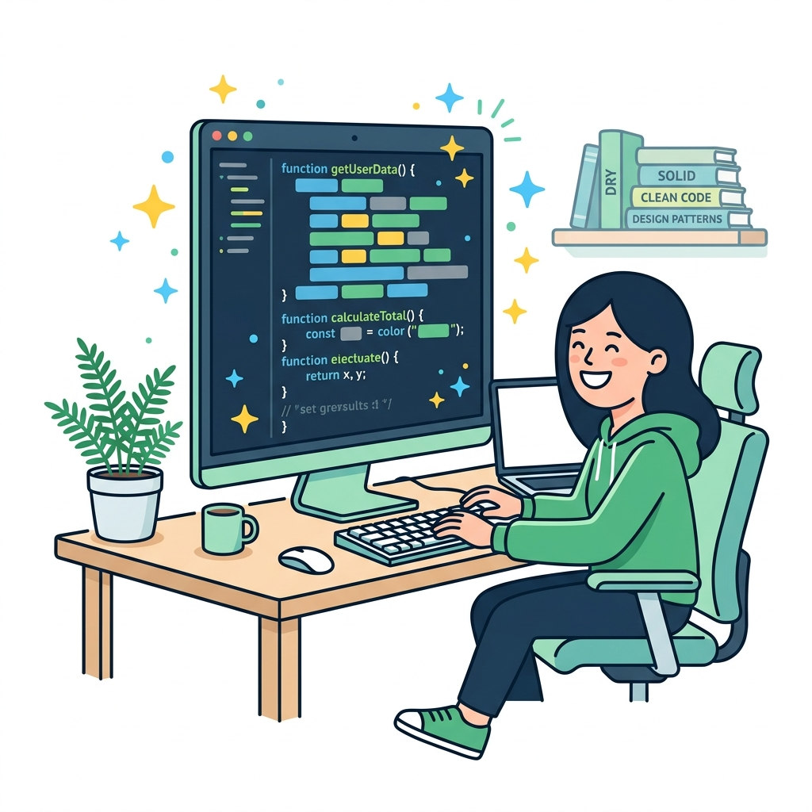

# 🧹 Clean Code

> **Nguồn gốc:** Tổng hợp và tham khảo từ [Refactoring.Guru — What is Refactoring](https://refactoring.guru/refactoring/what-is-refactoring)
> Tác giả: **Alexander Shvets** · Minh họa: **Dmitry Zhart**
> Đây là tài liệu tóm tắt cho mục đích học tập, mọi quyền thuộc về tác giả gốc.

## Clean Code là gì?

Mục đích chính của refactoring là **chống lại technical debt**. Nó biến đổi code lộn xộn (messy code) thành **clean code** — code sạch, rõ ràng và dễ bảo trì.

Nhưng thế nào là "clean code"? Mỗi lập trình viên có thể có định nghĩa riêng, nhưng nhìn chung clean code có những đặc điểm sau:

---

## Đặc điểm của Clean Code

### 1. 📖 Rõ ràng cho lập trình viên khác

Clean code phải **dễ đọc và dễ hiểu** cho bất kỳ lập trình viên nào, không chỉ người viết ra nó.

- **Naming tốt** — Tên biến, hàm, class mô tả rõ ràng mục đích
- **Logic dễ theo dõi** — Luồng code có thể hiểu được mà không cần comment giải thích phức tạp
- **Không có trick hay hack** — Code thẳng thắn, không dùng "mánh" khó hiểu

> 💡 Code được đọc nhiều hơn được viết. Đầu tư thời gian viết code dễ đọc sẽ tiết kiệm rất nhiều thời gian sau này.

### 2. 🔄 Không có code trùng lặp (DRY)

**DRY — Don't Repeat Yourself.** Mỗi đoạn logic chỉ nên xuất hiện **một lần** trong codebase.

- Nếu bạn thấy cùng một đoạn code xuất hiện ở nhiều nơi, đó là dấu hiệu cần extract ra method hoặc class chung
- Code trùng lặp nghĩa là khi sửa bug, bạn phải sửa ở nhiều chỗ — và rất dễ bỏ sót

### 3. 📦 Số lượng class/method tối thiểu cần thiết

Clean code giữ mọi thứ **đơn giản và tối giản**:

- Không tạo class hay method không cần thiết (over-engineering)
- Không thêm abstraction layer khi chưa cần
- Giữ theo nguyên tắc **YAGNI** — You Aren't Gonna Need It

### 4. ✅ Vượt qua tất cả test

Code clean là code **hoạt động đúng theo specification**:

- Có test coverage đầy đủ cho các trường hợp quan trọng
- Tất cả test pass — code làm đúng những gì được yêu cầu
- Dễ viết test mới khi cần thêm tính năng

---

## Dirty Code (Code bẩn)

Ngược lại với clean code là **dirty code** — code lộn xộn, khó hiểu, khó bảo trì:

| Đặc điểm | Dirty Code | Clean Code |
|-----------|------------|------------|
| **Đọc hiểu** | Mất hàng giờ để hiểu | Vài phút là nắm được |
| **Thay đổi** | Sửa 1 chỗ, vỡ 10 chỗ | Thay đổi cục bộ, không ảnh hưởng |
| **Trùng lặp** | Copy-paste khắp nơi | Mỗi logic một nơi duy nhất |
| **Naming** | `temp`, `data`, `x`, `doStuff()` | `playerHealth`, `CalculateDamage()` |
| **Complexity** | Method 500 dòng, 10 cấp if-else | Method ngắn gọn, logic rõ ràng |

Dirty code không phải lúc nào cũng do lập trình viên thiếu kinh nghiệm. Áp lực deadline, yêu cầu thay đổi liên tục, hay thiếu hiểu biết về domain đều có thể tạo ra code bẩn — và đó chính là lúc cần refactoring.

---

## 🎮 Trong Game Dev

Trong phát triển game, clean code đặc biệt quan trọng vì:

- **MonoBehaviour scripts** dễ trở nên cồng kềnh khi gom cả input, logic, rendering vào một file. Clean code nghĩa là tách biệt các responsibility rõ ràng.

- **Naming trong game** cần phải cụ thể:
  - ❌ `void DoAction()` → ✅ `void ApplyDamageToTarget()`
  - ❌ `float val` → ✅ `float moveSpeed`
  - ❌ `GameObject obj` → ✅ `GameObject projectilePrefab`

- **ScriptableObject và Prefab** giúp áp dụng DRY — thay vì hardcode giá trị ở nhiều nơi, bạn centralize data vào asset có thể reuse.

- **Play mode testing** — Trong Unity, bạn có thể bấm Play để kiểm tra ngay lập tức. Hãy tận dụng điều này để verify code hoạt động đúng sau mỗi lần refactor.

---

## 🗺️ Điều hướng

| Hướng | Liên kết |
|-------|----------|
| ← Tổng quan | [Refactoring Overview](../00-refactoring-overview.md) |
| → Tiếp theo | [Technical Debt](./02-technical-debt.md) |

---

> 📝 **Nguồn gốc:** [Refactoring.Guru](https://refactoring.guru/) · Tác giả: Alexander Shvets · Minh họa: Dmitry Zhart
