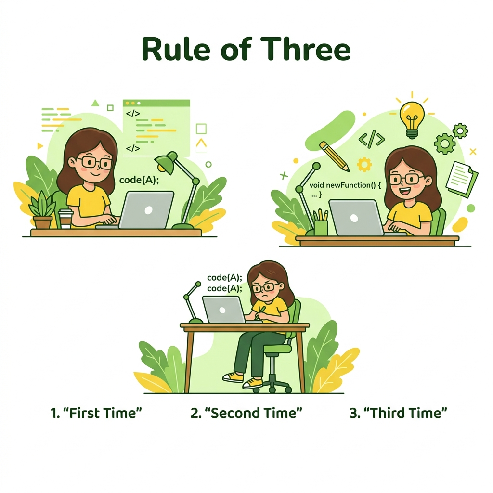

# ⏰ When to Refactor (Khi nào nên Refactor)

> **Nguồn gốc:** Tổng hợp và tham khảo từ [Refactoring.Guru — When to Refactor](https://refactoring.guru/refactoring/when)
> Tác giả: **Alexander Shvets** · Minh họa: **Dmitry Zhart**
> Đây là tài liệu tóm tắt cho mục đích học tập, mọi quyền thuộc về tác giả gốc.



## Khi nào nên Refactor?

Refactoring không phải là một task riêng biệt trong sprint — nó nên là một **phần tự nhiên** của quy trình phát triển hàng ngày. Nhưng cụ thể thì khi nào?

---

## Quy tắc 3 lần (Rule of Three)

Đây là heuristic đơn giản nhất để biết khi nào nên refactor:

1. **Lần đầu** — Bạn viết code để làm một việc. Cứ viết thôi, đừng lo ✅
2. **Lần thứ hai** — Bạn viết code tương tự lần nữa. Hơi khó chịu, nhưng tạm chấp nhận ⚠️
3. **Lần thứ ba** — Bạn lại viết code tương tự. **Dừng lại và refactor!** 🛑

> 💡 *"Three strikes and you refactor"* — Khi đoạn code tương tự xuất hiện lần thứ 3, đó là tín hiệu rõ ràng rằng cần extract nó thành một abstraction chung.

---

## Các thời điểm tốt để Refactor

### 1. 🆕 Khi thêm tính năng mới (Adding a Feature)

Đây là thời điểm phổ biến nhất để refactor:

- Bạn cần **hiểu code cũ** trước khi thêm code mới → refactor để code dễ hiểu hơn
- Code cũ không đủ linh hoạt để nhận feature mới → refactor để mở rộng
- Bạn nhận ra pattern lặp lại → refactor trước khi thêm instance thứ 3

> Refactoring ở bước này giúp feature mới **dễ implement hơn** và code tổng thể **sạch hơn trước**.

### 2. 🐛 Khi sửa bug (Fixing a Bug)

Bug thường ẩn trong code phức tạp, khó hiểu:

- Nếu code đủ clean, bug đã được phát hiện sớm hơn
- Refactoring code xung quanh bug giúp bạn **hiểu rõ nguyên nhân**
- Code sạch hơn → ít nơi cho bug ẩn nấp hơn

### 3. 👀 Khi code review (Code Review)

Code review là cơ hội cuối cùng để cải thiện code trước khi merge:

- Fresh eyes nhìn thấy vấn đề mà tác giả không thấy
- Có thể refactor ngay với sự đồng thuận của cả hai bên
- Chia sẻ kiến thức và nâng cao chất lượng code của team

---

## ⛔ Khi nào KHÔNG nên Refactor

Không phải lúc nào refactor cũng là lựa chọn đúng:

### Code quá lộn xộn — cần viết lại

Khi code đã quá tệ đến mức **refactor tốn nhiều thời gian hơn viết lại từ đầu**, hãy cân nhắc rewrite. Dấu hiệu:

- Không ai trong team hiểu code đang làm gì
- Code không có test → không thể refactor an toàn
- Architecture sai từ gốc, không thể cải thiện từng bước

> ⚠️ **Nhưng cẩn thận:** Rewrite cũng rất rủi ro. Chỉ nên rewrite khi có test coverage cho behavior hiện tại để đảm bảo hệ thống mới hoạt động đúng như cũ.

### Deadline rất gần

Nếu deadline sát nút và code hiện tại "hoạt động được", hãy ship trước, refactor sau. Technical debt từ quyết định này cần được ghi nhận và lên kế hoạch xử lý.

### Code sẽ bị bỏ đi

Nếu một module sắp bị thay thế hoàn toàn, không cần tốn thời gian refactor nó.

---

## 🎮 Trong Game Dev

### 🏁 Sau mỗi Milestone

Mỗi milestone (alpha, beta, vertical slice) là thời điểm tốt để refactor:

```
Milestone hoàn thành
    ↓
Sprint 0: Refactoring & Tech Debt
    ↓
Bắt đầu milestone tiếp theo với codebase sạch
```

### 🔄 Từ Prototype → Production

Khi prototype được phê duyệt và team quyết định phát triển tiếp:

- **Đánh giá** những gì có thể giữ lại vs. cần viết lại
- **Thiết kế architecture** phù hợp cho production
- **Refactor hoặc rewrite** từng module một, không làm cả đống cùng lúc

### 👋 Khi Onboarding thành viên mới

Developer mới join team là lúc tốt để refactor:

- Họ đọc code với **fresh eyes** — dễ phát hiện code khó hiểu
- Những câu hỏi "Tại sao code này lại thế?" thường chỉ ra vấn đề thực sự
- Refactoring giúp onboarding nhanh hơn và tạo documentation sống

### 🎮 Ví dụ thời điểm refactor trong game cycle

| Giai đoạn | Nên Refactor? | Lý do |
|-----------|:---:|--------|
| Game Jam (48h) | ❌ | Tập trung ship, code là throwaway |
| Prototype | ⚠️ Ít | Refactor nhẹ nếu prototype kéo dài |
| Pre-production | ✅ Nhiều | Thiết lập nền tảng architecture |
| Production | ✅ Đều đặn | Refactor khi thêm feature/fix bug |
| Pre-release crunch | ❌ | Ship trước, ghi nhận nợ |
| Post-release | ✅ Nhiều | Trả nợ kỹ thuật, chuẩn bị DLC/update |

---

## 🗺️ Điều hướng

| Hướng | Liên kết |
|-------|----------|
| ← Trước | [Technical Debt](./02-technical-debt.md) |
| → Tiếp theo | [How to Refactor](./04-how-to-refactor.md) |

---

> 📝 **Nguồn gốc:** [Refactoring.Guru](https://refactoring.guru/) · Tác giả: Alexander Shvets · Minh họa: Dmitry Zhart
