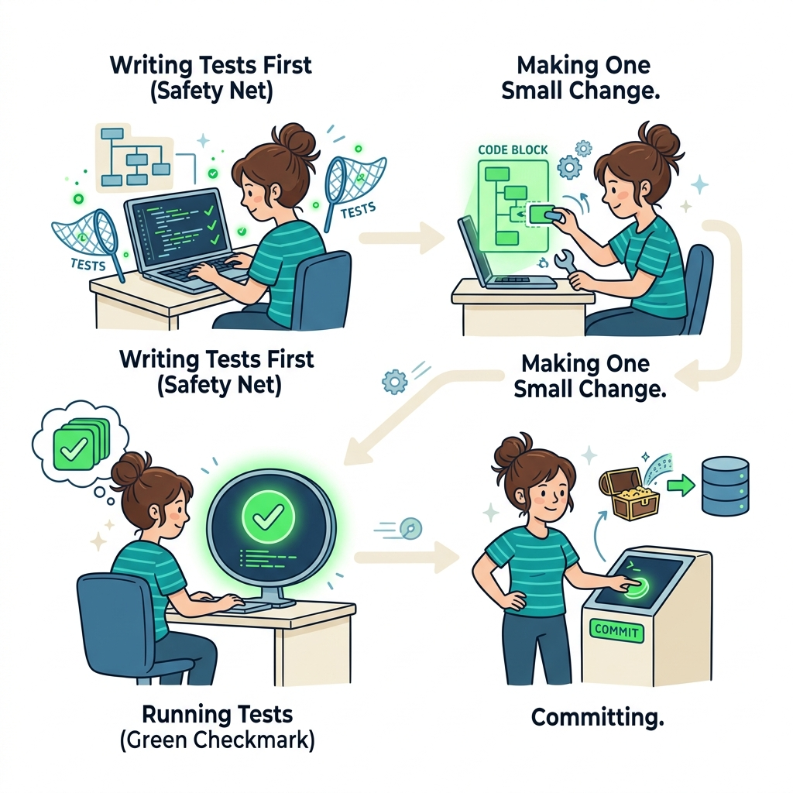
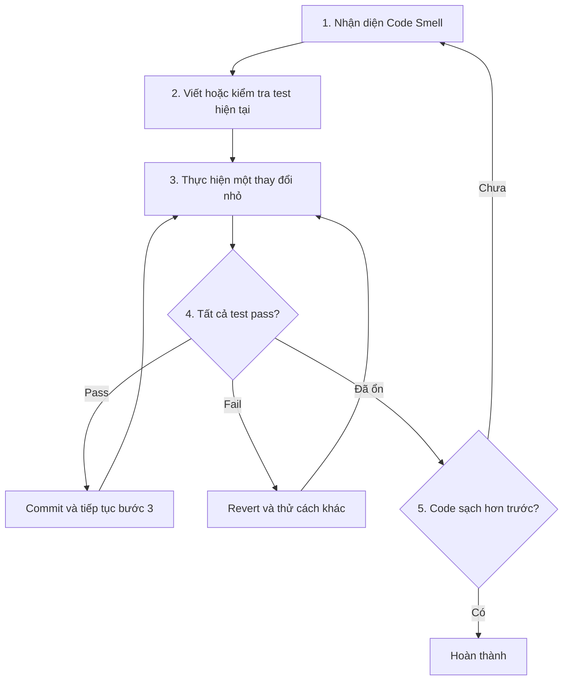

# 🔧 How to Refactor (Cách thực hiện Refactoring)

> **Nguồn gốc:** Tổng hợp và tham khảo từ [Refactoring.Guru — How to Refactor](https://refactoring.guru/refactoring/how-to)
> Tác giả: **Alexander Shvets** · Minh họa: **Dmitry Zhart**
> Đây là tài liệu tóm tắt cho mục đích học tập, mọi quyền thuộc về tác giả gốc.



## Cách thực hiện Refactoring

Refactoring phải được thực hiện **cẩn thận và có hệ thống**. Nếu làm sai cách, bạn có thể tạo ra bug mới hoặc lãng phí thời gian mà code không tốt hơn. Dưới đây là những nguyên tắc và quy trình cần tuân theo.

---

## 3 Nguyên tắc vàng

Checklist bắt buộc cho mọi lần refactoring:

### ✅ 1. Code phải sạch hơn sau refactoring

Đây là mục tiêu cốt lõi. Nếu sau khi refactor xong mà code không rõ ràng hơn, đơn giản hơn — bạn đã làm sai gì đó.

Đôi khi bạn bắt đầu refactor nhưng nhận ra vấn đề quá lớn. Trong trường hợp đó, hãy **ghi nhận lại** (document) và quay lại sau, thay vì cố gắng refactor một nửa rồi bỏ dở.

### ✅ 2. Không tạo chức năng mới trong quá trình refactoring

**Tuyệt đối không trộn lẫn** refactoring với thêm tính năng mới:

- Refactoring = thay đổi **cấu trúc** code, giữ nguyên **hành vi**
- Adding feature = thay đổi **hành vi** code

Nếu bạn đang refactor mà nghĩ ra feature mới, hãy **ghi lại** (TODO/ticket) và thực hiện sau. Mixing hai việc này làm tăng rủi ro lỗi và khó rollback.

### ✅ 3. Tất cả test hiện có phải pass sau mỗi bước

Mỗi bước refactoring nhỏ, bạn cần đảm bảo **tất cả test vẫn pass**:

- Test fail sau refactoring = bạn đã thay đổi behavior, không chỉ cấu trúc
- Nếu không có test → **viết test trước** khi refactor (đây là safety net của bạn)
- Không bao giờ skip bước chạy test

---

## Quy trình thực hiện

Quy trình refactoring an toàn theo từng bước:



### Chi tiết từng bước:

**Bước 1 — Nhận diện Code Smell:** Tìm ra vấn đề cụ thể cần giải quyết. Xem [Code Smells](../02-Code-Smells/00-code-smells-overview.md) để nhận diện.

**Bước 2 — Đảm bảo test coverage:** Viết test cho behavior hiện tại nếu chưa có. Đây là bước quan trọng nhất — test là safety net bảo vệ bạn khỏi phá vỡ code.

**Bước 3 — Thay đổi nhỏ:** Mỗi lần chỉ thay đổi một thứ nhỏ. Ví dụ: rename một biến, extract một method, move một field. Không bao giờ làm nhiều thay đổi lớn cùng lúc.

**Bước 4 — Chạy test:** Sau MỖI thay đổi nhỏ, chạy lại toàn bộ test. Nếu fail, revert ngay lập tức.

**Bước 5 — Review:** Nhìn lại toàn bộ thay đổi. Code có tốt hơn không? Nếu chưa, tiếp tục refactor hoặc revert.

---

## 💡 Lời khuyên

### Giữ commit riêng biệt

Tách commit refactoring ra khỏi commit feature/bugfix:

```
✅ Tốt:
  commit 1: "Refactor: Extract CalculateDamage from PlayerCombat"
  commit 2: "Feature: Add critical hit multiplier"

❌ Xấu:
  commit 1: "Refactor PlayerCombat and add critical hit"
```

**Lý do:** Nếu feature mới gây bug, bạn có thể revert commit feature mà vẫn giữ refactoring. Nếu trộn lẫn, bạn phải revert cả hai.

### Thay đổi nhỏ, tăng dần (Small Incremental Changes)

- Mỗi thay đổi nên mất **vài phút**, không phải vài giờ
- Nếu refactoring quá lớn, chia nhỏ thành nhiều bước
- Commit thường xuyên — mỗi bước nhỏ thành công là một commit

### Đừng cầu toàn

- Không cần refactor mọi thứ cùng lúc
- Tập trung vào phần code bạn đang **actively working on**
- "Boy Scout Rule": Luôn để code sạch hơn lúc bạn tìm thấy nó

---

## 🎮 Trong Game Dev

### 🎮 Sử dụng Play Mode để test

Trong Unity, **Play mode** là công cụ testing nhanh nhất:

- Sau mỗi thay đổi refactoring → bấm Play → kiểm tra game hoạt động đúng
- Sử dụng Debug.Log để verify logic
- Kiểm tra Inspector values trong runtime

Ngoài ra, hãy viết **Unit Test** với Unity Test Framework cho logic quan trọng:

```
Tests/
├── EditMode/
│   ├── DamageCalculationTests.cs
│   └── InventorySystemTests.cs
└── PlayMode/
    ├── PlayerMovementTests.cs
    └── EnemyAITests.cs
```

### 🔀 Sử dụng Version Control

Version control (Git) là **bắt buộc** khi refactoring:

- **Branch riêng** cho refactoring lớn: `refactor/player-combat-system`
- **Commit thường xuyên** với message rõ ràng
- **Revert dễ dàng** nếu refactoring đi sai hướng
- **Pull request** để team review trước khi merge

### 🛠️ Công cụ hỗ trợ trong Unity/IDE

| Công cụ | Chức năng |
|---------|-----------|
| **Rider/VS Refactoring** | Rename, Extract Method, Move tự động |
| **Unity Test Framework** | Unit test cho game logic |
| **Unity Profiler** | Kiểm tra performance sau refactoring |
| **Git** | Version control, branch, revert |
| **Rider Inspections** | Tự động phát hiện code smells |

### 📋 Checklist Refactoring cho Game Dev

Trước khi bắt đầu refactor một system trong game:

- [ ] Đã commit code hiện tại (clean working directory)
- [ ] Có test hoặc cách verify behavior hiện tại
- [ ] Đã tạo branch riêng cho refactoring (nếu thay đổi lớn)
- [ ] Không đang trong giai đoạn crunch/deadline gấp
- [ ] Đã xác định rõ code smell cần xử lý
- [ ] Đã chọn refactoring technique phù hợp

---

## 🗺️ Điều hướng

| Hướng | Liên kết |
|-------|----------|
| ← Trước | [When to Refactor](./03-when-to-refactor.md) |
| → Tiếp theo | [Code Smells →](../02-Code-Smells/00-code-smells-overview.md) |
| 🏠 Tổng quan | [Refactoring Overview](../00-refactoring-overview.md) |

---

> 📝 **Nguồn gốc:** [Refactoring.Guru](https://refactoring.guru/) · Tác giả: Alexander Shvets · Minh họa: Dmitry Zhart
