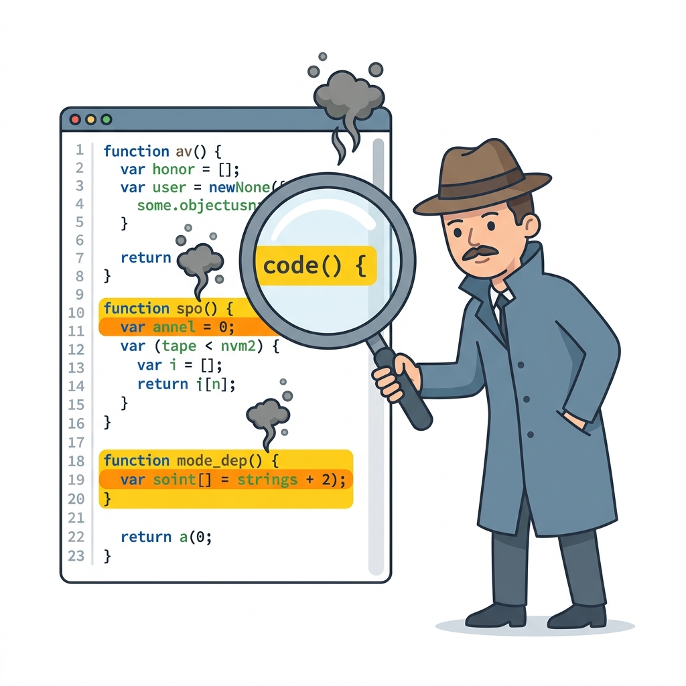

# 🦨 Code Smells

> 📖 **Nguồn:** [Refactoring.Guru — Code Smells](https://refactoring.guru/refactoring/smells) | Tác giả: Alexander Shvets

## Code Smells là gì?

**Code Smells** là các dấu hiệu bề mặt cho thấy có vấn đề sâu hơn bên dưới. Chúng không phải bug — code vẫn chạy — nhưng chúng cần được refactoring. Giống như mùi khó chịu trong nhà bếp cho thấy thức ăn đang hỏng, code smells báo hiệu rằng thiết kế code đang có vấn đề cần giải quyết.

> [!NOTE]
> Code Smells không phải lúc nào cũng cần fix ngay. Chúng là **chỉ dẫn** để bạn biết đâu cần xem xét kỹ hơn.

## 📂 Phân loại Code Smells

Có **23 code smells** được chia thành **5 nhóm chính**:

### 1. 📦 [Bloaters](./01-Bloaters/00-bloaters-overview.md)
Code, method hoặc class đã **phình to** đến mức khó làm việc. Thường tích tụ dần theo thời gian khi chương trình phát triển.

> **5 smells:** Long Method · Large Class · Primitive Obsession · Long Parameter List · Data Clumps

### 2. 🔨 [Object-Orientation Abusers](./02-OO-Abusers/00-oo-abusers-overview.md)
Áp dụng **OOP không đúng cách** hoặc không đầy đủ, dẫn đến code không tận dụng được sức mạnh của hướng đối tượng.

> **4 smells:** Switch Statements · Temporary Field · Refused Bequest · Alternative Classes with Different Interfaces

### 3. 🚧 [Change Preventers](./03-Change-Preventers/00-change-preventers-overview.md)
Khi thay đổi **một chỗ** buộc phải **sửa nhiều chỗ** khác. Những smell này khiến việc phát triển trở nên chậm chạp và rủi ro.

> **3 smells:** Divergent Change · Shotgun Surgery · Parallel Inheritance Hierarchies

### 4. 🗑️ [Dispensables](./04-Dispensables/00-dispensables-overview.md)
Code **thừa thãi** — nếu bỏ đi sẽ sạch hơn, dễ hiểu hơn, hiệu quả hơn.

> **6 smells:** Comments · Duplicate Code · Lazy Class · Data Class · Dead Code · Speculative Generality

### 5. 🔗 [Couplers](./05-Couplers/00-couplers-overview.md)
**Coupling quá mức** giữa các class, khiến chúng phụ thuộc lẫn nhau chặt chẽ và khó tách rời.

> **5 smells:** Feature Envy · Inappropriate Intimacy · Message Chains · Middle Man · Incomplete Library Class

## 📊 Tổng quan nhanh

| Nhóm | Số lượng | Vấn đề chính |
|------|:--------:|--------------|
| Bloaters | 5 | Code quá lớn, phình to |
| OO Abusers | 4 | OOP sai cách |
| Change Preventers | 3 | Khó thay đổi |
| Dispensables | 6 | Code thừa thãi |
| Couplers | 5 | Liên kết chặt quá mức |
| **Tổng** | **23** | |

## 🎮 Tại sao Game Dev cần biết Code Smells?

1. **Game code phức tạp** — Nhiều hệ thống tương tác (AI, physics, rendering, UI, networking)
2. **Iteration nhanh** — Game dev cần prototype và thay đổi liên tục theo feedback
3. **Performance-critical** — Code smells thường dẫn đến performance bottlenecks
4. **Team collaboration** — Game dev hiếm khi làm một mình, code cần dễ đọc
5. **Long-term maintenance** — Live-service games cần bảo trì hàng năm

---

> 📚 **Nguồn gốc:** Nội dung tham khảo từ [Refactoring.Guru](https://refactoring.guru/) — Tác giả: Alexander Shvets, Minh họa: Dmitry Zhart

⬅️ [Quay lại: Refactoring Overview](../00-refactoring-overview.md)
