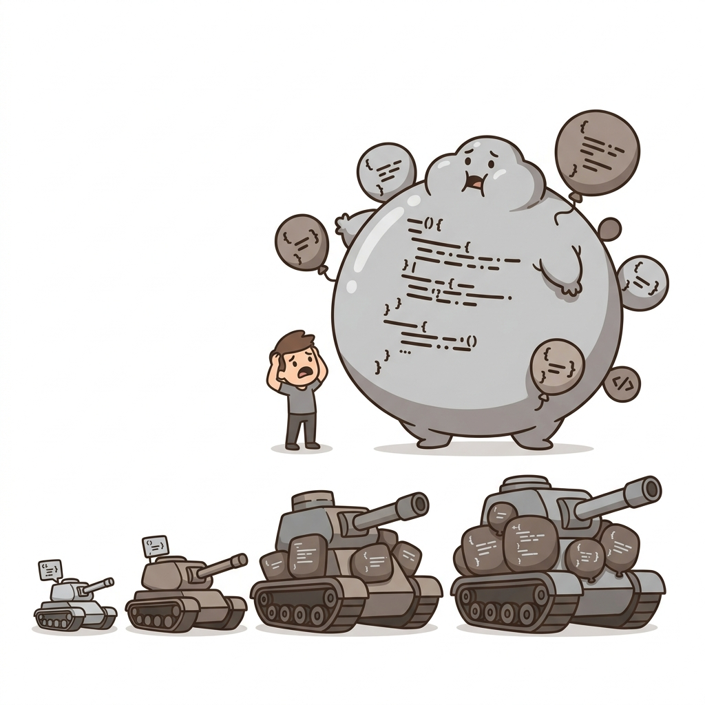

# 📦 Bloaters

> 📖 **Nguồn:** [Refactoring.Guru — Bloaters](https://refactoring.guru/refactoring/smells/bloaters) | Tác giả: Alexander Shvets

## Bloaters là gì?

**Bloaters** là code, method hoặc class đã phình to đến mức khó làm việc. Chúng thường không xuất hiện ngay lập tức mà **tích tụ dần theo thời gian** khi chương trình phát triển. Mỗi lần thêm một chút, tưởng như không đáng kể, nhưng qua nhiều tháng/năm, chúng trở thành những "quái vật" khó kiểm soát.

> [!WARNING]
> Bloaters là nhóm code smell **phổ biến nhất** trong game development vì game code thường phát triển nhanh qua nhiều iteration.

## 📋 Danh sách Code Smells

| # | Code Smell | Mô tả ngắn |
|:-:|-----------|-------------|
| 1 | [Long Method](./01-long-method.md) | Method có quá nhiều dòng code |
| 2 | [Large Class](./02-large-class.md) | Class chứa quá nhiều field, method, trách nhiệm |
| 3 | [Primitive Obsession](./03-primitive-obsession.md) | Dùng primitive types thay vì small objects |
| 4 | [Long Parameter List](./04-long-parameter-list.md) | Method nhận quá nhiều tham số |
| 5 | [Data Clumps](./05-data-clumps.md) | Nhóm dữ liệu luôn xuất hiện cùng nhau |

## 🎮 Trong Game Dev

Bloaters đặc biệt phổ biến trong game development:

- **Long Method**: Hàm `Update()` xử lý tất cả logic trong một MonoBehaviour
- **Large Class**: `GameManager` trở thành "God Object" chứa mọi thứ
- **Primitive Obsession**: Dùng `float x, float y, float z` thay vì `Vector3`
- **Long Parameter List**: `SpawnEnemy(x, y, z, hp, speed, name, level, ...)`
- **Data Clumps**: Position (x, y, z) và Rotation (rx, ry, rz) luôn đi cùng nhau

## 🔑 Nguyên tắc chung

> Khi code bắt đầu **phình to**, đó là lúc cần **tách nhỏ**. Chia để trị là chiến lược hiệu quả nhất.

---

> 📚 **Nguồn gốc:** Nội dung tham khảo từ [Refactoring.Guru](https://refactoring.guru/) — Tác giả: Alexander Shvets, Minh họa: Dmitry Zhart

⬅️ [Quay lại: Code Smells Overview](../00-code-smells-overview.md)
