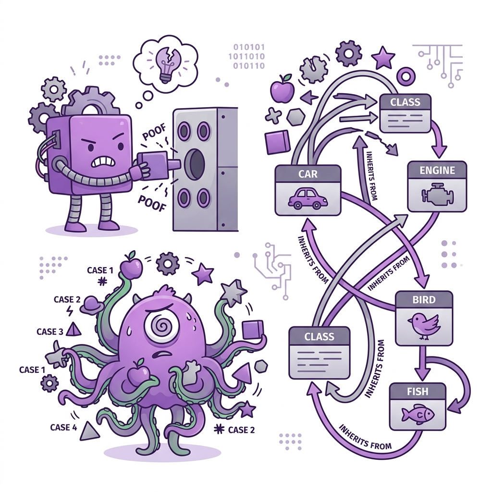

# 🔨 Object-Orientation Abusers

> 📖 **Nguồn:** [Refactoring.Guru — OO Abusers](https://refactoring.guru/refactoring/smells/oo-abusers) | Tác giả: Alexander Shvets

## OO Abusers là gì?

**Object-Orientation Abusers** là những code smell xuất hiện khi áp dụng **OOP không đúng cách** hoặc **không đầy đủ**. Code tuy dùng class và object nhưng không tận dụng được sức mạnh thực sự của hướng đối tượng — hoặc tệ hơn, lạm dụng OOP theo cách sai lầm.

> [!NOTE]
> Nhóm smell này thường gặp ở developer chuyển từ **procedural programming** sang OOP mà chưa thay đổi tư duy thiết kế.

## 📋 Danh sách Code Smells

| # | Code Smell | Mô tả ngắn |
|:-:|-----------|-------------|
| 1 | [Switch Statements](./01-switch-statements.md) | switch/if phức tạp phân loại theo type |
| 2 | [Temporary Field](./02-temporary-field.md) | Field chỉ có giá trị trong một số trường hợp |
| 3 | [Refused Bequest](./03-refused-bequest.md) | Subclass kế thừa nhưng không dùng hết từ parent |
| 4 | [Alternative Classes with Different Interfaces](./04-alternative-classes.md) | Hai class làm cùng việc nhưng interface khác nhau |

## 🎮 Trong Game Dev

OO Abusers đặc biệt phổ biến trong game development vì:
- Nhiều game dev bắt đầu từ **scripting** (tư duy procedural)
- Game có nhiều **loại entity** → dễ dùng switch thay vì polymorphism
- **Kế thừa sai cách** giữa các loại enemy, weapon, item rất thường gặp
- Code game thường **prototype nhanh** → không thiết kế OOP cẩn thận

## 🔑 Nguyên tắc chung

> OOP mạnh nhất khi sử dụng **polymorphism** để xử lý các loại khác nhau. Nếu bạn thấy mình viết switch/if theo type, hãy nghĩ đến kế thừa và interface.

---

> 📚 **Nguồn gốc:** Nội dung tham khảo từ [Refactoring.Guru](https://refactoring.guru/) — Tác giả: Alexander Shvets, Minh họa: Dmitry Zhart

⬅️ [Quay lại: Code Smells Overview](../00-code-smells-overview.md)
