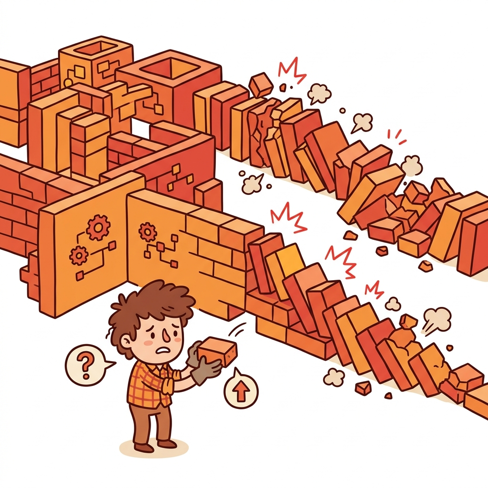

# 🚧 Change Preventers

> 📖 **Nguồn:** [Refactoring.Guru — Change Preventers](https://refactoring.guru/refactoring/smells/change-preventers) | Tác giả: Alexander Shvets

## Change Preventers là gì?

**Change Preventers** (Kẻ cản trở thay đổi) là nhóm code smells xảy ra khi việc thực hiện một thay đổi nhỏ ở một nơi trong code của bạn lại đòi hỏi bạn phải thay đổi ở nhiều nơi khác nhau. Các smell này làm cho việc phát triển tiếp trở nên rất chậm chạp, tốn thời gian và cực kỳ rủi ro vì bạn có thể bỏ sót những chỗ cần cập nhật.

> [!IMPORTANT]
> Change Preventers là khắc tinh lớn nhất của tính dễ mở rộng (maintainability & extensibility). Nếu không xử lý chúng, việc thêm các tính năng mới trong game của bạn sẽ ngày càng mất nhiều thời gian hơn và dễ gây ra bugs dây chuyền.

## 📋 Danh sách Code Smells

| # | Code Smell | Mô tả ngắn |
|:-:|-----------|-------------|
| 1 | [Divergent Change](./01-divergent-change.md) | Bạn phải thay đổi nhiều method khác nhau của **cùng một class** khi có một thay đổi bên ngoài. |
| 2 | [Shotgun Surgery](./02-shotgun-surgery.md) | Một thay đổi nhỏ yêu cầu bạn phải sửa đổi **nhiều class khác nhau** cùng một lúc. |
| 3 | [Parallel Inheritance Hierarchies](./03-parallel-inheritance.md) | Khi bạn tạo ra một subclass mới cho class này, bạn cũng buộc phải tạo thêm subclass mới cho class khác. |

## 💡 Divergent Change vs Shotgun Surgery

Hai smell này rất dễ bị nhầm lẫn vì chúng đều liên quan đến việc thay đổi code, nhưng thực tế chúng có tính chất **ngược nhau**:

- **Divergent Change** xảy ra khi **một class** có quá nhiều lý do để thay đổi (vi phạm Single Responsibility Principle). *Ví dụ:* Bạn phải sửa `GameManager` mỗi khi thêm một loại Enemy mới, HOẶC thêm một loại Weapon mới, HOẶC sửa UI.
- **Shotgun Surgery** xảy ra khi **một thay đổi** buộc bạn phải cập nhật ở rất **nhiều class** khác nhau (lỗi phân tán trách nhiệm). *Ví dụ:* Khi bạn thêm một chỉ số (stat) mới cho Player, bạn phải chỉnh sửa 10 class khác nhau bao gồm `PlayerHealth`, `PlayerCombat`, `PlayerUI`, `SaveSystem`, `NetworkSync`,...

## 🎮 Trong Game Dev

Nhóm smell này cực kỳ nguy hiểm trong phát triển game khi dự án mở rộng:
- **Divergent Change**: Class `PlayerController` chứa cả logic di chuyển, logic animation, logic âm thanh và logic bắn súng. Khi Designer yêu cầu chỉnh sửa animation, bạn sửa `PlayerController`. Khi Designer muốn chỉnh sửa tiếng động chân, bạn lại sửa `PlayerController`.
- **Shotgun Surgery**: Khi thêm một item mới vào game, bạn phải cập nhật thủ công enum `ItemID`, rồi qua class `Inventory` thêm trường hợp, qua class `Shop` định nghĩa giá, qua `SaveSystem` khai báo, và qua `UI_Inventory` để vẽ icon.
- **Parallel Inheritance Hierarchies**: Bạn tạo subclass `MageEnemy : Enemy`. Ngay sau đó, bạn bắt buộc phải tạo subclass `MageEnemyAI : EnemyAI`, và `MageEnemyAnimation : EnemyAnimation` để khớp với nó.

---

> 📚 **Nguồn gốc:** Nội dung tham khảo từ [Refactoring.Guru](https://refactoring.guru/) — Tác giả: Alexander Shvets, Minh họa: Dmitry Zhart

⬅️ [Quay lại: Code Smells Overview](../00-code-smells-overview.md)
