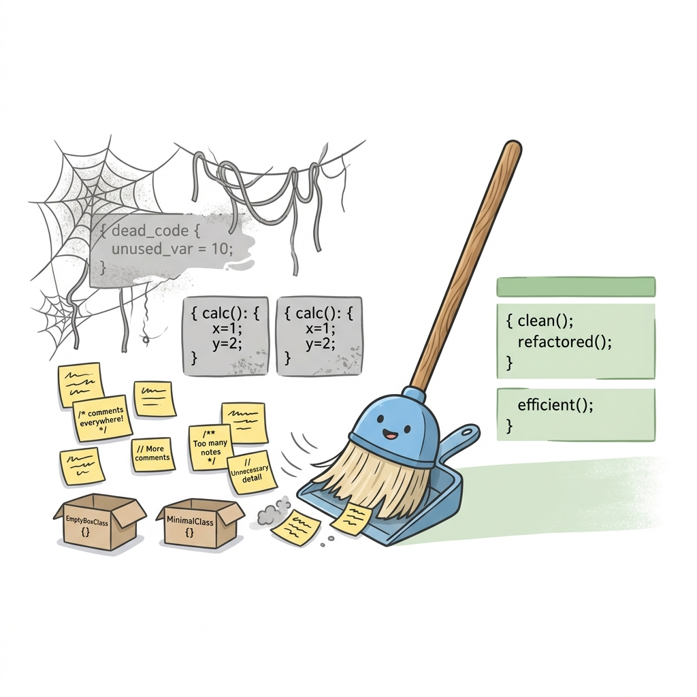

# 🗑️ Dispensables

> 📖 **Nguồn:** [Refactoring.Guru — Dispensables](https://refactoring.guru/refactoring/smells/dispensables) | Tác giả: Alexander Shvets

## Dispensables là gì?

**Dispensables** (Những thứ thừa thãi) là nhóm code smells chứa các thành phần vô dụng, không mang lại giá trị thực tế cho hệ thống và nếu loại bỏ chúng, code sẽ trở nên sạch sẽ, gọn gàng, dễ hiểu và dễ bảo trì hơn rất nhiều.

> [!TIP]
> Tránh tích lũy rác trong codebase. Code càng nhiều, khả năng sinh lỗi càng lớn. Việc dọn dẹp các Dispensables giúp giảm tải cognitive load (gánh nặng nhận thức) cho các lập trình viên khác khi đọc hiểu dự án.

## 📋 Danh sách Code Smells

| # | Code Smell | Mô tả ngắn |
|:-:|-----------|-------------|
| 1 | [Comments](./01-comments.md) | Comment quá mức hoặc dùng comment để che giấu code bẩn. |
| 2 | [Duplicate Code](./02-duplicate-code.md) | Code giống nhau xuất hiện ở nhiều nơi. |
| 3 | [Lazy Class](./03-lazy-class.md) | Một class quá đơn giản, không làm được việc gì thực sự ý nghĩa. |
| 4 | [Data Class](./04-data-class.md) | Class chỉ chứa data (fields, properties, getters/setters) mà không có hành vi nào. |
| 5 | [Dead Code](./05-dead-code.md) | Code không bao giờ được gọi hay sử dụng nữa. |
| 6 | [Speculative Generality](./06-speculative-generality.md) | Code "phòng hờ" cho tương lai, thiết kế quá trừu tượng cho những trường hợp chưa xảy ra. |

## 🎮 Trong Game Dev

Dispensables thường xuất hiện trong game dev qua các tình huống thực tế:
- **Comments**: Các đoạn comment giải thích luồng hoạt động dài ngoằng của hàm `Update()` thay vì tách nó thành các hàm nhỏ tự giải thích.
- **Duplicate Code**: Logic tính khoảng cách giữa các Object hoặc tính Damage bị copy-paste ở class `Player` và class `Enemy`.
- **Lazy Class**: Các class wrapper được tạo ra cho các component của Unity nhưng không thực hiện thêm chức năng nào khác ngoài việc gọi API gốc.
- **Data Class**: Class `ItemData` chỉ chứa thuộc tính mà không có các hàm tự xử lý logic của item đó (ví dụ như tự Consume).
- **Dead Code**: Các hàm `Start()` hoặc `Update()` trống rỗng do Unity tự tạo ra nhưng dev quên không xóa, hoặc code debug cũ không còn dùng.
- **Speculative Generality**: Thiết kế một hệ thống Quest quá phức tạp hỗ trợ cả ngàn loại Quest khác nhau, trong khi game của bạn chỉ là game bắn súng đơn giản chỉ cần 2 loại Quest.

---

> 📚 **Nguồn gốc:** Nội dung tham khảo từ [Refactoring.Guru](https://refactoring.guru/) — Tác giả: Alexander Shvets, Minh họa: Dmitry Zhart

⬅️ [Quay lại: Code Smells Overview](../00-code-smells-overview.md)
