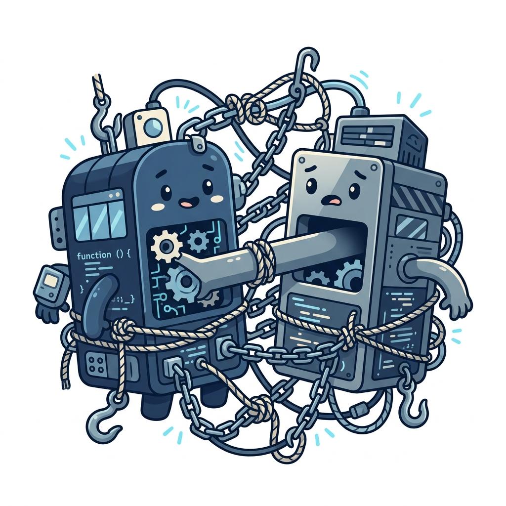

# 🔗 Couplers

> 📖 **Nguồn:** [Refactoring.Guru — Couplers](https://refactoring.guru/refactoring/smells/couplers) | Tác giả: Alexander Shvets

## Couplers là gì?

**Couplers** (Nhóm kết nối chặt) là nhóm các code smells liên quan đến sự **phụ thuộc quá mức (coupling)** giữa các class với nhau. Khi các class liên kết với nhau quá chặt chẽ, bạn không thể thay đổi hoặc tái sử dụng một class mà không kéo theo sự thay đổi ở các class liên quan.

> [!IMPORTANT]
> Một trong những nguyên tắc vàng của thiết kế phần mềm là **Loose Coupling (Liên kết lỏng lẻo)** và **High Cohesion (Độ gắn kết cao)**. Nhóm smell Couplers trực tiếp vi phạm nguyên tắc này, biến hệ thống của bạn thành một mớ dây điện chằng chịt rối rắm.

## 📋 Danh sách Code Smells

| # | Code Smell | Mô tả ngắn |
|:-:|-----------|-------------|
| 1 | [Feature Envy](./01-feature-envy.md) | Một method của class A sử dụng dữ liệu của class B nhiều hơn chính dữ liệu của class A. |
| 2 | [Inappropriate Intimacy](./02-inappropriate-intimacy.md) | Class này truy cập và can thiệp quá sâu vào các chi tiết nội bộ (private/protected) của class khác. |
| 3 | [Message Chains](./03-message-chains.md) | Các cuộc gọi hàm dạng chuỗi liên tiếp: `a.getB().getC().getD().doSomething()`. |
| 4 | [Middle Man](./04-middle-man.md) | Một class không làm việc gì ngoài việc chuyển tiếp (delegate) yêu cầu cho class khác. |
| 5 | [Incomplete Library Class](./05-incomplete-library-class.md) | Thư viện bên thứ ba (hoặc Engine API) thiếu đi tính năng bạn cần và bạn không có quyền sửa trực tiếp code nguồn thư viện đó. |

## 🎮 Trong Game Dev

Couplers là nguyên nhân hàng đầu khiến các hệ thống game không thể tách rời:
- **Feature Envy**: Hàm `CalculateDamage` của class `Combat` đi hỏi từng chỉ số nhỏ của `Player` và `Enemy` để tự tính thay vì giao cho đối tượng tự làm.
- **Inappropriate Intimacy**: Class `UIManager` truy cập trực tiếp vào các biến private của `PlayerController` qua cơ chế reflection hoặc hack code để vẽ giao diện.
- **Message Chains**: Một script camera muốn lấy thông tin đạn của người chơi gọi: `GameManager.Instance.GetPlayer().GetEquipment().GetActiveWeapon().GetAmmo()`. Nếu bất kỳ class nào ở giữa thay đổi cấu trúc, camera script sẽ bị lỗi biên dịch ngay lập tức!
- **Middle Man**: Bạn tạo ra class `PlayerWrapper` chỉ để chuyển tiếp tất cả các lệnh gọi đến Component `PlayerController` gốc bên dưới mà không thêm bất kỳ logic nào.
- **Incomplete Library Class**: Bạn muốn thêm một phương thức tiện ích cho class `Vector3` hay `Transform` của Unity nhưng không thể sửa code nguồn của Unity.

---

> 📚 **Nguồn gốc:** Nội dung tham khảo từ [Refactoring.Guru](https://refactoring.guru/) — Tác giả: Alexander Shvets, Minh họa: Dmitry Zhart

⬅️ [Quay lại: Code Smells Overview](../00-code-smells-overview.md)
