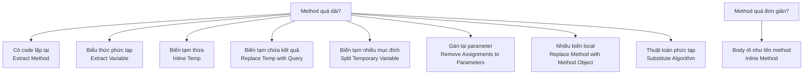

# 📝 Composing Methods (Tổ chức lại phương thức)

> 📖 **Nguồn:** [Refactoring.Guru — Composing Methods](https://refactoring.guru/refactoring/techniques/composing-methods) | Tác giả: Alexander Shvets

## Giới thiệu

Phần lớn refactoring liên quan đến việc tổ chức lại **method**. Method quá dài là nguồn gốc của nhiều vấn đề — chúng chứa quá nhiều logic, khó đọc, khó test và dễ sinh bug.

Nhóm kỹ thuật **Composing Methods** tập trung vào việc:
- **Tách** method dài thành các method ngắn, rõ ràng
- **Loại bỏ** biến tạm thừa thãi
- **Đơn giản hóa** cấu trúc bên trong method

---

## 📋 Danh sách 9 kỹ thuật

| # | Kỹ thuật | Mô tả ngắn | Chi tiết |
|---|----------|-------------|----------|
| 1 | **Extract Method** | Tách đoạn code có thể nhóm lại thành method riêng, đặt tên theo mục đích | [📄 Chi tiết](./01-extract-method.md) |
| 2 | **Inline Method** | Gộp method quá đơn giản — khi body rõ ràng như tên method | [📄 Chi tiết](./02-inline-method.md) |
| 3 | **Extract Variable** | Tách biểu thức phức tạp thành biến có tên rõ ràng, dễ hiểu | [📄 Chi tiết](./03-extract-variable.md) |
| 4 | **Inline Temp** | Thay thế biến tạm chỉ dùng một lần bằng biểu thức trực tiếp | [📄 Chi tiết](./04-inline-temp.md) |
| 5 | **Replace Temp with Query** | Thay biến tạm chứa kết quả biểu thức bằng method call | [📄 Chi tiết](./05-replace-temp-with-query.md) |
| 6 | **Split Temporary Variable** | Tách biến tạm được gán nhiều lần cho nhiều mục đích thành nhiều biến riêng | [📄 Chi tiết](./06-split-temporary-variable.md) |
| 7 | **Remove Assignments to Parameters** | Không gán lại giá trị cho tham số — dùng biến local thay thế | [📄 Chi tiết](./07-remove-assignments-to-parameters.md) |
| 8 | **Replace Method with Method Object** | Chuyển method dài có nhiều biến local thành class riêng | [📄 Chi tiết](./08-replace-method-with-method-object.md) |
| 9 | **Substitute Algorithm** | Thay thế thuật toán phức tạp bằng phiên bản rõ ràng và hiệu quả hơn | [📄 Chi tiết](./09-substitute-algorithm.md) |

---

## 🗺️ Khi nào dùng kỹ thuật nào?

---

## 🎮 Trong Game Dev

Composing Methods là nhóm kỹ thuật **được dùng nhiều nhất** trong game development:

### Ví dụ phổ biến:
- **Extract Method**: Tách `Update()` khổng lồ thành `HandleInput()`, `HandleMovement()`, `HandleCombat()`, `HandleAnimation()`
- **Extract Variable**: Biến biểu thức phức tạp `if (player.hp > 0 && player.stamina > 10 && !player.isStunned && Time.time > lastAttackTime + cooldown)` thành `bool canAttack = ...`
- **Replace Temp with Query**: Thay `float damage = baseDamage * multiplier` bằng method `GetCalculatedDamage()`
- **Replace Method with Method Object**: Tách logic AI phức tạp từ method `DecideAction()` thành class `AIDecisionMaker`

---

## 🔗 Liên kết

- ⬆️ [Refactoring Techniques — Tổng quan](../00-techniques-overview.md)
- ➡️ [Moving Features between Objects](../02-Moving-Features/00-moving-features-overview.md)

---

> 📚 **Nguồn gốc:** Nội dung tham khảo từ [Refactoring.Guru](https://refactoring.guru/) — Tác giả: Alexander Shvets, Minh họa: Dmitry Zhart
