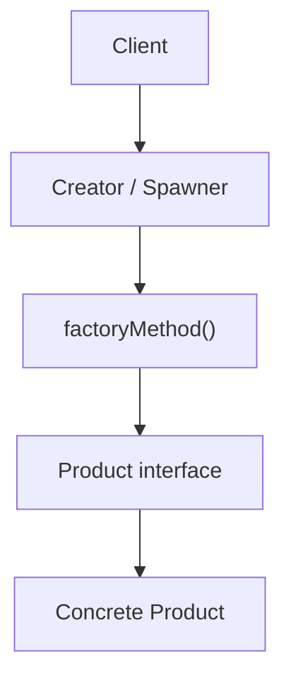
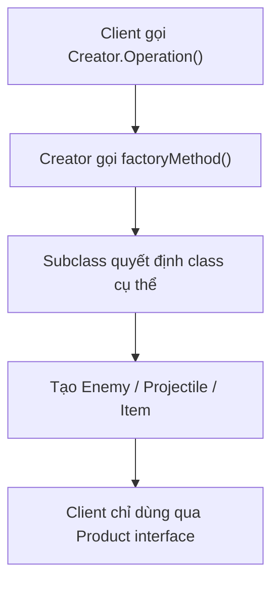
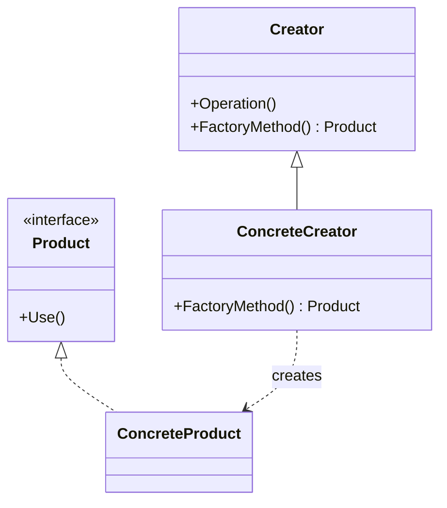

# Factory Method (Phương thức Nhà máy)

> 📖 **Nguồn:** [Refactoring.Guru — Factory Method](https://refactoring.guru/design-patterns/factory-method) | Tác giả: Alexander Shvets

---

## 🎯 Ý định (Intent)

**Factory Method** là một mẫu thiết kế thuộc nhóm khởi tạo (creational), cung cấp một interface chung để tạo lập các đối tượng trong lớp cha (superclass), nhưng cho phép các lớp con (subclasses) thay đổi loại đối tượng cụ thể sẽ được tạo ra.

---

## ❌ Vấn đề (Problem)

Hãy tưởng tượng bạn đang viết một trò chơi nhập vai (RPG) sinh tồn.
- Ở phiên bản đầu tiên, game của bạn chỉ có duy nhất một loại kẻ địch là **Zombie**. Logic tạo quái vật của bạn được viết cứng (hardcode) trực tiếp trong class `Spawner` bằng toán tử `new`:
  `Zombie zombie = new Zombie();`
- Code chạy rất tốt. Nhưng sau vài tuần, Designer yêu cầu thêm 2 loại quái vật mới: **Skeleton** (xương khô bắn cung) và **Dragon** (rồng phun lửa).
- Lúc này, class `Spawner` của bạn rơi vào cơn ác mộng. Bạn buộc phải mở class đó ra và viết thêm các câu lệnh `if-else` hoặc `switch-case` chằng chịt để kiểm tra xem loại quái vật nào cần tạo. 
- Bất kỳ khi nào thêm một loại quái vật mới trong tương lai, bạn lại phải sửa class `Spawner`, trực tiếp vi phạm nguyên tắc **Open/Closed Principle** và tạo ra sự liên kết cực kỳ chặt chẽ (tight coupling) giữa spawner và tất cả các concrete class quái vật.

---

## ✅ Giải pháp (Solution)

Mẫu **Factory Method** đề xuất bạn thay thế việc gọi trực tiếp toán tử khởi tạo `new` từ phía client (Spawner) bằng cách gọi một phương thức khởi tạo đặc biệt — gọi là **Factory Method (Phương thức nhà máy)**.

1.  Tạo một interface chung là `IEnemy` (Product) định nghĩa các hành vi cơ bản của quái vật (như di chuyển, tấn công).
2.  Tất cả các quái vật cụ thể (`Zombie`, `Skeleton`, `Dragon`) sẽ thực thi interface `IEnemy`.
3.  Biến class `EnemySpawner` thành abstract class (Creator), khai báo phương thức factory method `CreateEnemy()` trả về kiểu dữ liệu chung `IEnemy`.
4.  Tạo ra các subclass Spawner chuyên biệt: `ZombieSpawner` chỉ ghi đè (override) hàm `CreateEnemy()` để trả về `new Zombie()`, `SkeletonSpawner` trả về `new Skeleton()`.

Lúc này, Spawner chính chỉ tương tác với interface `IEnemy` mà không cần quan tâm quái vật cụ thể nào được tạo ra bên dưới!

---

## 🎨 Cấu trúc (Structure)

Thay vì đọc một UML lớn ngay từ đầu, hãy đọc pattern theo 3 lớp: **ý tưởng nhanh → luồng chạy thực tế → UML rút gọn**.

### 1. Ý tưởng nhanh



### 2. Luồng chạy thực tế



### 3. UML rút gọn



### Cách đọc sơ đồ

| Thành phần | Ý nghĩa |
|---|---|
| Nhìn nhanh | `Creator` không tự hard-code class cần tạo. |
| Luồng chính | `ConcreteCreator` override `FactoryMethod()` để chọn object cụ thể. |
| Trong game | Spawner chung có thể sinh nhiều loại enemy/projectile khác nhau. |
| Mũi tên nét liền | Object đang giữ tham chiếu hoặc gọi trực tiếp object khác. |
| Mũi tên tam giác / nét đứt trong UML | Kế thừa hoặc thực thi interface. |

> Mẹo đọc nhanh: trước hết hãy tìm **Client/Context**, sau đó đi theo mũi tên đến interface chính. Các class cụ thể chỉ là biến thể được thay vào khi chạy.

---

## 💻 Mã giả (Pseudocode)

```csharp
// Giao diện chung cho các sản phẩm
interface IProduct
{
    void DoSomething();
}

// Các lớp sản phẩm cụ thể
class ConcreteProductA : IProduct
{
    public void DoSomething() => Print("Sản phẩm A hoạt động!");
}

class ConcreteProductB : IProduct
{
    public void DoSomething() => Print("Sản phẩm B hoạt động!");
}

// Lớp khởi tạo gốc (Creator)
abstract class Creator
{
    // Đây chính là Factory Method trừu tượng
    protected abstract IProduct CreateProduct();

    public void BusinessLogic()
    {
        // Gọi Factory Method để tạo đối tượng mà không cần biết class cụ thể
        IProduct product = CreateProduct();
        product.DoSomething();
    }
}

// Lớp con ghi đè Factory Method
class ConcreteCreatorA : Creator
{
    protected override IProduct CreateProduct() => new ConcreteProductA();
}
```

---

## ⚙️ Khả năng áp dụng (Applicability)

Dùng Factory Method khi:
- Bạn không biết trước chính xác cấu trúc và loại đối tượng mà client code sẽ phải làm việc trong tương lai.
- Bạn muốn cung cấp cho người dùng thư viện (library) hoặc framework của bạn khả năng mở rộng, tùy biến các thành phần nội bộ một cách độc lập.
- Bạn muốn tiết kiệm tài nguyên hệ thống bằng cách tái sử dụng các đối tượng hiện có thay vì liên tục khởi tạo mới (kết hợp với cơ chế Cache/Object Pooling).

---

## 📝 Các bước thực hiện (How to Implement)

1.  Định nghĩa một interface hoặc abstract class chung cho tất cả các sản phẩm cụ thể sẽ được tạo ra (Product).
2.  Trong class Creator, khai báo một phương thức khởi tạo trống (Factory Method). Kiểu trả về của phương thức này phải là interface Product.
3.  Tìm tất cả các dòng lệnh gọi toán tử `new` của Product trong class Creator, tách chúng ra và đưa vào phương thức Factory Method.
4.  Tạo ra các subclass của Creator tương ứng cho từng loại Product và ghi đè phương thức Factory Method để thực hiện khởi tạo cụ thể.

---

## ⚖️ Ưu & Nhược điểm (Pros and Cons)

*   **👍 Ưu điểm:**
    *   *Tránh liên kết chặt (Loose Coupling):* Tách biệt hoàn toàn code logic chính khỏi các concrete class cụ thể của sản phẩm.
    *   *Single Responsibility Principle:* Đóng gói logic tạo lập đối tượng vào một nơi duy nhất.
    *   *Open/Closed Principle:* Dễ dàng thêm các loại sản phẩm mới vào game mà không làm hỏng hay phải sửa đổi code cũ.
*   **👎 Nhược điểm:**
    *   Mã nguồn có thể trở nên phức tạp hơn và có nhiều file hơn do bạn bắt buộc phải tạo thêm nhiều subclass mới cho cả Creator lẫn Product.

---

## 🎮 Trong Game Dev: C# Code Example (Unity)

Dưới đây là cách triển khai hệ thống **Wave Spawner** chuẩn mực trong Unity dùng Factory Method:

### 1. Interface Product và các Concrete class
```csharp
using UnityEngine;

// Định nghĩa hành vi chung của kẻ địch
public interface IEnemy
{
    void Initialize();
    void MoveTo(Vector3 destination);
}

// Kẻ địch cụ thể: Zombie
public class Zombie : MonoBehaviour, IEnemy
{
    public void Initialize() => Debug.Log("Zombie trỗi dậy từ nấm mồ!");
    public void MoveTo(Vector3 destination) => Debug.Log("Zombie đang lết tới " + destination);
}

// Kẻ địch cụ thể: Skeleton
public class Skeleton : MonoBehaviour, IEnemy
{
    public void Initialize() => Debug.Log("Skeleton lắp ráp bộ xương!");
    public void MoveTo(Vector3 destination) => Debug.Log("Skeleton đang chạy tới " + destination);
}
```

### 2. Class Creator (Spawner gốc) và các Concrete Creator (Spawner con)
```csharp
// Lớp Spawner trừu tượng
public abstract class EnemySpawner : MonoBehaviour
{
    [SerializeField] protected GameObject enemyPrefab;
    [SerializeField] protected Transform spawnPoint;

    // Factory Method trừu tượng
    protected abstract IEnemy CreateEnemyInstance();

    // Logic nghiệp vụ chung: Spawn quái vật và ra lệnh di chuyển
    public void SpawnEnemyWave(Vector3 targetLocation)
    {
        IEnemy enemy = CreateEnemyInstance();
        enemy.Initialize();
        enemy.MoveTo(targetLocation);
    }
}

// Spawner con chỉ lo tạo Zombie
public class ZombieSpawner : EnemySpawner
{
    protected override IEnemy CreateEnemyInstance()
    {
        GameObject obj = Instantiate(enemyPrefab, spawnPoint.position, Quaternion.identity);
        return obj.AddComponent<Zombie>();
    }
}

// Spawner con chỉ lo tạo Skeleton
public class SkeletonSpawner : EnemySpawner
{
    protected override IEnemy CreateEnemyInstance()
    {
        GameObject obj = Instantiate(enemyPrefab, spawnPoint.position, Quaternion.identity);
        return obj.AddComponent<Skeleton>();
    }
}
```

---

> 📚 **Nguồn gốc:** Nội dung tham khảo từ [Refactoring.Guru](https://refactoring.guru/) — Tác giả: Alexander Shvets, Minh họa: Dmitry Zhart

| Hướng | Liên kết |
|-------|----------|
| ← Quay lại | [Creational Patterns Overview](./00-creational-overview.md) |
| → Tiếp theo | [Abstract Factory](./02-abstract-factory.md) |
