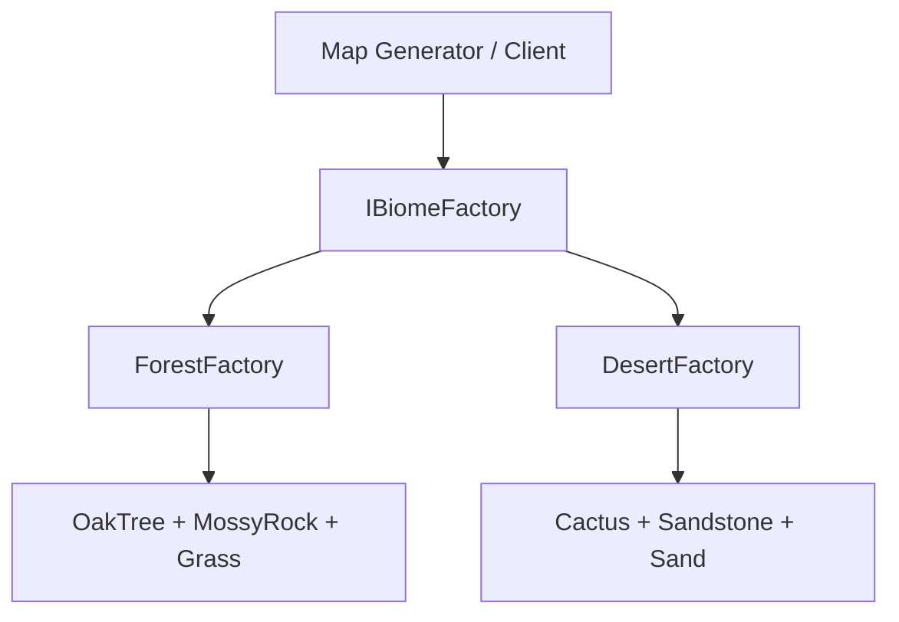
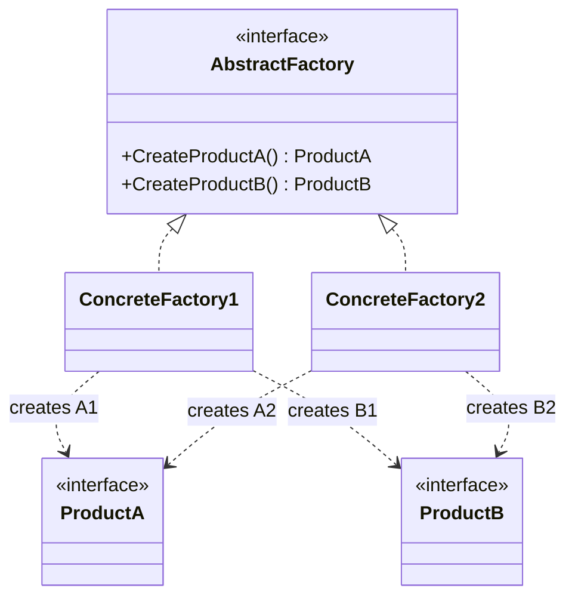

# Abstract Factory (Nhà máy Trừu tượng)

> 📖 **Nguồn:** [Refactoring.Guru — Abstract Factory](https://refactoring.guru/design-patterns/abstract-factory) | Tác giả: Alexander Shvets

---

## 🎯 Ý định (Intent)

**Abstract Factory** là một mẫu thiết kế thuộc nhóm khởi tạo (creational), cung cấp cơ chế khởi tạo một **họ (family) các đối tượng có liên quan hoặc phụ thuộc lẫn nhau** mà không cần chỉ định rõ ràng các concrete class cụ thể của chúng.

---

## ❌ Vấn đề (Problem)

Hãy tưởng tượng bạn đang viết một tựa game thế giới mở (Sandbox) có nhiều vùng đất sinh thái khác nhau (**Biomes**):
- Vùng đất **Rừng rậm (Forest Biome)** có: *Cây Sồi (Oak Tree)*, *Đá Rêu (Mossy Rock)* và *Thảm Cỏ xanh (Grass)*.
- Vùng đất **Sa mạc (Desert Biome)** có: *Cây Xương Rồng (Cactus)*, *Đá Cát (Sandstone)* và *Đất Cát (Sand)*.
- Bạn cần một hệ thống tạo bản đồ (Map Generator) tự động sinh ngẫu nhiên thực vật và đất đá khi người chơi di chuyển.
- **Vấn đề xảy ra:** Nếu bạn viết code gán thủ công từng class:
  ```csharp
  if (currentBiome == BiomeType.Forest) {
      Instantiate(oakTreePrefab);
      Instantiate(mossyRockPrefab);
  }
  ```
  Code của bạn sẽ nhanh chóng trở nên chằng chịt các câu lệnh rẽ nhánh khổng lồ. 
- Hơn thế nữa, sẽ rất dễ xảy ra lỗi "lệch theme" (ví dụ: Map Generator vô tình sinh ra một cây Xương Rồng Sa Mạc nằm giữa Thảm Cỏ Xanh của Rừng Rậm) do thiếu tính đồng bộ của họ sản phẩm. Khi thêm một Biome mới (ví dụ: Băng Tuyết), bạn phải lật tung toàn bộ code Map Generator ra để sửa.

---

## ✅ Giải pháp (Solution)

Mẫu **Abstract Factory** đề xuất:

1.  Định nghĩa các interface riêng biệt cho từng loại thực thể trong hệ thống: `ITree` (Cây), `IRock` (Đá), `IGround` (Đất).
2.  Tất cả các biến thể cụ thể sẽ thực thi các interface này (ví dụ: `OakTree` và `Cactus` đều thực thi `ITree`).
3.  Tạo ra interface **Abstract Factory** là `IBiomeFactory` khai báo các phương thức tạo lập cho từng sản phẩm trong họ:
    ```csharp
    interface IBiomeFactory {
        ITree CreateTree();
        IRock CreateRock();
        IGround CreateGround();
    }
    ```
4.  Tạo các concrete factory chuyên biệt cho từng Biome:
    - `ForestBiomeFactory` chỉ tạo ra `OakTree`, `MossyRock`, `Grass`.
    - `DesertBiomeFactory` chỉ tạo ra `Cactus`, `Sandstone`, `Sand`.

Bây giờ, class Map Generator chỉ cần giữ một tham chiếu đến interface `IBiomeFactory` chung. Khi người chơi bước vào vùng Forest, Map Generator được gắn `ForestBiomeFactory` và tự động sinh ra đúng họ thực vật Rừng rậm một cách hoàn hảo, không bao giờ lo lệch theme!

---

## 🎨 Cấu trúc (Structure)

Thay vì đọc một UML lớn ngay từ đầu, hãy đọc pattern theo 3 lớp: **ý tưởng nhanh → luồng chạy thực tế → UML rút gọn**.

### 1. Ý tưởng nhanh



### 2. Luồng chạy thực tế

```mermaid
flowchart TD
  A["Chọn biome"] --> B["Inject factory phù hợp"]
  B --> C["createTree()"]
  B --> D["createRock()"]
  B --> E["createGround()"]
  C --> F["Tree cùng family"]
  D --> G["Rock cùng family"]
  E --> H["Ground cùng family"]
```



### 3. UML rút gọn



### Cách đọc sơ đồ

| Thành phần | Ý nghĩa |
|---|---|
| Nhìn nhanh | Mỗi factory tạo nguyên một family object đồng bộ. |
| Luồng chính | Client chọn factory một lần, sau đó gọi các hàm tạo qua interface. |
| Trong game | Forest biome không bao giờ lẫn cactus/sand của Desert biome. |
| Mũi tên nét liền | Object đang giữ tham chiếu hoặc gọi trực tiếp object khác. |
| Mũi tên tam giác / nét đứt trong UML | Kế thừa hoặc thực thi interface. |

> Mẹo đọc nhanh: trước hết hãy tìm **Client/Context**, sau đó đi theo mũi tên đến interface chính. Các class cụ thể chỉ là biến thể được thay vào khi chạy.

---

## 💻 Mã giả (Pseudocode)

```csharp
// Dòng sản phẩm A
interface IAbstractProductA { string UsefulFunctionA(); }
class ConcreteProductA1 : IAbstractProductA { public string UsefulFunctionA() => "Sản phẩm A1"; }
class ConcreteProductA2 : IAbstractProductA { public string UsefulFunctionA() => "Sản phẩm A2"; }

// Dòng sản phẩm B
interface IAbstractProductB { string UsefulFunctionB(); }
class ConcreteProductB1 : IAbstractProductB { public string UsefulFunctionB() => "Sản phẩm B1"; }
class ConcreteProductB2 : IAbstractProductB { public string UsefulFunctionB() => "Sản phẩm B2"; }

// Abstract Factory định nghĩa các hàm tạo họ sản phẩm
interface IAbstractFactory
{
    IAbstractProductA CreateProductA();
    IAbstractProductB CreateProductB();
}

// Các Concrete Factory tạo họ sản phẩm tương thích
class ConcreteFactory1 : IAbstractFactory
{
    public IAbstractProductA CreateProductA() => new ConcreteProductA1();
    public IAbstractProductB CreateProductB() => new ConcreteProductB1();
}

class ConcreteFactory2 : IAbstractFactory
{
    public IAbstractProductA CreateProductA() => new ConcreteProductA2();
    public IAbstractProductB CreateProductB() => new ConcreteProductB2();
}
```

---

## ⚙️ Khả năng áp dụng (Applicability)

Dùng Abstract Factory khi:
- Code của bạn cần làm việc với nhiều họ sản phẩm liên quan khác nhau, nhưng bạn không muốn code phụ thuộc trực tiếp vào các concrete class cụ thể của chúng để dễ mở rộng trong tương lai.
- Hệ thống cần đảm bảo tính tương thích và đồng bộ tuyệt đối giữa các đối tượng trong cùng một nhóm (ví dụ: cùng một theme UI, cùng một vùng sinh thái).

---

## 📝 Các bước thực hiện (How to Implement)

1.  Xây dựng ma trận phân loại sản phẩm: Cột dọc là loại sản phẩm (Tree, Rock, Ground), hàng ngang là các biến thể theme (Forest, Desert, Snow).
2.  Khai báo interface chung cho tất cả các loại sản phẩm.
3.  Khai báo interface Abstract Factory với tập hợp các phương thức tạo lập cho tất cả các loại sản phẩm trừu tượng.
4.  Hiện thực các Concrete Factory tương ứng cho từng biến thể ở hàng ngang, ghi đè các hàm tạo để trả về đúng concrete class của biến thể đó.
5.  Trong client code, inject concrete factory tương ứng vào để sử dụng thông qua interface Abstract Factory.

---

## ⚖️ Ưu & Nhược điểm (Pros and Cons)

*   **👍 Ưu điểm:**
    *   *Tính đồng bộ tuyệt đối:* Bảo đảm các sản phẩm tạo ra từ cùng một factory luôn tương thích và khớp theme 100% với nhau.
    *   *Tránh Coupling:* Client code hoàn toàn độc lập với các concrete class cụ thể của sản phẩm.
    *   *Open/Closed Principle:* Dễ dàng bổ sung một họ sản phẩm mới (ví dụ: SnowBiome) mà không cần chỉnh sửa code lõi của Map Generator.
*   **👎 Nhược điểm:**
    *   Kiến trúc code trở nên khá cồng kềnh, phức tạp do phát sinh quá nhiều interface và class mới cho từng loại thực thể.

---

## 🎮 Trong Game Dev: C# Code Example (Unity)

Hiện thực hệ thống **Biome Asset Spawner** trong thế giới mở:

### 1. Khai báo các dòng sản phẩm trừu tượng và cụ thể
```csharp
using UnityEngine;

// 1. Dòng sản phẩm Cây (Tree)
public interface ITree { void Grow(); }

public class OakTree : ITree
{
    public void Grow() => Debug.Log("Cây sồi Rừng rậm mọc lên um tùm!");
}

public class Cactus : ITree
{
    public void Grow() => Debug.Log("Cây xương rồng Sa mạc gai góc mọc lên!");
}

// 2. Dòng sản phẩm Đá (Rock)
public interface IRock { void Spawn(); }

public class MossyRock : IRock
{
    public void Spawn() => Debug.Log("Đá phủ rêu xanh xuất hiện!");
}

public class Sandstone : IRock
{
    public void Spawn() => Debug.Log("Đá cát sa mạc màu vàng xuất hiện!");
}
```

### 2. Định nghĩa Abstract Factory và các Concrete Factory
```csharp
// Interface Abstract Factory chung cho các Biomes
public interface IBiomeFactory
{
    ITree CreateTree();
    IRock CreateRock();
}

// Factory chuyên biệt cho Rừng Rậm
public class ForestBiomeFactory : IBiomeFactory
{
    public ITree CreateTree() => new OakTree();
    public IRock CreateRock() => new MossyRock();
}

// Factory chuyên biệt cho Sa Mạc
public class DesertBiomeFactory : IBiomeFactory
{
    public ITree CreateTree() => new Cactus();
    public IRock CreateRock() => new Sandstone();
}
```

### 3. Client Code sử dụng Abstract Factory
```csharp
public class MapGenerator : MonoBehaviour
{
    private IBiomeFactory biomeFactory;

    // Thay đổi Biome Factory linh hoạt trong runtime
    public void SetBiome(IBiomeFactory newBiomeFactory)
    {
        biomeFactory = newBiomeFactory;
    }

    // Sinh ngẫu nhiên thực vật và địa hình đồng bộ
    public void GenerateZone()
    {
        if (biomeFactory == null) return;

        ITree tree = biomeFactory.CreateTree();
        IRock rock = biomeFactory.CreateRock();

        // Chạy logic
        tree.Grow();
        rock.Spawn();
    }
}
```

---

> 📚 **Nguồn gốc:** Nội dung tham khảo từ [Refactoring.Guru](https://refactoring.guru/) — Tác giả: Alexander Shvets, Minh họa: Dmitry Zhart

| Hướng | Liên kết |
|-------|----------|
| ← Quay lại | [Factory Method](./01-factory-method.md) |
| → Tiếp theo | [Builder](./03-builder.md) |
