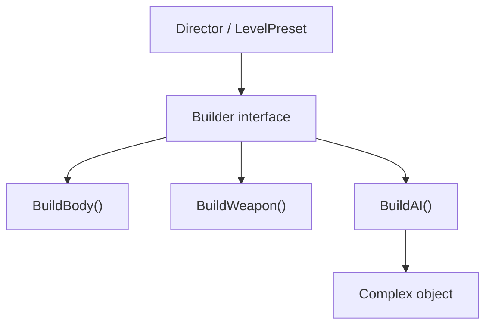
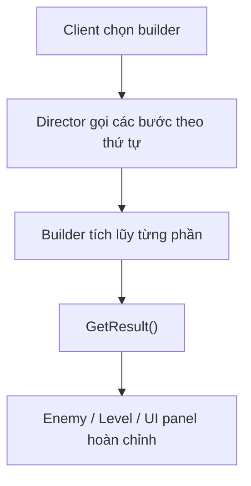
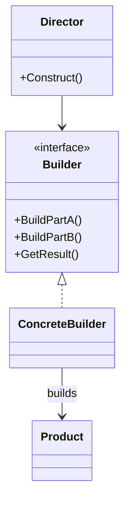

# Builder (Người xây dựng)

> 📖 **Nguồn:** [Refactoring.Guru — Builder](https://refactoring.guru/design-patterns/builder) | Tác giả: Alexander Shvets

---

## 🎯 Ý định (Intent)

**Builder** là một mẫu thiết kế thuộc nhóm khởi tạo (creational), cho phép bạn xây dựng các đối tượng cực kỳ phức tạp **từng bước một**. Bằng cách sử dụng chung một quy trình xây dựng, mẫu này cho phép bạn tạo ra nhiều biến thể (configurations) khác nhau của đối tượng đó.

---

## ❌ Vấn đề (Problem)

Hãy tưởng tượng bạn đang viết một trò chơi nhập vai (RPG) thế giới mở. Bạn cần tạo một class `Character` đại diện cho các anh hùng trong game.
- Ban đầu, nhân vật chỉ có vài thuộc tính đơn giản: chủng tộc (`Race`), hệ phái (`Class`), lượng máu (`HP`).
- Theo thời gian, game cập nhật thêm vô số thuộc tính tùy biến sâu sắc: kiểu tóc, màu mắt, mũ giáp, giáp ngực, khiên bảo vệ, vũ khí chính, nhẫn phép thuật, giày, thú cưng đi kèm...
- **Vấn đề Constructor Phình To (Telescoping Constructor):** Để khởi tạo một nhân vật đầy đủ, bạn bắt buộc phải viết một constructor khổng lồ với 15-20 tham số:
  ```csharp
  public Character(Race race, Class cls, string name, int hairStyle, string eyeColor, Helmet helmet, Shield shield, Weapon weapon, Ring ring, Pet pet...) { ... }
  ```
- Việc gọi constructor này là một cực hình: Bạn rất dễ truyền nhầm thứ tự các tham số `string` hoặc `int` với nhau, và bắt buộc phải truyền `null` cho các tham số không có (ví dụ: nhân vật không đội mũ giáp hay không có thú cưng). 
- Để giải quyết, bạn phải viết thêm hàng chục constructor overload khác nhau cho từng trường hợp cấu hình nhân vật. Code của bạn sẽ nhanh chóng trở nên cực kỳ hỗn loạn và không thể bảo trì!

---

## ✅ Giải pháp (Solution)

Mẫu **Builder** đề xuất bạn tách logic xây dựng đối tượng ra khỏi chính class đó và chuyển nó vào một class riêng biệt gọi là **Builder** (Người xây dựng).

1.  Tách toàn bộ logic gán thuộc tính phức tạp ra khỏi class `Character`.
2.  Tạo ra class `CharacterBuilder` chứa các phương thức gán từng thuộc tính nhỏ: `SetRace()`, `SetClass()`, `EquipWeapon()`, `EquipShield()`.
3.  Các phương thức này sẽ trả về chính thực thể Builder (`return this;`), cho phép bạn thực hiện gọi nối tiếp phương thức (**Method Chaining / Fluent Interface**) vô cùng đẹp mắt.
4.  Phương thức cuối cùng `Build()` sẽ trả về thực thể `Character` hoàn chỉnh đã được lắp ráp xong.
5.  (Tùy chọn) Bạn có thể tạo thêm class **Director** để định nghĩa sẵn các quy trình lắp ráp nhân vật mẫu (ví dụ: `ConstructWarrior()`, `ConstructMage()`) giúp tái sử dụng nhanh.

---

## 🎨 Cấu trúc (Structure)

Thay vì đọc một UML lớn ngay từ đầu, hãy đọc pattern theo 3 lớp: **ý tưởng nhanh → luồng chạy thực tế → UML rút gọn**.

### 1. Ý tưởng nhanh



### 2. Luồng chạy thực tế



### 3. UML rút gọn



### Cách đọc sơ đồ

| Thành phần | Ý nghĩa |
|---|---|
| Nhìn nhanh | Tách quy trình build khỏi object phức tạp. |
| Luồng chính | Director biết thứ tự build, Builder biết build chi tiết. |
| Trong game | Dùng cho level preset, enemy preset, weapon loadout. |
| Mũi tên nét liền | Object đang giữ tham chiếu hoặc gọi trực tiếp object khác. |
| Mũi tên tam giác / nét đứt trong UML | Kế thừa hoặc thực thi interface. |

> Mẹo đọc nhanh: trước hết hãy tìm **Client/Context**, sau đó đi theo mũi tên đến interface chính. Các class cụ thể chỉ là biến thể được thay vào khi chạy.

---

## 💻 Mã giả (Pseudocode)

```csharp
// Đối tượng phức tạp cần xây dựng
class Product
{
    public List<string> parts = new List<string>();
    public void Add(string part) => parts.Add(part);
}

// Interface định nghĩa các bước xây dựng
interface IBuilder
{
    void BuildPartA();
    void BuildPartB();
}

// Lớp xây dựng cụ thể
class ConcreteBuilder : IBuilder
{
    private Product product = new Product();

    public void Reset() => product = new Product();
    public void BuildPartA() => product.Add("Part A");
    public void BuildPartB() => product.Add("Part B");

    public Product GetResult()
    {
        Product finishedProduct = product;
        Reset(); // Sẵn sàng cho lần build tiếp theo
        return finishedProduct;
    }
}
```

---

## ⚙️ Khả năng áp dụng (Applicability)

Dùng Builder khi:
- Bạn muốn loại bỏ hoàn toàn các Constructor có quá nhiều tham số (Hội chứng Telescoping Constructor).
- Bạn muốn tạo lập các cấu hình biến thể khác nhau của cùng một đối tượng phức tạp bằng cách sử dụng chung một quy trình lắp ráp (ví dụ: tạo nhiều loại Robot khác nhau từ chung các part bánh xe, súng, động cơ).
- Bạn cần xây dựng các đối tượng dạng cấu trúc phức tạp như dạng cây (Composite trees) hoặc dữ liệu lồng nhau từng bước.

---

## 📝 Các bước thực hiện (How to Implement)

1.  Xác định các bước xây dựng chung để tạo ra các biến thể của đối tượng Product.
2.  Khai báo các bước này trong interface Builder chung.
3.  Tạo ra các Concrete Builder để thực thi interface đó. Class Concrete Builder phải chứa thực thể Product rỗng bên trong và hàm trả về kết quả `Build()`.
4.  (Tùy chọn) Xây dựng class Director để gom nhóm các quy trình lắp ráp mẫu phổ biến nhất thành các hàm riêng tiện lợi.
5.  Client code sẽ khởi tạo Builder, truyền nó vào Director (nếu có) hoặc tự gọi nối tiếp các bước để nhận về Product hoàn chỉnh.

---

## ⚖️ Ưu & Nhược điểm (Pros and Cons)

*   **👍 Ưu điểm:**
    *   *Khởi tạo từng bước:* Bạn có thể trì hoãn một số bước xây dựng hoặc thực hiện đệ quy một cách linh hoạt.
    *   *Fluent API:* Code khởi tạo đối tượng trở nên cực kỳ tường minh, rõ ràng và dễ đọc.
    *   *Tái sử dụng code:* Tách biệt hoàn toàn code khởi tạo phức tạp khỏi logic chạy chính của đối tượng.
*   **👎 Nhược điểm:**
    *   Số lượng class và dòng code tổng thể sẽ tăng lên do bạn phải viết thêm các file Builder và Director đi kèm.

---

## 🎮 Trong Game Dev: C# Code Example (Unity)

Hiện thực hệ thống **Character Customizer** lắp ráp nhân vật game:

### 1. Đối tượng phức tạp cần xây dựng: Character
```csharp
using UnityEngine;

public class Character
{
    public string name;
    public string race;
    public string charClass;
    public string weapon;
    public string armor;
    public string pet;

    public void ShowStats()
    {
        Debug.Log($"[Hero: {name}] Race: {race} | Class: {charClass} | Weapon: {weapon} | Armor: {armor} | Pet: {pet ?? "Không có"}");
    }
}
```

### 2. Class Builder thực hiện lắp ráp từng bước
```csharp
public class CharacterBuilder
{
    private Character character = new Character();

    public CharacterBuilder(string name)
    {
        character.name = name;
    }

    public CharacterBuilder SetRace(string race)
    {
        character.race = race;
        return this; // Trả về this để gọi nối tiếp (chaining)
    }

    public CharacterBuilder SetClass(string charClass)
    {
        character.charClass = charClass;
        return this;
    }

    public CharacterBuilder EquipWeapon(string weapon)
    {
        character.weapon = weapon;
        return this;
    }

    public CharacterBuilder EquipArmor(string armor)
    {
        character.armor = armor;
        return this;
    }

    public CharacterBuilder SummonPet(string petName)
    {
        character.pet = petName;
        return this;
    }

    // Trả về đối tượng hoàn chỉnh
    public Character Build()
    {
        Character completedHero = character;
        character = new Character(); // Reset trạng thái
        return completedHero;
    }
}
```

### 3. Class Director đóng gói các mẫu nhân vật phổ biến
```csharp
public class CharacterDirector
{
    // Tạo mẫu chiến binh Human Warrior tiêu chuẩn
    public Character BuildStandardWarrior(string name)
    {
        return new CharacterBuilder(name)
            .SetRace("Human")
            .SetClass("Warrior")
            .EquipWeapon("Thanh gươm rỉ sét")
            .EquipArmor("Giáp sắt thô sơ")
            .Build();
    }

    // Tạo mẫu pháp sư Elf Mage cao cấp có pet đi kèm
    public Character BuildEliteMage(string name)
    {
        return new CharacterBuilder(name)
            .SetRace("Elf")
            .SetClass("Mage")
            .EquipWeapon("Trượng pha lê cổ đại")
            .EquipArmor("Áo choàng tơ lụa")
            .SummonPet("Phượng hoàng lửa")
            .Build();
    }
}
```

---

> 📚 **Nguồn gốc:** Nội dung tham khảo từ [Refactoring.Guru](https://refactoring.guru/) — Tác giả: Alexander Shvets, Minh họa: Dmitry Zhart

| Hướng | Liên kết |
|-------|----------|
| ← Quay lại | [Abstract Factory](./02-abstract-factory.md) |
| → Tiếp theo | [Prototype](./04-prototype.md) |
