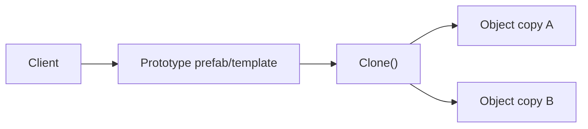
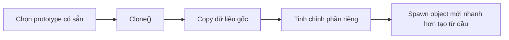
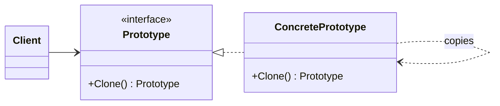

# Prototype (Mẫu Nguyên mẫu)

> 📖 **Nguồn:** [Refactoring.Guru — Prototype](https://refactoring.guru/design-patterns/prototype) | Tác giả: Alexander Shvets

---

## 🎯 Ý định (Intent)

**Prototype** là một mẫu thiết kế thuộc nhóm khởi tạo (creational), cho phép bạn sao chép (clone) một đối tượng hiện có mà không làm cho mã nguồn của bạn phụ thuộc vào các concrete class cụ thể của đối tượng đó.

---

## ❌ Vấn đề (Problem)

Hãy tưởng tượng bạn đang viết một tựa game chiến thuật thời gian thực (RTS) giống như *Age of Empires* hoặc *StarCraft*.
- Game của bạn cần tạo ra hàng nghìn đơn vị lính binh chủng (**Soldier**) liên tục. Mỗi Soldier là một đối tượng vô cùng phức tạp: Nó chứa các mô hình 3D Mesh đắt đỏ, hệ thống vật liệu (Materials), danh sách chỉ số (HP, Mana, Armor, Speed) và các trạng thái AI hiện tại.
- **Vấn đề hiệu năng:** Nếu mỗi khi tạo một lính mới, bạn lại gọi constructor và yêu cầu CPU tải lại mô hình 3D, phân tích file cấu hình từ ổ cứng và khởi tạo lại toàn bộ từ đầu, game của bạn sẽ lập tức bị giật lag nghiêm trọng (frame drop) và tràn bộ nhớ RAM.
- **Vấn đề đóng gói:** Bạn muốn sao chép một Soldier đang có trong game (với đầy đủ các chỉ số hiện tại, ví dụ: máu đang còn 50%, đang đeo kiếm gỗ) để tạo ra một bản sao y hệt. Nếu bạn làm thủ công từ bên ngoài, bạn phải đọc từng trường dữ liệu của nó để gán sang đối tượng mới. Nhưng rất nhiều thuộc tính quan trọng của Soldier đã bị ẩn đi (private/protected) để bảo mật, khiến bạn không thể truy cập để sao chép từ bên ngoài được!

---

## ✅ Giải pháp (Solution)

Mẫu **Prototype** giải quyết vấn đề này bằng cách giao trách nhiệm sao chép cho **chính bản thân đối tượng đang tồn tại**.

1.  Định nghĩa một interface có phương thức `Clone()` (hoặc kế thừa interface `ICloneable` có sẵn trong C#).
2.  Bản thân class `Soldier` sẽ thực thi phương thức `Clone()`.
3.  Bên trong hàm `Clone()`, đối tượng `Soldier` tự tạo ra một instance mới của chính nó và sao chép toàn bộ các giá trị thuộc tính (kể cả các biến private) sang đối tượng mới này.
4.  Client code muốn tạo lính mới chỉ cần giữ một thực thể mẫu (Prototype) làm chuẩn, và gọi:
    `Soldier newSoldier = prototypeSoldier.Clone();`

> [!NOTE]
> Trong Unity, **Prototype Pattern** chính là nền tảng cốt lõi đứng sau hệ thống **Prefab** và phương thức thần thánh **`Instantiate()`**! Khi bạn kéo thả một Prefab từ Asset vào Scene hoặc gọi lệnh `Instantiate(prefab)`, Unity đang thực hiện nhân bản (clone) một đối tượng nguyên mẫu có sẵn.

---

## 🎨 Cấu trúc (Structure)

Thay vì đọc một UML lớn ngay từ đầu, hãy đọc pattern theo 3 lớp: **ý tưởng nhanh → luồng chạy thực tế → UML rút gọn**.

### 1. Ý tưởng nhanh



### 2. Luồng chạy thực tế



### 3. UML rút gọn



### Cách đọc sơ đồ

| Thành phần | Ý nghĩa |
|---|---|
| Nhìn nhanh | Object mới được copy từ mẫu có sẵn. |
| Luồng chính | `Clone()` giữ cấu hình gốc rồi cho phép chỉnh phần riêng. |
| Trong game | Prefab, bullet template, enemy wave template. |
| Mũi tên nét liền | Object đang giữ tham chiếu hoặc gọi trực tiếp object khác. |
| Mũi tên tam giác / nét đứt trong UML | Kế thừa hoặc thực thi interface. |

> Mẹo đọc nhanh: trước hết hãy tìm **Client/Context**, sau đó đi theo mũi tên đến interface chính. Các class cụ thể chỉ là biến thể được thay vào khi chạy.

---

## 💻 Mã giả (Pseudocode)

```csharp
// Giao diện Prototype
interface IPrototype
{
    IPrototype Clone();
}

// Đối tượng cụ thể hỗ trợ nhân bản
class ConcretePrototype : IPrototype
{
    private string name;
    private int value;

    public ConcretePrototype(string name, int value)
    {
        this.name = name;
        this.value = value;
    }

    // Constructor sao chép (Copy Constructor)
    public ConcretePrototype(ConcretePrototype source)
    {
        this.name = source.name;
        this.value = source.value;
    }

    // Thực thi hàm Clone
    public IPrototype Clone()
    {
        return new ConcretePrototype(this); // Gọi copy constructor tự nhân bản
    }
}
```

---

## ⚙️ Khả năng áp dụng (Applicability)

Dùng Prototype khi:
- Việc khởi tạo đối tượng mới trực tiếp tốn quá nhiều tài nguyên hệ thống (load file, tính toán hình học phức tạp) hoặc qua nhiều bước cấu hình rườm rà.
- Bạn muốn sao chép chính xác trạng thái hiện tại (runtime state) của một đối tượng đang hoạt động sang đối tượng mới độc lập.
- Bạn muốn giảm thiểu số lượng class con trong hệ thống chỉ khác nhau về cách cấu hình giá trị ban đầu. Thay vì tạo nhiều subclass, bạn chỉ cần tạo các Prototype mẫu với các giá trị khác nhau rồi nhân bản chúng.

---

## 📝 Các bước thực hiện (How to Implement)

1.  Tạo interface Prototype và khai báo phương thức `Clone()`.
2.  Hiện thực phương thức `Clone()` trong class cụ thể:
    *   **Sao chép nông (Shallow Copy):** Chỉ sao chép các kiểu dữ liệu nguyên thủy (Value Types như int, float, bool). Các đối tượng tham chiếu (Reference Types) sẽ chỉ sao chép địa chỉ vùng nhớ (trỏ chung vào một thực thể con). Trong C#, bạn có thể gọi nhanh hàm có sẵn `this.MemberwiseClone()`.
    *   **Sao chép sâu (Deep Copy):** Nhân bản hoàn toàn độc lập tất cả các đối tượng con nằm bên trong. Đây là cách khuyên dùng cho Game Dev để tránh lỗi thay đổi thuộc tính của bản sao làm ảnh hưởng ngược lại bản gốc.
3.  Tạo một Registry (hoặc Manager) để lưu trữ danh sách các thực thể nguyên mẫu (Prototypes) nhằm giúp client dễ dàng truy xuất và ra lệnh clone khi cần.

---

## ⚖️ Ưu & Nhược điểm (Pros and Cons)

*   **👍 Ưu điểm:**
    *   *Tối ưu hóa hiệu năng cực cao:* Bỏ qua quy trình khởi tạo phức tạp và việc tải lại asset từ ổ cứng.
    *   *Sao chép trạng thái động:* Nhân bản chính xác thực thể game tại bất kỳ thời điểm nào trong runtime.
    *   *Giảm Coupling:* Client code không còn phụ thuộc trực tiếp vào concrete class của sản phẩm mà chỉ tương tác qua interface Prototype.
*   **👎 Nhược điểm:**
    *   Việc hiện thực **Deep Copy** cho các class có cấu trúc cực kỳ phức tạp, có nhiều tham chiếu vòng (circular references) chéo nhau là vô cùng khó khăn và rất dễ xảy ra lỗi rò rỉ dữ liệu.

---

## 🎮 Trong Game Dev: C# Code Example (Unity)

Hiện thực hệ thống **Monster Duplicator** nhân bản quái vật có sao chép sâu (Deep Copy):

### 1. Interface và Concrete Class Monster
```csharp
using UnityEngine;

// Định nghĩa interface nhân bản
public interface IMonsterPrototype
{
    IMonsterPrototype Clone();
}

// Đối tượng quái vật cụ thể
public class Monster : IMonsterPrototype
{
    private string species;
    private int currentHP;
    private Weapon equippedWeapon; // Đối tượng tham chiếu (Reference Type)

    public Monster(string species, int hp, Weapon weapon)
    {
        this.species = species;
        this.currentHP = hp;
        this.equippedWeapon = weapon;
    }

    // Thực thi DEEP COPY để nhân bản độc lập vũ khí đi kèm
    public IMonsterPrototype Clone()
    {
        // 1. Tạo vũ khí mới độc lập cho quái vật clone
        Weapon clonedWeapon = new Weapon(equippedWeapon.weaponName, equippedWeapon.damage);
        
        // 2. Trả về Monster mới hoàn toàn tách biệt bản gốc
        return new Monster(this.species, this.currentHP, clonedWeapon);
    }

    public void SetHP(int newHP) => currentHP = newHP;

    public void ShowStatus(string label)
    {
        Debug.Log($"[{label}] Loài: {species} | HP: {currentHP} | Vũ khí: {equippedWeapon.weaponName} (Dmg: {equippedWeapon.damage})");
    }
}

// Đối tượng vũ khí phụ trợ
public class Weapon
{
    public string weaponName;
    public int damage;

    public Weapon(string name, int dmg)
    {
        weaponName = name;
        damage = dmg;
    }
}
```

### 2. Client Code kiểm chứng tính độc lập sau nhân bản
```csharp
public class SpawnManager : MonoBehaviour
{
    void Start()
    {
        // 1. Khởi tạo một Quái Vật Nguyên Mẫu (Orc Chiến Binh) cực kỳ mạnh mẽ
        Weapon prototypeSword = new Weapon("Đao Răng Cưa", 50);
        Monster orcPrototype = new Monster("Orc", 500, prototypeSword);
        orcPrototype.ShowStatus("ORIGINAL - Orc Mẫu");

        // 2. Người chơi chém Orc mẫu mất 200 HP
        orcPrototype.SetHP(300);
        orcPrototype.ShowStatus("ORIGINAL - Orc Mẫu sau khi bị chém");

        // 3. Spawner tiến hành Nhân bản (Clone) Orc mẫu này ra một bản sao mới tinh
        Monster clonedOrc = (Monster)orcPrototype.Clone();
        clonedOrc.ShowStatus("CLONED - Orc Bản Sao");

        // 4. Kiểm chứng tính độc lập: Tăng máu cho bản sao lên 1000 HP
        clonedOrc.SetHP(1000);
        
        // Xem kết quả: HP bản gốc vẫn là 300, HP bản sao là 1000. Độc lập hoàn hảo!
        orcPrototype.ShowStatus("ORIGINAL - Orc Mẫu cuối cùng");
        clonedOrc.ShowStatus("CLONED - Orc Bản Sao cuối cùng");
    }
}
```

---

> 📚 **Nguồn gốc:** Nội dung tham khảo từ [Refactoring.Guru](https://refactoring.guru/) — Tác giả: Alexander Shvets, Minh họa: Dmitry Zhart

| Hướng | Liên kết |
|-------|----------|
| ← Quay lại | [Builder](./03-builder.md) |
| → Tiếp theo | [Singleton](./05-singleton.md) |
