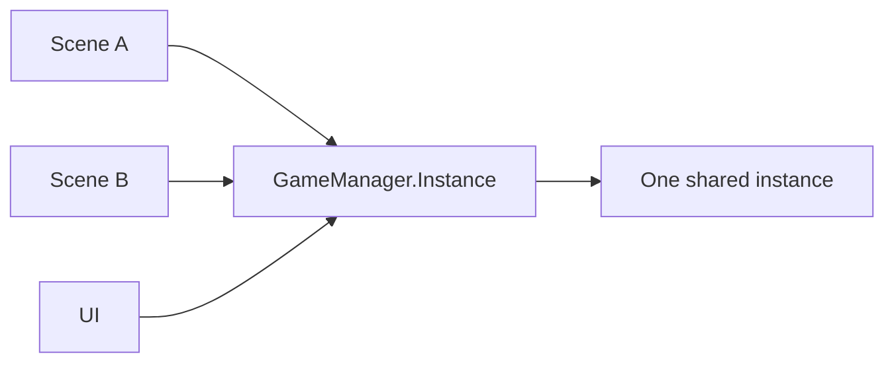
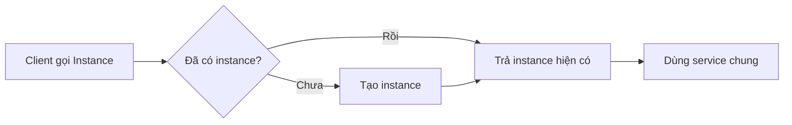
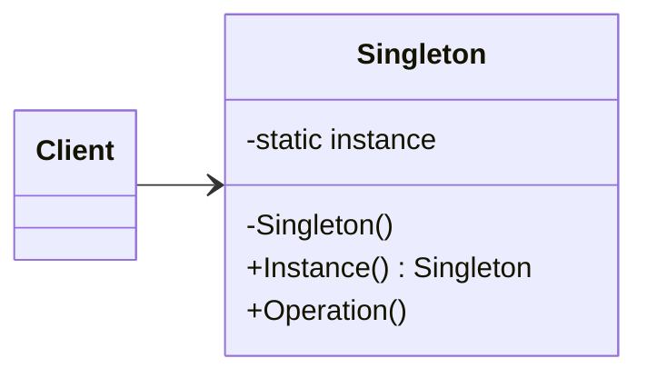

# Singleton (Độc bản)

> 📖 **Nguồn:** [Refactoring.Guru — Singleton](https://refactoring.guru/design-patterns/singleton) | Tác giả: Alexander Shvets

---

## 🎯 Ý định (Intent)

**Singleton** là một mẫu thiết kế thuộc nhóm khởi tạo (creational), đảm bảo rằng một class chỉ có **duy nhất một instance (thực thể)** hoạt động trong suốt vòng đời của ứng dụng và cung cấp một điểm truy cập toàn cục (global access point) đến instance đó.

---

## ❌ Vấn đề (Problem)

Trong phát triển game, bạn có rất nhiều hệ thống quản lý trung tâm (Core Managers) chỉ được phép có đúng duy nhất một thực thể duy nhất hoạt động:
*   **AudioManager:** Quản lý toàn bộ nhạc nền và hiệu ứng âm thanh. Nếu có 2 AudioManager cùng chạy, nhạc nền sẽ bị phát chồng chéo lên nhau tạo nên âm thanh cực kỳ hỗn loạn.
*   **GameManager:** Quản lý vòng lặp trạng thái của game (Chờ, Đang chơi, Tạm dừng, Thắng, Thua).
*   **SaveSystem:** Quản lý việc ghi dữ liệu save ra ổ cứng.
- **Vấn đề Truy cập:** Các thực thể nhỏ lẻ trong game (như Player, Enemy, Item, Coin) liên tục cần gọi các hệ thống trung tâm này để phát âm thanh hay cộng điểm. Việc phải kéo thả thủ công tham chiếu của `AudioManager` vào hàng ngàn script quái vật trong Unity Inspector là điều bất khả thi và cực kỳ tốn thời gian. Bạn cần một cách gọi nhanh, trực tiếp ở mọi lúc, mọi nơi trong codebase.

---

## ✅ Giải pháp (Solution)

Mẫu **Singleton** giải quyết cả hai vấn đề trên bằng cách tích hợp trực tiếp cơ chế tự quản lý thực thể vào trong chính class đó:

1.  **Ẩn Constructor:** Đặt Constructor của class đó thành `private`. Điều này ngăn chặn hoàn toàn các class ngoài tự tiện gọi lệnh `new GameManager()` để khởi tạo thực thể quái thai thứ hai.
2.  **Lưu giữ Thực thể Tĩnh:** Khai báo một biến static nội bộ để lưu trữ instance duy nhất:
    `private static GameManager instance;`
3.  **Cung cấp Điểm truy cập Toàn cục:** Tạo ra một property static public (thường gọi là `Instance` hoặc `getInstance()`) để trả về thực thể duy nhất đó. Các script khác chỉ cần gọi trực tiếp:
    `GameManager.Instance.AddScore(10);`

---

## 🎨 Cấu trúc (Structure)

Thay vì đọc một UML lớn ngay từ đầu, hãy đọc pattern theo 3 lớp: **ý tưởng nhanh → luồng chạy thực tế → UML rút gọn**.

### 1. Ý tưởng nhanh



### 2. Luồng chạy thực tế



### 3. UML rút gọn



### Cách đọc sơ đồ

| Thành phần | Ý nghĩa |
|---|---|
| Nhìn nhanh | Toàn hệ thống dùng cùng một instance. |
| Luồng chính | Truy cập qua cổng static, constructor bị khóa. |
| Trong game | Cẩn thận với GameManager/AudioManager vì dễ tạo global state khó test. |
| Mũi tên nét liền | Object đang giữ tham chiếu hoặc gọi trực tiếp object khác. |
| Mũi tên tam giác / nét đứt trong UML | Kế thừa hoặc thực thi interface. |

> Mẹo đọc nhanh: trước hết hãy tìm **Client/Context**, sau đó đi theo mũi tên đến interface chính. Các class cụ thể chỉ là biến thể được thay vào khi chạy.

---

## 💻 Mã giả (Pseudocode)

```csharp
class Singleton
{
    // Biến static lưu trữ thực thể độc bản
    private static Singleton instance;

    // 1. Constructor phải là private!
    private Singleton() { }

    // 2. Điểm truy cập toàn cục duy nhất
    public static Singleton GetInstance()
    {
        if (instance == null)
        {
            instance = new Singleton(); // Khởi tạo trễ (Lazy Initialization)
        }
        return instance;
    }
}
```

---

## ⚙️ Khả năng áp dụng (Applicability)

Dùng Singleton khi:
- Một class trong chương trình bắt buộc chỉ được phép có duy nhất một thực thể hoạt động để tránh xung đột dữ liệu (ví dụ: luồng ghi file, kết nối cơ sở dữ liệu, quản lý âm thanh).
- Bạn cần một điểm truy cập toàn cục dễ dàng, gọn nhẹ để gọi các hệ thống lõi từ bất kỳ đâu mà không muốn truyền tham chiếu rườm rà qua nhiều tầng trung gian.

---

## ⚠️ Cảnh báo Độc tính: Cơn ác mộng của Game Dev!

Mặc dù Singleton là mẫu thiết kế dễ viết và cực kỳ phổ biến, nó lại là **mẫu bị lạm dụng nhiều nhất và bị coi là "Anti-pattern"** nếu dùng vô tội vạ:

1.  **Tạo ra Phụ thuộc Ẩn (Hidden Dependencies):** Khi bạn gọi `GameManager.Instance`, class của bạn đang phụ thuộc chặt chẽ vào `GameManager`. Nếu sau này bạn muốn thay đổi class này, toàn bộ các class gọi nó sẽ bị lỗi.
2.  **Khó viết Kiểm thử (Unit Testing):** Singleton lưu trữ trạng thái toàn cục (global state). Khi chạy test, trạng thái của ca kiểm thử trước sẽ ảnh hưởng trực tiếp đến ca kiểm thử sau, khiến việc viết test độc lập trở nên bất khả thi.
3.  **Vi phạm Single Responsibility Principle:** Class Singleton vừa phải làm nhiệm vụ chuyên môn của nó (ví dụ: quản lý âm thanh), vừa phải gánh thêm trách nhiệm tự quản lý vòng đời khởi tạo và hủy bỏ của chính nó.
4.  **Bất khả thi khi Đa luồng (Multi-threading):** Khi nhiều luồng CPU cùng truy cập và chỉnh sửa một Singleton cùng lúc, lỗi xung đột bộ nhớ (Race Conditions) sẽ xảy ra liên tục.

---

## 📝 Các bước thực hiện (How to Implement)

1.  Khai báo static field `private static ClassName instance` trong class.
2.  Đặt Constructor mặc định của class là `private`.
3.  Cung cấp static property `public static ClassName Instance` để trả về biến `instance`.
4.  Trong Unity, hiện thực trong hàm `Awake()` để tự hủy các bản sao quái thai khi load scene mới và giữ thực thể không bị hủy bằng `DontDestroyOnLoad()`.

---

## ⚖️ Ưu & Nhược điểm (Pros and Cons)

*   **👍 Ưu điểm:**
    *   Đảm bảo tuyệt đối chỉ có 1 instance hoạt động.
    *   Điểm truy cập toàn cục cực kỳ tiện lợi, nhanh chóng cho lập trình viên.
    *   Hỗ trợ khởi tạo trễ (Lazy Initialization): Đối tượng chỉ được tạo ra khi có người gọi đến lần đầu tiên, giúp tiết kiệm bộ nhớ ban đầu.
*   **👎 Nhược điểm:**
    *   Tạo ra thiết kế khớp nối chặt (Tight Coupling).
    *   Che giấu các dependency, cản trở việc viết Unit Test và kiểm thử tự động.
    *   Gây xung đột bộ nhớ khi lập trình đa luồng.

---

## 🎮 Trong Game Dev: C# Code Example (Unity)

Hiện thực **Game Manager** chuẩn mực, an toàn và chống trùng lặp thực thể trong Unity:

```csharp
using UnityEngine;

public class GameManager : MonoBehaviour
{
    // 1. Biến static lưu thực thể độc bản
    public static GameManager Instance { get; private set; }

    // Dữ liệu trạng thái game
    public int playerScore { get; private set; }
    public bool isGameOver { get; private set; }

    // 2. Constructor trong Unity được xử lý qua hàm Awake
    private void Awake()
    {
        // Kiểm tra xem đã có Instance nào tồn tại chưa
        if (Instance != null && Instance != this)
        {
            // Nếu đã có thực thể khác tồn tại -> Hủy thực thể quái thai này ngay lập tức!
            Destroy(gameObject);
            return;
        }

        // Gán thực thể duy nhất
        Instance = this;

        // Giữ cho GameManager không bị hủy khi chuyển Scene
        DontDestroyOnLoad(gameObject);
    }

    public void AddScore(int points)
    {
        if (isGameOver) return;
        playerScore += points;
        Debug.Log("Điểm hiện tại: " + playerScore);
    }

    public void TriggerGameOver()
    {
        isGameOver = true;
        Debug.Log("GAME OVER!");
    }
}
```

### 💡 Các giải pháp thay thế Singleton tốt hơn trong Unity:
- **ScriptableObjects:** Lưu trữ dữ liệu chung và chia sẻ cấu hình giữa các Prefab mà không cần static Instance.
- **Dependency Injection (DI):** Sử dụng các framework như *Zenject/Extenject* để tự động truyền (inject) tham chiếu hệ thống vào các class cần thiết, loại bỏ hoàn toàn sự phụ thuộc vào static global.

---

> 📚 **Nguồn gốc:** Nội dung tham khảo từ [Refactoring.Guru](https://refactoring.guru/) — Tác giả: Alexander Shvets, Minh họa: Dmitry Zhart

| Hướng | Liên kết |
|-------|----------|
| ← Quay lại | [Prototype](./04-prototype.md) |
| 🦨 Trở về | [Creational Patterns Overview](./00-creational-overview.md) |
