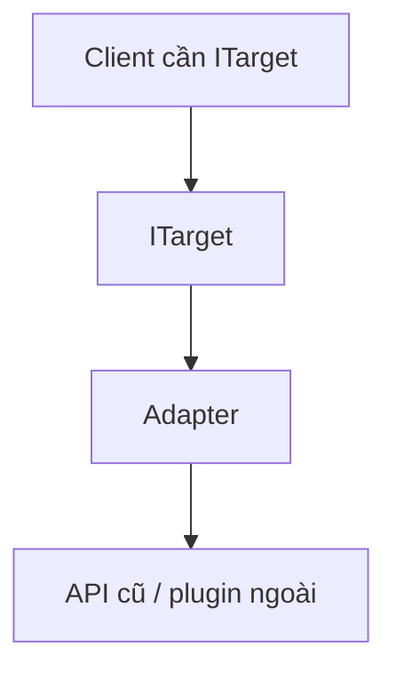
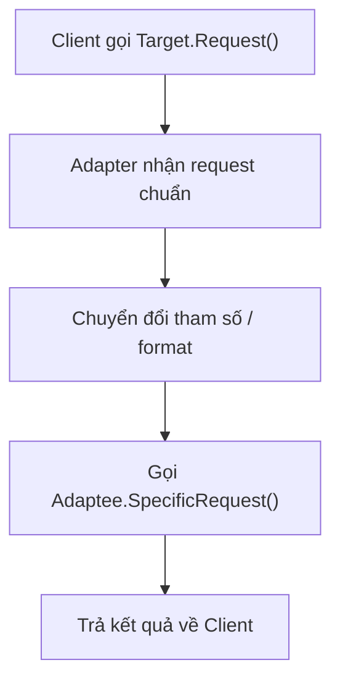
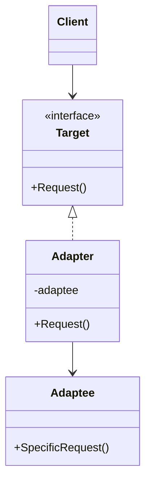

# Adapter (Bộ chuyển đổi)

> 📖 **Nguồn:** [Refactoring.Guru — Adapter](https://refactoring.guru/design-patterns/adapter) | Tác giả: Alexander Shvets

---

## 🎯 Ý định (Intent)

**Adapter** là một mẫu thiết kế cấu trúc cho phép các đối tượng có giao diện (interface) không tương thích có thể hợp tác và làm việc với nhau. Nó hoạt động như một bộ chuyển đổi giữa hai hệ thống, dịch chuyển các yêu cầu từ client sang định dạng mà hệ thống dịch vụ (service) mong đợi.

---

## ❌ Vấn đề (Problem)

Hãy tưởng tượng bạn đang nâng cấp một dự án game MMORPG lớn từ phiên bản cũ lên phiên bản mới.
- Hệ thống theo dõi thành tựu (Achievements) cũ của game được quản lý bởi lớp `LegacyAchievementSystem`. Lớp này đã chạy ổn định 5 năm qua, sử dụng các hàm như `RecordScore(string id, int points)` và `UnlockBadge(string badgeName)`.
- Ở phiên bản mới, bạn tích hợp một hệ thống Achievements API thống nhất, đa nền tảng (Steam, Google Play, iOS Game Center) thông qua interface `IAchievementsManager`. Hệ thống mới này yêu cầu định dạng tham số rất khác: sử dụng tiến trình phần trăm `TrackProgress(string achievementId, float progressPercent)` và hoàn thành qua `CompleteAchievement(string achievementId)`.
- Bạn không thể chỉnh sửa trực tiếp `LegacyAchievementSystem` vì nó là mã nguồn đóng từ thư viện cũ hoặc đã quá phức tạp, sợ gây lỗi (regression) cho các hệ thống khác. Tuy nhiên, toàn bộ logic gameplay mới lại được viết để giao tiếp trực tiếp với `IAchievementsManager`.

---

## ✅ Giải pháp (Solution)

Mẫu **Adapter** đề xuất bạn tạo ra một lớp đặc biệt gọi là **Adapter (Bộ chuyển đổi)** đóng vai trò trung gian:

1.  Lớp Adapter thực thi interface của hệ thống mới (`IAchievementsManager`).
2.  Lớp Adapter chứa một tham chiếu đối tượng (reference) đến lớp cũ (`LegacyAchievementSystem`).
3.  Khi Gameplay gọi hàm `TrackProgress` trên Adapter, lớp này sẽ tự động chuyển đổi logic: tính toán tiến trình phần trăm thành điểm số cụ thể tương ứng và gọi hàm `RecordScore` của hệ thống cũ.

Nhờ đó, Client (gameplay mới) có thể giao tiếp mượt mà với hệ thống cũ thông qua Adapter mà không cần biết đến sự tồn tại của hệ thống cũ đó.

---

## 🎨 Cấu trúc (Structure)

Thay vì đọc một UML lớn ngay từ đầu, hãy đọc pattern theo 3 lớp: **ý tưởng nhanh → luồng chạy thực tế → UML rút gọn**.

### 1. Ý tưởng nhanh



### 2. Luồng chạy thực tế



### 3. UML rút gọn



### Cách đọc sơ đồ

| Thành phần | Ý nghĩa |
|---|---|
| Nhìn nhanh | Adapter là đầu chuyển giữa interface mong muốn và API hiện có. |
| Luồng chính | Client không biết Adaptee có format khác. |
| Trong game | Bọc SDK, plugin input, analytics, asset loader cũ. |
| Mũi tên nét liền | Object đang giữ tham chiếu hoặc gọi trực tiếp object khác. |
| Mũi tên tam giác / nét đứt trong UML | Kế thừa hoặc thực thi interface. |

> Mẹo đọc nhanh: trước hết hãy tìm **Client/Context**, sau đó đi theo mũi tên đến interface chính. Các class cụ thể chỉ là biến thể được thay vào khi chạy.

---

## 💻 Mã giả (Pseudocode)

```csharp
// Giao diện Target mà Client mong đợi
interface ITarget
{
    void Request();
}

// Lớp Adaptee chứa các hàm hữu ích nhưng không tương thích interface
class Adaptee
{
    public void SpecificRequest()
    {
        Print("Yêu cầu đặc thù của hệ thống cũ.");
    }
}

// Lớp Adapter kết nối Target và Adaptee
class Adapter : ITarget
{
    private Adaptee _adaptee;

    public Adapter(Adaptee adaptee)
    {
        this._adaptee = adaptee;
    }

    public void Request()
    {
        // Chuyển đổi cuộc gọi sang định dạng của Adaptee
        this._adaptee.SpecificRequest();
    }
}
```

---

## ⚙️ Khả năng áp dụng (Applicability)

Dùng Adapter khi:
- Bạn muốn sử dụng một class có sẵn nhưng interface của nó không tương thích với phần còn lại của dự án.
- Bạn muốn tạo một class có thể tái sử dụng, tương thích với các class không xác định hoặc không liên quan trong tương lai (tạo ra một tầng đệm - abstraction layer).
- Bạn cần tích hợp các SDK/Plugin bên thứ ba (quảng cáo, thanh toán, phân tích số liệu) có interface thay đổi liên tục qua các bản cập nhật vào trong lõi game của bạn.

---

## 📝 Các bước thực hiện (How to Implement)

1.  Xác định giao diện (interface) mà client mong muốn (Target).
2.  Xác định class có sẵn nhưng không tương thích cần chuyển đổi (Adaptee).
3.  Tạo class Adapter thực thi interface Target.
4.  Khai báo một field trong class Adapter chứa thực thể Adaptee (Composition). Khởi tạo nó thông qua Constructor.
5.  Triển khai các phương thức của Target trong Adapter bằng cách gọi các phương thức tương ứng của Adaptee kèm theo logic chuyển đổi định dạng dữ liệu thích hợp.

---

## ⚖️ Ưu & Nhược điểm (Pros and Cons)

*   **👍 Ưu điểm:**
    *   *Single Responsibility Principle:* Phân tách mã nguồn chuyển đổi giao diện ra khỏi logic nghiệp vụ chính của game.
    *   *Open/Closed Principle:* Có thể tạo thêm nhiều bộ chuyển đổi mới mà không làm ảnh hưởng đến mã nguồn của Client hay Adaptee.
    *   *Tái sử dụng cao:* Cho phép tái sử dụng các class cũ cực kỳ an toàn.
*   **👎 Nhược điểm:**
    *   Làm tăng độ phức tạp tổng thể của mã nguồn do phải giới thiệu thêm các interface và class trung gian mới.

---

## 🎮 Trong Game Dev: C# Code Example (Unity)

Dưới đây là cách chuyển đổi hệ thống lưu thành tựu cũ sang API Achievements mới của game trong Unity:

### 1. Hệ thống cũ (Adaptee - Legacy Achievement System)
```csharp
using UnityEngine;

namespace DesignPatterns.Adapter
{
    // Lớp cũ, không thể chỉnh sửa trực tiếp vì lý do bảo trì hoặc nguồn đóng
    public class LegacyAchievementSystem
    {
        public void RecordScore(string id, int points)
        {
            Debug.Log($"[Legacy System] Ghi nhận thành tích '{id}' đạt {points} điểm.");
        }

        public void UnlockBadge(string badgeName)
        {
            Debug.Log($"[Legacy System] Đã mở khóa huy hiệu: '{badgeName}'!");
        }
    }
}
```

### 2. Interface mới (Target) và lớp Adapter
```csharp
namespace DesignPatterns.Adapter
{
    // Interface chuẩn mực mới mà Gameplay và UI đang sử dụng
    public interface IAchievementsManager
    {
        void TrackProgress(string achievementId, float progressPercent);
        void CompleteAchievement(string achievementId);
    }

    // Lớp Adapter thực hiện cầu nối chuyển đổi dữ liệu
    public class LegacyAchievementAdapter : IAchievementsManager
    {
        private readonly LegacyAchievementSystem _legacySystem;
        private const int MAX_POINTS = 100;

        public LegacyAchievementAdapter(LegacyAchievementSystem legacySystem)
        {
            _legacySystem = legacySystem;
        }

        public void TrackProgress(string achievementId, float progressPercent)
        {
            // Chuyển đổi phần trăm (0.0f -> 1.0f) sang điểm số cũ (0 -> 100)
            int points = Mathf.RoundToInt(Mathf.Clamp01(progressPercent) * MAX_POINTS);
            
            // Gọi hàm của hệ thống cũ
            _legacySystem.RecordScore(achievementId, points);
        }

        public void CompleteAchievement(string achievementId)
        {
            // Hoàn thành thành tích đồng nghĩa với mở khóa Badge hệ thống cũ
            _legacySystem.UnlockBadge(achievementId);
        }
    }
}
```

### 3. Cách sử dụng trong Game (Client - GameplayManager)
```csharp
using UnityEngine;

namespace DesignPatterns.Adapter
{
    public class GamePlayManager : MonoBehaviour
    {
        private IAchievementsManager _achievementsManager;

        private void Start()
        {
            // 1. Khởi tạo hệ thống cũ
            LegacyAchievementSystem legacySystem = new LegacyAchievementSystem();

            // 2. Wrap hệ thống cũ qua bộ chuyển đổi Adapter
            _achievementsManager = new LegacyAchievementAdapter(legacySystem);

            // 3. Gameplay mới sử dụng interface mới mượt mà
            Debug.Log("--- Gameplay bắt đầu tiêu diệt quái vật ---");
            
            // Người chơi tiêu diệt được 50% số lượng quái yêu cầu
            _achievementsManager.TrackProgress("MONSTER_SLAYER", 0.5f);

            // Người chơi hoàn thành thử thách
            _achievementsManager.CompleteAchievement("MONSTER_SLAYER");
        }
    }
}
```

---

> 📚 **Nguồn gốc:** Nội dung tham khảo từ [Refactoring.Guru](https://refactoring.guru/) — Tác giả: Alexander Shvets, Minh họa: Dmitry Zhart

| Hướng | Liên kết |
|-------|----------|
| ← Quay lại | [Structural Patterns Overview](./00-structural-overview.md) |
| → Tiếp theo | [Bridge](./02-bridge.md) |
