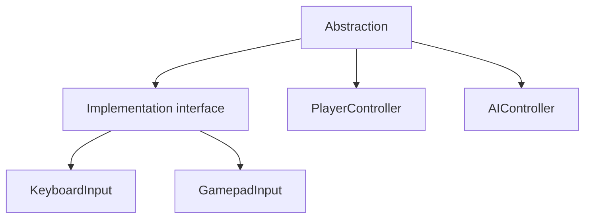
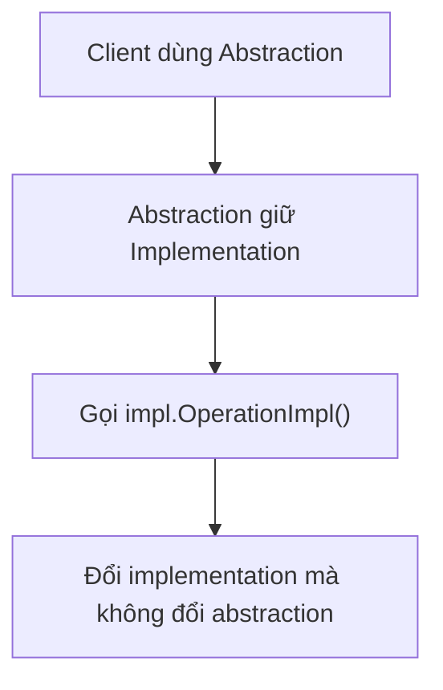
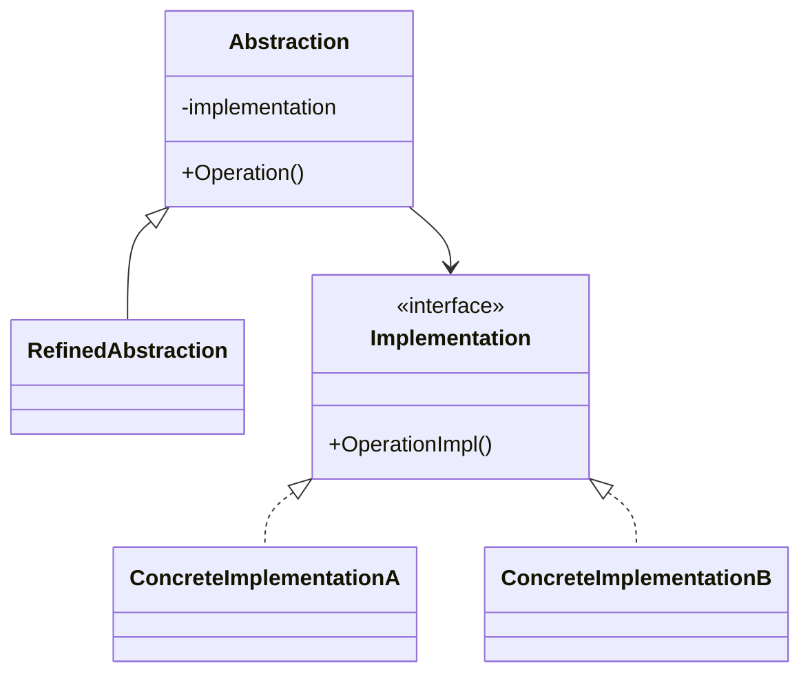

# Bridge (Cầu nối)

> 📖 **Nguồn:** [Refactoring.Guru — Bridge](https://refactoring.guru/design-patterns/bridge) | Tác giả: Alexander Shvets

---

## 🎯 Ý định (Intent)

**Bridge** là một mẫu thiết kế cấu trúc giúp chia tách một lớp lớn (hoặc một nhóm các lớp liên quan chặt chẽ) thành hai phân cấp độc lập: **Trừu tượng (Abstraction)** và **Thực thi (Implementation)**, cho phép chúng phát triển độc lập với nhau.

---

## ❌ Vấn đề (Problem)

Hãy tưởng tượng bạn đang xây dựng một hệ thống vũ khí (Weapon System) cho một tựa game RPG hành động.
- Ban đầu, bạn có hai loại vũ khí: `Sword` (Kiếm) và `Bow` (Cung).
- Bạn muốn thêm các hiệu ứng nguyên tố (VFX/SFX) khác nhau cho từng loại vũ khí: `Fire` (Lửa) và `Ice` (Băng).
- Nếu bạn sử dụng cơ chế kế thừa truyền thống, bạn sẽ phải tạo các class con như: `FireSword`, `IceSword`, `FireBow`, `IceBow`.
- Trong tương lai, nếu Designer muốn thêm loại vũ khí mới là `Staff` (Trượng) và hiệu ứng mới là `Shadow` (Bóng tối), số lượng class con sẽ bùng nổ theo cấp số nhân ($M \times N$):
  *   *Vũ khí mới:* `ShadowSword`, `ShadowBow`, `FireStaff`, `IceStaff`, `ShadowStaff`...
  *   Điều này dẫn đến sự trùng lặp code VFX/SFX cực kỳ nghiêm trọng và cấu trúc phân cấp lớp trở nên cồng kềnh, không thể quản lý nổi.

---

## ✅ Giải pháp (Solution)

Mẫu **Bridge** đề xuất chuyển dịch từ cơ chế kế thừa (inheritance) sang cơ chế chứa đựng (composition). 

1.  **Tách biệt hai phân cấp:** 
    *   **Phân cấp Trừu tượng (Abstraction - Gameplay Logic):** Định nghĩa loại vũ khí hoạt động thế nào (ví dụ: kiếm cận chiến, cung bắn xa).
    *   **Phân cấp Thực thi (Implementation - Visual & Sound):** Định nghĩa cách trình diễn các hiệu ứng nguyên tố (ví dụ: phát hiệu ứng lửa, phát âm thanh băng giá).
2.  Lớp cơ sở `Weapon` (Abstraction) sẽ chứa một tham chiếu đến interface `IWeaponVisual` (Implementation).
3.  Khi gọi hàm tấn công `Attack()`, vũ khí chỉ thực hiện logic toán học của nó (như tính sát thương) và ủy quyền (delegate) việc trình diễn hình ảnh/âm thanh cho đối tượng `IWeaponVisual` thông qua tham chiếu đó.

Bằng cách này, chúng ta chỉ cần tạo $M + N$ class thay vì $M \times N$ class. Chúng ta có thể dễ dàng thêm vũ khí mới hoặc hiệu ứng mới mà không cần chỉnh sửa các class hiện có. Thậm chí có thể hoán đổi hiệu ứng vũ khí ngay thời điểm runtime (như khi nhân vật nhặt được buff nguyên tố).

---

## 🎨 Cấu trúc (Structure)

Thay vì đọc một UML lớn ngay từ đầu, hãy đọc pattern theo 3 lớp: **ý tưởng nhanh → luồng chạy thực tế → UML rút gọn**.

### 1. Ý tưởng nhanh



### 2. Luồng chạy thực tế



### 3. UML rút gọn



### Cách đọc sơ đồ

| Thành phần | Ý nghĩa |
|---|---|
| Nhìn nhanh | Tách hai trục thay đổi độc lập. |
| Luồng chính | Abstraction ủy quyền cho implementation đang được gắn. |
| Trong game | Tách gameplay object khỏi input/render/audio backend. |
| Mũi tên nét liền | Object đang giữ tham chiếu hoặc gọi trực tiếp object khác. |
| Mũi tên tam giác / nét đứt trong UML | Kế thừa hoặc thực thi interface. |

> Mẹo đọc nhanh: trước hết hãy tìm **Client/Context**, sau đó đi theo mũi tên đến interface chính. Các class cụ thể chỉ là biến thể được thay vào khi chạy.

---

## 💻 Mã giả (Pseudocode)

```csharp
// Phân cấp Thực thi (Implementation)
interface IImplementation
{
    void MethodImpl();
}

// Phân cấp Trừu tượng (Abstraction)
class Abstraction
{
    protected IImplementation _impl;
    
    public Abstraction(IImplementation impl)
    {
        _impl = impl;
    }
    
    public virtual void Operation()
    {
        _impl.MethodImpl();
    }
}

// Lớp trừu tượng mở rộng (Refined Abstraction)
class RefinedAbstraction : Abstraction
{
    public RefinedAbstraction(IImplementation impl) : base(impl) {}
    
    public override void Operation()
    {
        base.Operation();
        // Logic bổ sung riêng
    }
}
```

---

## ⚙️ Khả năng áp dụng (Applicability)

Dùng Bridge khi:
- Bạn muốn phân chia và tổ chức một class nguyên khối có nhiều biến thể ở cả mặt logic lẫn mặt hiển thị đồ họa.
- Bạn cần phát triển độc lập lớp trừu tượng (Gameplay Mechanics) và lớp thực thi (Platform-specific API, VFX/SFX, Rendering Engine).
- Bạn muốn có khả năng chuyển đổi các thành phần thực thi khác nhau ngay lúc game đang chạy (runtime) mà không cần tạo mới toàn bộ đối tượng game.

---

## 📝 Các bước thực hiện (How to Implement)

1.  Xác định các khía cạnh độc lập trong lớp của bạn (ví dụ: chủng loại vũ khí vs hiệu ứng nguyên tố).
2.  Tạo interface chung cho phân cấp thực thi (Implementation) và định nghĩa các phương thức cần thiết.
3.  Trong lớp cha trừu tượng (Abstraction), khai báo một field kiểu interface vừa tạo và thiết lập thông qua Constructor hoặc Property setter.
4.  Kế thừa lớp cha trừu tượng để tạo các lớp trừu tượng cụ thể (Refined Abstraction) chứa logic nghiệp vụ chính.
5.  Thực thi interface Implementation ở các lớp con cụ thể để xử lý đồ họa/âm thanh chi tiết.
6.  Ở Client, khởi tạo đối tượng Implementation mong muốn, truyền nó vào Constructor của Abstraction.

---

## ⚖️ Ưu & Nhược điểm (Pros and Cons)

*   **👍 Ưu điểm:**
    *   *Giảm số lượng class kế thừa:* Chuyển phân cấp $M \times N$ thành cấu trúc phẳng $M + N$.
    *   *Open/Closed Principle:* Có thể thêm các loại vũ khí mới và các hiệu ứng mới hoàn toàn độc lập.
    *   *Single Responsibility Principle:* Tách biệt code tính toán gameplay (Dev) khỏi code điều khiển diễn hoạt/âm thanh (Artist).
    *   *Runtime Flexibility:* Có thể đổi hiệu ứng hiển thị của vũ khí ở runtime chỉ bằng cách gán lại tham chiếu Implementation.
*   **👎 Nhược điểm:**
    *   Có thể làm cho mã nguồn trở nên khó đọc hơn ở giai đoạn đầu đối với những ai chưa quen với mô hình Bridge/Composition.

---

## 🎮 Trong Game Dev: C# Code Example (Unity)

Dưới đây là hệ thống Vũ khí chia tách hoàn toàn giữa Logic gameplay (Sword, Bow) và hiệu ứng hình ảnh âm thanh (Fire, Ice) trong Unity:

### 1. Phân cấp Thực thi (IWeaponVisual và các Concrete Implementation)
```csharp
using UnityEngine;

namespace DesignPatterns.Bridge
{
    // Giao diện điều khiển hình ảnh và âm thanh của vũ khí
    public interface IWeaponVisual
    {
        void PlayAttackEffects(Vector3 spawnPosition);
        void PlayHitSound();
    }

    // Hiệu ứng lửa (Fire Elemental)
    public class FireWeaponVisual : IWeaponVisual
    {
        public void PlayAttackEffects(Vector3 spawnPosition)
        {
            Debug.Log($"[VFX] Bùng nổ hạt lửa đỏ rực rỡ tại {spawnPosition}!");
            // Thực tế sẽ Instantiate một Particle System lửa ở đây:
            // Object.Instantiate(firePrefab, spawnPosition, Quaternion.identity);
        }

        public void PlayHitSound()
        {
            Debug.Log("[SFX] Âm thanh xèo xèo thiêu đốt!");
        }
    }

    // Hiệu ứng băng (Ice Elemental)
    public class IceWeaponVisual : IWeaponVisual
    {
        public void PlayAttackEffects(Vector3 spawnPosition)
        {
            Debug.Log($"[VFX] Tạo chông băng nhọn hoắt tỏa hơi lạnh tại {spawnPosition}!");
        }

        public void PlayHitSound()
        {
            Debug.Log("[SFX] Âm thanh rạn nứt đóng băng giòn giã!");
        }
    }
}
```

### 2. Phân cấp Trừu tượng (Weapon và các Refined Abstraction)
```csharp
namespace DesignPatterns.Bridge
{
    // Lớp trừu tượng đại diện cho Vũ khí
    public abstract class Weapon
    {
        // Cầu nối (Bridge) sang phần thực thi hiển thị
        protected IWeaponVisual weaponVisual;

        protected Weapon(IWeaponVisual visual)
        {
            weaponVisual = visual;
        }

        // Cho phép thay đổi hiệu ứng ở runtime (Enchantment)
        public void SetVisual(IWeaponVisual newVisual)
        {
            weaponVisual = newVisual;
        }

        public abstract void PerformAttack(Vector3 targetPosition);
    }

    // Kiếm cận chiến
    public class Sword : Weapon
    {
        public Sword(IWeaponVisual visual) : base(visual) { }

        public override void PerformAttack(Vector3 targetPosition)
        {
            Debug.Log("[Weapon System] Thực hiện nhát chém chí mạng cận chiến!");
            
            // Gọi phần thực thi hiển thị thông qua cầu nối
            weaponVisual.PlayAttackEffects(targetPosition);
            weaponVisual.PlayHitSound();
        }
    }

    // Cung bắn xa
    public class Bow : Weapon
    {
        public Bow(IWeaponVisual visual) : base(visual) { }

        public override void PerformAttack(Vector3 targetPosition)
        {
            Debug.Log("[Weapon System] Bắn ra mũi tên xuyên thấu tầm xa!");
            
            // Gọi phần thực thi hiển thị thông qua cầu nối
            weaponVisual.PlayAttackEffects(targetPosition);
            weaponVisual.PlayHitSound();
        }
    }
}
```

### 3. Client Test Component trong Unity
```csharp
using UnityEngine;

namespace DesignPatterns.Bridge
{
    public class CombatManager : MonoBehaviour
    {
        private void Start()
        {
            // 1. Tạo các đối tượng thực thi hiệu ứng
            IWeaponVisual fireEffect = new FireWeaponVisual();
            IWeaponVisual iceEffect = new IceWeaponVisual();

            // 2. Khởi tạo vũ khí kiếm mang hiệu ứng lửa
            Debug.Log("--- Khởi tạo Kiếm Lửa ---");
            Weapon mySword = new Sword(fireEffect);
            mySword.PerformAttack(new Vector3(2f, 0f, 0f));

            // 3. Khởi tạo cung mang hiệu ứng băng
            Debug.Log("\n--- Khởi tạo Cung Băng ---");
            Weapon myBow = new Bow(iceEffect);
            myBow.PerformAttack(new Vector3(10f, 2f, 0f));

            // 4. Thay đổi hiệu ứng của thanh kiếm sang băng tại runtime (Nhặt bùa băng)
            Debug.Log("\n--- Thanh kiếm được phù phép băng (Enchant Ice) ---");
            mySword.SetVisual(iceEffect);
            mySword.PerformAttack(new Vector3(3f, 0f, 0f));
        }
    }
}
```

---

> 📚 **Nguồn gốc:** Nội dung tham khảo từ [Refactoring.Guru](https://refactoring.guru/) — Tác giả: Alexander Shvets, Minh họa: Dmitry Zhart

| Hướng | Liên kết |
|-------|----------|
| ← Quay lại | [Adapter](./01-adapter.md) |
| → Tiếp theo | [Composite](./03-composite.md) |
