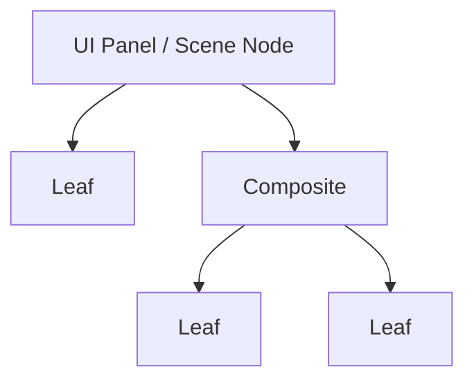
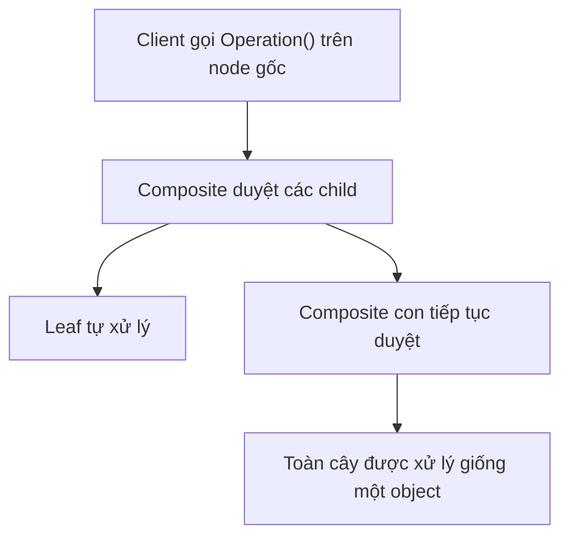
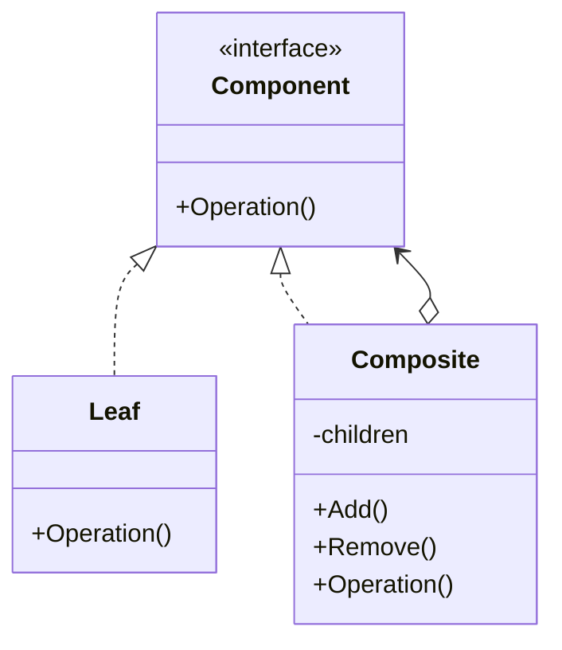

# Composite (Hỗn hợp)

> 📖 **Nguồn:** [Refactoring.Guru — Composite](https://refactoring.guru/design-patterns/composite) | Tác giả: Alexander Shvets

---

## 🎯 Ý định (Intent)

**Composite** là một mẫu thiết kế cấu trúc cho phép bạn sắp xếp các đối tượng theo cấu trúc cây (tree structure) và làm việc với các cấu trúc này như thể chúng là các đối tượng riêng lẻ (tính đồng nhất giữa đối tượng đơn và nhóm đối tượng).

---

## ❌ Vấn đề (Problem)

Hãy tưởng tượng bạn đang lập trình hệ thống hòm đồ (Inventory System) cho một tựa game RPG sinh tồn.
- Người chơi có thể sở hữu các vật phẩm đơn lẻ như: `Sword` (Kiếm - nặng 2kg, trị giá 150 vàng), `Health Potion` (Bình máu - nặng 0.2kg, trị giá 15 vàng).
- Người chơi cũng có thể sở hữu các vật phẩm chứa đồ (Container) như `Pouch` (Túi nhỏ), `Backpack` (Balo lớn), hoặc nhặt được `Treasure Chest` (Rương kho báu). Một chiếc Balo có thể chứa vài bình máu, một thanh kiếm và... một chiếc Túi nhỏ khác bên trong.
- Khi cần tính toán **Tổng trọng lượng** hành lý để xem người chơi có bị quá tải (overencumbered) hay không, hoặc tính **Tổng trị giá** hòm đồ để bán cho thương nhân, bạn sẽ gặp rắc rối lớn.
- Nếu không có mẫu thiết kế chuẩn, bạn phải viết code kiểm tra kiểu dữ liệu (type checking): duyệt qua danh sách, xem món nào là túi đồ thì phải mở ra duyệt đệ quy tiếp các món bên trong, món nào là vật phẩm đơn lẻ thì cộng trực tiếp. Việc này tạo ra các vòng lặp lồng nhau chằng chịt, cực kỳ dễ lỗi và khó bảo trì khi thêm loại vật phẩm mới.

---

## ✅ Giải pháp (Solution)

Mẫu **Composite** khuyên bạn nên sử dụng một interface chung cho cả vật phẩm đơn lẻ và vật phẩm chứa đồ. Interface này được gọi là **Component** (trong game là `IInventoryItem`).

1.  **Component (`IInventoryItem`):** Định nghĩa các phương thức chung như `GetWeight()` (lấy trọng lượng) và `GetValue()` (lấy giá trị vàng).
2.  **Leaf (Lá - `SingleItem`):** Đại diện cho vật phẩm cơ bản không chứa gì khác. Lớp này chỉ trả về trọng lượng và giá trị của chính nó.
3.  **Composite (Hỗn hợp - `ItemContainer`):** Đại diện cho các vật phẩm chứa đồ (Balo, Túi, Rương). Nó chứa một danh sách các `IInventoryItem` con.
    *   Hàm `GetWeight()` của nó sẽ tự động lặp qua toàn bộ các vật phẩm con bên trong, gọi hàm `GetWeight()` của từng đứa rồi cộng dồn lại (cộng thêm trọng lượng rỗng của chiếc túi nếu có).

Khi Client muốn tính tổng trọng lượng của cả Balo, họ chỉ cần gọi `backpack.GetWeight()`. Balo sẽ tự động hỏi các vật phẩm con của nó, bất kể con của nó là một bình máu nhỏ hay một túi đồ trung gian khác. Cuộc gọi đệ quy sẽ tự động lan truyền đi khắp cấu trúc cây.

---

## 🎨 Cấu trúc (Structure)

Thay vì đọc một UML lớn ngay từ đầu, hãy đọc pattern theo 3 lớp: **ý tưởng nhanh → luồng chạy thực tế → UML rút gọn**.

### 1. Ý tưởng nhanh



### 2. Luồng chạy thực tế



### 3. UML rút gọn



### Cách đọc sơ đồ

| Thành phần | Ý nghĩa |
|---|---|
| Nhìn nhanh | Leaf và group có cùng interface. |
| Luồng chính | Client thao tác với cả cây như một object duy nhất. |
| Trong game | Scene hierarchy, UI hierarchy, skill tree. |
| Mũi tên nét liền | Object đang giữ tham chiếu hoặc gọi trực tiếp object khác. |
| Mũi tên tam giác / nét đứt trong UML | Kế thừa hoặc thực thi interface. |

> Mẹo đọc nhanh: trước hết hãy tìm **Client/Context**, sau đó đi theo mũi tên đến interface chính. Các class cụ thể chỉ là biến thể được thay vào khi chạy.

---

## 💻 Mã giả (Pseudocode)

```csharp
// Giao diện chung Component
interface IComponent
{
    void Execute();
}

// Đối tượng Lá (Leaf)
class Leaf : IComponent
{
    public void Execute()
    {
        // Thực hiện hành vi của đối tượng đơn lẻ
    }
}

// Đối tượng Hỗn hợp (Composite)
class Composite : IComponent
{
    private List<IComponent> _children = new List<IComponent>();

    public void Add(IComponent component) => _children.Add(component);
    public void Remove(IComponent component) => _children.Remove(component);

    public void Execute()
    {
        // Duyệt đệ quy qua tất cả các con
        foreach (var child in _children)
        {
            child.Execute();
        }
    }
}
```

---

## ⚙️ Khả năng áp dụng (Applicability)

Dùng Composite khi:
- Bạn cần thể hiện các mối quan hệ phân cấp kiểu cây (cha - con, chứa - được chứa) trong thế giới game.
- Bạn muốn client code có thể bỏ qua sự khác biệt giữa các đối tượng riêng lẻ và các nhóm đối tượng, giúp client tương tác đồng nhất với mọi thành phần.
- Điển hình trong game: Hệ thống UI phân cấp (Canvas -> Panel -> Button/Text), Hệ thống cây kỹ năng (Skill Tree), Hệ thống hòm đồ (Inventory), hoặc sơ đồ tổ chức quân đội (Quân đoàn -> Sư đoàn -> Trung đội -> Binh lính).

---

## 📝 Các bước thực hiện (How to Implement)

1.  Đảm bảo mô hình nghiệp vụ của game có thể biểu diễn dưới dạng cấu trúc cây.
2.  Khai báo interface Component (ví dụ: `IInventoryItem`) với các phương thức nghiệp vụ chung (như lấy trọng lượng, tính giá bán).
3.  Tạo class Leaf (Lá) đại diện cho các phần tử cuối cùng. Thực thi các hàm nghiệp vụ trả về giá trị trực tiếp của Leaf.
4.  Tạo class Composite (Hỗn hợp) đại diện cho các node chứa phần tử khác.
    *   Khai báo mảng hoặc danh sách chứa các phần tử kiểu Component.
    *   Cung cấp các hàm quản lý con như `Add()` và `Remove()`.
    *   Thực thi hàm nghiệp vụ bằng cách duyệt qua danh sách con và gọi đệ quy các hàm tương ứng của con.

---

## ⚖️ Ưu & Nhược điểm (Pros and Cons)

*   **👍 Ưu điểm:**
    *   *Tính đa hình cực cao (Polymorphism):* Giúp client code sạch sẽ, không cần check kiểu dữ liệu thủ công hay dùng quá nhiều vòng lặp lồng nhau.
    *   *Open/Closed Principle:* Dễ dàng giới thiệu các loại vật phẩm lá mới hoặc các loại rương/túi mới vào game mà không làm hỏng logic tính toán hiện có.
*   **👎 Nhược điểm:**
    *   Khó tạo ra các hạn chế kiểu cứng tại compile-time (ví dụ: ngăn không cho bỏ Rương sắt vào trong một cái Túi vải nhỏ). Phải xử lý logic kiểm tra lồng nhau này tại runtime.

---

## 🎮 Trong Game Dev: C# Code Example (Unity)

Dưới đây là cách triển khai hệ thống Hòm đồ lồng nhau trong Unity sử dụng Composite:

### 1. Interface Component
```csharp
namespace DesignPatterns.Composite
{
    // Interface chung cho tất cả vật phẩm trong hòm đồ
    public interface IInventoryItem
    {
        string GetName();
        float GetWeight();
        int GetValue();
    }
}
```

### 2. Lớp Leaf (Vật phẩm đơn lẻ)
```csharp
namespace DesignPatterns.Composite
{
    // Đại diện cho một vật phẩm đơn lẻ
    public class SingleItem : IInventoryItem
    {
        private string name;
        private float weight;
        private int value;

        public SingleItem(string name, float weight, int value)
        {
            this.name = name;
            this.weight = weight;
            this.value = value;
        }

        public string GetName() => name;
        public float GetWeight() => weight;
        public int GetValue() => value;
    }
}
```

### 3. Lớp Composite (Vật phẩm chứa đồ - Balo/Túi/Rương)
```csharp
using System.Collections.Generic;
using System.Text;

namespace DesignPatterns.Composite
{
    // Đại diện cho hộp chứa, túi đồ có thể chứa các IInventoryItem khác
    public class ItemContainer : IInventoryItem
    {
        private string containerName;
        private float containerEmptyWeight; // Trọng lượng bản thân chiếc túi khi rỗng
        private List<IInventoryItem> storedItems = new List<IInventoryItem>();

        public ItemContainer(string name, float emptyWeight)
        {
            this.containerName = name;
            this.containerEmptyWeight = emptyWeight;
        }

        public void AddItem(IInventoryItem item)
        {
            storedItems.Add(item);
        }

        public void RemoveItem(IInventoryItem item)
        {
            storedItems.Remove(item);
        }

        public string GetName() => containerName;

        // Tính tổng trọng lượng đệ quy: Trọng lượng túi rỗng + trọng lượng các vật phẩm bên trong
        public float GetWeight()
        {
            float totalWeight = containerEmptyWeight;
            foreach (var item in storedItems)
            {
                totalWeight += item.GetWeight();
            }
            return totalWeight;
        }

        // Tính tổng giá trị đệ quy: Tổng giá trị của các vật phẩm bên trong
        public int GetValue()
        {
            int totalValue = 0;
            foreach (var item in storedItems)
            {
                totalValue += item.GetValue();
            }
            return totalValue;
        }

        // Hàm helper để in ra cấu trúc hòm đồ dạng cây
        public string GetStructureInfo(int indent = 0)
        {
            StringBuilder sb = new StringBuilder();
            string indentSpace = new string(' ', indent * 4);
            sb.AppendLine($"{indentSpace}[Container] {containerName} (Nặng: {GetWeight()}kg | Trị giá: {GetValue()} Vàng)");
            
            foreach (var item in storedItems)
            {
                if (item is ItemContainer subContainer)
                {
                    sb.Append(subContainer.GetStructureInfo(indent + 1));
                }
                else
                {
                    sb.AppendLine($"{indentSpace}    - {item.GetName()} ({item.GetWeight()}kg | {item.GetValue()} Vàng)");
                }
            }
            return sb.ToString();
        }
    }
}
```

### 4. Client Test Component trong Unity
```csharp
using UnityEngine;

namespace DesignPatterns.Composite
{
    public class InventoryTest : MonoBehaviour
    {
        private void Start()
        {
            // 1. Tạo các vật phẩm lá đơn lẻ
            IInventoryItem ironSword = new SingleItem("Kiếm Sắt", 2.5f, 120);
            IInventoryItem redPotion = new SingleItem("Bình Máu Đỏ", 0.2f, 15);
            IInventoryItem goldRing = new SingleItem("Nhẫn Vàng", 0.05f, 500);

            // 2. Tạo một Túi nhỏ (Pouch) đựng Potion
            ItemContainer potionPouch = new ItemContainer("Túi Thuốc Nhỏ", 0.1f);
            potionPouch.AddItem(redPotion);
            potionPouch.AddItem(new SingleItem("Bình Mana Xanh", 0.2f, 20));

            // 3. Tạo một Balo (Backpack) lớn của người chơi
            ItemContainer backpack = new ItemContainer("Balo Thám Hiểm", 1.0f);
            
            // Thêm kiếm sắt và nhẫn vàng vào balo
            backpack.AddItem(ironSword);
            backpack.AddItem(goldRing);
            
            // Thêm chiếc túi thuốc nhỏ (Pouch) vào balo (Composite lồng Composite)
            backpack.AddItem(potionPouch);

            // 4. In ra thông tin chi tiết
            Debug.Log("--- CẤU TRÚC HÒM ĐỒ CỦA NGƯỜI CHƠI ---");
            Debug.Log(backpack.GetStructureInfo());

            // 5. Tính toán nhanh
            Debug.Log($"Tổng trọng lượng của Balo: {backpack.GetWeight()} kg");
            Debug.Log($"Tổng giá trị kinh tế của Balo: {backpack.GetValue()} Vàng");
        }
    }
}
```

---

> 📚 **Nguồn gốc:** Nội dung tham khảo từ [Refactoring.Guru](https://refactoring.guru/) — Tác giả: Alexander Shvets, Minh họa: Dmitry Zhart

| Hướng | Liên kết |
|-------|----------|
| ← Quay lại | [Bridge](./02-bridge.md) |
| → Tiếp theo | [Decorator](./04-decorator.md) |
