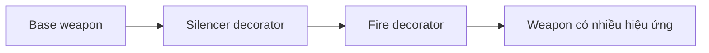
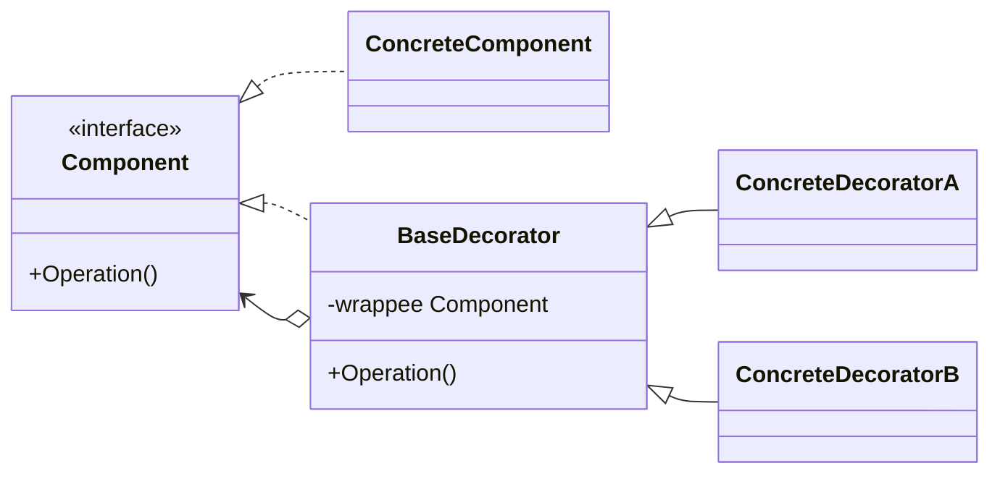

# Decorator (Trang trí)

> 📖 **Nguồn:** [Refactoring.Guru — Decorator](https://refactoring.guru/design-patterns/decorator) | Tác giả: Alexander Shvets

---

## 🎯 Ý định (Intent)

**Decorator** là một mẫu thiết kế cấu trúc cho phép bạn gắn thêm các hành vi, tính năng mới vào một đối tượng một cách động (at runtime) bằng cách đặt đối tượng này bên trong các đối tượng "bao bọc" (wrapper) đặc biệt chứa các hành vi đó.

---

## ❌ Vấn đề (Problem)

Hãy tưởng tượng bạn đang viết mã cho một hệ thống Vũ khí trong game bắn súng sinh tồn (Shooter) hoặc game RPG.
- Bạn có một lớp vũ khí cơ bản là `SimpleWeapon` (Súng trường tiêu chuẩn) gây ra 20 sát thương.
- Người chơi có thể nhặt được các phụ kiện nâng cấp (attachments) hoặc bùa phép (enchantments) để gắn lên vũ khí như:
  *   `Silencer` (Ống giảm thanh): Giảm tiếng ồn, giảm nhẹ 2 sát thương cơ bản nhưng tăng độ chí mạng.
  *   `FireAmmo` (Đạn lửa): Thêm hiệu ứng thiêu đốt, cộng thêm 5 sát thương lửa.
  *   `PoisonAmmo` (Đạn độc): Thêm hiệu ứng độc rút máu, cộng thêm 3 sát thương độc.
- Nếu dùng phương pháp kế thừa, bạn sẽ phải tạo ra hàng loạt class để phục vụ tất cả các tổ hợp lắp ghép có thể: `SilencedWeapon`, `FireWeapon`, `PoisonWeapon`, `SilencedFireWeapon`, `SilencedPoisonWeapon`, `FirePoisonWeapon`, `SilencedFirePoisonWeapon`...
- Việc này dẫn đến sự bùng nổ số lượng lớp con (subclass explosion) không thể kiểm soát. Đồng thời, bạn không thể dễ dàng tháo lắp phụ kiện hoặc thay đổi hiệu ứng vũ khí ngay trong trận đấu khi người chơi nhấn nút tháo phụ kiện.

---

## ✅ Giải pháp (Solution)

Mẫu **Decorator** đề xuất thay thế việc kế thừa trực tiếp bằng cách sử dụng **Bao bọc (Wrapping)**.

1.  **Component (`IWeapon`):** Định nghĩa một interface chung cho cả vũ khí cơ bản và các phụ kiện trang trí.
2.  **Concrete Component (`SimpleWeapon`):** Vũ khí thô, cơ bản ban đầu thực thi `IWeapon`.
3.  **Base Decorator (`WeaponDecorator`):** Thực thi interface `IWeapon` và chứa một tham chiếu đến đối tượng `IWeapon` khác. Lớp này đóng vai trò chuyển tiếp mọi cuộc gọi hàm (như tính sát thương, lấy mô tả) đến đối tượng được bao bọc bên trong.
4.  **Concrete Decorators (`FireEnchantment`, `SilencerDecorator`):** Ghi đè các hàm của Decorator cha để cộng thêm logic riêng (ví dụ: lấy sát thương của súng bên trong rồi cộng thêm sát thương nguyên tố lửa).

Khi chạy game, ta có thể lắp ráp vũ khí như những lớp vỏ hành tây lồng vào nhau:
*   Bắt đầu với: `IWeapon myWeapon = new SimpleWeapon();` (Sát thương: 20)
*   Gắn thêm giảm thanh: `myWeapon = new SilencerDecorator(myWeapon);` (Sát thương: 20 - 2 = 18)
*   Gắn thêm đạn lửa: `myWeapon = new FireEnchantment(myWeapon);` (Sát thương: 18 + 5 = 23)

Mỗi khi ta gọi hàm `myWeapon.GetDamage()`, cuộc gọi sẽ chạy xuyên suốt qua tất cả các lớp Decorator để tính ra kết quả cuối cùng.

---

## 🎨 Cấu trúc (Structure)

Thay vì đọc một UML lớn ngay từ đầu, hãy đọc pattern theo 3 lớp: **ý tưởng nhanh → luồng chạy thực tế → UML rút gọn**.

### 1. Ý tưởng nhanh



### 2. Luồng chạy thực tế


### 3. UML rút gọn



### Cách đọc sơ đồ

| Thành phần | Ý nghĩa |
|---|---|
| Nhìn nhanh | Decorator bọc object để thêm behavior runtime. |
| Luồng chính | Call đi từ lớp bọc ngoài vào trong rồi cộng logic khi trả ra. |
| Trong game | Power-up, buff/debuff, weapon attachment. |
| Mũi tên nét liền | Object đang giữ tham chiếu hoặc gọi trực tiếp object khác. |
| Mũi tên tam giác / nét đứt trong UML | Kế thừa hoặc thực thi interface. |

> Mẹo đọc nhanh: trước hết hãy tìm **Client/Context**, sau đó đi theo mũi tên đến interface chính. Các class cụ thể chỉ là biến thể được thay vào khi chạy.

---

## 💻 Mã giả (Pseudocode)

```csharp
// Giao diện Component
interface IComponent
{
    string Operation();
}

// Lớp đối tượng gốc
class ConcreteComponent : IComponent
{
    public string Operation() => "Gốc";
}

// Decorator cơ bản
abstract class Decorator : IComponent
{
    protected IComponent _component;

    public Decorator(IComponent component)
    {
        this._component = component;
    }

    public virtual string Operation() => _component.Operation();
}

// Bộ trang trí cụ thể A
class ConcreteDecoratorA : Decorator
{
    public ConcreteDecoratorA(IComponent comp) : base(comp) {}

    public override string Operation()
    {
        return $"Trang trí A({base.Operation()})";
    }
}
```

---

## ⚙️ Khả năng áp dụng (Applicability)

Dùng Decorator khi:
- Bạn muốn thêm các thuộc tính hoặc hành vi mới cho các đối tượng một cách động mà không làm ảnh hưởng đến các đối tượng khác.
- Bạn cần một giải pháp thay thế linh hoạt cho cơ chế kế thừa vốn đang gặp tình trạng bùng nổ số lượng lớp con quá mức.
- Điển hình trong game: Hệ thống trang trí bùa phép vũ khí, hệ thống Buff/Debuff của nhân vật (mỗi buff là một decorator bao bọc chỉ số nhân vật), hệ thống nâng cấp chỉ số trang bị.

---

## 📝 Các bước thực hiện (How to Implement)

1.  Định nghĩa interface chung (Component) đại diện cho thực thể cốt lõi và các bộ trang trí.
2.  Tạo lớp cụ thể (Concrete Component) thực thi interface này để làm đối tượng nền tảng.
3.  Tạo lớp Base Decorator thực thi interface Component và chứa một trường tham chiếu đến kiểu Component đó.
4.  Ủy quyền tất cả các phương thức của Component sang đối tượng được wrap bên trong.
5.  Tạo các Concrete Decorator kế thừa từ Base Decorator. Ở mỗi phương thức cần trang trí, hãy gọi phương thức tương tự của lớp cha (hoặc đối tượng bên trong) rồi thực hiện cộng dồn/bổ sung logic mới.

---

## ⚖️ Ưu & Nhược điểm (Pros and Cons)

*   **👍 Ưu điểm:**
    *   *Linh hoạt vượt trội:* Có thể kết hợp nhiều hiệu ứng/phụ kiện khác nhau cùng một lúc tại runtime (ví dụ: súng vừa giảm thanh vừa bắn đạn độc).
    *   *Single Responsibility Principle:* Chia nhỏ các hiệu ứng (lửa, độc, giảm thanh) ra thành các class riêng biệt.
    *   *Tránh kế thừa tĩnh:* Cắt giảm tối đa số lượng class con cần duy trì.
*   **👎 Nhược điểm:**
    *   Khó gỡ bỏ một Decorator cụ thể ở giữa chuỗi bao bọc (ví dụ: muốn tháo ống giảm thanh nhưng giữ nguyên đạn lửa và đạn độc).
    *   Thứ tự lồng ghép Decorator có thể ảnh hưởng đến logic (ví dụ: nhân sát thương trước hay cộng sát thương trước).
    *   Mã nguồn có thể khó debug ban đầu vì đối tượng cuối cùng thực tế là một chuỗi lồng ghép sâu.

---

## 🎮 Trong Game Dev: C# Code Example (Unity)

Dưới đây là cách xây dựng hệ thống Trang trí Vũ khí với hiệu ứng Đạn lửa và Ống giảm thanh trong Unity:

### 1. Interface Component và Concrete Component
```csharp
namespace DesignPatterns.Decorator
{
    // Interface chung cho tất cả các loại vũ khí và phụ kiện nâng cấp
    public interface IWeapon
    {
        string GetDescription();
        float GetDamage();
    }

    // Vũ khí cơ bản ban đầu
    public class SimpleWeapon : IWeapon
    {
        private string weaponName;
        private float baseDamage;

        public SimpleWeapon(string name, float damage)
        {
            weaponName = name;
            baseDamage = damage;
        }

        public string GetDescription() => weaponName;
        public float GetDamage() => baseDamage;
    }
}
```

### 2. Base Decorator (WeaponDecorator)
```csharp
namespace DesignPatterns.Decorator
{
    // Lớp cơ sở cho mọi phụ kiện trang trí vũ khí
    public abstract class WeaponDecorator : IWeapon
    {
        protected IWeapon wrappedWeapon;

        protected WeaponDecorator(IWeapon weapon)
        {
            this.wrappedWeapon = weapon;
        }

        // Chuyển tiếp cuộc gọi đến vũ khí được bao bọc bên trong
        public virtual string GetDescription()
        {
            return wrappedWeapon.GetDescription();
        }

        public virtual float GetDamage()
        {
            return wrappedWeapon.GetDamage();
        }
    }
}
```

### 3. Concrete Decorators (Các phụ kiện cụ thể)
```csharp
namespace DesignPatterns.Decorator
{
    // Phụ kiện: Ống giảm thanh (Silencer)
    public class SilencerDecorator : WeaponDecorator
    {
        public SilencerDecorator(IWeapon weapon) : base(weapon) { }

        public override string GetDescription()
        {
            return base.GetDescription() + " + Ống Giảm Thanh (Silencer)";
        }

        public override float GetDamage()
        {
            // Giảm thanh làm giảm nhẹ sát thương cơ bản đi 2 đơn vị
            return base.GetDamage() - 2f;
        }
    }

    // Nâng cấp: Đạn Lửa (Fire Enchantment)
    public class FireEnchantment : WeaponDecorator
    {
        public FireEnchantment(IWeapon weapon) : base(weapon) { }

        public override string GetDescription()
        {
            return base.GetDescription() + " & Đạn Lửa (Fire)";
        }

        public override float GetDamage()
        {
            // Cộng thêm 5 sát thương lửa
            return base.GetDamage() + 5f;
        }
    }
}
```

### 4. Client Test Component trong Unity
```csharp
using UnityEngine;

namespace DesignPatterns.Decorator
{
    public class WeaponModTest : MonoBehaviour
    {
        private void Start()
        {
            // 1. Tạo khẩu súng trường M4A1 cơ bản
            IWeapon myRifle = new SimpleWeapon("Súng trường M4A1", 20f);
            PrintWeaponInfo(myRifle);

            // 2. Gắn thêm ống giảm thanh (Silencer) vào khẩu M4A1
            Debug.Log("\n--- Người chơi gắn thêm Ống giảm thanh ---");
            myRifle = new SilencerDecorator(myRifle);
            PrintWeaponInfo(myRifle);

            // 3. Phù phép thêm Đạn lửa (Fire Enchantment) lên khẩu M4A1 đang có giảm thanh
            Debug.Log("\n--- Người chơi nạp thêm Đạn lửa ---");
            myRifle = new FireEnchantment(myRifle);
            PrintWeaponInfo(myRifle);

            // 4. Có thể lồng ghép thêm một lớp đạn lửa nữa nếu game cho phép stack hiệu ứng
            Debug.Log("\n--- Người chơi stack thêm một lớp Đạn lửa nữa ---");
            myRifle = new FireEnchantment(myRifle);
            PrintWeaponInfo(myRifle);
        }

        private void PrintWeaponInfo(IWeapon weapon)
        {
            Debug.Log($"Vũ khí: {weapon.GetDescription()}");
            Debug.Log($"Tổng sát thương: {weapon.GetDamage()} DPS");
        }
    }
}
```

---

> 📚 **Nguồn gốc:** Nội dung tham khảo từ [Refactoring.Guru](https://refactoring.guru/) — Tác giả: Alexander Shvets, Minh họa: Dmitry Zhart

| Hướng | Liên kết |
|-------|----------|
| ← Quay lại | [Composite](./03-composite.md) |
| → Tiếp theo | [Facade](./05-facade.md) |
