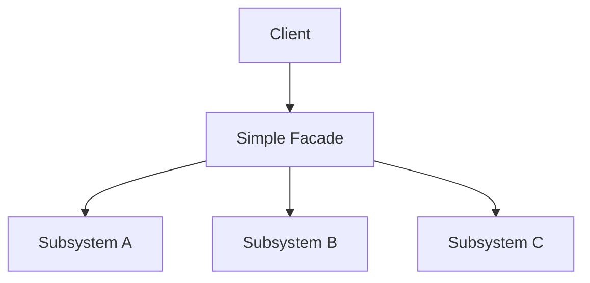
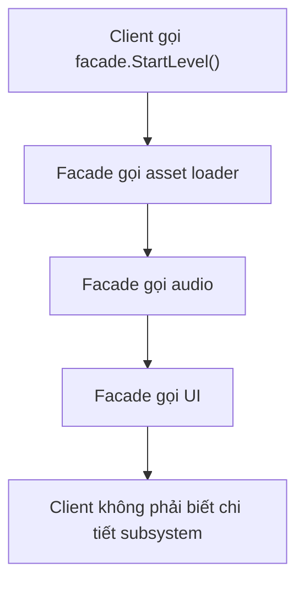
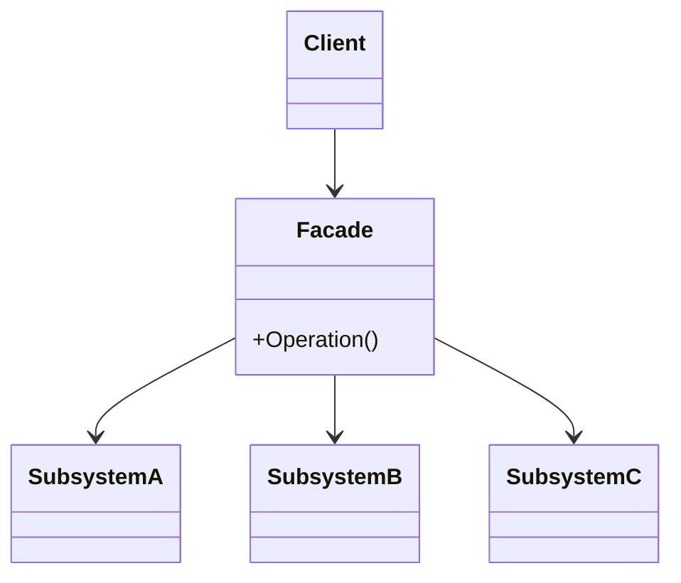

# Facade (Mặt tiền)

> 📖 **Nguồn:** [Refactoring.Guru — Facade](https://refactoring.guru/design-patterns/facade) | Tác giả: Alexander Shvets

---

## 🎯 Ý định (Intent)

**Facade** là một mẫu thiết kế cấu trúc cung cấp một giao diện (interface) đơn giản hóa, duy nhất đại diện cho một hệ thống con (subsystem) cực kỳ phức tạp gồm nhiều class, thư viện hoặc logic xử lý chằng chịt bên trong. Facade giúp che giấu đi sự phức tạp và hướng sự tương tác của client vào một điểm duy nhất, tinh gọn.

---

## ❌ Vấn đề (Problem)

Hãy tưởng tượng bạn đang triển khai tính năng **Lưu & Tải game (Save/Load Game)** cho một tựa game RPG thế giới mở.
- Để lưu trạng thái trò chơi (lượng máu, vị trí, hòm đồ, nhiệm vụ), hệ thống cần phải phối hợp rất nhiều bước phức tạp:
  1.  **Serialization:** Chuyển đổi đối tượng C# `SaveData` thành chuỗi định dạng JSON hoặc dữ liệu nhị phân (Binary).
  2.  **Encryption:** Mã hóa chuỗi dữ liệu (ví dụ dùng thuật toán AES) để ngăn chặn người chơi mở file lên chỉnh sửa gian lận (cheat).
  3.  **File I/O:** Ghi file dữ liệu đã mã hóa xuống ổ đĩa cục bộ của thiết bị (`Application.persistentDataPath`).
  4.  **Local Settings:** Lưu các cài đặt nhỏ (như âm lượng, độ sáng) riêng biệt vào `PlayerPrefs` của Unity.
  5.  **Cloud Sync:** Đồng bộ hóa file save vừa lưu lên đám mây (Steam Cloud, Google Play Games hoặc iCloud).
- Nếu các class Gameplay hoặc UI trực tiếp gọi cả 5 hệ thống này mỗi khi người chơi nhấn nút "Save Game", code sẽ trở nên cực kỳ rác, rối rắm và liên kết chặt chẽ (tight coupling). 
- Bất kỳ khi nào bạn thay đổi thư viện mã hóa, hoặc đổi từ JSON sang Protocol Buffers, bạn lại phải đi sửa code ở tất cả các nơi gọi hàm Save.

---

## ✅ Giải pháp (Solution)

Mẫu **Facade** đề xuất tạo ra một class duy nhất là `SaveLoadManager` (đóng vai trò là Mặt tiền - Facade).

1.  Lớp `SaveLoadManager` sẽ bao bọc (wrap) tất cả các lớp con phức tạp bên trong như: `JsonSerializer`, `DataEncryptor`, `DiskWriter`, `CloudSyncManager`.
2.  Nó chỉ phơi bày (expose) hai hàm cực kỳ đơn giản cho Client:
    *   `void Save(SaveData data)`
    *   `SaveData Load()`
3.  Mọi chi tiết xử lý nội bộ về mã hóa, ghi file, đồng bộ cloud đều được thực hiện kín kẽ bên trong `SaveLoadManager`.

Client (Gameplay, UI Button) giờ đây chỉ cần giao tiếp với `SaveLoadManager` thông qua một dòng code duy nhất mà không cần biết các thư viện con bên dưới hoạt động ra sao.

---

## 🎨 Cấu trúc (Structure)

Thay vì đọc một UML lớn ngay từ đầu, hãy đọc pattern theo 3 lớp: **ý tưởng nhanh → luồng chạy thực tế → UML rút gọn**.

### 1. Ý tưởng nhanh



### 2. Luồng chạy thực tế



### 3. UML rút gọn



### Cách đọc sơ đồ

| Thành phần | Ý nghĩa |
|---|---|
| Nhìn nhanh | Facade gom nhiều subsystem thành một API dễ dùng. |
| Luồng chính | Client gọi một hàm, Facade điều phối nhiều bước. |
| Trong game | Load level, start match, save/load, menu flow. |
| Mũi tên nét liền | Object đang giữ tham chiếu hoặc gọi trực tiếp object khác. |
| Mũi tên tam giác / nét đứt trong UML | Kế thừa hoặc thực thi interface. |

> Mẹo đọc nhanh: trước hết hãy tìm **Client/Context**, sau đó đi theo mũi tên đến interface chính. Các class cụ thể chỉ là biến thể được thay vào khi chạy.

---

## 💻 Mã giả (Pseudocode)

```csharp
// Các lớp hệ thống con phức tạp (Subsystems)
class SubsystemA { public void OperationA1() {} }
class SubsystemB { public void OperationB1() {} }
class SubsystemC { public void OperationC1() {} }

// Facade gom tất cả hệ thống con lại
class Facade
{
    private SubsystemA _a = new SubsystemA();
    private SubsystemB _b = new SubsystemB();
    private SubsystemC _c = new SubsystemC();

    public void SimpleOperation()
    {
        // Phối hợp các hệ thống con
        _a.OperationA1();
        _b.OperationB1();
        _c.OperationC1();
    }
}
```

---

## ⚙️ Khả năng áp dụng (Applicability)

Dùng Facade khi:
- Bạn muốn cung cấp một giao diện đơn giản, tối giản cho một hệ thống con phức tạp chứa nhiều thành phần liên kết chéo.
- Bạn muốn phân tầng (layer) mã nguồn của game. Sử dụng Facade làm điểm vào (entry point) cho mỗi tầng, giúp giảm thiểu sự phụ thuộc giữa các tầng với nhau.
- Điển hình trong game: Hệ thống Save/Load, Hệ thống Audio Manager (bao gồm quản lý Mixer, nguồn phát AudioSource, tải clip từ Addressables, điều chỉnh âm lượng nhóm), Hệ thống Network Manager (kết nối, xác thực, gửi nhận gói tin).

---

## 📝 Các bước thực hiện (How to Implement)

1.  Xác định hệ thống con phức tạp cần đơn giản hóa giao diện.
2.  Tạo lớp Facade mới (ví dụ: `SaveLoadManager`). Lớp này sẽ chứa các biến tham chiếu đến các thực thể của hệ thống con.
3.  Triển khai các phương thức nghiệp vụ tinh gọn trên Facade. Các phương thức này sẽ chịu trách nhiệm phân bổ, điều phối công việc cho các lớp con theo đúng quy trình.
4.  Định hướng Client code gọi qua Facade thay vì gọi trực tiếp các lớp con.

---

## ⚖️ Ưu & Nhược điểm (Pros and Cons)

*   **👍 Ưu điểm:**
    *   *Giảm Coupling:* Tách biệt Client khỏi sự phức tạp và thay đổi của các thư viện con bên dưới.
    *   *Dễ sử dụng:* Giúp nhà phát triển khác trong nhóm dễ dàng gọi các tính năng phức tạp mà không cần học cách hoạt động chi tiết của từng subsystem.
*   **👎 Nhược điểm:**
    *   Nếu không thiết kế cẩn thận, Facade có thể biến thành một **God Object** (lớp siêu cấp chứa quá nhiều logic và phình to vô hạn theo thời gian).

---

## 🎮 Trong Game Dev: C# Code Example (Unity)

Dưới đây là cách xây dựng Facade `SaveLoadManager` quản lý Serialization, Encryption, File I/O và Cloud Sync trong Unity:

### 1. Dữ liệu Save và các Subsystems (Hệ thống con)
```csharp
using System;
using UnityEngine;

namespace DesignPatterns.Facade
{
    // Lớp chứa dữ liệu Save game
    [Serializable]
    public class SaveData
    {
        public int playerLevel;
        public float health;
        public string currentScene;
    }

    // Subsystem 1: Chuyển đổi dữ liệu (Serializer)
    public class GameSerializer
    {
        public string Serialize(SaveData data)
        {
            Debug.Log("[Subsystem] Đang serialize SaveData sang JSON...");
            return JsonUtility.ToJson(data);
        }

        public SaveData Deserialize(string json)
        {
            Debug.Log("[Subsystem] Đang deserialize JSON sang SaveData...");
            return JsonUtility.FromJson<SaveData>(json);
        }
    }

    // Subsystem 2: Mã hóa dữ liệu (Encryptor)
    public class DataEncryptor
    {
        public string Encrypt(string plainText)
        {
            Debug.Log("[Subsystem] Đang mã hóa dữ liệu (AES)...");
            return "ENCRYPTED_[" + plainText + "]"; // Giả lập mã hóa
        }

        public string Decrypt(string cipherText)
        {
            Debug.Log("[Subsystem] Đang giải mã dữ liệu...");
            return cipherText.Replace("ENCRYPTED_[", "").Replace("]", "");
        }
    }

    // Subsystem 3: Ghi file xuống ổ cứng (FileWriter)
    public class FileStorage
    {
        public void WriteToFile(string fileName, string content)
        {
            string path = Application.persistentDataPath + "/" + fileName;
            Debug.Log($"[Subsystem] Đang ghi file xuống ổ đĩa cục bộ tại: {path}");
            // Thực tế: File.WriteAllText(path, content);
        }

        public string ReadFromFile(string fileName)
        {
            string path = Application.persistentDataPath + "/" + fileName;
            Debug.Log($"[Subsystem] Đang đọc file từ ổ đĩa cục bộ tại: {path}");
            // Thực tế: return File.ReadAllText(path);
            return "ENCRYPTED_[{\"playerLevel\":15,\"health\":85.5,\"currentScene\":\"Level_3\"}]"; // Giả lập dữ liệu đọc được
        }
    }

    // Subsystem 4: Đồng bộ hóa đám mây (CloudService)
    public class CloudService
    {
        public void SyncToCloud(string fileName)
        {
            Debug.Log($"[Subsystem] Đang đồng bộ file '{fileName}' lên Steam Cloud...");
        }
    }
}
```

### 2. Lớp Facade (SaveLoadManager)
```csharp
namespace DesignPatterns.Facade
{
    // Lớp Mặt tiền (Facade) quản lý toàn bộ hệ thống Save/Load phức tạp
    public class SaveLoadManager
    {
        private readonly GameSerializer _serializer;
        private readonly DataEncryptor _encryptor;
        private readonly FileStorage _storage;
        private readonly CloudService _cloud;

        private const string SAVE_FILE_NAME = "gamesave.sav";

        public SaveLoadManager()
        {
            _serializer = new GameSerializer();
            _encryptor = new DataEncryptor();
            _storage = new FileStorage();
            _cloud = new CloudService();
        }

        // Interface cực kỳ đơn giản cho Client sử dụng để Lưu Game
        public void SaveGame(SaveData data)
        {
            Debug.Log(">>> Bắt đầu quy trình Lưu Game (Save Facade) <<<");
            
            string json = _serializer.Serialize(data);
            string encryptedData = _encryptor.Encrypt(json);
            _storage.WriteToFile(SAVE_FILE_NAME, encryptedData);
            _cloud.SyncToCloud(SAVE_FILE_NAME);
            
            Debug.Log(">>> Đã lưu game thành công! <<<\n");
        }

        // Interface cực kỳ đơn giản cho Client sử dụng để Tải Game
        public SaveData LoadGame()
        {
            Debug.Log(">>> Bắt đầu quy trình Tải Game (Load Facade) <<<");
            
            string encryptedData = _storage.ReadFromFile(SAVE_FILE_NAME);
            string json = _encryptor.Decrypt(encryptedData);
            SaveData data = _serializer.Deserialize(json);
            
            Debug.Log(">>> Đã tải game thành công! <<<\n");
            return data;
        }
    }
}
```

### 3. Client Component trong Unity (GameplayController)
```csharp
using UnityEngine;

namespace DesignPatterns.Facade
{
    public class GameplayController : MonoBehaviour
    {
        private SaveLoadManager _saveLoadManager;

        private void Start()
        {
            // 1. Khởi tạo Facade
            _saveLoadManager = new SaveLoadManager();

            // 2. Tạo dữ liệu game hiện tại của người chơi
            SaveData currentProgress = new SaveData
            {
                playerLevel = 15,
                health = 85.5f,
                currentScene = "Level_3"
            };

            // 3. Thực hiện lưu game qua 1 cuộc gọi duy nhất
            _saveLoadManager.SaveGame(currentProgress);

            // 4. Thực hiện tải game qua 1 cuộc gọi duy nhất
            SaveData loadedProgress = _saveLoadManager.LoadGame();

            // Kiểm tra dữ liệu sau khi tải
            Debug.Log($"[Client] Kết quả tải game - Level: {loadedProgress.playerLevel}, Máu: {loadedProgress.health}, Màn: {loadedProgress.currentScene}");
        }
    }
}
```

---

> 📚 **Nguồn gốc:** Nội dung tham khảo từ [Refactoring.Guru](https://refactoring.guru/) — Tác giả: Alexander Shvets, Minh họa: Dmitry Zhart

| Hướng | Liên kết |
|-------|----------|
| ← Quay lại | [Decorator](./04-decorator.md) |
| → Tiếp theo | [Flyweight](./06-flyweight.md) |
