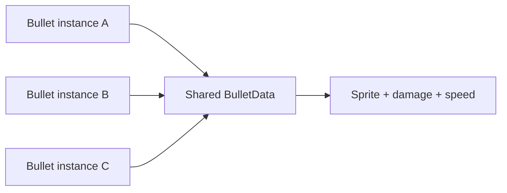
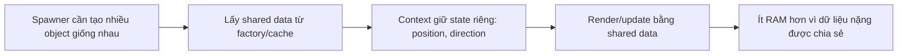
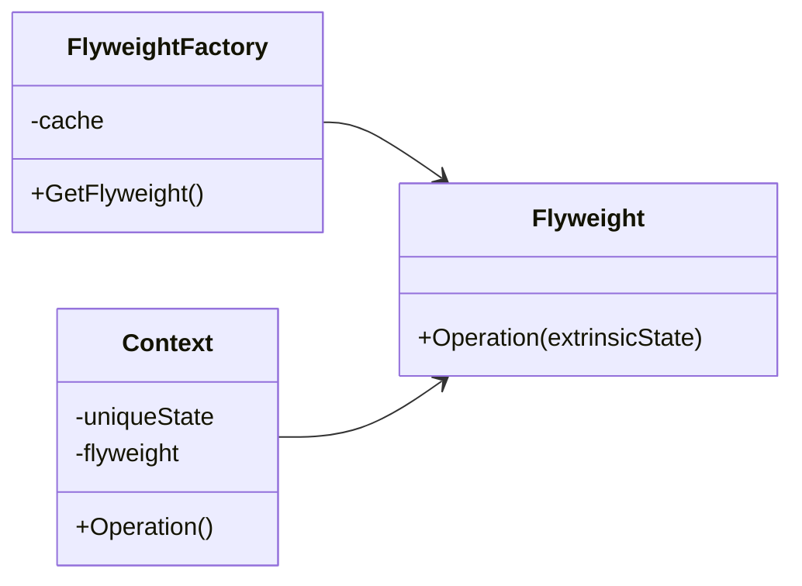

# Flyweight (Khinh lượng / Trọng lượng nhẹ)

> 📖 **Nguồn:** [Refactoring.Guru — Flyweight](https://refactoring.guru/design-patterns/flyweight) | Tác giả: Alexander Shvets

---

## 🎯 Ý định (Intent)

**Flyweight** là một mẫu thiết kế cấu trúc giúp tối ưu hóa bộ nhớ RAM bằng cách chia sẻ các phần trạng thái chung (**trạng thái nội tại - Intrinsic State**) giữa nhiều đối tượng tương tự nhau, thay vì lưu trữ lặp đi lặp lại tất cả các dữ liệu đó trong mỗi đối tượng một cách riêng lẻ.

---

## ❌ Vấn đề (Problem)

Hãy tưởng tượng bạn đang phát triển một tựa game bắn súng "mưa đạn" (Bullet Hell) hoặc game chiến thuật dàn trận (RTS) quy mô lớn.
- Tại một thời điểm, trên màn hình có thể có tới 10,000 viên đạn đang bay cùng lúc.
- Mỗi viên đạn trong game cần lưu trữ các thông tin:
  *   *Thông tin động:* Vị trí (`Vector3 position`), hướng bay (`Vector3 direction`), tốc độ hiện tại.
  *   *Thông tin tĩnh:* Hình ảnh đạn (`Sprite`), mô hình 3D (`Mesh`), hiệu ứng âm thanh phát ra khi bắn (`AudioClip`), lượng sát thương gây ra (`damage`), bán kính vụ nổ, thời gian tồn tại tối đa (`maxLifetime`).
- Nếu mỗi viên đạn là một GameObject độc lập chứa toàn bộ các biến trên, bộ nhớ RAM sẽ bị quá tải cực nhanh. Hàng vạn viên đạn sẽ giữ hàng vạn bản sao giống hệt nhau của cùng một Sprite, cùng một AudioClip và cùng các chỉ số sát thương. Điều này gây lãng phí bộ nhớ khủng khiếp và dẫn đến hiện tượng giật lag do Garbage Collector (GC) phải dọn dẹp bộ nhớ liên tục khi đạn biến mất.

---

## ✅ Giải pháp (Solution)

Mẫu **Flyweight** đề xuất phân tách các thuộc tính của đối tượng thành hai phần:

1.  **Trạng thái nội tại (Intrinsic State):** Là các dữ liệu bất biến, giống nhau hoàn toàn giữa mọi viên đạn cùng loại (như sprite, damage, speed, maxLifetime). Các dữ liệu này sẽ được tách riêng ra và chỉ lưu trữ **duy nhất một bản sao** trong bộ nhớ.
2.  **Trạng thái ngoại tại (Extrinsic State):** Là các dữ liệu thay đổi liên tục và độc lập theo từng thực thể cụ thể (như position, direction). Các dữ liệu này sẽ được giữ lại trong mỗi viên đạn cụ thể.

Trong Unity, cách triển khai Flyweight chuẩn mực và trực quan nhất chính là sử dụng **ScriptableObject**.
- Chúng ta tạo ra một ScriptableObject tên là `BulletData` (đóng vai trò là Flyweight) chứa tất cả các Intrinsic State. Chúng ta chỉ cần tạo đúng 1 file Asset `BulletData` cho loại "Đạn Laser Đỏ" và 1 file cho "Đạn Plasma Xanh".
- Class `Bullet` (Context) đại diện cho viên đạn thực tế bay trên màn hình chỉ chứa Extrinsic State (vị trí, hướng bay) và một tham chiếu (reference) trỏ tới file Asset `BulletData` chung.

Nhờ đó, dù có 10,000 viên đạn Laser Đỏ trên màn hình, chúng cũng chỉ dùng chung một tham chiếu đến 1 file `BulletData` duy nhất, tiết kiệm đến 90% dung lượng RAM cần thiết.

---

## 🎨 Cấu trúc (Structure)

Thay vì đọc một UML lớn ngay từ đầu, hãy đọc pattern theo 3 lớp: **ý tưởng nhanh → luồng chạy thực tế → UML rút gọn**.

### 1. Ý tưởng nhanh



### 2. Luồng chạy thực tế



### 3. UML rút gọn



### Cách đọc sơ đồ

| Thành phần | Ý nghĩa |
|---|---|
| Nhìn nhanh | Tách dữ liệu chung khỏi dữ liệu riêng từng instance. |
| Luồng chính | Context truyền state riêng vào shared Flyweight khi chạy. |
| Trong game | ScriptableObject data cho bullet, tile, tree, enemy stats. |
| Mũi tên nét liền | Object đang giữ tham chiếu hoặc gọi trực tiếp object khác. |
| Mũi tên tam giác / nét đứt trong UML | Kế thừa hoặc thực thi interface. |

> Mẹo đọc nhanh: trước hết hãy tìm **Client/Context**, sau đó đi theo mũi tên đến interface chính. Các class cụ thể chỉ là biến thể được thay vào khi chạy.

---

## 💻 Mã giả (Pseudocode)

```csharp
// Lớp Flyweight chứa trạng thái nội tại (Intrinsic State)
class Flyweight
{
    private string _sharedState; // Ví dụ: Texture, âm thanh, chỉ số chung
    
    public Flyweight(string shared) => _sharedState = shared;
    
    public void Operation(string uniqueState)
    {
        // Thực hiện hành động kết hợp trạng thái nội tại và ngoại tại
        Print($"Nội tại: {_sharedState}, Ngoại tại: {uniqueState}");
    }
}

// Lớp Context chứa trạng thái ngoại tại (Extrinsic State) và tham chiếu Flyweight
class Context
{
    private string _uniqueState; // Trạng thái ngoại tại (Vị trí, hướng)
    private Flyweight _flyweight;

    public Context(string unique, Flyweight flyweight)
    {
        _uniqueState = unique;
        _flyweight = flyweight;
    }

    public void Render() => _flyweight.Operation(_uniqueState);
}
```

---

## ⚙️ Khả năng áp dụng (Applicability)

Dùng Flyweight khi:
- Game của bạn cần tạo ra số lượng thực thể cực kỳ lớn (hàng ngàn, hàng vạn đối tượng).
- Chi phí lưu trữ bộ nhớ của các đối tượng này đang đe dọa trực tiếp đến hiệu năng game (gây crash do tràn RAM hoặc giật khung hình do GC spikes).
- Hầu hết các thuộc tính của đối tượng có thể phân tách rõ ràng thành trạng thái nội tại (chung) và trạng thái ngoại tại (riêng).
- Điển hình trong game: Hệ thống đạn bắn, hệ thống các hạt hiệu ứng (Particles), hệ thống thảm thực vật (vẽ hàng triệu ngọn cỏ, cây cối trên bản đồ thế giới mở), hoặc các đơn vị lính nhỏ (minions) trong game MOBA/RTS.

---

## 📝 Các bước thực hiện (How to Implement)

1.  Phân tích các thuộc tính của đối tượng cần tối ưu, chia chúng thành hai nhóm: Intrinsic (nội tại) và Extrinsic (ngoại tại).
2.  Tạo một lớp Flyweight (trong Unity nên dùng `ScriptableObject`) để lưu trữ các thuộc tính Intrinsic. Đảm bảo lớp này không chứa dữ liệu thay đổi theo từng instance cụ thể.
3.  Tạo lớp Context (thường là `MonoBehaviour` hoặc cấu trúc `struct` gọn nhẹ) để chứa các thuộc tính Extrinsic cùng một tham chiếu trỏ đến lớp Flyweight vừa tạo.
4.  Khi Spawner khởi tạo đối tượng Context, hãy truyền (inject) tham chiếu Flyweight tương ứng vào đối tượng đó.

---

## ⚖️ Ưu & Nhược điểm (Pros and Cons)

*   **👍 Ưu điểm:**
    *   *Tiết kiệm RAM vượt trội:* Tránh việc nhân bản hàng ngàn asset đắt đỏ (Sprite, Audio, Mesh) trong bộ nhớ.
    *   *Tăng hiệu năng:* Giảm tần suất phân bổ và thu hồi bộ nhớ, hạn chế tối đa hiện tượng giật lag do Garbage Collection.
*   **👎 Nhược điểm:**
    *   Lập trình viên phải tách biệt dữ liệu, làm cho code phức tạp hơn một chút.
    *   Tốn một chút CPU để truy xuất dữ liệu từ Flyweight thông qua tham chiếu (nhưng đánh đổi này là cực kỳ xứng đáng so với việc tiết kiệm RAM).

---

## 🎮 Trong Game Dev: C# Code Example (Unity)

Dưới đây là cách triển khai hệ thống Đạn tối ưu bộ nhớ sử dụng `ScriptableObject` làm Flyweight trong Unity:

### 1. Lớp Flyweight (ScriptableObject) chứa trạng thái nội tại
```csharp
using UnityEngine;

namespace DesignPatterns.Flyweight
{
    // Tạo menu để tạo file Asset trong Unity Editor
    [CreateAssetMenu(fileName = "NewBulletData", menuName = "Design Patterns/Flyweight/Bullet Data")]
    public class BulletData : ScriptableObject
    {
        [Header("Intrinsic Properties (Shared)")]
        public Sprite bulletSprite;
        public float baseDamage = 10f;
        public float baseSpeed = 20f;
        public float maxLifetime = 3f;
        
        [SerializeField] private AudioClip hitSound;

        public void PlayHitAudio(Vector3 position)
        {
            if (hitSound != null)
            {
                // Giả lập phát âm thanh tại vị trí va chạm
                Debug.Log($"[SFX] Phát âm thanh {hitSound.name} tại {position}");
            }
        }
    }
}
```

### 2. Lớp Context (MonoBehaviour) chứa trạng thái ngoại tại
```csharp
using UnityEngine;

namespace DesignPatterns.Flyweight
{
    // Lớp đại diện cho viên đạn thực tế bay trong game
    public class Bullet : MonoBehaviour
    {
        // Trạng thái ngoại tại (Extrinsic State - Độc lập cho mỗi viên đạn)
        private Vector3 _velocity;
        private float _currentLifetime;

        // Tham chiếu đến Flyweight (Chia sẻ chung)
        private BulletData _bulletData;
        private SpriteRenderer _spriteRenderer;

        private void Awake()
        {
            _spriteRenderer = GetComponent<SpriteRenderer>();
        }

        // Thiết lập trạng thái ngoại tại ban đầu và gán Flyweight
        public void Initialize(Vector3 direction, BulletData data)
        {
            _bulletData = data;
            
            // Áp dụng dữ liệu nội tại chung để cấu hình hiển thị
            _spriteRenderer.sprite = _bulletData.bulletSprite;
            
            // Tính toán vận tốc dựa trên hướng đi (ngoại tại) và tốc độ bay (nội tại)
            _velocity = direction.normalized * _bulletData.baseSpeed;
            _currentLifetime = 0f;
        }

        private void Update()
        {
            // Cập nhật trạng thái ngoại tại theo thời gian thực
            transform.Translate(_velocity * Time.deltaTime);
            _currentLifetime += Time.deltaTime;

            if (_currentLifetime >= _bulletData.maxLifetime)
            {
                DestroyBullet();
            }
        }

        private void OnTriggerEnter2D(Collider2D collision)
        {
            // Xử lý va chạm
            Debug.Log($"[Bullet] Gây ra {_bulletData.baseDamage} sát thương lên {collision.name}");
            
            // Gọi hàm của Flyweight để phát âm thanh chung
            _bulletData.PlayHitAudio(transform.position);
            
            DestroyBullet();
        }

        private void DestroyBullet()
        {
            // Thực tế nên sử dụng Object Pooling kết hợp với Flyweight để đạt hiệu năng tối đa
            Destroy(gameObject);
        }
    }
}
```

### 3. Spawner tạo hàng loạt đạn (BulletSpawner)
```csharp
using UnityEngine;

namespace DesignPatterns.Flyweight
{
    public class BulletSpawner : MonoBehaviour
    {
        [SerializeField] private GameObject bulletPrefab;
        
        // Kéo thả các file ScriptableObject BulletData vào đây từ Inspector
        [SerializeField] private BulletData redLaserData;
        [SerializeField] private BulletData bluePlasmaData;

        private void Update()
        {
            // Nhấn phím J để bắn đạn Laser Đỏ
            if (Input.GetKeyDown(KeyCode.J))
            {
                SpawnBullet(Vector3.up, redLaserData);
            }

            // Nhấn phím K để bắn đạn Plasma Xanh
            if (Input.GetKeyDown(KeyCode.K))
            {
                SpawnBullet(new Vector3(0.5f, 1f, 0f), bluePlasmaData);
            }
        }

        private void SpawnBullet(Vector3 direction, BulletData data)
        {
            // Khởi tạo GameObject
            GameObject bulletObj = Instantiate(bulletPrefab, transform.position, Quaternion.identity);
            Bullet bulletScript = bulletObj.GetComponent<Bullet>();
            
            // Inject Flyweight ScriptableObject vào viên đạn
            bulletScript.Initialize(direction, data);
            
            Debug.Log($"[Spawner] Đã bắn 1 viên đạn. Đạn này dùng chung dữ liệu: {data.name} (Sát thương: {data.baseDamage})");
        }
    }
}
```

---

> 📚 **Nguồn gốc:** Nội dung tham khảo từ [Refactoring.Guru](https://refactoring.guru/) — Tác giả: Alexander Shvets, Minh họa: Dmitry Zhart

| Hướng | Liên kết |
|-------|----------|
| ← Quay lại | [Facade](./05-facade.md) |
| → Tiếp theo | [Proxy](./07-proxy.md) |
