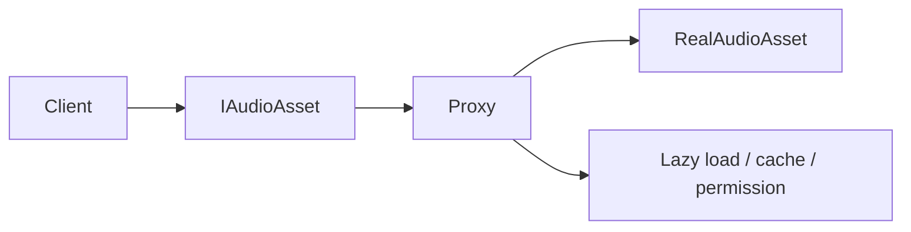
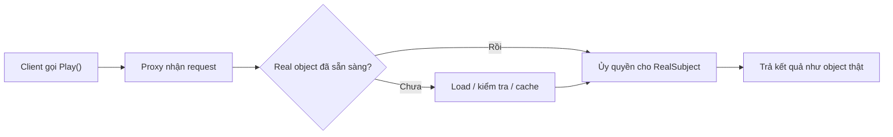
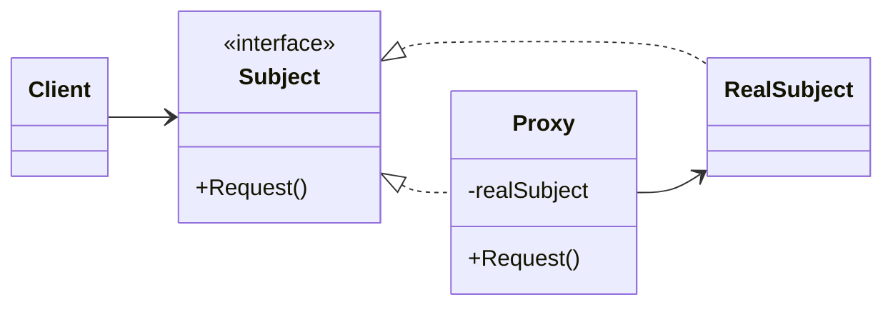

# Proxy (Ủy quyền / Đại diện)

> 📖 **Nguồn:** [Refactoring.Guru — Proxy](https://refactoring.guru/design-patterns/proxy) | Tác giả: Alexander Shvets

---

## 🎯 Ý định (Intent)

**Proxy** là một mẫu thiết kế cấu trúc cho phép bạn cung cấp một đối tượng đại diện hoặc giữ chỗ (substitute/placeholder) cho một đối tượng khác. Một Proxy sẽ kiểm soát quyền truy cập vào đối tượng gốc, cho phép thực hiện các thao tác xử lý bổ sung (như lazy loading, bảo mật, logging, caching) trước hoặc sau khi yêu cầu được truyền tới đối tượng gốc.

---

## ❌ Vấn đề (Problem)

Hãy tưởng tượng bạn đang phát triển một trò chơi AAA thế giới mở có dung lượng hàng chục GB với hàng ngàn hiệu ứng âm thanh (SFX) chất lượng cao và nhạc nền (BGM) định dạng lossless rất nặng.
- Nếu bạn tải (load) tất cả các file âm thanh này vào RAM ngay khi game khởi động, thiết bị của người chơi sẽ cạn kiệt bộ nhớ ngay lập tức và game mất vài phút chỉ để khởi động xong.
- Giải pháp tốt nhất là sử dụng **Lazy Loading (Tải chậm)**: Chỉ tải file âm thanh vào RAM khi nó thực sự được yêu cầu phát lên (ví dụ: khi người chơi bước vào một vùng đất cụ thể hoặc nhặt được một món vũ khí đặc thù).
- Tuy nhiên, việc viết code tải dữ liệu không đồng bộ (Asynchronous Loading) từ Unity Addressables hoặc Asset Bundles ở khắp mọi nơi trong Gameplay sẽ làm code của bạn cực kỳ rối rắm.
- Bạn không muốn các class Client (như nhân vật di chuyển, nút bấm UI) phải tự quản lý vòng đời của âm thanh hay tự thực hiện logic kiểm tra xem file âm thanh đã được tải vào RAM chưa mỗi khi gọi phát âm thanh.

---

## ✅ Giải pháp (Solution)

Mẫu **Proxy** khuyên bạn tạo ra một lớp Đại diện trung gian có cùng interface với đối tượng thật.

1.  **Subject (`IAudioAsset`):** Interface định nghĩa hành động chung, ví dụ `void Play()`.
2.  **Real Subject (`RealAudioAsset`):** Thực thể thật, chứa file âm thanh thực sự (`AudioClip`) đã được tải vào RAM và thực hiện phát âm thanh.
3.  **Proxy (`AudioAssetProxy`):** Lớp đại diện trung gian. Lớp này chứa đường dẫn địa chỉ của asset (Addressable Key) và giữ một tham chiếu đến `RealAudioAsset`.

Khi Client gọi hàm `Play()` trên Proxy:
- Proxy sẽ kiểm tra xem `RealAudioAsset` đã được khởi tạo (đã tải clip vào RAM) chưa.
- **Nếu chưa:** Proxy sẽ tự động thực hiện tiến trình tải âm thanh không đồng bộ từ đĩa lên RAM, khởi tạo `RealAudioAsset` rồi gọi hàm `Play()` trên đó.
- **Nếu rồi:** Proxy sẽ ngay lập tức gọi hàm `Play()` trên `RealAudioAsset` hiện có.

Client tương tác với Proxy hoàn toàn giống hệt như đang tương tác với đối tượng thật mà không hề biết rằng đằng sau đó là cả một quá trình lazy loading và quản lý bộ nhớ RAM phức tạp.

---

## 🎨 Cấu trúc (Structure)

Thay vì đọc một UML lớn ngay từ đầu, hãy đọc pattern theo 3 lớp: **ý tưởng nhanh → luồng chạy thực tế → UML rút gọn**.

### 1. Ý tưởng nhanh



### 2. Luồng chạy thực tế



### 3. UML rút gọn



### Cách đọc sơ đồ

| Thành phần | Ý nghĩa |
|---|---|
| Nhìn nhanh | Proxy đứng trước object thật để kiểm soát truy cập. |
| Luồng chính | Proxy có thể lazy-load, cache, log hoặc phân quyền trước khi ủy quyền. |
| Trong game | Lazy-load audio/texture, network proxy, anti-cheat guard. |
| Mũi tên nét liền | Object đang giữ tham chiếu hoặc gọi trực tiếp object khác. |
| Mũi tên tam giác / nét đứt trong UML | Kế thừa hoặc thực thi interface. |

> Mẹo đọc nhanh: trước hết hãy tìm **Client/Context**, sau đó đi theo mũi tên đến interface chính. Các class cụ thể chỉ là biến thể được thay vào khi chạy.

---

## 💻 Mã giả (Pseudocode)

```csharp
// Interface chung cho Proxy và Real Subject
interface ISubject
{
    void Request();
}

// Đối tượng thực tế (Real Subject) chứa logic nghiệp vụ nặng nề
class RealSubject : ISubject
{
    public void Request()
    {
        Print("Xử lý nghiệp vụ của RealSubject.");
    }
}

// Đối tượng đại diện (Proxy) kiểm soát quyền truy cập
class Proxy : ISubject
{
    private RealSubject _realSubject;

    public void Request()
    {
        // Thực hiện tiền xử lý hoặc Lazy Loading
        if (_realSubject == null)
        {
            _realSubject = new RealSubject();
        }
        
        // Chuyển tiếp yêu cầu
        _realSubject.Request();
    }
}
```

---

## ⚙️ Khả năng áp dụng (Applicability)

Dùng Proxy khi:
- **Virtual Proxy (Lazy Initialization):** Bạn cần quản lý các tài nguyên nặng (ảnh, mô hình 3D, âm thanh) chỉ tải lên RAM khi thực sự được sử dụng để tiết kiệm tài nguyên hệ thống.
- **Protection Proxy (Kiểm soát truy cập):** Bạn muốn phân quyền truy cập. Ví dụ: một Proxy kiểm soát xem Client có đủ thẩm quyền gửi gói tin lên Game Server hay không.
- **Caching/Logging Proxy:** Bạn muốn lưu tạm (cache) kết quả của các yêu cầu đắt đỏ (như request dữ liệu từ Database/Network) hoặc ghi nhận nhật ký (log) lịch sử truy cập của client mà không muốn sửa code của đối tượng gốc.

---

## 📝 Các bước thực hiện (How to Implement)

1.  Nếu chưa có interface chung, hãy tạo một interface (Subject) chung cho cả lớp Proxy và lớp gốc.
2.  Tạo lớp Proxy và khai báo một trường (field) để lưu trữ tham chiếu đến lớp gốc (Real Subject).
3.  Triển khai các phương thức của interface trong lớp Proxy.
4.  Trong thân các phương thức đó, chèn thêm logic kiểm soát (như lazy loading hoặc kiểm tra bảo mật) trước khi chuyển tiếp (delegate) cuộc gọi đến đối tượng gốc.
5.  Cân nhắc cơ chế giải phóng đối tượng gốc khi không còn sử dụng để thu hồi RAM.

---

## ⚖️ Ưu & Nhược điểm (Pros and Cons)

*   **👍 Ưu điểm:**
    *   *Quản lý vòng đời tối ưu:* Cho phép khởi tạo muộn (lazy initialization) các đối tượng nặng mà không làm phiền Client code.
    *   *Hoạt động âm thầm:* Proxy hoạt động ngay cả khi đối tượng gốc chưa sẵn sàng hoặc bị lỗi.
    *   *Open/Closed Principle:* Có thể giới thiệu các Proxy mới (như Proxy bảo mật hoặc Proxy ghi log) mà không cần chỉnh sửa đối tượng gốc.
*   **👎 Nhược điểm:**
    *   Phản hồi có thể bị trễ trong lần gọi đầu tiên do phải thực hiện các tác vụ nặng (như tải asset từ đĩa hoặc mạng).
    *   Làm tăng số lượng lớp, tăng độ phức tạp của code.

---

## 🎮 Trong Game Dev: C# Code Example (Unity)

Dưới đây là cách triển khai hệ thống Lazy-Loading âm thanh sử dụng mẫu Proxy giả lập việc tải dữ liệu từ ổ đĩa (Addressables) trong Unity:

### 1. Interface Subject và Real Subject (Đối tượng âm thanh thực tế)
```csharp
using UnityEngine;

namespace DesignPatterns.Proxy
{
    // Interface chung cho tất cả các tài nguyên âm thanh
    public interface IAudioAsset
    {
        void Play();
    }

    // Đối tượng âm thanh thật, chỉ tồn tại khi đã nạp file âm thanh vào bộ nhớ RAM
    public class RealAudioAsset : IAudioAsset
    {
        private string _assetAddress;
        private string _audioClipName; // Giả lập AudioClip thực tế

        public RealAudioAsset(string address)
        {
            _assetAddress = address;
            LoadClipFromDisk();
        }

        private void LoadClipFromDisk()
        {
            // Giả lập tốn thời gian đọc file từ đĩa cứng vào RAM
            _audioClipName = "AudioClip_Data_of_" + _assetAddress.Replace("Assets/Audio/", "");
            Debug.Log($"[Real Subject] Đã nạp thành công '{_audioClipName}' vào RAM (Tiêu tốn 5MB bộ nhớ).");
        }

        public void Play()
        {
            Debug.Log($"[Real Subject] Đang phát âm thanh: {_audioClipName} thông qua AudioSource!");
        }
    }
}
```

### 2. Proxy Class (AudioAssetProxy) quản lý Lazy Loading
```csharp
namespace DesignPatterns.Proxy
{
    // Lớp đại diện (Proxy), được tạo sẵn mà không tốn RAM load file âm thanh
    public class AudioAssetProxy : IAudioAsset
    {
        private string _assetAddress;
        
        // Tham chiếu đến đối tượng thật, ban đầu bằng null
        private RealAudioAsset _realAudioAsset;

        public AudioAssetProxy(string assetAddress)
        {
            this._assetAddress = assetAddress;
            Debug.Log($"[Proxy] Đã khởi tạo Proxy cho âm thanh: '{_assetAddress}'. (Vẫn chưa tốn RAM nạp file)");
        }

        // Thực thi phương thức interface
        public void Play()
        {
            // Lazy Loading: Nếu đối tượng thật chưa được nạp, nạp ngay lúc này
            if (_realAudioAsset == null)
            {
                Debug.Log($"[Proxy] Phát hiện âm thanh '{_assetAddress}' chưa có trên RAM. Bắt đầu tải chậm...");
                _realAudioAsset = new RealAudioAsset(_assetAddress);
            }
            else
            {
                Debug.Log($"[Proxy] Âm thanh '{_assetAddress}' đã có sẵn trên RAM. Bỏ qua tải dữ liệu.");
            }

            // Chuyển tiếp yêu cầu đến đối tượng thật
            _realAudioAsset.Play();
        }
        
        // Hàm giải phóng bộ nhớ khi chuyển màn hoặc không dùng nữa
        public void ReleaseFromMemory()
        {
            if (_realAudioAsset != null)
            {
                _realAudioAsset = null;
                Debug.Log($"[Proxy] Giải phóng bộ nhớ RAM của âm thanh '{_assetAddress}'!");
                System.GC.Collect(); // Giả lập dọn dẹp bộ nhớ
            }
        }
    }
}
```

### 3. Client Component trong Unity (SoundPlayerController)
```csharp
using UnityEngine;
using System.Collections.Generic;

namespace DesignPatterns.Proxy
{
    public class SoundPlayerController : MonoBehaviour
    {
        private Dictionary<string, IAudioAsset> _soundLibrary = new Dictionary<string, IAudioAsset>();

        private void Start()
        {
            Debug.Log("=== HỆ THỐNG KHỞI ĐỘNG GAME (Chỉ đăng ký Proxy) ===");
            
            // Đăng ký các file nhạc nền và hiệu ứng qua Proxy
            _soundLibrary.Add("BGM_LEVEL_1", new AudioAssetProxy("Assets/Audio/BGM_Level_1.mp3"));
            _soundLibrary.Add("SFX_EXPLOSION", new AudioAssetProxy("Assets/Audio/Explosion_Heavy.wav"));
            _soundLibrary.Add("BGM_BOSS_FIGHT", new AudioAssetProxy("Assets/Audio/Boss_Theme_Epic.mp3"));

            Debug.Log("=== KHỞI ĐỘNG HOÀN TẤT (Khởi động cực nhanh vì chưa load file nặng) ===\n");

            // 1. Phát tiếng nổ (Sẽ load từ đĩa trong lần đầu tiên)
            Debug.Log("--- Tình huống 1: Người chơi bắn nổ thùng dầu ---");
            _soundLibrary["SFX_EXPLOSION"].Play();
            Debug.Log("--- Kết thúc Tình huống 1 ---\n");

            // 2. Phát lại tiếng nổ (Sẽ phát ngay lập tức vì đã có trong cache RAM)
            Debug.Log("--- Tình huống 2: Người chơi tiếp tục bắn nổ thùng dầu thứ hai ---");
            _soundLibrary["SFX_EXPLOSION"].Play();
            Debug.Log("--- Kết thúc Tình huống 2 ---\n");

            // 3. Người chơi tiến vào boss fight (Tải nhạc Boss)
            Debug.Log("--- Tình huống 3: Người chơi chạm trán Boss ---");
            _soundLibrary["BGM_BOSS_FIGHT"].Play();
            Debug.Log("--- Kết thúc Tình huống 3 ---\n");

            // 4. Giải phóng bộ nhớ nhạc Boss khi diệt xong boss
            Debug.Log("--- Tình huống 4: Boss bị tiêu diệt, giải phóng nhạc Boss để giảm tải RAM ---");
            if (_soundLibrary["BGM_BOSS_FIGHT"] is AudioAssetProxy bossBgmProxy)
            {
                bossBgmProxy.ReleaseFromMemory();
            }
            Debug.Log("--- Kết thúc Tình huống 4 ---");
        }
    }
}
```

---

> 📚 **Nguồn gốc:** Nội dung tham khảo từ [Refactoring.Guru](https://refactoring.guru/) — Tác giả: Alexander Shvets, Minh họa: Dmitry Zhart

| Hướng | Liên kết |
|-------|----------|
| ← Quay lại | [Flyweight](./06-flyweight.md) |
| 🦨 Trở về | [Structural Patterns Overview](./00-structural-overview.md) |
