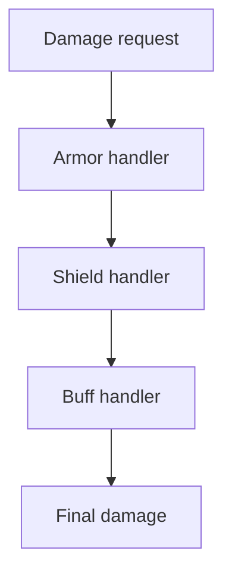
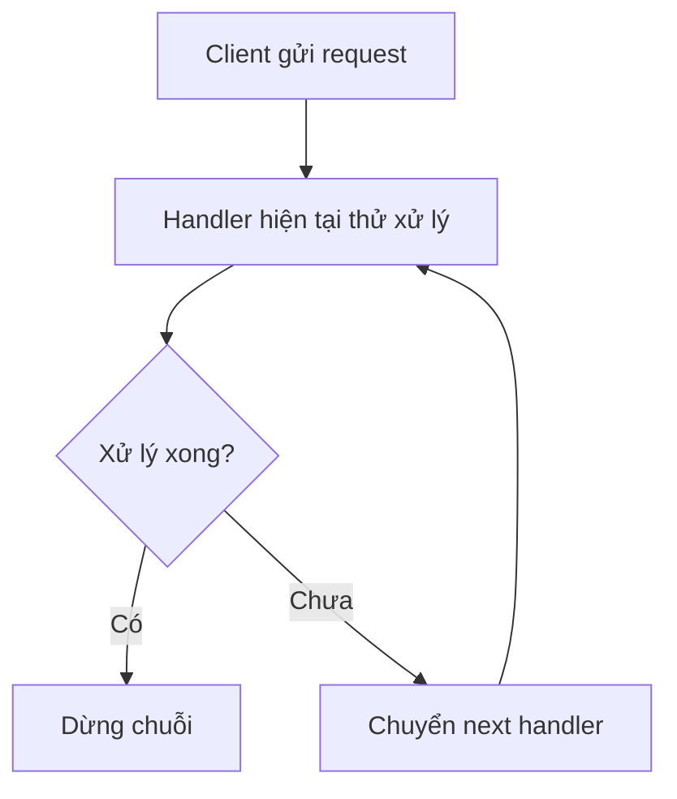
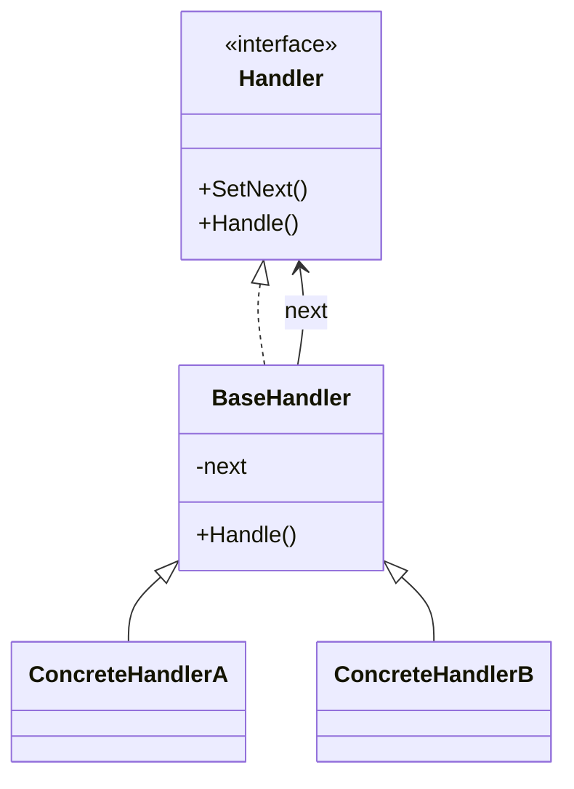

# Chain of Responsibility (Chuỗi Trách nhiệm)

> 📖 **Nguồn:** [Refactoring.Guru — Chain of Responsibility](https://refactoring.guru/design-patterns/chain-of-responsibility) | Tác giả: Alexander Shvets

---

## 🎯 Ý định (Intent)

**Chain of Responsibility** là một mẫu thiết kế thuộc nhóm hành vi (behavioral), cho phép bạn truyền các yêu cầu dọc theo một chuỗi các bộ xử lý (handlers). Khi nhận được yêu cầu, mỗi bộ xử lý sẽ quyết định xử lý yêu cầu đó hoặc chuyển tiếp nó cho bộ xử lý tiếp theo trong chuỗi.

---

## ❌ Vấn đề (Problem)

Hãy tưởng tượng bạn đang xây dựng một hệ thống **tính toán sát thương (Damage Calculation)** phức tạp trong một game nhập vai (RPG):
- Khi một chiến binh bị trúng đòn, sát thương cơ bản ban đầu là `100 HP`.
- Tuy nhiên, nhân vật có thể có **Giáp vật lý (Armor)** giúp giảm 20% sát thương nhận vào.
- Nhân vật cũng có thể đang bật **Lá chắn năng lượng (Magic Shield)** giúp hấp thụ tối đa 50 sát thương.
- Ngoài ra, nhân vật có một Buff đặc biệt **Miễn dịch sát thương (Invulnerability Buff)** khiến họ hoàn toàn không nhận sát thương trong một khoảng thời gian.
- Nếu bạn viết tất cả logic này trong một hàm lớn của class `PlayerHealth`, bạn sẽ có một khối code khổng lồ đầy các lệnh `if-else` lồng nhau. Khi Designer muốn thêm một loại phòng thủ mới (ví dụ: Kháng nguyên tố, Né tránh), bạn lại phải mở hàm đó ra chỉnh sửa, dễ dẫn đến bug và vi phạm nghiêm trọng nguyên tắc **Open/Closed Principle**.

---

## ✅ Giải pháp (Solution)

Mẫu thiết kế **Chain of Responsibility** đề xuất bạn biến đổi các bước xử lý riêng biệt thành các đối tượng độc lập gọi là **Handlers (Bộ xử lý)**.

1.  Mỗi bộ xử lý chứa một liên kết đến bộ xử lý tiếp theo trong chuỗi (Next Handler).
2.  Khi nhận một yêu cầu (ở đây là một Object chứa thông tin sát thương), bộ xử lý sẽ:
    *   Thực hiện phần việc của nó (ví dụ: trừ bớt sát thương qua giáp).
    *   Quyết định xem có chuyển tiếp thông tin sát thương đã được sửa đổi sang bộ xử lý tiếp theo hay dừng chuỗi lại (ví dụ: nếu bật Khiên bất tử, sát thương về 0, không cần tính toán thêm).
3.  Client (nhân vật bị trúng đòn) chỉ cần gửi gói tin sát thương ban đầu cho bộ xử lý đầu tiên của chuỗi được cấu hình sẵn.

---

## 🎨 Cấu trúc (Structure)

Thay vì đọc một UML lớn ngay từ đầu, hãy đọc pattern theo 3 lớp: **ý tưởng nhanh → luồng chạy thực tế → UML rút gọn**.

### 1. Ý tưởng nhanh



### 2. Luồng chạy thực tế



### 3. UML rút gọn



### Cách đọc sơ đồ

| Thành phần | Ý nghĩa |
|---|---|
| Nhìn nhanh | Request đi qua một chuỗi handler. |
| Luồng chính | Mỗi handler xử lý hoặc chuyển tiếp. |
| Trong game | Damage pipeline, input bubbling, validation chain. |
| Mũi tên nét liền | Object đang giữ tham chiếu hoặc gọi trực tiếp object khác. |
| Mũi tên tam giác / nét đứt trong UML | Kế thừa hoặc thực thi interface. |

> Mẹo đọc nhanh: trước hết hãy tìm **Client/Context**, sau đó đi theo mũi tên đến interface chính. Các class cụ thể chỉ là biến thể được thay vào khi chạy.

---

## 💻 Mã giả (Pseudocode)

```csharp
// Đối tượng mang dữ liệu yêu cầu
class DamageRequest
{
    public float Amount;
    public string DamageType;
}

// Giao diện handler
interface IDamageHandler
{
    IDamageHandler SetNext(IDamageHandler handler);
    DamageRequest Handle(DamageRequest request);
}

// Lớp cơ sở xử lý việc chuyển tiếp trong chuỗi
abstract class BaseDamageHandler : IDamageHandler
{
    private IDamageHandler _nextHandler;

    public IDamageHandler SetNext(IDamageHandler handler)
    {
        _nextHandler = handler;
        return handler; // Trả về handler tiếp theo để hỗ trợ nạp chuỗi (fluent interface)
    }

    public virtual DamageRequest Handle(DamageRequest request)
    {
        if (_nextHandler != null)
        {
            return _nextHandler.Handle(request);
        }
        return request;
    }
}
```

---

## ⚙️ Khả năng áp dụng (Applicability)

Dùng Chain of Responsibility khi:
- Game cần xử lý một yêu cầu qua nhiều bước lọc/tính toán khác nhau nhưng thứ tự hoặc danh sách các bước có thể thay đổi linh hoạt tại runtime.
- Bạn muốn phát đi một yêu cầu đến một nhóm đối tượng xử lý mà không cần client biết chính xác đối tượng nào sẽ giải quyết yêu cầu đó.
- Tập hợp các đối tượng xử lý và thứ tự của chúng cần được cấu hình động (ví dụ: người chơi thay đổi trang bị hoặc ăn buff mới sẽ tái sắp xếp chuỗi tính sát thương).

---

## 📝 Các bước thực hiện (How to Implement)

1.  Khai báo interface của Handler và định nghĩa phương thức xử lý yêu cầu.
2.  Tạo lớp base handler trừu tượng để lưu trữ tham chiếu đến handler tiếp theo (`nextHandler`) và triển khai logic chuyển tiếp mặc định.
3.  Tạo ra các subclass handler cụ thể để xử lý các logic riêng biệt (Armor, Shield, Buff, ...). Mỗi subclass ghi đè phương thức xử lý để thực hiện logic của riêng mình, rồi chuyển tiếp tiếp tục cho lớp base gọi handler tiếp theo.
4.  Ở phía Client, liên kết các handler lại với nhau tạo thành chuỗi bằng phương thức `SetNext`.
5.  Client kích hoạt chuỗi bằng cách truyền yêu cầu vào phần tử đầu tiên của chuỗi.

---

## ⚖️ Ưu & Nhược điểm (Pros and Cons)

*   **👍 Ưu điểm:**
    *   *Loose Coupling:* Tách biệt đối tượng gửi yêu cầu và các đối tượng nhận/xử lý yêu cầu.
    *   *Single Responsibility Principle:* Mỗi handler chỉ chịu trách nhiệm giải quyết một logic cụ thể (ví dụ: chỉ giảm sát thương của khiên).
    *   *Open/Closed Principle:* Bạn có thể thêm hoặc bớt các handler mới vào hệ thống mà không làm thay đổi các handler hiện có.
*   **👎 Nhược điểm:**
    *   Không đảm bảo yêu cầu sẽ được xử lý: Nếu chuỗi kết thúc mà không có handler nào chặn lại hoặc xử lý hoàn chỉnh, yêu cầu có thể bị rơi rụng (trong game, điều này có thể dẫn đến việc sát thương bị bỏ qua hoàn toàn nếu không có handler cuối cùng nhận diện).
    *   Khó debug: Việc luồng đi qua quá nhiều đối tượng có thể làm chậm hiệu suất nhẹ và gây khó khăn khi đặt breakpoint dò lỗi.

---

## 🎮 Trong Game Dev: C# Code Example (Unity)

Dưới đây là hệ thống tính sát thương hoàn chỉnh sử dụng **Chain of Responsibility** trong Unity:

### 1. Dữ liệu yêu cầu và Interface Handler
```csharp
using UnityEngine;

public class DamageRequest
{
    public float Amount;
    public bool IsMagic;
    
    public DamageRequest(float amount, bool isMagic)
    {
        Amount = amount;
        IsMagic = isMagic;
    }
}

public interface IDamageHandler
{
    IDamageHandler SetNext(IDamageHandler handler);
    DamageRequest ProcessDamage(DamageRequest request);
}
```

### 2. Base Handler và các Bộ xử lý cụ thể
```csharp
public abstract class BaseDamageHandler : IDamageHandler
{
    private IDamageHandler _nextHandler;

    public IDamageHandler SetNext(IDamageHandler handler)
    {
        _nextHandler = handler;
        return handler; // Cho phép viết code theo kiểu xích: handlerA.SetNext(handlerB).SetNext(handlerC)
    }

    public virtual DamageRequest ProcessDamage(DamageRequest request)
    {
        if (_nextHandler != null)
        {
            return _nextHandler.ProcessDamage(request);
        }
        return request;
    }
}

// 1. Bộ xử lý né tránh (Evasion)
public class EvasionHandler : BaseDamageHandler
{
    private float _evasionChance; // 0.0 to 1.0

    public EvasionHandler(float evasionChance)
    {
        _evasionChance = evasionChance;
    }

    public override DamageRequest ProcessDamage(DamageRequest request)
    {
        if (Random.value < _evasionChance)
        {
            Debug.Log("🎯 [Evasion] Né đòn thành công! Sát thương giảm về 0.");
            request.Amount = 0;
            return request; // Trả về luôn, cắt chuỗi xử lý
        }
        return base.ProcessDamage(request);
    }
}

// 2. Bộ xử lý lá chắn hấp thụ (Shield)
public class ShieldHandler : BaseDamageHandler
{
    private float _shieldHealth;

    public ShieldHandler(float shieldHealth)
    {
        _shieldHealth = shieldHealth;
    }

    public override DamageRequest ProcessDamage(DamageRequest request)
    {
        if (request.Amount <= 0) return base.ProcessDamage(request);

        if (_shieldHealth > 0)
        {
            float absorbed = Mathf.Min(request.Amount, _shieldHealth);
            _shieldHealth -= absorbed;
            request.Amount -= absorbed;
            Debug.Log($"🛡️ [Shield] Hấp thụ {absorbed} sát thương. Máu khiên còn lại: {_shieldHealth}. Sát thương lọt qua: {request.Amount}");
        }
        return base.ProcessDamage(request);
    }
}

// 3. Bộ xử lý giáp vật lý (Armor)
public class ArmorHandler : BaseDamageHandler
{
    private float _armorPercentReduction; // Ví dụ: 0.2f tương đương giảm 20% sát thương

    public ArmorHandler(float armorPercentReduction)
    {
        _armorPercentReduction = armorPercentReduction;
    }

    public override DamageRequest ProcessDamage(DamageRequest request)
    {
        if (request.Amount <= 0) return base.ProcessDamage(request);

        if (!request.IsMagic) // Chỉ giảm sát thương vật lý
        {
            float reduced = request.Amount * _armorPercentReduction;
            request.Amount -= reduced;
            Debug.Log($"⚙️ [Armor] Giáp vật lý giảm {reduced} sát thương. Sát thương còn lại: {request.Amount}");
        }
        return base.ProcessDamage(request);
    }
}
```

### 3. Client code tích hợp chuỗi
```csharp
public class PlayerCharacter : MonoBehaviour
{
    [Header("Stats")]
    public float maxHealth = 100f;
    public float currentHealth;

    private IDamageHandler _damageChain;

    private void Start()
    {
        currentHealth = maxHealth;

        // Cấu hình chuỗi tính sát thương: Né tránh -> Lá chắn -> Giáp vật lý
        var evasion = new EvasionHandler(evasionChance: 0.25f); // 25% né tránh
        var shield = new ShieldHandler(shieldHealth: 30f);      // Khiên hấp thụ 30 HP
        var armor = new ArmorHandler(armorPercentReduction: 0.15f); // Giáp giảm 15% physical damage

        evasion.SetNext(shield).SetNext(armor);
        _damageChain = evasion;
    }

    // Khi nhân vật bị tấn công
    public void TakeDamage(float rawAmount, bool isMagic)
    {
        Debug.Log($"💥 Nhân vật nhận sát thương thô: {rawAmount} (Magic: {isMagic})");
        
        DamageRequest finalRequest = new DamageRequest(rawAmount, isMagic);
        
        // Chạy qua chuỗi xử lý sát thương
        finalRequest = _damageChain.ProcessDamage(finalRequest);

        // Áp dụng sát thương thực tế
        currentHealth -= finalRequest.Amount;
        currentHealth = Mathf.Max(0, currentHealth);
        Debug.Log($"❤️ Máu hiện tại của người chơi: {currentHealth}/{maxHealth}\n");
    }
}
```

---
> 📚 **Nguồn gốc:** Nội dung tham khảo từ [Refactoring.Guru](https://refactoring.guru/) — Tác giả: Alexander Shvets, Minh họa: Dmitry Zhart

| Hướng | Liên kết |
|-------|----------|
| ← Quay lại | [Behavioral Patterns Overview](./00-behavioral-overview.md) |
| → Tiếp theo | [Command](./02-command.md) |
