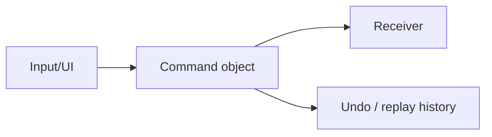
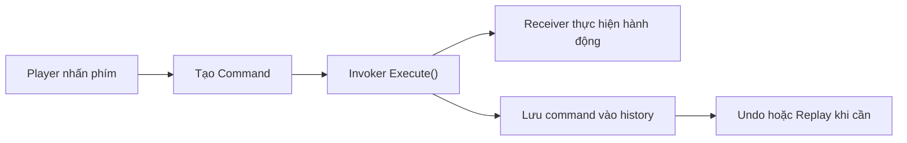
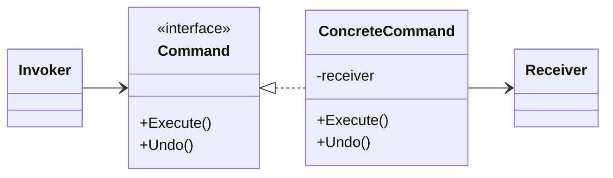

# Command (Lệnh)

> 📖 **Nguồn:** [Refactoring.Guru — Command](https://refactoring.guru/design-patterns/command) | Tác giả: Alexander Shvets

---

## 🎯 Ý định (Intent)

**Command** là một mẫu thiết kế hành vi (behavioral), chuyển đổi một yêu cầu hoặc hành động thành một đối tượng độc lập chứa tất cả thông tin về yêu cầu đó. Sự chuyển đổi này cho phép bạn tham số hóa các phương thức với các yêu cầu khác nhau, trì hoãn hoặc xếp hàng thực hiện yêu cầu, và hỗ trợ các hoạt động không thể hoàn tác (Undo/Redo).

---

## ❌ Vấn đề (Problem)

Hãy tưởng tượng bạn đang viết một game chiến thuật theo lượt (Turn-based Strategy) hoặc một game giải đố ô lưới (Grid-based Puzzle):
- Bạn muốn lập trình di chuyển cho nhân vật. Ban đầu, bạn viết code trực tiếp trong class `PlayerInput`:
  `if (Input.GetKeyDown(KeyCode.W)) player.Move(Vector3.forward);`
- Game chạy ổn. Tuy nhiên, Designer yêu cầu thêm chức năng **Hoàn tác (Undo)** nếu người chơi đi nhầm nước. Vì bạn thực hiện di chuyển trực tiếp bằng cách thay đổi tọa độ của nhân vật, bạn không có cách nào lưu lại lịch sử di chuyển một cách sạch sẽ để quay lui.
- Hơn thế nữa, Designer muốn người chơi có thể **tự cấu hình phím bấm (Input Mapping)** (ví dụ: đổi nút di chuyển từ `W/A/S/D` sang `I/J/K/L` hoặc dùng tay cầm Console). Nếu code di chuyển bị gắn chặt với phím bấm cụ thể, việc viết thêm tính năng remapping phím sẽ cực kỳ phức tạp và dễ phát sinh lỗi.

---

## ✅ Giải pháp (Solution)

Mẫu **Command** đề xuất việc tách biệt luồng nhận tín hiệu đầu vào (GUI, Phím bấm) khỏi luồng thực thi hành động bằng cách bọc toàn bộ thông tin hành động vào một class độc lập thực thi interface `ICommand`.

1.  Tạo interface `ICommand` khai báo hai phương thức: `Execute()` (thực thi) và `Undo()` (hoàn tác).
2.  Với mỗi hành động cụ thể (như di chuyển, tấn công, sử dụng vật phẩm), tạo một class thực thi `ICommand` (ví dụ: `MoveCommand`). Class này sẽ giữ tham chiếu tới nhân vật nhận lệnh (Receiver) và các tham số cần thiết (như hướng di chuyển, khoảng cách).
3.  Khi người chơi nhấn phím, thay vì di chuyển nhân vật trực tiếp, ta khởi tạo một đối tượng `MoveCommand` tương ứng và gọi hàm `Execute()` của nó.
4.  Để hỗ trợ Undo, chúng ta đẩy lệnh vừa thực thi vào một danh sách lịch sử (**Command History Stack**). Khi người chơi nhấn nút Undo, ta chỉ cần lấy lệnh cuối cùng ra khỏi Stack và gọi hàm `Undo()` của nó.

---

## 🎨 Cấu trúc (Structure)

Thay vì đọc một UML lớn ngay từ đầu, hãy đọc pattern theo 3 lớp: **ý tưởng nhanh → luồng chạy thực tế → UML rút gọn**.

### 1. Ý tưởng nhanh



### 2. Luồng chạy thực tế



### 3. UML rút gọn



### Cách đọc sơ đồ

| Thành phần | Ý nghĩa |
|---|---|
| Nhìn nhanh | Biến request thành object. |
| Luồng chính | Invoker không biết chi tiết hành động, chỉ gọi Execute(). |
| Trong game | Input mapping, undo/redo, replay, turn-based action. |
| Mũi tên nét liền | Object đang giữ tham chiếu hoặc gọi trực tiếp object khác. |
| Mũi tên tam giác / nét đứt trong UML | Kế thừa hoặc thực thi interface. |

> Mẹo đọc nhanh: trước hết hãy tìm **Client/Context**, sau đó đi theo mũi tên đến interface chính. Các class cụ thể chỉ là biến thể được thay vào khi chạy.

---

## 💻 Mã giả (Pseudocode)

```csharp
// Interface cơ sở cho tất cả các Command
interface ICommand
{
    void Execute();
    void Undo();
}

// Command cụ thể cho việc di chuyển
class MoveCommand : ICommand
{
    private Player _player;
    private Vector3 _direction;

    public MoveCommand(Player player, Vector3 direction)
    {
        _player = player;
        _direction = direction;
    }

    public void Execute() => _player.Move(_direction);
    public void Undo() => _player.Move(-_direction); // Ngược hướng để hoàn tác
}

// Bộ lưu trữ và quản lý lịch sử Command
class CommandHistory
{
    private Stack<ICommand> _history = new Stack<ICommand>();

    public void Push(ICommand command)
    {
        command.Execute();
        _history.Push(command);
    }

    public void Pop()
    {
        if (_history.Count > 0)
        {
            ICommand command = _history.Pop();
            command.Undo();
        }
    }
}
```

---

## ⚙️ Khả năng áp dụng (Applicability)

Dụng mẫu Command khi:
- Bạn muốn tham số hóa các đối tượng theo hành động (như phím tắt, menu, nút bấm trong UI).
- Bạn cần xếp hàng các hành động để thực thi tuần tự (ví dụ: xếp hàng hành động tấn công cho nhân vật trong game Turn-based).
- Bạn muốn xây dựng tính năng **Undo (hoàn tác)** và **Redo (làm lại)**.
- Bạn muốn xây dựng hệ thống **Replay** (lưu lại chuỗi lệnh của người chơi từ đầu màn game, sau đó chạy lại các lệnh đó để tái tạo màn chơi).
- Bạn cần hỗ trợ tính năng rollback trạng thái trong môi trường mạng (Network Rewind/Client Prediction).

---

## 📝 Các bước thực hiện (How to Implement)

1.  Định nghĩa interface `ICommand` với hàm `Execute()` và tùy chọn hàm `Undo()`.
2.  Tạo các lớp Concrete Command tương ứng cho từng hành động. Các class này cần có constructor nhận vào đối tượng nhận tác động (Receiver) và các tham số cần thiết để thực hiện hành động.
3.  Tạo một lớp quản lý lịch sử (Invoker/CommandHistory) chứa các Stack hoặc List để quản lý chuỗi lệnh đã thực thi.
4.  Cấu hình bộ nhận diện phím bấm (Input Manager) để ánh xạ nút bấm sang các đối tượng Command tương ứng.
5.  Gửi các Command này đến Invoker để thực thi và lưu trữ.

---

## ⚖️ Ưu & Nhược điểm (Pros and Cons)

*   **👍 Ưu điểm:**
    *   *Decoupling:* Tách biệt hoàn toàn lớp phát lệnh (UI, Keyboard) khỏi lớp thực thi lệnh (Character Logic).
    *   *Hỗ trợ Undo/Redo:* Dễ dàng quay lui hoặc thực hiện lại hành động nhờ lưu vết đối tượng.
    *   *Hỗ trợ Macro:* Cho phép kết hợp nhiều lệnh nhỏ thành một lệnh phức hợp lớn.
    *   *Open/Closed Principle:* Bạn có thể thêm các Command mới vào game mà không làm ảnh hưởng đến mã nguồn nhận diện input hiện có.
*   **👎 Nhược điểm:**
    *   Mã nguồn dài dòng hơn: Bạn phải tạo ra rất nhiều class Command nhỏ cho từng hành vi nhỏ trong game.

---

## 🎮 Trong Game Dev: C# Code Example (Unity)

Dưới đây là một hệ thống di chuyển ô lưới hoàn chỉnh hỗ trợ **Undo/Redo** trong Unity bằng cách áp dụng Command pattern:

### 1. Interface ICommand và Concrete Command
```csharp
using UnityEngine;

public interface ICommand
{
    void Execute();
    void Undo();
}

// Command di chuyển nhân vật trên lưới
public class MoveCommand : ICommand
{
    private readonly Transform _playerTransform;
    private readonly Vector3 _moveDirection;
    private readonly float _gridSize;

    public MoveCommand(Transform playerTransform, Vector3 direction, float gridSize)
    {
        _playerTransform = playerTransform;
        _moveDirection = direction;
        _gridSize = gridSize;
    }

    public void Execute()
    {
        // Di chuyển nhân vật về phía trước theo gridSize
        _playerTransform.position += _moveDirection * _gridSize;
        Debug.Log($"🏃 [Command] Di chuyển nhân vật sang {_moveDirection}. Vị trí hiện tại: {_playerTransform.position}");
    }

    public void Undo()
    {
        // Di chuyển ngược lại để hoàn tác
        _playerTransform.position -= _moveDirection * _gridSize;
        Debug.Log($"↩️ [Undo] Hoàn tác di chuyển! Vị trí hiện tại: {_playerTransform.position}");
    }
}
```

### 2. Lớp quản lý Invoker (Lịch sử lệnh)
```csharp
using System.Collections.Generic;

public class CommandInvoker
{
    private readonly Stack<ICommand> _undoStack = new Stack<ICommand>();
    private readonly Stack<ICommand> _redoStack = new Stack<ICommand>();

    // Thực thi lệnh mới và xóa lịch sử Redo cũ
    public void ExecuteCommand(ICommand command)
    {
        command.Execute();
        _undoStack.Push(command);
        _redoStack.Clear(); // Khi có hành động mới, không thể Redo hành động cũ nữa
    }

    // Hoàn tác hành động gần nhất
    public void Undo()
    {
        if (_undoStack.Count > 0)
        {
            ICommand activeCommand = _undoStack.Pop();
            activeCommand.Undo();
            _redoStack.Push(activeCommand);
        }
        else
        {
            Debug.LogWarning("⚠️ Không còn hành động nào để Undo!");
        }
    }

    // Thực hiện lại hành động vừa hoàn tác
    public void Redo()
    {
        if (_redoStack.Count > 0)
        {
            ICommand activeCommand = _redoStack.Pop();
            activeCommand.Execute();
            _undoStack.Push(activeCommand);
        }
        else
        {
            Debug.LogWarning("⚠️ Không còn hành động nào để Redo!");
        }
    }
}
```

### 3. Client code (Input Handler) trong Unity
```csharp
public class PlayerInputHandler : MonoBehaviour
{
    [SerializeField] private Transform playerTransform;
    [SerializeField] private float gridSize = 1.0f;

    private CommandInvoker _invoker;

    private void Start()
    {
        _invoker = new CommandInvoker();
        if (playerTransform == null) playerTransform = transform;
    }

    private void Update()
    {
        // Nhận diện Input di chuyển
        if (Input.GetKeyDown(KeyCode.W) || Input.GetKeyDown(KeyCode.UpArrow))
        {
            ICommand moveUp = new MoveCommand(playerTransform, Vector3.forward, gridSize);
            _invoker.ExecuteCommand(moveUp);
        }
        else if (Input.GetKeyDown(KeyCode.S) || Input.GetKeyDown(KeyCode.DownArrow))
        {
            ICommand moveDown = new MoveCommand(playerTransform, Vector3.back, gridSize);
            _invoker.ExecuteCommand(moveDown);
        }
        else if (Input.GetKeyDown(KeyCode.A) || Input.GetKeyDown(KeyCode.LeftArrow))
        {
            ICommand moveLeft = new MoveCommand(playerTransform, Vector3.left, gridSize);
            _invoker.ExecuteCommand(moveLeft);
        }
        else if (Input.GetKeyDown(KeyCode.D) || Input.GetKeyDown(KeyCode.RightArrow))
        {
            ICommand moveRight = new MoveCommand(playerTransform, Vector3.right, gridSize);
            _invoker.ExecuteCommand(moveRight);
        }

        // Nhận diện Input Undo/Redo
        if (Input.GetKeyDown(KeyCode.Z)) // Bấm Z để Undo
        {
            _invoker.Undo();
        }
        else if (Input.GetKeyDown(KeyCode.R)) // Bấm R để Redo
        {
            _invoker.Redo();
        }
    }
}
```

---
> 📚 **Nguồn gốc:** Nội dung tham khảo từ [Refactoring.Guru](https://refactoring.guru/) — Tác giả: Alexander Shvets, Minh họa: Dmitry Zhart

| Hướng | Liên kết |
|-------|----------|
| ← Quay lại | [Chain of Responsibility](./01-chain-of-responsibility.md) |
| → Tiếp theo | [Iterator](./03-iterator.md) |
