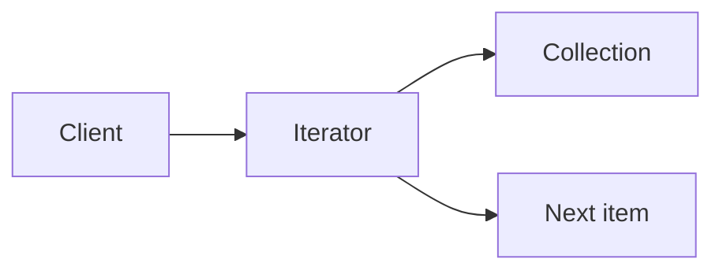
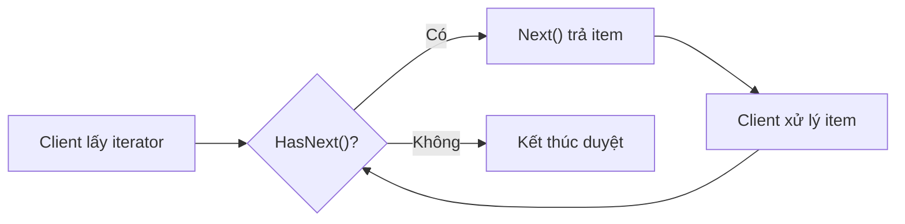
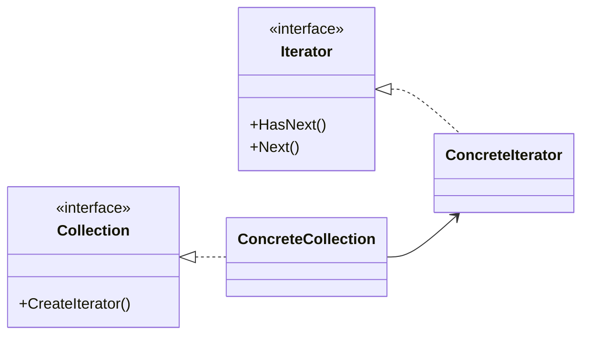

# Iterator (Bộ lặp)

> 📖 **Nguồn:** [Refactoring.Guru — Iterator](https://refactoring.guru/design-patterns/iterator) | Tác giả: Alexander Shvets

---

## 🎯 Ý định (Intent)

**Iterator** là một mẫu thiết kế thuộc nhóm hành vi (behavioral), cho phép bạn duyệt qua các phần tử của một tập hợp (collection) tuần tự mà không cần để lộ cấu trúc biểu diễn bên trong của tập hợp đó (dạng danh sách, ngăn xếp, cây, hay đồ thị).

---

## ❌ Vấn đề (Problem)

Hãy tưởng tượng bạn đang phát triển một trò chơi RPG thế giới mở với hệ thống **Túi đồ (Inventory System)**:
- Ban đầu, bạn lưu trữ vật phẩm dưới dạng danh sách phẳng: `List<Item> items`.
- Việc duyệt qua các vật phẩm để hiển thị lên UI rất đơn giản: dùng một vòng lặp `for` hoặc `foreach`.
- Tuy nhiên, sau đó game phát triển phức tạp hơn:
  - Inventory được nâng cấp lên dạng ngăn chia theo tab (Vũ khí, Giáp, Thuốc, v.v.).
  - Túi đồ có thêm cơ chế giới hạn cân nặng, vật phẩm được sắp xếp theo độ hiếm (Rarity) hoặc theo ô lưới (Grid) 2 chiều.
- Lúc này, UI Manager chịu trách nhiệm hiển thị túi đồ rơi vào rắc rối. Để vẽ danh sách vũ khí, nó phải tự mình biết cách lọc danh sách gốc, tự xử lý điều kiện duyệt. Nếu bạn đổi cấu trúc lưu trữ từ `List<Item>` sang `Dictionary<ItemType, List<Item>>` hoặc cấu trúc Cây (Tree), toàn bộ code duyệt ở các UI Panel khác nhau sẽ bị vỡ vụn và phải viết lại từ đầu.

---

## ✅ Giải pháp (Solution)

Mẫu **Iterator** đề xuất việc tách biệt thuật toán duyệt tập hợp ra khỏi chính tập hợp đó và đưa nó vào một đối tượng riêng biệt gọi là **Iterator (Bộ lặp)**.

1.  Một đối tượng **Iterator** sẽ đóng gói tất cả các chi tiết của việc duyệt như: vị trí hiện tại (current index), hướng duyệt (ngược/xuôi), và điều kiện lọc (ví dụ: chỉ duyệt qua Vũ khí).
2.  Bản thân tập hợp (Túi đồ) sẽ cung cấp một phương thức để tạo ra các Iterator tương ứng cho Client.
3.  Client (UI Manager) không cần biết túi đồ được cấu tạo bằng `List`, `Array` hay `Graph` bên dưới. Nó chỉ cần gọi các phương thức chuẩn hóa như `HasNext()` (còn phần tử tiếp theo không?) và `Next()` (lấy phần tử tiếp theo) từ Iterator.

---

## 🎨 Cấu trúc (Structure)

Thay vì đọc một UML lớn ngay từ đầu, hãy đọc pattern theo 3 lớp: **ý tưởng nhanh → luồng chạy thực tế → UML rút gọn**.

### 1. Ý tưởng nhanh



### 2. Luồng chạy thực tế



### 3. UML rút gọn



### Cách đọc sơ đồ

| Thành phần | Ý nghĩa |
|---|---|
| Nhìn nhanh | Iterator che giấu cách lưu trữ bên trong collection. |
| Luồng chính | Client chỉ gọi HasNext()/Next(). |
| Trong game | Inventory, waypoint, dialogue nodes, skill list. |
| Mũi tên nét liền | Object đang giữ tham chiếu hoặc gọi trực tiếp object khác. |
| Mũi tên tam giác / nét đứt trong UML | Kế thừa hoặc thực thi interface. |

> Mẹo đọc nhanh: trước hết hãy tìm **Client/Context**, sau đó đi theo mũi tên đến interface chính. Các class cụ thể chỉ là biến thể được thay vào khi chạy.

---

## 💻 Mã giả (Pseudocode)

```csharp
// Giao diện Iterator chuẩn
interface IIterator<T>
{
    T Current { get; }
    bool MoveNext();
    void Reset();
}

// Giao diện của Collection
interface ICollection<T>
{
    IIterator<T> CreateIterator();
}

// Bộ duyệt cụ thể cho một mảng
class ArrayIterator<T> : IIterator<T>
{
    private T[] _collection;
    private int _position = -1;

    public ArrayIterator(T[] collection)
    {
        _collection = collection;
    }

    public T Current => _collection[_position];

    public bool MoveNext()
    {
        if (_position < _collection.Length - 1)
        {
            _position++;
            return true;
        }
        return false;
    }

    public void Reset() => _position = -1;
}
```

---

## ⚙️ Khả năng áp dụng (Applicability)

Dùng Iterator khi:
- Tập hợp dữ liệu của bạn có cấu trúc phức tạp bên dưới (ví dụ: cây nhị phân, đồ thị điểm waypoint chuyển động của AI) và bạn muốn che giấu sự phức tạp này khỏi client vì lý do bảo mật hoặc tiện lợi.
- Bạn cần hỗ trợ nhiều cách duyệt khác nhau trên cùng một tập hợp (ví dụ: duyệt qua danh sách quái vật theo khoảng cách gần nhất, hoặc theo mức độ máu giảm dần).
- Bạn muốn cung cấp một giao diện duyệt đồng nhất cho các cấu trúc dữ liệu khác nhau mà không cần client quan tâm đến kiểu dữ liệu thực tế (Duyệt đa hình - Polymorphic Iteration).

---

## 📝 Các bước thực hiện (How to Implement)

1.  Định nghĩa interface `IIterator` chứa các phương thức cơ bản (`Current`, `MoveNext`, `Reset`). *Lưu ý: Trong C#, bạn nên sử dụng trực tiếp interface có sẵn của hệ thống là `IEnumerator<T>` và `IEnumerable<T>`*.
2.  Tạo interface `ICollection` chứa phương thức tạo ra Iterator.
3.  Triển khai các lớp Iterator cụ thể (Concrete Iterator) cho các thuật toán duyệt của bạn. Các lớp này cần tham chiếu đến đối tượng Collection để lấy dữ liệu.
4.  Triển khai lớp Collection cụ thể (Concrete Collection) trả về instance của Iterator tương ứng.
5.  Trong mã nguồn client, sử dụng Iterator để thay thế cho các vòng lặp thủ công phụ thuộc cấu trúc.

---

## ⚖️ Ưu & Nhược điểm (Pros and Cons)

*   **👍 Ưu điểm:**
    *   *Single Responsibility Principle:* Tách biệt thuật toán duyệt phức tạp khỏi lớp lưu trữ dữ liệu chính.
    *   *Open/Closed Principle:* Có thể thêm các kiểu duyệt mới (Iterator mới) mà không làm ảnh hưởng đến cấu trúc dữ liệu cũ hay Client code.
    *   *Duyệt đồng thời:* Bạn có thể chạy song song nhiều Iterator trên cùng một tập hợp dữ liệu vì mỗi Iterator tự lưu trữ trạng thái duyệt của riêng nó.
*   **👎 Nhược điểm:**
    *   Áp dụng mẫu này có thể là quá mức cần thiết (overkill) nếu game của bạn chỉ sử dụng các mảng hoặc danh sách phẳng đơn giản và không cần tùy biến cách duyệt.
    *   Duyệt qua Iterator đôi khi kém hiệu năng hơn duyệt mảng trực tiếp bằng chỉ mục (index) do chi phí gọi hàm qua interface.

---

## 🎮 Trong Game Dev: C# Code Example (Unity)

Dưới đây là cách xây dựng hệ thống lọc túi đồ (Inventory Filter) trong Unity. Chúng ta sẽ sử dụng trực tiếp interface chuẩn của C# (`IEnumerator` và `IEnumerable`) để tương thích hoàn toàn với vòng lặp `foreach` mặc định:

### 1. Lớp Item và enum liên quan
```csharp
public enum ItemRarity
{
    Common,
    Rare,
    Legendary
}

public enum ItemType
{
    Weapon,
    Armor,
    Consumable
}

[System.Serializable]
public class Item
{
    public string itemName;
    public ItemType type;
    public ItemRarity rarity;

    public Item(string name, ItemType type, ItemRarity rarity)
    {
        itemName = name;
        this.type = type;
        this.rarity = rarity;
    }
}
```

### 2. Triển khai Custom Iterator (IEnumerator) lọc theo độ hiếm (Rarity)
```csharp
using System.Collections;
using System.Collections.Generic;

// Bộ lặp lọc vật phẩm theo Rarity
public class InventoryRarityIterator : IEnumerator<Item>
{
    private readonly List<Item> _items;
    private readonly ItemRarity _targetRarity;
    private int _currentIndex = -1;

    public InventoryRarityIterator(List<Item> items, ItemRarity targetRarity)
    {
        _items = items;
        _targetRarity = targetRarity;
    }

    public Item Current
    {
        get
        {
            if (_currentIndex >= 0 && _currentIndex < _items.Count)
                return _items[_currentIndex];
            return null;
        }
    }

    // IEnumerator yêu cầu thuộc tính Current không Generic này
    object IEnumerator.Current => Current;

    public bool MoveNext()
    {
        // Tiếp tục tiến lên tìm phần tử thỏa mãn điều kiện độ hiếm
        while (++_currentIndex < _items.Count)
        {
            if (_items[_currentIndex].rarity == _targetRarity)
            {
                return true;
            }
        }
        return false;
    }

    public void Reset()
    {
        _currentIndex = -1;
    }

    public void Dispose()
    {
        // Giải phóng tài nguyên nếu cần thiết
    }
}
```

### 3. Collection (Inventory) cung cấp Iterator
```csharp
public class Inventory : IEnumerable<Item>
{
    private List<Item> _items = new List<Item>();

    public void AddItem(Item item)
    {
        _items.Add(item);
    }

    // IEnumerable mặc định duyệt qua toàn bộ vật phẩm
    public IEnumerator<Item> GetEnumerator()
    {
        return _items.GetEnumerator();
    }

    IEnumerator IEnumerable.GetEnumerator()
    {
        return GetEnumerator();
    }

    // Phương thức tùy chỉnh để lấy bộ lọc theo độ hiếm
    public IEnumerable<Item> GetRarityFilter(ItemRarity rarity)
    {
        return new RarityEnumerable(_items, rarity);
    }

    // Helper class để đóng gói Enumerable lọc
    private class RarityEnumerable : IEnumerable<Item>
    {
        private readonly List<Item> _items;
        private readonly ItemRarity _rarity;

        public RarityEnumerable(List<Item> items, ItemRarity rarity)
        {
            _items = items;
            _rarity = rarity;
        }

        public IEnumerator<Item> GetEnumerator()
        {
            return new InventoryRarityIterator(_items, _rarity);
        }

        IEnumerator IEnumerable.GetEnumerator()
        {
            return GetEnumerator();
        }
    }
}
```

### 4. Sử dụng trong Unity MonoBehavior
```csharp
using UnityEngine;

public class InventoryDisplay : MonoBehaviour
{
    private Inventory _myInventory;

    private void Start()
    {
        _myInventory = new Inventory();

        // Thêm dữ liệu giả lập
        _myInventory.AddItem(new Item("Kiếm gỗ", ItemType.Weapon, ItemRarity.Common));
        _myInventory.AddItem(new Item("Giáp Sắt", ItemType.Armor, ItemRarity.Common));
        _myInventory.AddItem(new Item("Thần Kiếm Excalibur", ItemType.Weapon, ItemRarity.Legendary));
        _myInventory.AddItem(new Item("Bình Máu Siêu Cấp", ItemType.Consumable, ItemRarity.Rare));
        _myInventory.AddItem(new Item("Nhẫn Vô Cực", ItemType.Armor, ItemRarity.Legendary));

        // 1. Duyệt qua toàn bộ túi đồ bằng foreach mặc định
        Debug.Log("🎒 --- Duyệt toàn bộ túi đồ ---");
        foreach (var item in _myInventory)
        {
            Debug.Log($"Vật phẩm: {item.itemName} | Loại: {item.type} | Rarity: {item.rarity}");
        }

        // 2. Chỉ duyệt qua vật phẩm Legendary thông qua Iterator lọc
        Debug.Log("\n🏆 --- Duyệt vật phẩm huyền thoại (Legendary) ---");
        foreach (var item in _myInventory.GetRarityFilter(ItemRarity.Legendary))
        {
            Debug.Log($"✨ [Huyền thoại] {item.itemName}!");
        }
    }
}
```

---
> 📚 **Nguồn gốc:** Nội dung tham khảo từ [Refactoring.Guru](https://refactoring.guru/) — Tác giả: Alexander Shvets, Minh họa: Dmitry Zhart

| Hướng | Liên kết |
|-------|----------|
| ← Quay lại | [Command](./02-command.md) |
| → Tiếp theo | [Mediator](./04-mediator.md) |
