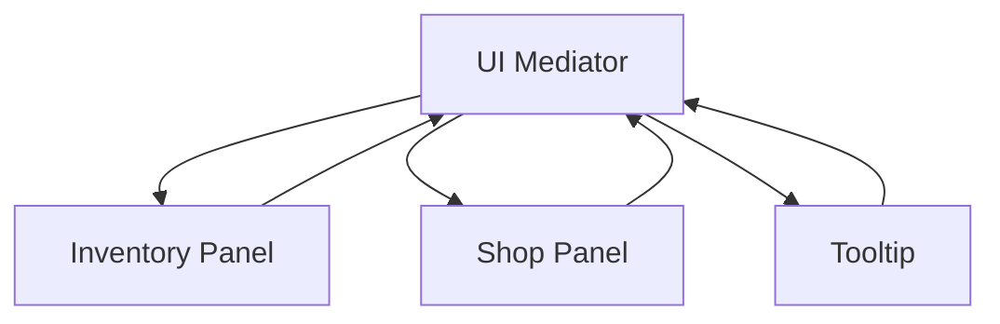
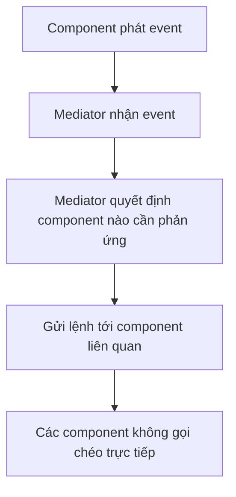
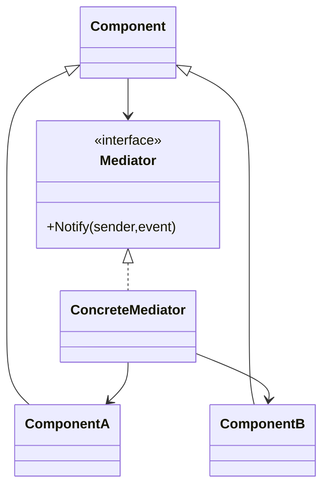

# Mediator (Bộ trung gian)

> 📖 **Nguồn:** [Refactoring.Guru — Mediator](https://refactoring.guru/design-patterns/mediator) | Tác giả: Alexander Shvets

---

## 🎯 Ý định (Intent)

**Mediator** là một mẫu thiết kế thuộc nhóm hành vi (behavioral), giảm thiểu sự liên kết chặt chẽ (tight coupling) và phụ thuộc trực tiếp giữa các lớp bằng cách bắt chúng giao tiếp gián tiếp thông qua một đối tượng trung gian duy nhất.

---

## ❌ Vấn đề (Problem)

Hãy tưởng tượng bạn đang xây dựng một màn hình **Giao diện người dùng (UI Panel/Dialog)** phức tạp cho game, ví dụ màn hình **Victory Screen (Kết thúc màn chơi)**:
- Màn hình này gồm nhiều thành phần giao diện nhỏ:
  - Nút **Next Level Button** để qua màn tiếp theo.
  - Nút **Retry Button** để chơi lại.
  - Hộp thoại hiển thị điểm số **Score Text**.
  - Hiệu ứng ngôi sao lấp lánh **Stars Panel**.
- Ngoài ra màn hình Victory này cần tương tác với các hệ thống quản lý chính khác trong game:
  - **AudioManager** để phát nhạc chiến thắng (Victory SFX).
  - **LevelLoader** để tải màn chơi mới.
  - **SaveSystem** để ghi nhận màn chơi đã hoàn thành.
- Nếu bạn để các nút tự gọi trực tiếp đến `LevelLoader` và `AudioManager`, rồi `LevelLoader` tự điều chỉnh trạng thái nút bấm, code của bạn sẽ tạo ra một **mạng lưới nhện (spaghetti dependencies)**. Mỗi thành phần phải giữ tham chiếu đến 3-4 thành phần khác. Bạn không thể tái sử dụng nút bấm đó ở màn hình khác (như Settings Screen) vì nó đang bị trói buộc cứng nhắc với Victory Screen.

---

## ✅ Giải pháp (Solution)

Mẫu **Mediator** đề xuất bạn loại bỏ mọi liên kết trực tiếp giữa các thành phần muốn hợp tác với nhau. Thay vào đó, bắt chúng phụ thuộc vào một class trung gian duy nhất gọi là **Mediator (Bộ điều phối/Trung gian)**.

1.  Các thành phần giao tiếp (gọi là **Colleagues**) không còn gọi hàm của nhau nữa. Khi có sự kiện xảy ra (ví dụ: Nút bấm được click), nó chỉ cần thông báo cho Mediator: *"Tôi vừa bị click!"*.
2.  **Mediator** nhận tín hiệu đó, xử lý logic điều phối và ra quyết định hành động tiếp theo cho toàn bộ các thành phần khác.
    *   Ví dụ: Khi `RetryButton` được click, nó báo cho `VictoryPanelMediator`. Bộ trung gian sẽ gọi `AudioManager` phát tiếng click, báo `SaveSystem` lưu điểm, rồi ra lệnh cho `LevelLoader` reset lại màn chơi.
3.  Nhờ đó, các Colleague trở nên độc lập hoàn toàn, không cần biết các Colleague khác là ai và làm gì.

---

## 🎨 Cấu trúc (Structure)

Thay vì đọc một UML lớn ngay từ đầu, hãy đọc pattern theo 3 lớp: **ý tưởng nhanh → luồng chạy thực tế → UML rút gọn**.

### 1. Ý tưởng nhanh



### 2. Luồng chạy thực tế



### 3. UML rút gọn



### Cách đọc sơ đồ

| Thành phần | Ý nghĩa |
|---|---|
| Nhìn nhanh | Mediator là trung tâm điều phối, giảm liên kết chéo. |
| Luồng chính | Component báo sự kiện cho Mediator thay vì gọi nhau trực tiếp. |
| Trong game | UI flow, dialogue panel, lobby/matchmaking screen. |
| Mũi tên nét liền | Object đang giữ tham chiếu hoặc gọi trực tiếp object khác. |
| Mũi tên tam giác / nét đứt trong UML | Kế thừa hoặc thực thi interface. |

> Mẹo đọc nhanh: trước hết hãy tìm **Client/Context**, sau đó đi theo mũi tên đến interface chính. Các class cụ thể chỉ là biến thể được thay vào khi chạy.

---

## 💻 Mã giả (Pseudocode)

```csharp
// Giao diện Mediator chung
interface IMediator
{
    void Notify(object sender, string ev);
}

// Lớp cơ sở cho các thành phần giao tiếp
abstract class Component
{
    protected IMediator _mediator;

    public Component(IMediator mediator)
    {
        _mediator = mediator;
    }
}

// Component cụ thể
class Button : Component
{
    public Button(IMediator mediator) : base(mediator) {}

    public void Click()
    {
        // Thay vì gọi trực tiếp logic của đối tượng khác, chỉ báo cho Mediator
        _mediator.Notify(this, "click");
    }
}

// Mediator cụ thể điều phối luồng
class ScreenMediator : IMediator
{
    private Button _saveButton;
    private TextBox _inputBox;

    public void Notify(object sender, string ev)
    {
        if (ev == "click" && sender == _saveButton)
        {
            string content = _inputBox.GetText();
            SaveData(content);
        }
    }
}
```

---

## ⚙️ Khả năng áp dụng (Applicability)

Dùng Mediator khi:
- Code của bạn bắt đầu xuất hiện tình trạng mạng lưới tham chiếu chéo rườm rà giữa các class (đặc biệt là UI và Managers).
- Bạn muốn tái sử dụng một component ở nhiều nơi khác nhau nhưng không thể vì nó quá dính líu (coupled) với các thành phần khác xung quanh nó.
- Bạn muốn tập trung hóa (centralize) logic điều khiển luồng hoạt động của game/UI vào một chỗ duy nhất để dễ kiểm soát và chỉnh sửa.

---

## 📝 Các bước thực hiện (How to Implement)

1.  Định nghĩa interface `IMediator` khai báo phương thức thông báo (thường nhận diện qua đối tượng gửi `sender` và sự kiện `event` dạng enum hoặc string).
2.  Tạo lớp Concrete Mediator kế thừa interface trên và lưu giữ tham chiếu tới tất cả các thành phần con cần điều phối.
3.  Cung cấp cho các thành phần con tham chiếu đến đối tượng Mediator (Colleagues). Có thể truyền qua Constructor hoặc Setter.
4.  Chỉnh sửa mã nguồn của các thành phần con: thay thế các lệnh gọi trực tiếp đến lớp ngoài bằng cách gọi phương thức `Notify` của Mediator.
5.  Triển khai logic phân phối/chuyển hướng sự kiện bên trong phương thức `Notify` của lớp Concrete Mediator.

---

## ⚖️ Ưu & Nhược điểm (Pros and Cons)

*   **👍 Ưu điểm:**
    *   *Loose Coupling:* Phá vỡ sự liên kết trực tiếp giữa các component, giúp code dễ đọc, dễ viết test.
    *   *Single Responsibility Principle:* Đóng gói luồng điều khiển phối hợp vào một nơi tập trung (Mediator), thay vì phân tán rải rác khắp nơi.
    *   *Reusability:* Các component con trở nên sạch sẽ và có thể tái sử dụng dễ dàng trong các ngữ cảnh khác.
*   **👎 Nhược điểm:**
    *   *God Object:* Mediator có nguy cơ phình to ra theo thời gian và chứa quá nhiều logic xử lý của toàn bộ game, biến nó thành một "Super Class" khó bảo trì nếu không được phân chia hợp lý.

---

## 🎮 Trong Game Dev: C# Code Example (Unity)

Dưới đây là thiết kế màn hình kết thúc game Victory Panel điều phối các luồng âm thanh, điểm số và chuyển cảnh thông qua **Mediator Pattern**:

### 1. Hệ thống Mediator và các Component UI cơ bản
```csharp
using UnityEngine;

// Giao diện Mediator chung
public interface IMediator
{
    void Notify(Component sender, string eventCode);
}

// Lớp cơ sở Colleague để liên kết với Mediator
public abstract class Colleague : MonoBehaviour
{
    protected IMediator mediator;

    public void Configure(IMediator mediator)
    {
        this.mediator = mediator;
    }
}
```

### 2. Các Colleagues cụ thể (Nút bấm, Panel hiệu ứng)
```csharp
using UnityEngine.UI;

// Thành phần nút bấm trong game
public class GameButton : Colleague
{
    private Button _button;
    public string clickEventName;

    private void Awake()
    {
        _button = GetComponent<Button>();
        _button.onClick.AddListener(OnClicked);
    }

    private void OnClicked()
    {
        Debug.Log($"🔘 [UI Button] Nút {gameObject.name} được click.");
        if (mediator != null)
        {
            mediator.Notify(this, clickEventName);
        }
    }
}

// Thành phần hiển thị điểm số
public class ScorePanel : Colleague
{
    public void UpdateScoreDisplay(int score)
    {
        Debug.Log($"📊 [Score Panel] Cập nhật điểm số UI: {score} điểm.");
    }
}
```

### 3. Concrete Mediator điều phối các Managers và UI Components
```csharp
// Giả lập các Manager lớn
public class AudioManager : MonoBehaviour
{
    public void PlaySFX(string name) => Debug.Log($"🎵 [Audio Manager] Phát nhạc hiệu: {name}");
}

public class LevelLoader : MonoBehaviour
{
    public void LoadLevel(string name) => Debug.Log($"🌀 [Level Loader] Đang tải màn chơi: {name}");
}

// Victory Screen Mediator
public class VictoryScreenMediator : MonoBehaviour, IMediator
{
    [Header("Managers")]
    [SerializeField] private AudioManager audioManager;
    [SerializeField] private LevelLoader levelLoader;

    [Header("UI Components")]
    [SerializeField] private GameButton nextLevelButton;
    [SerializeField] private GameButton retryButton;
    [SerializeField] private ScorePanel scorePanel;

    private void Start()
    {
        // Đăng ký mediator cho các Colleague
        nextLevelButton.Configure(this);
        retryButton.Configure(this);
        scorePanel.Configure(this);

        // Hiển thị điểm số khi bắt đầu mở Panel
        scorePanel.UpdateScoreDisplay(5000);
        audioManager.PlaySFX("Fanfare_Victory");
    }

    // Logic điều phối chính nằm ở đây
    public void Notify(Component sender, string eventCode)
    {
        switch (eventCode)
        {
            case "NEXT_LEVEL":
                audioManager.PlaySFX("Button_Click");
                Debug.Log("🏆 [Mediator] Người chơi chọn Qua Màn. Yêu cầu chuyển cảnh.");
                levelLoader.LoadLevel("Level_02");
                break;

            case "RETRY":
                audioManager.PlaySFX("Button_Click");
                Debug.Log("🔄 [Mediator] Người chơi chọn Chơi Lại. Reset màn chơi.");
                levelLoader.LoadLevel("Level_01");
                break;

            default:
                Debug.LogWarning($"⚠️ [Mediator] Không tìm thấy luồng xử lý sự kiện: {eventCode}");
                break;
        }
    }
}
```

---
> 📚 **Nguồn gốc:** Nội dung tham khảo từ [Refactoring.Guru](https://refactoring.guru/) — Tác giả: Alexander Shvets, Minh họa: Dmitry Zhart

| Hướng | Liên kết |
|-------|----------|
| ← Quay lại | [Iterator](./03-iterator.md) |
| → Tiếp theo | [Memento](./05-memento.md) |
