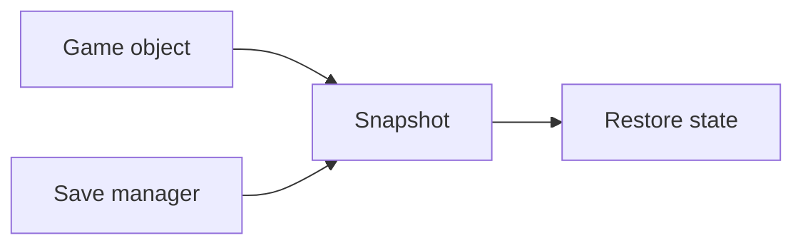
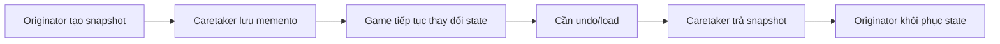
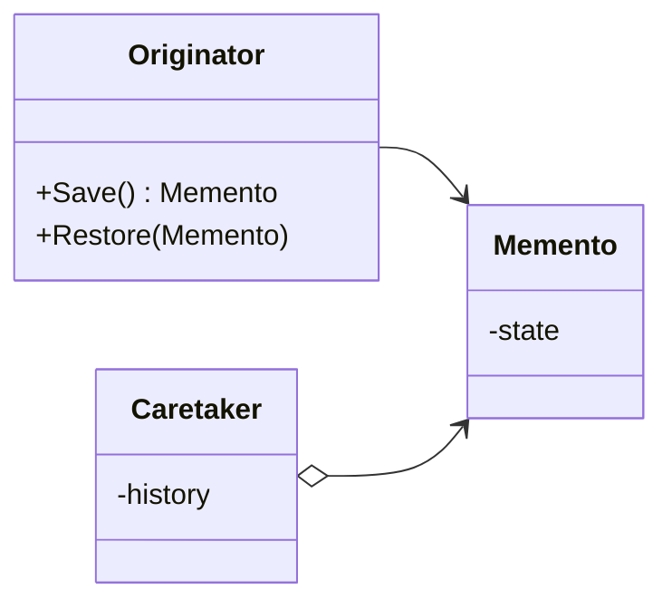

# Memento (Mẫu ghi nhớ)

> 📖 **Nguồn:** [Refactoring.Guru — Memento](https://refactoring.guru/design-patterns/memento) | Tác giả: Alexander Shvets

---

## 🎯 Ý định (Intent)

**Memento** là một mẫu thiết kế thuộc nhóm hành vi (behavioral), cho phép lưu lại và khôi phục trạng thái bên trong của một đối tượng mà không vi phạm nguyên tắc đóng gói (encapsulation).

---

## ❌ Vấn đề (Problem)

Trong phát triển game hành động trực tuyến (Multiplayer) hoặc game giải đố tua ngược thời gian (Time Rewind / Rollback System):
- Bạn cần lưu trữ vị trí, vận tốc, máu, hướng đi của nhân vật ở mỗi khung hình (hoặc tại các checkpoint).
- Nếu có sự sai lệch thông tin giữa Client và Server (Desync), Client cần lập tức **quay lui trạng thái (Rollback)** về đúng khung hình bị lỗi, sau đó mô phỏng lại (Re-simulate).
- Nếu bạn thiết kế hệ thống mạng đọc trực tiếp các biến private như `private Vector3 position`, `private float currentHealth` của nhân vật rồi lưu ra một nơi khác, bạn sẽ phá vỡ nguyên lý đóng gói (Encapsulation). Lớp quản lý mạng sẽ phải biết quá nhiều chi tiết nội bộ của nhân vật.
- Hơn nữa, việc lưu trữ và khôi phục này diễn ra liên tục, nếu class nhân vật thay đổi thuộc tính trong tương lai (ví dụ: thêm thanh năng lượng mana), bạn lại phải sửa toàn bộ code lưu trữ của hệ thống mạng.

---

## ✅ Giải pháp (Solution)

Mẫu **Memento** đề xuất ủy thác việc chụp lại trạng thái cho chính đối tượng sở hữu trạng thái đó (gọi là **Originator**).

1.  Bản thân nhân vật (Originator) sẽ tự tạo ra một bản sao lưu trạng thái đặc biệt gọi là **Memento (Vật lưu niệm)**. Đối tượng Memento này là bất biến (Read-only) và chỉ chứa dữ liệu trạng thái thô tại một thời điểm nhất định.
2.  Bên ngoài nhân vật (ví dụ: `RewindManager` đóng vai trò là **Caretaker**) chỉ nhận về Memento này và lưu nó vào một danh sách lịch sử. Caretaker không được quyền và không có cách nào xem hoặc sửa đổi các dữ liệu bên trong Memento.
3.  Khi cần tua ngược, Caretaker gửi trả Memento đó lại cho nhân vật. Nhân vật tự đọc dữ liệu memento của mình và khôi phục lại các giá trị tương ứng.

---

## 🎨 Cấu trúc (Structure)

Thay vì đọc một UML lớn ngay từ đầu, hãy đọc pattern theo 3 lớp: **ý tưởng nhanh → luồng chạy thực tế → UML rút gọn**.

### 1. Ý tưởng nhanh



### 2. Luồng chạy thực tế



### 3. UML rút gọn



### Cách đọc sơ đồ

| Thành phần | Ý nghĩa |
|---|---|
| Nhìn nhanh | Memento lưu snapshot mà không lộ chi tiết state. |
| Luồng chính | Caretaker chỉ giữ snapshot, Originator tự restore. |
| Trong game | Checkpoint, save/load, undo move, rollback. |
| Mũi tên nét liền | Object đang giữ tham chiếu hoặc gọi trực tiếp object khác. |
| Mũi tên tam giác / nét đứt trong UML | Kế thừa hoặc thực thi interface. |

> Mẹo đọc nhanh: trước hết hãy tìm **Client/Context**, sau đó đi theo mũi tên đến interface chính. Các class cụ thể chỉ là biến thể được thay vào khi chạy.

---

## 💻 Mã giả (Pseudocode)

```csharp
// Đối tượng Memento bất biến lưu giữ state
class Memento
{
    private readonly string _state;

    public Memento(string state)
    {
        _state = state;
    }

    public string GetState() => _state;
}

// Đối tượng Originator có state cần lưu trữ
class Originator
{
    private string _state;

    public void SetState(string state) => _state = state;

    // Chụp lại state hiện tại
    public Memento Save() => new Memento(_state);

    // Khôi phục lại state cũ
    public void Restore(Memento memento)
    {
        _state = memento.GetState();
    }
}

// Đối tượng Caretaker quản lý lịch sử Memento
class Caretaker
{
    private List<Memento> _mementos = new List<Memento>();
    private Originator _originator;

    public void Backup() => _mementos.Add(_originator.Save());
    public void Undo()
    {
        if (_mementos.Count > 0)
        {
            var memento = _mementos.Last();
            _mementos.Remove(memento);
            _originator.Restore(memento);
        }
    }
}
```

---

## ⚙️ Khả năng áp dụng (Applicability)

Dùng Memento khi:
- Bạn cần chụp lại snapshot (ảnh chụp tức thời) trạng thái của một đối tượng để có thể khôi phục lại sau này (Save/Load game, Checkpoint, Rollback).
- Việc lấy trạng thái trực tiếp của đối tượng vi phạm tính bao đóng (encapsulation) và làm lộ các chi tiết cài đặt của nó.
- Bạn cần một cơ chế rollback trong lập trình mạng (Netcode) như Client-side Prediction và Server Reconciliation.

---

## 📝 Các bước thực hiện (How to Implement)

1.  Xác định class đóng vai trò Originator (nơi chứa state cần lưu) và Caretaker (nơi giữ lịch sử).
2.  Tạo class Memento chứa các thuộc tính mô tả trạng thái của Originator. Đảm bảo các thuộc tính này là `readonly` để tránh bị chỉnh sửa từ bên ngoài.
3.  Cung cấp cho class Memento các phương thức lấy dữ liệu (getters) hoặc làm cho nó thành class lồng nhau (nested class) bên trong Originator để chỉ Originator mới truy cập được các trường dữ liệu của nó.
4.  Trong Originator, thêm phương thức tạo Memento (chứa dữ liệu hiện tại) và phương thức khôi phục Memento (gán ngược dữ liệu).
5.  Trong Caretaker, quản lý danh sách Memento và ra quyết định khi nào cần chụp ảnh trạng thái, khi nào cần rollback.

---

## ⚖️ Ưu & Nhược điểm (Pros and Cons)

*   **👍 Ưu điểm:**
    *   *Bảo vệ tính đóng gói:* Client không cần biết cấu trúc thuộc tính của nhân vật để lưu và phục hồi.
    *   *Đơn giản hóa Originator:* Originator không cần tự quản lý lịch sử lưu trữ của chính mình.
*   **👎 Nhược điểm:**
    *   *Tốn bộ nhớ:* Nếu lưu trữ quá nhiều Memento ở mỗi khung hình (Update) mà không giải phóng, bộ nhớ RAM sẽ tăng lên rất nhanh.
    *   *Chi phí khởi tạo:* Việc tạo mới object Memento liên tục có thể kích hoạt bộ dọn rác (Garbage Collector) hoạt động mạnh gây lag game (giật micro-stutter).

---

## 🎮 Trong Game Dev: C# Code Example (Unity)

Dưới đây là một hệ thống **Tua ngược thời gian (Time Rewind)** đơn giản cho nhân vật trong Unity bằng cách lưu snapshot mỗi 0.1 giây:

### 1. Memento lưu trữ trạng thái nhân vật
```csharp
using UnityEngine;

// Memento lưu trữ state thô của người chơi
public class PlayerStateMemento
{
    // Đảm bảo tính bất biến (immutable)
    public Vector3 Position { get; }
    public Quaternion Rotation { get; }
    public float Health { get; }

    public PlayerStateMemento(Vector3 position, Quaternion rotation, float health)
    {
        Position = position;
        Rotation = rotation;
        Health = health;
    }
}
```

### 2. Originator (Player Controller)
```csharp
public class PlayerController : MonoBehaviour
{
    [SerializeField] private float speed = 5f;
    private float _health = 100f;
    private Rigidbody _rb;

    private void Awake()
    {
        _rb = GetComponent<Rigidbody>();
    }

    private void Update()
    {
        // Điều khiển di chuyển đơn giản
        float moveX = Input.GetAxis("Horizontal");
        float moveZ = Input.GetAxis("Vertical");
        Vector3 move = new Vector3(moveX, 0, moveZ) * (speed * Time.deltaTime);
        transform.Translate(move, Space.World);

        // Giả lập mất máu
        if (Input.GetKeyDown(KeyCode.Space))
        {
            _health -= 10f;
            Debug.Log($"💥 Player trúng đòn! Máu còn: {_health}");
        }
    }

    // Tạo Memento lưu trạng thái hiện tại
    public PlayerStateMemento SaveState()
    {
        return new PlayerStateMemento(transform.position, transform.rotation, _health);
    }

    // Khôi phục trạng thái từ Memento
    public void RestoreState(PlayerStateMemento memento)
    {
        transform.position = memento.Position;
        transform.rotation = memento.Rotation;
        _health = memento.Health;
        
        // Reset lại vận tốc vật lý tránh lực quán tính cũ tác động sau khi hồi phục
        if (_rb != null)
        {
            _rb.linearVelocity = Vector3.zero;
            _rb.angularVelocity = Vector3.zero;
        }

        Debug.Log($"↩️ [Originator] Khôi phục trạng thái! Vị trí: {transform.position}, Máu: {_health}");
    }
}
```

### 3. Caretaker (Time Rewind Manager)
```csharp
using System.Collections.Generic;
using UnityEngine;

public class TimeRewindManager : MonoBehaviour
{
    [SerializeField] private PlayerController player;
    [SerializeField] private float recordInterval = 0.1f; // Chụp ảnh mỗi 100ms
    [SerializeField] private int maxStoredStates = 50;    // Lưu tối đa 5 giây lịch sử

    private readonly List<PlayerStateMemento> _stateHistory = new List<PlayerStateMemento>();
    private float _recordTimer;

    private void Update()
    {
        // Nhấn Q để kích hoạt Tua ngược thời gian
        if (Input.GetKey(KeyCode.Q))
        {
            Rewind();
        }
        else
        {
            // Ghi nhận trạng thái tự động theo chu kỳ
            _recordTimer += Time.deltaTime;
            if (_recordTimer >= recordInterval)
            {
                Record();
                _recordTimer = 0;
            }
        }
    }

    private void Record()
    {
        if (player == null) return;

        // Chụp trạng thái và đẩy vào lịch sử
        _stateHistory.Add(player.SaveState());

        // Giới hạn số lượng lưu trữ để tránh tràn bộ nhớ
        if (_stateHistory.Count > maxStoredStates)
        {
            _stateHistory.RemoveAt(0); // Xóa trạng thái cũ nhất
        }
    }

    private void Rewind()
    {
        if (_stateHistory.Count > 0)
        {
            // Lấy trạng thái gần nhất ra và khôi phục
            int lastIndex = _stateHistory.Count - 1;
            PlayerStateMemento lastState = _stateHistory[lastIndex];
            _stateHistory.RemoveAt(lastIndex);

            player.RestoreState(lastState);
        }
        else
        {
            Debug.LogWarning("⚠️ Đã tua ngược về điểm giới hạn lịch sử!");
        }
    }
}
```

---
> 📚 **Nguồn gốc:** Nội dung tham khảo từ [Refactoring.Guru](https://refactoring.guru/) — Tác giả: Alexander Shvets, Minh họa: Dmitry Zhart

| Hướng | Liên kết |
|-------|----------|
| ← Quay lại | [Mediator](./04-mediator.md) |
| → Tiếp theo | [Observer](./06-observer.md) |
