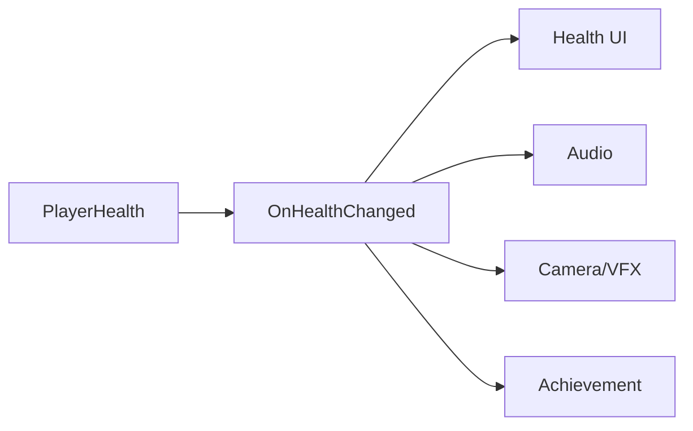
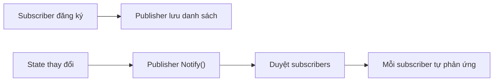
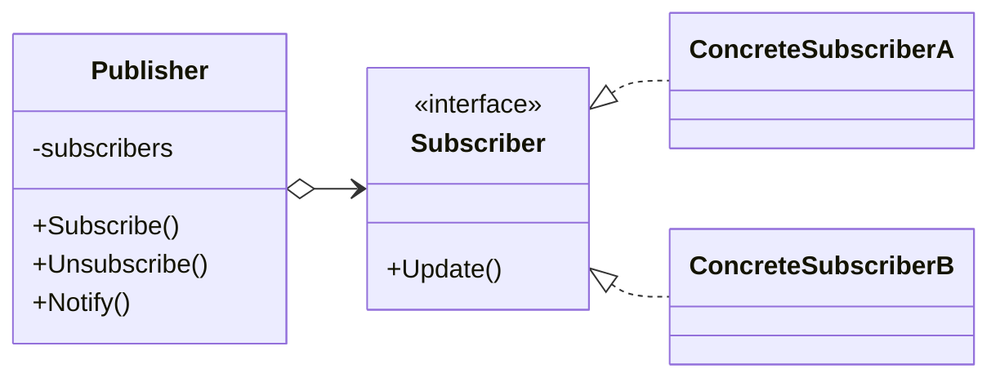

# Observer (Người quan sát)

> 📖 **Nguồn:** [Refactoring.Guru — Observer](https://refactoring.guru/design-patterns/observer) | Tác giả: Alexander Shvets

---

## 🎯 Ý định (Intent)

**Observer** là một mẫu thiết kế thuộc nhóm hành vi (behavioral), định nghĩa một cơ chế đăng ký để thông báo cho nhiều đối tượng (subscribers) về bất kỳ sự kiện nào xảy ra với đối tượng mà chúng đang quan sát (publisher).

---

## ❌ Vấn đề (Problem)

Hãy tưởng tượng bạn đang viết class quản lý máu nhân vật **PlayerHealth**:
- Khi người chơi bị mất máu, game cần thực hiện rất nhiều phản hồi:
  1.  **UI (Health Bar)** cần cập nhật thanh máu đỏ co ngắn lại.
  2.  **Sound System** cần phát âm thanh kêu rên hoặc nhịp tim đập dồn dập nếu máu quá thấp.
  3.  **VFX (Camera Shake / Red Flash)** cần nhấp nháy đỏ trên màn hình để báo hiệu nguy hiểm.
  4.  **Achievement Manager** cần kiểm tra xem người chơi có đạt thành tựu "Sống sót thần kỳ" (máu còn dưới 1% mà vẫn thắng) hay không.
- Nếu bạn kéo trực tiếp các tham chiếu của `HealthBar`, `SoundManager`, `CameraEffects`, và `AchievementManager` vào trong script `PlayerHealth`, class này sẽ trở thành **trung tâm liên kết (Highly Coupled Class)**. Bạn không thể mang script `PlayerHealth` sang một prototype game khác mà không kéo theo đống script UI, Sound, VFX kia. Đồng thời, mỗi khi thêm một hệ thống phản hồi mới, bạn lại phải sửa code của `PlayerHealth`.

---

## ✅ Giải pháp (Solution)

Mẫu **Observer** giải quyết vấn đề này bằng cách giới thiệu mô hình **Publisher (Người phát) & Subscribers (Người nhận)**.

1.  **Publisher (PlayerHealth):** Lưu trữ một danh sách các đối tượng quan tâm (subscribers) và cung cấp phương thức để họ có thể Đăng ký (Subscribe) hoặc Hủy đăng ký (Unsubscribe) theo dõi sự kiện thay đổi máu.
2.  Khi máu thay đổi, Publisher chỉ cần duyệt qua danh sách subscribers và gọi một phương thức thông báo chung.
3.  **Subscribers:** Thực thi một interface chung (hoặc đăng ký thông qua cơ chế Delegate/Action của C#) để lắng nghe thông báo và tự thực hiện logic phản hồi của riêng mình.
4.  Bây giờ, `PlayerHealth` không cần biết ai đang quan sát nó. Nó chỉ cần phát loa thông báo: *"Máu của tôi vừa thay đổi!"*.

---

## 🎨 Cấu trúc (Structure)

Thay vì đọc một UML lớn ngay từ đầu, hãy đọc pattern theo 3 lớp: **ý tưởng nhanh → luồng chạy thực tế → UML rút gọn**.

### 1. Ý tưởng nhanh



### 2. Luồng chạy thực tế



### 3. UML rút gọn



### Cách đọc sơ đồ

| Thành phần | Ý nghĩa |
|---|---|
| Nhìn nhanh | Publisher phát sự kiện, subscriber tự xử lý. |
| Luồng chính | Publisher không cần biết UI/Audio/VFX cụ thể. |
| Trong game | Health change, quest event, achievement, UI refresh. |
| Mũi tên nét liền | Object đang giữ tham chiếu hoặc gọi trực tiếp object khác. |
| Mũi tên tam giác / nét đứt trong UML | Kế thừa hoặc thực thi interface. |

> Mẹo đọc nhanh: trước hết hãy tìm **Client/Context**, sau đó đi theo mũi tên đến interface chính. Các class cụ thể chỉ là biến thể được thay vào khi chạy.

---

## 💻 Mã giả (Pseudocode)

```csharp
// Giao diện người quan sát
interface IObserver
{
    void Update(float health);
}

// Đối tượng bị quan sát (Subject / Publisher)
class PlayerHealth
{
    private List<IObserver> _observers = new List<IObserver>();
    private float _health = 100f;

    public void Subscribe(IObserver observer) => _observers.Add(observer);
    public void Unsubscribe(IObserver observer) => _observers.Remove(observer);

    public void TakeDamage(float damage)
    {
        _health -= damage;
        NotifyObservers();
    }

    private void NotifyObservers()
    {
        foreach (var observer in _observers)
        {
            observer.Update(_health);
        }
    }
}
```

---

## ⚙️ Khả năng áp dụng (Applicability)

Dùng Observer khi:
- Sự thay đổi trạng thái của một đối tượng yêu cầu cập nhật các đối tượng khác, và bạn không biết trước có bao nhiêu đối tượng cần cập nhật.
- Bạn cần xây dựng hệ thống UI phản hồi theo Gameplay Logic (UI luôn lắng nghe Data thay đổi - cơ chế Data Binding).
- Bạn cần tách biệt phần cốt lõi của game (Core Logic) với các thành phần phụ trợ như Âm thanh, Thành tựu (Achievements), Nhiệm vụ (Quest System), hoặc Phân tích (Analytics).

---

## 📝 Các bước thực hiện (How to Implement)

1.  Xác định đối tượng gửi thông tin (Publisher) và đối tượng nhận thông tin (Subscriber).
2.  *Lập trình C#/Unity:* Cách tốt nhất và chuẩn mực nhất là sử dụng `System.Action` hoặc `System.Action<T>` (Delegates) thay vì tự viết interface Observer thủ công.
3.  Trong Publisher, khai báo một sự kiện (event Action).
4.  Tại thời điểm chạy, các đối tượng Subscriber sẽ thực hiện đăng ký hàm xử lý của mình vào sự kiện của Publisher bằng toán tử `+=`.
5.  Đảm bảo hủy đăng ký bằng toán tử `-=` khi Subscriber bị hủy kích hoạt (như `OnDestroy` hoặc `OnDisable` trong Unity) để tránh rò rỉ bộ nhớ (Memory Leak - gọi là Lỗi Lắng Nghe Quá Hạn).
6.  Khi có thay đổi trạng thái, Publisher kích hoạt sự kiện bằng cách gọi `EventName?.Invoke(data)`.

---

## ⚖️ Ưu & Nhược điểm (Pros and Cons)

*   **👍 Ưu điểm:**
    *   *Loose Coupling:* Publisher và Subscribers hoàn toàn độc lập, thay đổi bên này không làm vỡ code bên kia.
    *   *Open/Closed Principle:* Bạn có thể thêm hàng trăm Subscriber mới vào hệ thống (ví dụ: hiệu ứng khói bụi, rung camera) mà không cần chỉnh sửa một dòng code nào trong class nhân vật gốc.
*   **👎 Nhược điểm:**
    *   Thứ tự nhận thông báo của các Subscriber là ngẫu nhiên, không thể kiểm soát chính xác ai sẽ chạy trước ai.
    *   **Nguy cơ Rò rỉ Bộ nhớ (Memory Leak):** Nếu quên hủy đăng ký (`-=`) khi đối tượng UI hoặc VFX bị phá hủy (Destroy), garbage collector sẽ không thể dọn dẹp đối tượng đó vì Publisher vẫn giữ một tham chiếu delegate tới nó.

---

## 🎮 Trong Game Dev: C# Code Example (Unity)

Dưới đây là triển khai hệ thống sự kiện máu nhân vật thay đổi dùng **C# Actions** cực kỳ phổ biến trong Unity:

### 1. Publisher (Player Health)
```csharp
using System;
using UnityEngine;

public class PlayerHealth : MonoBehaviour
{
    [SerializeField] private float maxHealth = 100f;
    private float _currentHealth;

    // Định nghĩa sự kiện thông báo máu thay đổi: truyền đi máu hiện tại và máu tối đa
    public event Action<float, float> OnHealthChanged;

    private void Start()
    {
        _currentHealth = maxHealth;
        // Kích hoạt sự kiện lần đầu để UI cập nhật giá trị khởi tạo
        TriggerHealthEvent();
    }

    public void TakeDamage(float amount)
    {
        if (amount <= 0) return;

        _currentHealth = Mathf.Max(0, _currentHealth - amount);
        Debug.Log($"💥 [Publisher] Nhân vật mất {amount} máu. Máu hiện tại: {_currentHealth}");

        TriggerHealthEvent();
    }

    private void TriggerHealthEvent()
    {
        // Invoke an toàn bằng toán tử ?. (chỉ gọi khi có ít nhất 1 subscriber lắng nghe)
        OnHealthChanged?.Invoke(_currentHealth, maxHealth);
    }
}
```

### 2. Các Subscribers (UI, Audio, Achievement)
```csharp
using UnityEngine;
using UnityEngine.UI;

// Subscriber 1: Thanh Máu UI (Health Bar)
public class HealthBarUI : MonoBehaviour
{
    [SerializeField] private PlayerHealth playerHealth;
    [SerializeField] private Image fillImage;

    private void OnEnable()
    {
        if (playerHealth != null)
            playerHealth.OnHealthChanged += UpdateHealthBar; // Đăng ký
    }

    private void OnDisable()
    {
        if (playerHealth != null)
            playerHealth.OnHealthChanged -= UpdateHealthBar; // Hủy đăng ký tránh Memory Leak
    }

    private void UpdateHealthBar(float currentHealth, float maxHealth)
    {
        float fillAmount = currentHealth / maxHealth;
        fillImage.fillAmount = fillAmount;
        Debug.Log($"📊 [HealthBar UI] Cập nhật thanh máu UI thành {fillAmount * 100}%");
    }
}

// Subscriber 2: Âm thanh cảnh báo (Audio Manager)
public class HealthAudioObserver : MonoBehaviour
{
    [SerializeField] private PlayerHealth playerHealth;

    private void OnEnable()
    {
        if (playerHealth != null)
            playerHealth.OnHealthChanged += PlayHurtSound;
    }

    private void OnDisable()
    {
        if (playerHealth != null)
            playerHealth.OnHealthChanged -= PlayHurtSound;
    }

    private void PlayHurtSound(float currentHealth, float maxHealth)
    {
        if (currentHealth <= 0)
        {
            Debug.Log("🎵 [Audio] Phát âm thanh nhân vật hy sinh.");
        }
        else if (currentHealth < maxHealth * 0.2f)
        {
            Debug.Log("🎵 [Audio] Phát tiếng tim đập khẩn cấp (Máu dưới 20%).");
        }
        else
        {
            Debug.Log("🎵 [Audio] Phát tiếng kêu 'Ah!' do trúng đòn nhẹ.");
        }
    }
}
```

### 3. Controller phát lệnh tấn công thử nghiệm
```csharp
public class GameTester : MonoBehaviour
{
    [SerializeField] private PlayerHealth targetPlayer;

    private void Update()
    {
        // Bấm phím T trên bàn phím để trừ 15 máu kiểm tra phản hồi hệ thống
        if (Input.GetKeyDown(KeyCode.T))
        {
            if (targetPlayer != null)
            {
                targetPlayer.TakeDamage(15f);
            }
        }
    }
}
```

---
> 📚 **Nguồn gốc:** Nội dung tham khảo từ [Refactoring.Guru](https://refactoring.guru/) — Tác giả: Alexander Shvets, Minh họa: Dmitry Zhart

| Hướng | Liên kết |
|-------|----------|
| ← Quay lại | [Memento](./05-memento.md) |
| → Tiếp theo | [State](./07-state.md) |
