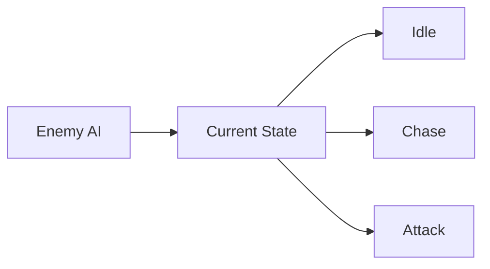
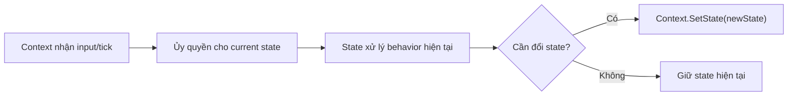
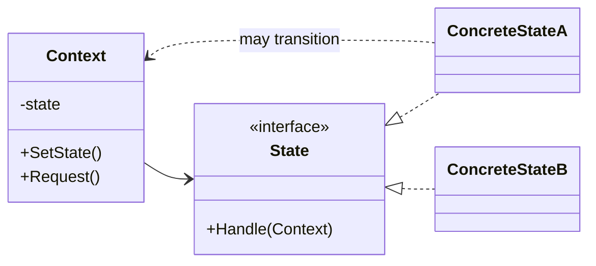

# State (Trạng thái)

> 📖 **Nguồn:** [Refactoring.Guru — State](https://refactoring.guru/design-patterns/state) | Tác giả: Alexander Shvets

---

## 🎯 Ý định (Intent)

**State** là một mẫu thiết kế thuộc nhóm hành vi (behavioral), cho phép một đối tượng thay đổi hành vi của nó khi trạng thái bên trong thay đổi. Đối tượng sẽ giống như thể đã thay đổi lớp của nó tại thời điểm chạy (runtime).

---

## ❌ Vấn đề (Problem)

Hãy tưởng tượng bạn đang viết AI cho một **Kẻ địch (Enemy AI)** tuần tra trong màn chơi:
- Kẻ địch có 3 trạng thái hoạt động: **Tuần tra (Patrol)**, **Đuổi theo người chơi (Chase)**, và **Tấn công (Attack)**.
- Cách tiếp cận thông thường là sử dụng một enum và một lệnh điều hướng lớn trong hàm `Update()`:
  ```csharp
  enum EnemyState { Patrol, Chase, Attack }

  void Update() {
      switch (currentState) {
          case EnemyState.Patrol:
              MoveAlongPatrolPath();
              if (CanSeePlayer()) currentState = EnemyState.Chase;
              break;
          case EnemyState.Chase:
              MoveTowardsPlayer();
              if (IsPlayerInAttackRange()) currentState = EnemyState.Attack;
              else if (!CanSeePlayer()) currentState = EnemyState.Patrol;
              break;
          case EnemyState.Attack:
              PerformAttackAction();
              if (!IsPlayerInAttackRange()) currentState = EnemyState.Chase;
              break;
      }
  }
  ```
- Ban đầu cấu trúc này chạy rất ổn. Nhưng khi game lớn lên, Designer muốn thêm các trạng thái mới: **Bị choáng (Stunned)**, **Bỏ chạy (Flee)**, **Tìm kiếm (Search)**.
- Lúc này, hàm `Update()` phình to thành hàng ngàn dòng code. Logic chuyển đổi trạng thái (state transition) đan xen chằng chịt vào nhau. Việc chỉnh sửa hay thêm mới một trạng thái trở thành ác mộng vì bạn rất dễ phá hỏng hoạt động của các trạng thái hiện tại.

---

## ✅ Giải pháp (Solution)

Mẫu **State** đề xuất bạn tạo ra các lớp riêng biệt cho từng trạng thái của đối tượng và chuyển tất cả các hành vi cụ thể của trạng thái đó vào trong các lớp này.

1.  Định nghĩa một interface chung là `IState` (hoặc lớp cơ sở abstract `State`) chứa các phương thức vòng đời như `Enter()` (khi bắt đầu vào trạng thái), `Update()` (chạy mỗi khung hình) và `Exit()` (khi rời khỏi trạng thái).
2.  Tạo ra các class trạng thái cụ thể: `PatrolState`, `ChaseState`, `AttackState` thực thi interface `IState`.
3.  Đối tượng AI gốc (gọi là **Context**) giữ một tham chiếu đến trạng thái hiện tại (`currentState`) và ủy thác toàn bộ công việc trong hàm `Update()` cho trạng thái đó xử lý:
    `currentState.Update();`
4.  Khi cần đổi trạng thái, Context chỉ cần gọi hàm chuyển đổi để gán đối tượng trạng thái mới vào biến `currentState`.

---

## 🎨 Cấu trúc (Structure)

Thay vì đọc một UML lớn ngay từ đầu, hãy đọc pattern theo 3 lớp: **ý tưởng nhanh → luồng chạy thực tế → UML rút gọn**.

### 1. Ý tưởng nhanh



### 2. Luồng chạy thực tế



### 3. UML rút gọn



### Cách đọc sơ đồ

| Thành phần | Ý nghĩa |
|---|---|
| Nhìn nhanh | Behavior thay đổi theo object state hiện tại. |
| Luồng chính | Context ủy quyền, State có thể yêu cầu chuyển state. |
| Trong game | Player state, enemy FSM, game phase. |
| Mũi tên nét liền | Object đang giữ tham chiếu hoặc gọi trực tiếp object khác. |
| Mũi tên tam giác / nét đứt trong UML | Kế thừa hoặc thực thi interface. |

> Mẹo đọc nhanh: trước hết hãy tìm **Client/Context**, sau đó đi theo mũi tên đến interface chính. Các class cụ thể chỉ là biến thể được thay vào khi chạy.

---

## 💻 Mã giả (Pseudocode)

```csharp
// Giao diện trạng thái
interface IState
{
    void Enter();
    void Update();
    void Exit();
}

// Đối tượng ngữ cảnh (Context)
class Context
{
    private IState _state;

    public void TransitionTo(IState state)
    {
        _state?.Exit();
        _state = state;
        _state.Enter();
    }

    public void Request()
    {
        _state.Update();
    }
}

// Một trạng thái cụ thể
class ConcreteStateA : IState
{
    private Context _context;

    public ConcreteStateA(Context context) => _context = context;

    public void Enter() => Print("Bắt đầu Trạng thái A");
    public void Update()
    {
        // Điều kiện chuyển trạng thái
        _context.TransitionTo(new ConcreteStateB(_context));
    }
    public void Exit() => Print("Thoát Trạng thái A");
}
```

---

## ⚙️ Khả năng áp dụng (Applicability)

Dùng mẫu State khi:
- Đối tượng có các hành vi khác nhau rõ rệt tùy thuộc vào trạng thái hiện tại của nó, và số lượng trạng thái lớn, liên tục thay đổi.
- Bạn có quá nhiều cấu trúc rẽ nhánh `switch-case` hoặc `if-else` phức tạp để điều hướng hành vi dựa trên các biến trạng thái.
- Bạn muốn chia sẻ logic chung giữa các trạng thái hoặc đóng gói mã nguồn của từng hành động AI sạch sẽ để làm việc nhóm (collaborative development) hiệu quả hơn.

---

## 📝 Các bước thực hiện (How to Implement)

1.  Định nghĩa interface `IState` hoặc class abstract `State`.
2.  Tạo class Context (ở đây là class điều khiển AI chính). Đảm bảo class này có phương thức `ChangeState(IState newState)`.
3.  Với mỗi trạng thái trong game, tạo một class thực thi `IState`. Class này nên nhận đối tượng Context trong Constructor để có thể gọi hàm thay đổi trạng thái hoặc truy cập dữ liệu nhân vật.
4.  Trong phương thức `ChangeState` của Context:
    *   Gọi `currentState.Exit()` để dọn dẹp trạng thái cũ (tắt hiệu ứng, dừng âm thanh).
    *   Gán trạng thái mới: `currentState = newState;`
    *   Gọi `currentState.Enter()` để khởi tạo trạng thái mới (chạy animation, thiết lập biến).
5.  Trong hàm `Update()` của Context, chỉ gọi duy nhất `currentState.Update()`.

---

## ⚖️ Ưu & Nhược điểm (Pros and Cons)

*   **👍 Ưu điểm:**
    *   *Single Responsibility Principle:* Đóng gói mã nguồn của mỗi trạng thái vào một lớp chuyên biệt.
    *   *Open/Closed Principle:* Dễ dàng thêm trạng thái mới mà không sửa đổi code của các trạng thái cũ.
    *   *Rõ ràng tường minh:* Loại bỏ hoàn toàn đống `switch-case` rườm rà dễ sinh bug trong hàm update chính.
*   **👎 Nhược điểm:**
    *   Mã nguồn có thể bị chia nhỏ thành quá nhiều file script.
    *   Nếu máy trạng thái quá đơn giản (chỉ có 2-3 trạng thái và hiếm khi đổi), việc áp dụng pattern này sẽ làm tăng độ phức tạp của dự án một cách không đáng có.

---

## 🎮 Trong Game Dev: C# Code Example (Unity)

Dưới đây là một máy trạng thái hữu hạn (**Finite State Machine - FSM**) chuẩn chỉnh cho Enemy AI trong Unity:

### 1. Interface IState
```csharp
public interface IState
{
    void Enter();
    void Update();
    void Exit();
}
```

### 2. Context Class (Enemy AI Controller)
```csharp
using UnityEngine;

public class EnemyAI : MonoBehaviour
{
    [Header("Movement Stats")]
    public float patrolSpeed = 2f;
    public float chaseSpeed = 5f;
    public Transform[] patrolWaypoints;

    [Header("Detection")]
    public Transform playerTransform;
    public float detectionRange = 7f;
    public float attackRange = 1.5f;

    // Trạng thái hiện tại
    private IState _currentState;

    private void Start()
    {
        // Khởi tạo trạng thái đầu tiên là Tuần tra
        ChangeState(new PatrolState(this));
    }

    private void Update()
    {
        // Ủy thác xử lý cho trạng thái hiện tại
        if (_currentState != null)
        {
            _currentState.Update();
        }
    }

    public void ChangeState(IState newState)
    {
        // Chạy hàm Exit của trạng thái cũ
        if (_currentState != null)
        {
            _currentState.Exit();
        }

        _currentState = newState;

        // Chạy hàm Enter của trạng thái mới
        if (_currentState != null)
        {
            _currentState.Enter();
        }
    }

    // Helper kiểm tra khoảng cách đến người chơi
    public float GetDistanceToPlayer()
    {
        if (playerTransform == null) return float.MaxValue;
        return Vector3.Distance(transform.position, playerTransform.position);
    }
}
```

### 3. Các Trạng thái cụ thể (Patrol & Chase)
```csharp
using UnityEngine;

// 1. Trạng thái Tuần tra (Patrol State)
public class PatrolState : IState
{
    private readonly EnemyAI _enemy;
    private int _waypointIndex;

    public PatrolState(EnemyAI enemy)
    {
        _enemy = enemy;
    }

    public void Enter()
    {
        Debug.Log("🤖 [State] Bước vào trạng thái TUẦN TRA.");
        _waypointIndex = 0;
    }

    public void Update()
    {
        // Di chuyển tuần tra giữa các Waypoints
        if (_enemy.patrolWaypoints.Length == 0) return;

        Transform targetWaypoint = _enemy.patrolWaypoints[_waypointIndex];
        _enemy.transform.position = Vector3.MoveTowards(
            _enemy.transform.position, 
            targetWaypoint.position, 
            _enemy.patrolSpeed * Time.deltaTime
        );

        if (Vector3.Distance(_enemy.transform.position, targetWaypoint.position) < 0.2f)
        {
            _waypointIndex = (_waypointIndex + 1) % _enemy.patrolWaypoints.Length;
        }

        // Điều kiện chuyển đổi: Phát hiện người chơi -> Đuổi theo
        if (_enemy.GetDistanceToPlayer() < _enemy.detectionRange)
        {
            _enemy.ChangeState(new ChaseState(_enemy));
        }
    }

    public void Exit()
    {
        Debug.Log("🤖 [State] Thoát trạng thái TUẦN TRA.");
    }
}

// 2. Trạng thái Đuổi theo (Chase State)
public class ChaseState : IState
{
    private readonly EnemyAI _enemy;

    public ChaseState(EnemyAI enemy)
    {
        _enemy = enemy;
    }

    public void Enter()
    {
        Debug.Log("🏃 [State] Bước vào trạng thái ĐUỔI THEO.");
    }

    public void Update()
    {
        if (_enemy.playerTransform == null) return;

        // Đuổi sát người chơi
        _enemy.transform.position = Vector3.MoveTowards(
            _enemy.transform.position, 
            _enemy.playerTransform.position, 
            _enemy.chaseSpeed * Time.deltaTime
        );

        float distance = _enemy.GetDistanceToPlayer();

        // Điểu kiện chuyển tiếp 1: Mất dấu người chơi -> Quay lại tuần tra
        if (distance > _enemy.detectionRange)
        {
            _enemy.ChangeState(new PatrolState(_enemy));
        }
        // Điều kiện chuyển tiếp 2: Áp sát -> Tấn công (Giả lập in log)
        else if (distance <= _enemy.attackRange)
        {
            Debug.Log("⚔️ [Action] Kẻ địch tấn công người chơi!");
        }
    }

    public void Exit()
    {
        Debug.Log("🏃 [State] Thoát trạng thái ĐUỔI THEO.");
    }
}
```

---
> 📚 **Nguồn gốc:** Nội dung tham khảo từ [Refactoring.Guru](https://refactoring.guru/) — Tác giả: Alexander Shvets, Minh họa: Dmitry Zhart

| Hướng | Liên kết |
|-------|----------|
| ← Quay lại | [Observer](./06-observer.md) |
| → Tiếp theo | [Strategy](./08-strategy.md) |
