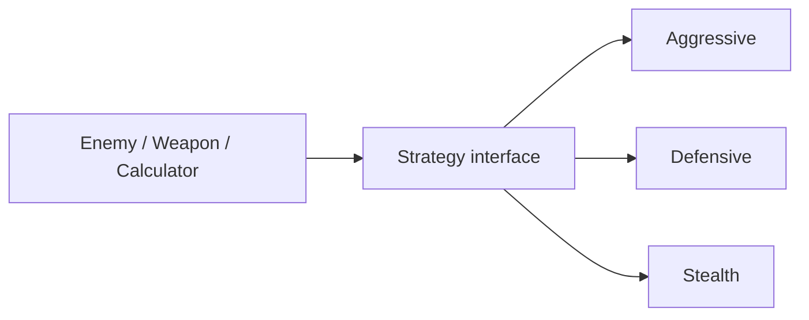
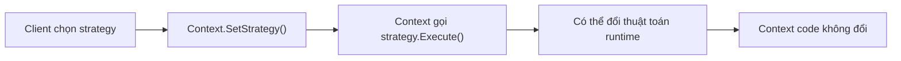
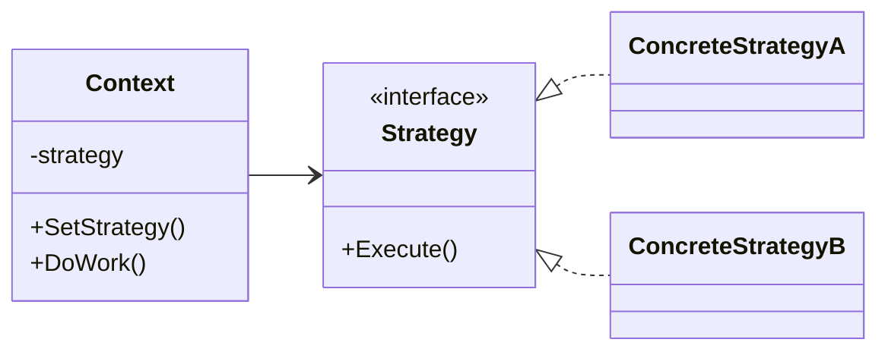

# Strategy (Chiến lược)

> 📖 **Nguồn:** [Refactoring.Guru — Strategy](https://refactoring.guru/design-patterns/strategy) | Tác giả: Alexander Shvets

---

## 🎯 Ý định (Intent)

**Strategy** là một mẫu thiết kế thuộc nhóm hành vi (behavioral), giúp định nghĩa một họ các thuật toán, đóng gói từng thuật toán lại và làm cho chúng có thể hoán đổi cho nhau tại thời điểm chạy (runtime). Mẫu này giúp thuật toán thay đổi độc lập với client sử dụng nó.

---

## ❌ Vấn đề (Problem)

Hãy tưởng tượng bạn đang xây dựng AI di chuyển cho các loại quái vật trong game:
- Bạn muốn quái vật di chuyển theo nhiều cách khác nhau tùy hoàn cảnh:
  - Khi còn nhiều máu: Đuổi theo người chơi trực tiếp (**Chase**).
  - Khi máu xuống quá thấp dưới 15%: Chạy trốn khỏi người chơi (**Flee**).
  - Khi bình thường: Đi tuần tra tự do xung quanh bản đồ (**Wander**).
- Nếu bạn lập trình tất cả thuật toán tính toán vị trí này trực tiếp trong class `EnemyMovement`, class này sẽ cực kỳ phức tạp. Bạn sẽ có các khối code tính toán đường đi NavMesh xen lẫn các công thức lượng giác chạy trốn.
- Việc thay đổi thuật toán di chuyển tại runtime bắt buộc bạn phải viết nhiều nhánh `if-else` lồng nhau. Khi bạn muốn cập nhật hoặc thêm một kiểu di chuyển mới (ví dụ: Bay lượn vòng tròn - Orbit), bạn sẽ gặp khó khăn vì code bị phụ thuộc chéo và dễ phát sinh lỗi ngoài ý muốn.

---

## ✅ Giải pháp (Solution)

Mẫu **Strategy** đề xuất bạn tách biệt các thuật toán di chuyển khác nhau ra khỏi class chính và đưa chúng vào các class riêng biệt gọi là **Strategies (Chiến lược)**.

1.  Định nghĩa một interface chung là `IMovementStrategy` có phương thức di chuyển `ExecuteMovement()`.
2.  Tạo ra các class chiến lược cụ thể thực thi interface này: `ChaseStrategy`, `FleeStrategy`, `WanderStrategy`. Mỗi class chỉ tập trung giải quyết thuật toán tính toán vector di chuyển đặc thù của nó.
3.  Class chính `EnemyAgent` (Context) sẽ lưu trữ một tham chiếu đến interface chiến lược: `IMovementStrategy activeStrategy`.
4.  Trong hàm cập nhật di chuyển, `EnemyAgent` chỉ cần gọi:
    `activeStrategy.ExecuteMovement(transform, target);`
5.  Khi trạng thái game thay đổi (ví dụ: máu yếu), `EnemyAgent` chỉ cần hoán đổi đối tượng gán cho `activeStrategy` mà không cần thay đổi bất kỳ logic nội bộ nào của class di chuyển gốc.

---

## 🎨 Cấu trúc (Structure)

Thay vì đọc một UML lớn ngay từ đầu, hãy đọc pattern theo 3 lớp: **ý tưởng nhanh → luồng chạy thực tế → UML rút gọn**.

### 1. Ý tưởng nhanh



### 2. Luồng chạy thực tế



### 3. UML rút gọn



### Cách đọc sơ đồ

| Thành phần | Ý nghĩa |
|---|---|
| Nhìn nhanh | Đóng gói thuật toán để hoán đổi runtime. |
| Luồng chính | Context giữ strategy và gọi qua interface. |
| Trong game | AI movement, damage formula, targeting mode. |
| Mũi tên nét liền | Object đang giữ tham chiếu hoặc gọi trực tiếp object khác. |
| Mũi tên tam giác / nét đứt trong UML | Kế thừa hoặc thực thi interface. |

> Mẹo đọc nhanh: trước hết hãy tìm **Client/Context**, sau đó đi theo mũi tên đến interface chính. Các class cụ thể chỉ là biến thể được thay vào khi chạy.

---

## 💻 Mã giả (Pseudocode)

```csharp
// Giao diện Chiến lược chung
interface IStrategy
{
    void Execute();
}

// Chiến lược cụ thể A
class ConcreteStrategyA : IStrategy
{
    public void Execute() => Print("Thực hiện thuật toán A");
}

// Chiến lược cụ thể B
class ConcreteStrategyB : IStrategy
{
    public void Execute() => Print("Thực hiện thuật toán B");
}

// Đối tượng sử dụng chiến lược (Context)
class Context
{
    private IStrategy _strategy;

    public void SetStrategy(IStrategy strategy)
    {
        _strategy = strategy;
    }

    public void DoAction()
    {
        _strategy.Execute(); // Ủy thác cho chiến lược được gán
    }
}
```

---

## ⚙️ Khả năng áp dụng (Applicability)

Dùng Strategy khi:
- Bạn có nhiều biến thể thuật toán giải quyết cùng một công việc (như các cách di chuyển AI khác nhau, các thuật toán tìm đường A* vs Dijkstra, hoặc các cách tính sát thương khác nhau).
- Bạn muốn thay đổi thuật toán của đối tượng một cách linh hoạt ngay tại thời điểm chạy (runtime).
- Bạn muốn che giấu chi tiết cấu trúc thuật toán đắt đỏ khỏi mã nguồn nghiệp vụ chính của lớp Context.

---

## 📝 Các bước thực hiện (How to Implement)

1.  Trong class Context, khai báo một trường dữ liệu (field) có kiểu dữ liệu là interface Chiến lược.
2.  Tạo interface Chiến lược chứa phương thức thực thi thuật toán. Truyền các tham số cần thiết từ Context vào phương thức này (hoặc truyền chính đối tượng Context).
3.  Triển khai các lớp Chiến lược cụ thể (Concrete Strategies).
4.  Cung cấp hàm thiết lập chiến lược (`SetStrategy` hoặc qua Constructor) trong class Context để Client có thể cấu hình thuật toán mong muốn.
5.  Trong logic xử lý của Context, thay thế việc tính toán trực tiếp bằng cách gọi phương thức thực thi của đối tượng chiến lược hiện tại.

---

## ⚖️ Ưu & Nhược điểm (Pros and Cons)

*   **👍 Ưu điểm:**
    *   *Thay đổi linh hoạt:* Dễ dàng hoán đổi các thuật toán khác nhau tại runtime.
    *   *Tách biệt dữ liệu:* Cô lập dữ liệu cấu trúc phức tạp của thuật toán ra khỏi lớp điều khiển chính.
    *   *Loại bỏ rẽ nhánh:* Tránh được các cấu trúc điều kiện `if-else` khổng lồ để chọn thuật toán di chuyển.
    *   *Open/Closed Principle:* Dễ dàng bổ sung thuật toán mới mà không cần chỉnh sửa code cũ.
*   **👎 Nhược điểm:**
    *   Mã nguồn phức tạp hơn do phải khai báo thêm nhiều class riêng lẻ cho từng thuật toán.
    *   Client sử dụng bắt buộc phải hiểu sự khác biệt giữa các chiến lược để lựa chọn chiến lược phù hợp.

---

## 🎮 Trong Game Dev: C# Code Example (Unity)

Dưới đây là một hệ thống AI di chuyển trong Unity sử dụng **Strategy Pattern** để đổi cách di chuyển dựa trên máu của quái vật:

### 1. Interface Chiến lược di chuyển
```csharp
using UnityEngine;

public interface IMovementStrategy
{
    void Move(Transform agent, Transform target, float speed);
}
```

### 2. Các lớp Chiến lược cụ thể (Chase & Flee)
```csharp
using UnityEngine;

// 1. Chiến lược Đuổi theo (Chase Strategy)
public class DirectChaseStrategy : IMovementStrategy
{
    public void Move(Transform agent, Transform target, float speed)
    {
        if (target == null) return;

        // Tính hướng đến mục tiêu và di chuyển trực diện
        Vector3 direction = (target.position - agent.position).normalized;
        agent.position += direction * (speed * Time.deltaTime);

        // Xoay mặt về hướng di chuyển
        if (direction != Vector3.zero)
        {
            agent.rotation = Quaternion.LookRotation(new Vector3(direction.x, 0, direction.z));
        }

        Debug.Log("🎯 [Strategy] Đang ĐUỔI THEO người chơi áp sát.");
    }
}

// 2. Chiến lược Chạy trốn (Flee Strategy)
public class FleeStrategy : IMovementStrategy
{
    public void Move(Transform agent, Transform target, float speed)
    {
        if (target == null) return;

        // Tính hướng ngược lại với mục tiêu để chạy trốn
        Vector3 direction = (agent.position - target.position).normalized;
        agent.position += direction * (speed * Time.deltaTime);

        // Xoay mặt về hướng chạy trốn
        if (direction != Vector3.zero)
        {
            agent.rotation = Quaternion.LookRotation(new Vector3(direction.x, 0, direction.z));
        }

        Debug.Log("🏃 [Strategy] Đang CHẠY TRỐN khỏi người chơi.");
    }
}
```

### 3. Context Class (Enemy Agent) điều khiển
```csharp
using UnityEngine;

public class EnemyAgent : MonoBehaviour
{
    [Header("Stats")]
    [SerializeField] private Transform targetPlayer;
    [SerializeField] private float movementSpeed = 3f;
    [SerializeField] private float health = 100f;

    // Tham chiếu chiến lược di chuyển
    private IMovementStrategy _movementStrategy;

    private void Start()
    {
        // Khởi tạo mặc định là chiến lược Đuổi theo
        _movementStrategy = new DirectChaseStrategy();
    }

    private void Update()
    {
        // Thực thi chiến lược di chuyển hiện tại
        if (_movementStrategy != null && targetPlayer != null)
        {
            _movementStrategy.Move(transform, targetPlayer, movementSpeed);
        }

        // Giả lập nhận sát thương theo thời gian để kích hoạt đổi chiến lược
        if (Input.GetKeyDown(KeyCode.H))
        {
            TakeDamage(30f);
        }
    }

    public void SetMovementStrategy(IMovementStrategy newStrategy)
    {
        _movementStrategy = newStrategy;
    }

    public void TakeDamage(float amount)
    {
        health -= amount;
        Debug.Log($"💥 Enemy nhận {amount} sát thương. Máu còn lại: {health}");

        // Nếu máu xuống dưới 30%, tự động hoán đổi chiến lược sang Chạy trốn
        if (health < 30f && _movementStrategy is DirectChaseStrategy)
        {
            Debug.Log("⚠️ Máu quá thấp! Hoán đổi chiến lược di chuyển sang CHẠY TRỐN.");
            SetMovementStrategy(new FleeStrategy());
        }
    }
}
```

---
> 📚 **Nguồn gốc:** Nội dung tham khảo từ [Refactoring.Guru](https://refactoring.guru/) — Tác giả: Alexander Shvets, Minh họa: Dmitry Zhart

| Hướng | Liên kết |
|-------|----------|
| ← Quay lại | [State](./07-state.md) |
| → Tiếp theo | [Template Method](./09-template-method.md) |
