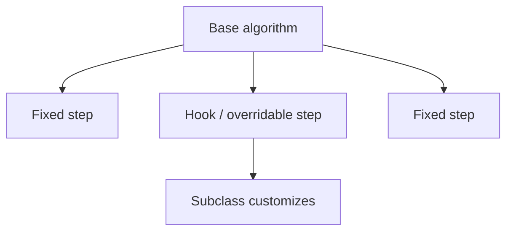
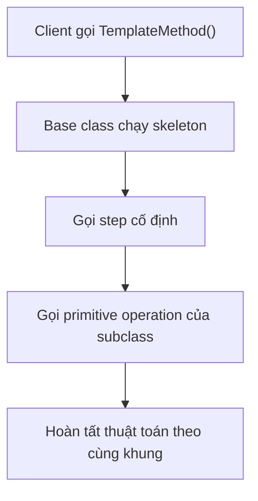
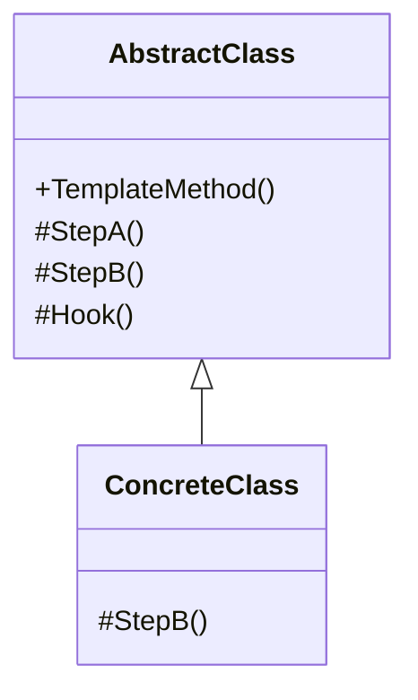

# Template Method (Phương thức Khuôn mẫu)

> 📖 **Nguồn:** [Refactoring.Guru — Template Method](https://refactoring.guru/design-patterns/template-method) | Tác giả: Alexander Shvets

---

## 🎯 Ý định (Intent)

**Template Method** là một mẫu thiết kế thuộc nhóm hành vi (behavioral), giúp định nghĩa bộ khung của một thuật toán trong lớp cha (superclass) nhưng cho phép các lớp con (subclasses) ghi đè (override) các bước cụ thể của thuật toán mà không làm thay đổi cấu trúc chung của nó.

---

## ❌ Vấn đề (Problem)

Hãy tưởng tượng bạn đang viết một trò chơi thẻ bài chiến thuật (Collectible Card Game):
- Tất cả các thẻ bài khi được người chơi sử dụng đều tuân theo một quy trình kích hoạt nghiêm ngặt:
  1.  Khấu trừ điểm năng lượng (Mana Cost).
  2.  Phát âm thanh và hiệu ứng tung bài (Spawn Animation & Audio).
  3.  **Kích hoạt hiệu ứng đặc biệt của quân bài** (ví dụ: thẻ lửa phun lửa gây damage, thẻ hồi máu hồi máu).
  4.  Đưa thẻ bài vào nghĩa địa (Move to Discard Pile).
- Nếu mỗi thẻ bài cụ thể (`FireballCard`, `HealCard`, `ShieldCard`) tự triển khai lại toàn bộ 4 bước này, bạn sẽ gặp tình trạng trùng lặp mã nguồn cực kỳ nhiều ở bước 1, 2 và 4.
- Tệ hơn nữa, nếu sau đó bạn muốn thay đổi quy trình chung (ví dụ: thêm bước kiểm tra xem đối thủ có phản bài - Counter Spell hay không trước khi trừ mana), bạn sẽ phải mở hàng trăm file script của hàng trăm thẻ bài ra để sửa đổi thủ công.

---

## ✅ Giải pháp (Solution)

Mẫu **Template Method** khuyên bạn nên định nghĩa quy trình thuật toán chung trong một class cha trừu tượng dưới dạng một phương thức duy nhất (gọi là **Template Method**).

1.  Trong class cha `Card`, định nghĩa hàm `Play()` chứa thứ tự gọi tuần tự của các bước.
2.  Các bước giống nhau giữa các thẻ bài (`PayMana()`, `SendToDiscard()`) sẽ được triển khai chi tiết trực tiếp trong class cha.
3.  Các bước khác biệt giữa các thẻ bài (`ApplyEffect()`) được khai báo dưới dạng phương thức trừu tượng (abstract method) hoặc ảo (virtual method).
4.  Các class con (`FireballCard`, `HealCard`) chỉ cần kế thừa class `Card` và ghi đè duy nhất phương thức `ApplyEffect()`.
5.  Quy trình chạy chung được bảo toàn, đồng thời code trùng lặp được loại bỏ hoàn toàn!

---

## 🎨 Cấu trúc (Structure)

Thay vì đọc một UML lớn ngay từ đầu, hãy đọc pattern theo 3 lớp: **ý tưởng nhanh → luồng chạy thực tế → UML rút gọn**.

### 1. Ý tưởng nhanh



### 2. Luồng chạy thực tế



### 3. UML rút gọn



### Cách đọc sơ đồ

| Thành phần | Ý nghĩa |
|---|---|
| Nhìn nhanh | Base class giữ khung thuật toán, subclass thay vài bước. |
| Luồng chính | Client gọi một template method duy nhất. |
| Trong game | Spawn cycle, AI routine, level loading pipeline. |
| Mũi tên nét liền | Object đang giữ tham chiếu hoặc gọi trực tiếp object khác. |
| Mũi tên tam giác / nét đứt trong UML | Kế thừa hoặc thực thi interface. |

> Mẹo đọc nhanh: trước hết hãy tìm **Client/Context**, sau đó đi theo mũi tên đến interface chính. Các class cụ thể chỉ là biến thể được thay vào khi chạy.

---

## 💻 Mã giả (Pseudocode)

```csharp
// Lớp cơ sở định nghĩa Template Method
abstract class GameAI
{
    // Đây chính là Template Method định nghĩa khung thuật toán
    public void RunTurn()
    {
        CollectResources();
        BuildStructures();
        BuildUnits();
        AttackEnemy(); // Bước trừu tượng để lớp con tùy chỉnh
        EndTurn();
    }

    protected void CollectResources() => Print("Thu thập tài nguyên chung.");
    protected void BuildStructures() => Print("Xây dựng nhà cửa.");
    protected void BuildUnits() => Print("Mua lính.");
    protected void EndTurn() => Print("Kết thúc lượt.");

    // Bước này bắt buộc lớp con phải tự định nghĩa cách tấn công
    protected abstract void AttackEnemy();
}

// Lớp con cụ thể hóa thuật toán tấn công
class AggressiveAI : GameAI
{
    protected override void AttackEnemy()
    {
        Print("Tấn công tổng lực bằng bộ binh!");
    }
}
```

---

## ⚙️ Khả năng áp dụng (Applicability)

Dùng Template Method khi:
- Bạn muốn các lớp con mở rộng hoặc tùy biến chỉ một số bước cụ thể của thuật toán mà không làm thay đổi cấu trúc tổng thể hay trình tự của thuật toán đó.
- Bạn có nhiều lớp thực hiện các công việc gần như giống hệt nhau, chỉ khác biệt nhỏ ở một vài công đoạn. Việc đưa logic chung lên lớp cha giúp loại bỏ trùng lặp code (DRY - Don't Repeat Yourself).
- Bạn muốn cung cấp các điểm móc nối (**Hooks** - các hàm ảo rỗng) để các lớp con có thể tùy ý can thiệp vào trước hoặc sau các bước quan trọng của thuật toán chính.

---

## 📝 Các bước thực hiện (How to Implement)

1.  Tạo một abstract class đóng vai trò làm lớp cha.
2.  Khai báo phương thức chính làm Template Method (nên để kiểu `public` hoặc `final/sealed` nếu ngôn ngữ hỗ trợ để tránh lớp con ghi đè cấu trúc thứ tự chạy).
3.  Chuyển các bước thực thi chung thành các hàm `private` hoặc `protected` trong lớp cha.
4.  Xác định các bước thay đổi linh hoạt và khai báo chúng dưới dạng các phương thức `abstract` (buộc phải ghi đè) hoặc `virtual` (tùy chọn ghi đè, có thể để trống hoặc triển khai mặc định).
5.  Tạo ra các class con kế thừa lớp cha và triển khai (override) các phương thức thay đổi theo yêu cầu.

---

## ⚖️ Ưu & Nhược điểm (Pros and Cons)

*   **👍 Ưu điểm:**
    *   *Tái sử dụng mã nguồn tối đa:* Gom toàn bộ code giống nhau lên lớp cha.
    *   *Dễ bảo trì:* Thay đổi quy trình chung chỉ cần sửa đổi ở một nơi duy nhất (lớp cha).
    *   *Mở rộng an toàn:* Lớp con chỉ có thể thay đổi các bước được cho phép, không thể làm xáo trộn thứ tự chạy của thuật toán chính.
*   **👎 Nhược điểm:**
    *   *Giới hạn thiết kế:* Các lớp con bị bó buộc vào khung thuật toán của lớp cha. Nếu thuật toán cần thay đổi cấu trúc chạy hoàn toàn cho một lớp con đặc thù, mẫu này không đáp ứng được.
    *   *Lỗi Liskov:* Việc ghi đè các hàm con đôi khi vô tình vi phạm nguyên lý thay thế Liskov nếu lớp con làm thay đổi bản chất mong đợi của bước đó.

---

## 🎮 Trong Game Dev: C# Code Example (Unity)

Dưới đây là cách triển khai hệ thống **Kích hoạt thẻ bài (Card Play Pipeline)** trong Unity sử dụng **Template Method**:

### 1. Abstract Class cha định nghĩa Template Method
```csharp
using UnityEngine;

public abstract class Card : MonoBehaviour
{
    [Header("Card Metadata")]
    public string cardName;
    public int manaCost;

    // Template Method: Định nghĩa quy trình kích hoạt thẻ bài
    // Dùng từ khóa sealed hoặc đơn giản là giữ hàm không virtual để lớp con không thể sửa thứ tự chạy
    public void PlayCard()
    {
        Debug.Log($"🃏 --- Bắt đầu quy trình chơi thẻ: {cardName} ---");
        
        if (!PayManaCost())
        {
            Debug.LogWarning("❌ Năng lượng không đủ! Hủy kích hoạt bài.");
            return;
        }

        PlaySpawnAnimation();
        
        // Bước thay đổi: Gọi hàm trừu tượng để lớp con thực thi hiệu ứng riêng biệt
        ApplyCustomEffect();

        MoveToDiscardPile();
        
        Debug.Log($"🃏 --- Kết thúc quy trình chơi thẻ: {cardName} ---\n");
    }

    private bool PayManaCost()
    {
        Debug.Log($"[1. Cost] Trừ {manaCost} mana của người chơi.");
        return true; // Giả lập luôn đủ mana
    }

    private void PlaySpawnAnimation()
    {
        Debug.Log("[2. Visual] Phát hiệu ứng tung bài lên bàn đấu.");
    }

    // Lớp con BẮT BUỘC phải tự định nghĩa hiệu ứng này
    protected abstract void ApplyCustomEffect();

    // Hook: Một hàm ảo mặc định có thể ghi đè hoặc không
    protected virtual void MoveToDiscardPile()
    {
        Debug.Log("[4. Discard] Đẩy thẻ bài vào nghĩa địa mặc định.");
    }
}
```

### 2. Các lớp con Card cụ thể (Fireball & Heal)
```csharp
using UnityEngine;

// 1. Thẻ bài Cầu Lửa (Fireball Card)
public class FireballCard : Card
{
    [Header("Fireball Stats")]
    public float damage = 50f;

    protected override void ApplyCustomEffect()
    {
        // Thực thi hiệu ứng nổ và trừ máu đối thủ
        Debug.Log($"🔥 [Effect] Gây {damage} sát thương thiêu đốt lên kẻ địch!");
    }
}

// 2. Thẻ bài Hồi Máu (Heal Card)
public class HealCard : Card
{
    [Header("Heal Stats")]
    public float healAmount = 30f;

    protected override void ApplyCustomEffect()
    {
        // Thực thi hiệu ứng hồi máu
        Debug.Log($"💚 [Effect] Hồi {healAmount} máu cho đồng minh.");
    }

    // Hủy nghĩa địa: Ghi đè phương thức Hook nếu muốn thẻ bài này biến mất vĩnh viễn thay vì vào Discard Pile
    protected override void MoveToDiscardPile()
    {
        Debug.Log("[4. Discard - Override] Thẻ bài Hồi Máu bị trục xuất khỏi trận đấu (Banish) thay vì vào nghĩa địa!");
    }
}
```

### 3. Client code giả lập gọi bài
```csharp
public class CardGameController : MonoBehaviour
{
    [SerializeField] private Card fireballCard;
    [SerializeField] private Card healCard;

    private void Start()
    {
        // Sử dụng Template Method để chạy thử
        if (fireballCard != null)
        {
            fireballCard.PlayCard();
        }

        if (healCard != null)
        {
            healCard.PlayCard();
        }
    }
}
```

---
> 📚 **Nguồn gốc:** Nội dung tham khảo từ [Refactoring.Guru](https://refactoring.guru/) — Tác giả: Alexander Shvets, Minh họa: Dmitry Zhart

| Hướng | Liên kết |
|-------|----------|
| ← Quay lại | [Strategy](./08-strategy.md) |
| → Tiếp theo | [Visitor](./10-visitor.md) |
