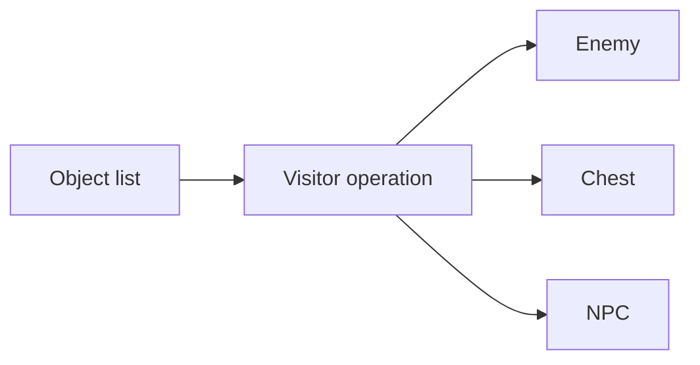
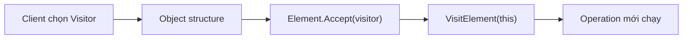
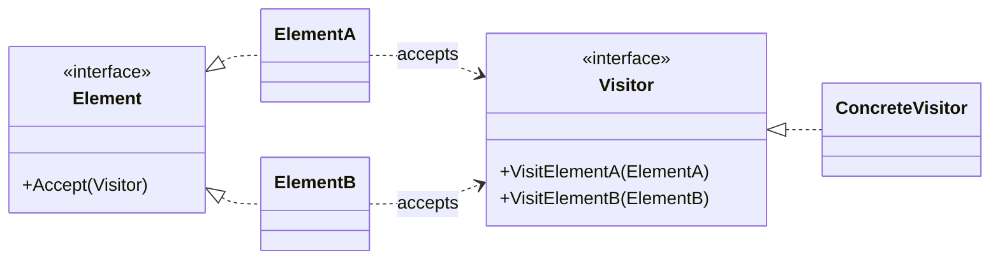

# Visitor (Bộ truy cập)

> 📖 **Nguồn:** [Refactoring.Guru — Visitor](https://refactoring.guru/design-patterns/visitor) | Tác giả: Alexander Shvets

---

## 🎯 Ý định (Intent)

**Visitor** là một mẫu thiết kế thuộc nhóm hành vi (behavioral), cho phép bạn tách biệt các thuật toán và hành vi khỏi các đối tượng mà chúng hoạt động trên đó, giúp bạn thêm các hoạt động mới vào các cấu trúc đối tượng hiện có mà không cần sửa đổi các lớp đó.

---

## ❌ Vấn đề (Problem)

Hãy tưởng tượng bạn đang thiết kế một trò chơi đi cảnh (Platformer) với hệ thống **Vật phẩm bổ trợ (Power-up / Buff System)**:
- Game của bạn có một số loại thực thể chính kế thừa từ `IEntity`: **Player** (người chơi), **Enemy** (kẻ địch), và **Obstacle** (chướng ngại vật như thùng gỗ, tường đá).
- Bây giờ bạn muốn viết tính năng cho vật phẩm **Freeze Power-up (Búa đóng băng)**:
  - Khi tác động lên **Player**: Đóng băng di chuyển của người chơi trong 2 giây.
  - Khi tác động lên **Enemy**: Làm chậm quái vật 50% trong 5 giây.
  - Khi tác động lên **Obstacle**: Khiến chướng ngại vật giòn đi và dễ bị đập vỡ.
- Nếu bạn giải quyết bằng cách thêm hàm `ApplyFreeze()` trực tiếp vào interface `IEntity` và triển khai trong tất cả các class con, code sẽ hoạt động. Tuy nhiên, vài tuần sau Designer lại muốn thêm: **Lava Power-up (Lửa đỏ)**, **Electricity Power-up (Sét đánh)**.
- Bạn lại phải mở toàn bộ các file `Player`, `Enemy`, `Obstacle` ra để viết thêm các hàm `ApplyLava()`, `ApplyLightning()`. Điều này vi phạm nghiêm trọng nguyên lý **Open/Closed Principle** (lớp thực thể bị chỉnh sửa liên tục cho các tính năng không phải cốt lõi của nó).
- Nếu dùng kiểm tra kiểu dữ liệu thủ công dạng `if (entity is Player)`, bạn sẽ tạo ra đống code kiểm tra rườm rà, mất đi tính hướng đối tượng và dễ bỏ sót khi thêm thực thể mới.

---

## ✅ Giải pháp (Solution)

Mẫu **Visitor** đề xuất bạn đóng gói toàn bộ logic của các hành vi bổ trợ (Power-up) vào các lớp riêng biệt gọi là **Visitors (Bộ truy cập)**. Bản thân các thực thể cũ chỉ cung cấp một điểm móc nối nhỏ nhận Visitor.

1.  Tạo interface `IVisitor` định nghĩa các hàm truy cập cho từng loại thực thể cụ thể:
    *   `Visit(Player player)`
    *   `Visit(Enemy enemy)`
    *   `Visit(Obstacle obstacle)`
2.  Tạo interface `IEntity` khai báo phương thức: `Accept(IVisitor visitor)`.
3.  Trong mỗi thực thể cụ thể, triển khai hàm `Accept` cực kỳ đơn giản bằng kỹ thuật **Double Dispatch**:
    ```csharp
    public void Accept(IVisitor visitor) {
        visitor.Visit(this); // Gọi đúng hàm overload của Visitor tương ứng với kiểu của 'this'
    }
    ```
4.  Bây giờ, khi muốn thêm hiệu ứng Búa đóng băng, bạn chỉ cần tạo class `FreezeVisitor` kế thừa `IVisitor` và viết logic xử lý riêng cho Player, Enemy, Obstacle tại đó. Bạn không cần sửa đổi bất kỳ dòng code cốt lõi nào của các lớp thực thể nữa!

---

## 🎨 Cấu trúc (Structure)

Thay vì đọc một UML lớn ngay từ đầu, hãy đọc pattern theo 3 lớp: **ý tưởng nhanh → luồng chạy thực tế → UML rút gọn**.

### 1. Ý tưởng nhanh



### 2. Luồng chạy thực tế



### 3. UML rút gọn



### Cách đọc sơ đồ

| Thành phần | Ý nghĩa |
|---|---|
| Nhìn nhanh | Thêm operation mới bằng Visitor thay vì sửa từng class element. |
| Luồng chính | Double dispatch: element gọi đúng VisitX của visitor. |
| Trong game | Export/save, buff effect, damage calculation qua nhiều entity type. |
| Mũi tên nét liền | Object đang giữ tham chiếu hoặc gọi trực tiếp object khác. |
| Mũi tên tam giác / nét đứt trong UML | Kế thừa hoặc thực thi interface. |

> Mẹo đọc nhanh: trước hết hãy tìm **Client/Context**, sau đó đi theo mũi tên đến interface chính. Các class cụ thể chỉ là biến thể được thay vào khi chạy.

---

## 💻 Mã giả (Pseudocode)

```csharp
// Giao diện Visitor chứa các hàm overload cho từng thực thể
interface IVisitor
{
    void VisitConcreteElementA(ElementA element);
    void VisitConcreteElementB(ElementB element);
}

// Giao diện Element chấp nhận Visitor
interface IElement
{
    void Accept(IVisitor visitor);
}

// Element cụ thể A
class ElementA : IElement
{
    public void Accept(IVisitor visitor) => visitor.VisitConcreteElementA(this);
    public void FeatureA() => Print("Tính năng của A");
}

// Visitor cụ thể xử lý tính năng mới
class ConcreteVisitor : IVisitor
{
    public void VisitConcreteElementA(ElementA element)
    {
        element.FeatureA(); // Thực thi hành vi mới trên A
    }

    public void VisitConcreteElementB(ElementB element)
    {
        // Thực thi hành vi mới trên B
    }
}
```

---

## ⚙️ Khả năng áp dụng (Applicability)

Dùng Visitor khi:
- Bạn cần thực hiện một hoạt động trên tất cả các phần tử của một cấu trúc đối tượng phức tạp (như một cây thực thể game, Scene Hierarchy) và các phần tử này có các lớp cụ thể khác nhau.
- Bạn muốn làm sạch mã nguồn của các lớp thực thể bằng cách loại bỏ các hành vi phụ trợ không liên quan đến nhiệm vụ chính của chúng.
- Bạn thường xuyên phải thêm các tính năng mới cho các lớp trong cấu trúc đối tượng hiện có, nhưng cấu trúc của các lớp thực thể này rất ổn định và hiếm khi thay đổi (chỉ có Player, Enemy, Obstacle, không phát sinh thêm kiểu thực thể mới).

---

## 📝 Các bước thực hiện (How to Implement)

1.  Định nghĩa interface `IVisitor` với tập hợp các phương thức `Visit...` tương ứng cho mỗi lớp Concrete Element có sẵn trong game.
2.  Định nghĩa phương thức `Accept(IVisitor visitor)` trong interface của Element gốc.
3.  Triển khai phương thức `Accept` trong tất cả các lớp Element cụ thể. Code triển khai luôn là: `visitor.Visit(this);` (trong đó `this` tự động trỏ về kiểu dữ liệu chính xác của class hiện tại nhờ cơ chế biên dịch).
4.  Tạo ra các class Concrete Visitor kế thừa `IVisitor` để cài đặt các thuật toán/hành vi mới.
5.  Khi cần áp dụng hành vi, Client gọi: `element.Accept(visitor)`.

---

## ⚖️ Ưu & Nhược điểm (Pros and Cons)

*   **👍 Ưu điểm:**
    *   *Open/Closed Principle:* Dễ dàng thêm các hiệu ứng/thuật toán mới (Visitor mới) tác động lên các đối tượng mà không cần sửa đổi các đối tượng đó.
    *   *Single Responsibility Principle:* Gom tất cả các biến thể của một thuật toán mới cho nhiều lớp vào một nơi duy nhất.
    *   *Double Dispatch:* Giải quyết sạch sẽ vấn đề đa hình theo tham số đầu vào mà không cần ép kiểu (`casting`).
*   **👎 Nhược điểm:**
    *   *Khó thay đổi cấu trúc Element:* Nếu bạn thêm một loại thực thể mới (ví dụ: `Npc`), bạn bắt buộc phải mở toàn bộ các file interface `IVisitor` và tất cả các Concrete Visitor hiện có để viết thêm hàm `VisitNpc(...)`.

---

## 🎮 Trong Game Dev: C# Code Example (Unity)

Dưới đây là hệ thống tương tác **Power-up (Freeze & Fire)** tác động lên các thực thể khác nhau trong Unity bằng Visitor Pattern:

### 1. Interfaces chính
```csharp
// Giao diện Bộ truy cập
public interface IEntityVisitor
{
    void Visit(PlayerCharacter player);
    void Visit(EnemyCharacter enemy);
    void Visit(DestructibleObstacle obstacle);
}

// Giao diện Thực thể chấp nhận Bộ truy cập
public interface IGameEntity
{
    void Accept(IEntityVisitor visitor);
}
```

### 2. Các thực thể Element cụ thể (Player, Enemy, Obstacle)
```csharp
using UnityEngine;

// 1. Thực thể Người chơi
public class PlayerCharacter : MonoBehaviour, IGameEntity
{
    public float movementSpeed = 5f;

    public void Accept(IEntityVisitor visitor)
    {
        visitor.Visit(this); // Double Dispatch định tuyến đúng hàm của Visitor
    }

    public void ApplySpeedDebuff(float factor, float duration)
    {
        Debug.Log($"👤 [Player] Tốc độ chạy bị giảm đi {factor * 100}% trong {duration} giây!");
    }

    public void BurnPlayer(float damage)
    {
        Debug.Log($"👤 [Player] Bị bỏng lửa! Nhận {damage} sát thương thiêu đốt.");
    }
}

// 2. Thực thể Kẻ địch
public class EnemyCharacter : MonoBehaviour, IGameEntity
{
    public void Accept(IEntityVisitor visitor)
    {
        visitor.Visit(this);
    }

    public void FreezeEnemy(float stunDuration)
    {
        Debug.Log($"🤖 [Enemy] Bị ĐÓNG BĂNG hoàn toàn! Choáng trong {stunDuration} giây.");
    }

    public void BurnEnemy(float damage)
    {
        Debug.Log($"🤖 [Enemy] Bị thiêu rụi bởi lửa! Nhận {damage} sát thương.");
    }
}

// 3. Thực thể Chướng ngại vật
public class DestructibleObstacle : MonoBehaviour, IGameEntity
{
    public void Accept(IEntityVisitor visitor)
    {
        visitor.Visit(this);
    }

    public void MakeShatterable()
    {
        Debug.Log("📦 [Obstacle] Thùng gỗ hóa giòn dễ vỡ!");
    }

    public void MeltObstacle()
    {
        Debug.Log("📦 [Obstacle] Rào chắn gỗ bị đốt cháy tiêu hủy hoàn toàn.");
    }
}
```

### 3. Các Concrete Visitors (Freeze & Fire Power-up)
```csharp
using UnityEngine;

// 1. Hiệu ứng Đóng băng
public class FreezePowerUp : IEntityVisitor
{
    public void Visit(PlayerCharacter player)
    {
        // Player bị làm chậm
        player.ApplySpeedDebuff(0.5f, 2.0f);
    }

    public void Visit(EnemyCharacter enemy)
    {
        // Enemy bị stun hoàn toàn
        enemy.FreezeEnemy(3.0f);
    }

    public void Visit(DestructibleObstacle obstacle)
    {
        // Thùng gỗ hóa giòn
        obstacle.MakeShatterable();
    }
}

// 2. Hiệu ứng Lửa cháy
public class FirePowerUp : IEntityVisitor
{
    private readonly float _damage = 25f;

    public void Visit(PlayerCharacter player)
    {
        player.BurnPlayer(_damage);
    }

    public void Visit(EnemyCharacter enemy)
    {
        enemy.BurnEnemy(_damage * 1.5f); // Lửa khắc quái vật nên gây sát thương nhân đôi
    }

    public void Visit(DestructibleObstacle obstacle)
    {
        obstacle.MeltObstacle();
    }
}
```

### 4. Client code (Va chạm vật lý áp dụng Visitor)
```csharp
using UnityEngine;

public class PowerUpTrigger : MonoBehaviour
{
    // Cấu hình loại PowerUp qua Inspector
    public enum PowerUpType { Freeze, Fire }
    public PowerUpType activePowerUp;

    private void OnTriggerEnter(Collider other)
    {
        // Tìm xem đối tượng va chạm có thực thi IGameEntity không
        IGameEntity entity = other.GetComponent<IGameEntity>();
        
        if (entity != null)
        {
            IEntityVisitor visitor = null;

            switch (activePowerUp)
            {
                case PowerUpType.Freeze:
                    visitor = new FreezePowerUp();
                    Debug.Log("❄️ Kích hoạt va chạm ĐÓNG BĂNG!");
                    break;
                case PowerUpType.Fire:
                    visitor = new FirePowerUp();
                    Debug.Log("🔥 Kích hoạt va chạm LỬA ĐỎ!");
                    break;
            }

            if (visitor != null)
            {
                // Thực thi mẫu thiết kế Visitor
                entity.Accept(visitor);
            }
        }
    }
}
```

---
> 📚 **Nguồn gốc:** Nội dung tham khảo từ [Refactoring.Guru](https://refactoring.guru/) — Tác giả: Alexander Shvets, Minh họa: Dmitry Zhart

| Hướng | Liên kết |
|-------|----------|
| ← Quay lại | [Template Method](./09-template-method.md) |
| → Tiếp theo | [Behavioral Patterns Overview](./00-behavioral-overview.md) |
