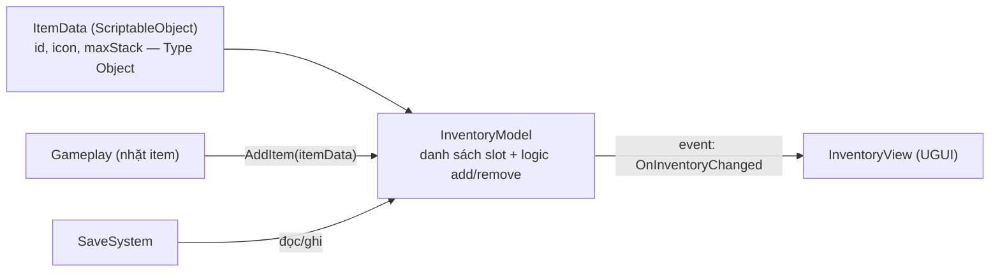
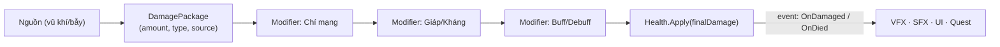
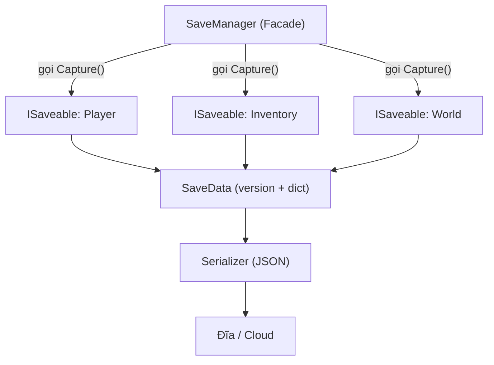
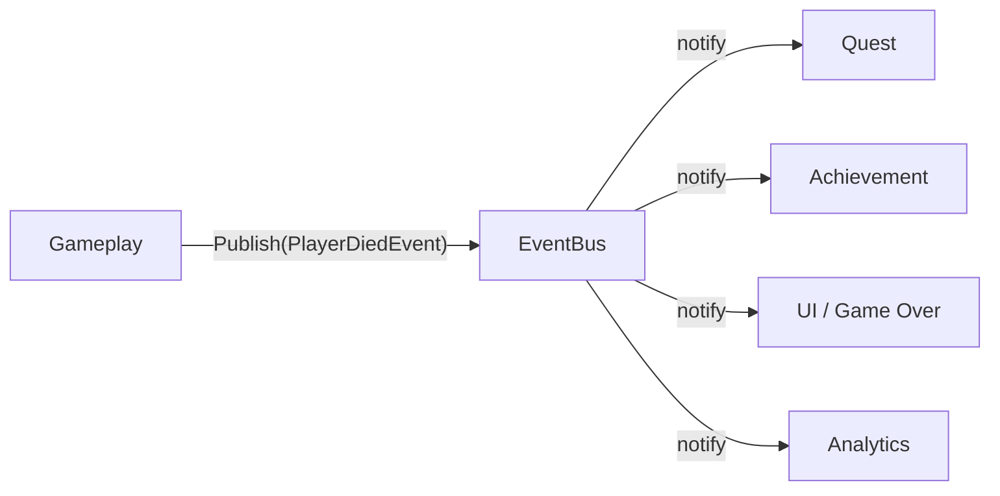
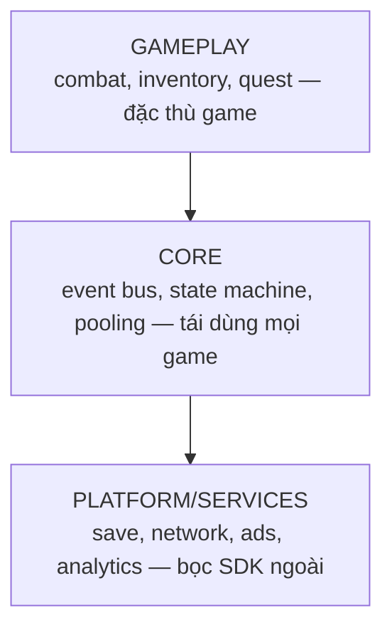

# 🏗️ Hướng dẫn Thiết kế Hệ thống Game

> 📖 **Về trang này:** Pattern dạy bạn *giải một vấn đề nhỏ*. **Thiết kế hệ thống** dạy bạn *ghép nhiều phần thành một thể sống được, sửa được, mở rộng được*. Đây là kỹ năng phân tách Junior với Senior. Trang này đi từ **một feature → một hệ thống → kiến trúc toàn dự án**, kèm case study thật và sơ đồ.

---

## 🎚️ Ba tầng độ cao của "thiết kế"

Mỗi cấp bậc thiết kế ở một tầng độ cao khác nhau:

```
TẦNG 1: FEATURE      →  "Làm cái nút nhảy đôi"          (Fresher → Junior)
TẦNG 2: HỆ THỐNG     →  "Làm cả hệ thống Inventory"     (Junior → Middle)
TẦNG 3: KIẾN TRÚC    →  "Cả game ghép với nhau ra sao"  (Middle → Senior → Lead)
```

> [!IMPORTANT]
> Sai lầm phổ biến: nhảy thẳng lên tầng 3 khi chưa vững tầng 2. Bạn **không thể** thiết kế kiến trúc tốt nếu chưa từng tự tay làm chủ vài hệ thống. Hãy leo tuần tự.

---

## 🧭 Quy trình 6 bước thiết kế một hệ thống

Áp dụng được cho *mọi* hệ thống (inventory, combat, quest, save…):

1. **Liệt kê yêu cầu & ràng buộc.** Hệ thống phải làm gì? Ai dùng nó (gameplay code? designer? UI?). Quy mô (10 item hay 10.000)?
2. **Tìm ranh giới.** Đâu là "bên trong" (chi tiết được giấu) và "bên ngoài" (API người khác gọi)? → đây là chỗ dùng **Facade**.
3. **Tách dữ liệu khỏi hành vi.** Cái gì là *data* (nên là ScriptableObject/struct), cái gì là *logic*? → **Type Object**, data-driven.
4. **Định nghĩa giao tiếp.** Hệ thống nói chuyện với phần còn lại bằng cách nào: gọi trực tiếp, `event` (Observer), hay hàng đợi (Event Queue)?
5. **Lường thay đổi.** "6 tháng nữa designer sẽ muốn thêm gì?" Thiết kế để **thêm không phải sửa** (Open/Closed).
6. **Chọn điểm dừng.** Đừng over-engineer. Pattern vừa đủ cho yêu cầu *hiện tại + 1 bước thấy trước*, không hơn.

> [!TIP]
> Câu hỏi vàng ở bước 5: *"Khi cái này thay đổi, **bao nhiêu file** phải sửa theo?"* Câu trả lời lý tưởng là **một**. Nếu là "rải khắp nơi" → bạn đang có code smell **Shotgun Surgery**, cần tách ranh giới lại.

---

## 📦 Case study 1 — Hệ thống Inventory *(tầng Junior → Middle)*

**Yêu cầu:** giữ item người chơi nhặt; UI hiển thị; designer thêm item mới không cần code; lưu/tải được.

**Thiết kế:** tách 3 phần — **Data** (item là gì), **Model** (đang giữ gì), **View** (vẽ ra sao):



**Quyết định then chốt & trade-off:**

* **Vì sao `ItemData` là ScriptableObject?** → designer tạo asset mới = thêm item, **không sửa code** (Type Object + data-driven). Trade-off: nhiều file asset hơn.
* **Vì sao View nghe `event` thay vì Model gọi thẳng UI?** → Model **không biết** UI tồn tại (Observer). Đổi UI hoàn toàn không đụng logic. Trade-off: khó lần luồng hơn một chút.
* **Vì sao có lớp Model riêng, không nhét vào MonoBehaviour?** → tách logic khỏi engine → **unit test được**, tái dùng ở server.

**Pattern dùng:** [Type Object](#gpp-doc:type-object) · [Observer](../../02-Design-Patterns/02-Catalog/03-Behavioral/06-observer.md) · [Facade](../../02-Design-Patterns/02-Catalog/02-Structural/05-facade.md) (API `InventoryModel`).

---

## ⚔️ Case study 2 — Hệ thống Sát thương / Combat *(tầng Middle)*

**Yêu cầu:** nhiều nguồn sát thương (vũ khí, bẫy, độc); có giáp/kháng; designer chỉnh công thức; thêm hiệu ứng (chí mạng, hút máu) mà không viết lại.

**Thiết kế:** mọi sát thương đi qua **một đường ống (pipeline)** gồm các bước có thể cắm thêm:



**Quyết định then chốt:**

* **Pipeline modifier** thay vì một hàm `TakeDamage` khổng lồ → thêm hiệu ứng = thêm một modifier (**Strategy** + **Open/Closed**), không sửa code cũ.
* **`DamagePackage` là một object** (không phải mỗi `int amount`) → mang theo ngữ cảnh (ai gây, loại gì) cho modifier và analytics quyết định.
* **`OnDamaged`/`OnDied` là event** → VFX, âm thanh, quest, thành tựu **tự đăng ký nghe**, hệ thống combat không cần biết chúng tồn tại.

**Pattern dùng:** [Strategy](../../02-Design-Patterns/02-Catalog/03-Behavioral/08-strategy.md) (modifier) · [Command](../../02-Design-Patterns/02-Catalog/03-Behavioral/02-command.md) (gói hành động) · [Observer](../../02-Design-Patterns/02-Catalog/03-Behavioral/06-observer.md) (phản ứng sau sát thương).

---

## 💾 Case study 3 — Hệ thống Save/Load *(tầng Middle → Senior)*

**Yêu cầu:** lưu trạng thái nhiều hệ thống (player, inventory, world); đổi cấu trúc save giữa các phiên bản game mà không hỏng save cũ (migration).

**Thiết kế:** mỗi hệ thống tự biết cách lưu mình qua một **interface chung**; SaveManager chỉ điều phối:



**Quyết định then chốt:**

* **`ISaveable` interface** → thêm hệ thống mới chỉ cần implement interface, SaveManager **không sửa** (Open/Closed + Dependency Inversion).
* **Có trường `version` trong save** → đọc save cũ vẫn chạy nhờ bước **migration**. Bỏ qua điều này = bug kinh điển khi update game.
* **Tách `Serializer`** khỏi SaveManager → đổi JSON sang binary/mã hoá mà không đụng logic thu thập dữ liệu (**Strategy**).

**Pattern dùng:** [Facade](../../02-Design-Patterns/02-Catalog/02-Structural/05-facade.md) · [Memento](../../02-Design-Patterns/02-Catalog/03-Behavioral/05-memento.md) (chụp/khôi phục trạng thái) · Dependency Inversion (`ISaveable`).

---

## 📨 Case study 4 — Event Bus toàn cục *(tầng Middle → Senior)*

**Vấn đề:** nhiều hệ thống cần phản ứng với "người chơi chết", "lên level", "nhặt vàng" mà không phụ thuộc lẫn nhau.



**Quyết định & cảnh báo:**

* Người gửi và người nhận **không biết nhau** → cực kỳ decoupled.
* ⚠️ **Mặt trái:** lạm dụng Event Bus = "ai cũng nói chuyện với mọi người" → khó lần luồng, khó debug. Dùng cho **sự kiện toàn cục thật sự**, không phải cho giao tiếp cục bộ giữa 2 object cạnh nhau.

**Pattern dùng:** [Observer](../../02-Design-Patterns/02-Catalog/03-Behavioral/06-observer.md) + [Event Queue](#gpp-doc:event-queue) (khi cần xử lý theo lô/độ trễ) + [Mediator](../../02-Design-Patterns/02-Catalog/03-Behavioral/04-mediator.md).

---

## 🏛️ Tầng 3 — Kiến trúc toàn dự án *(tầng Senior → Lead)*

Khi nhiều hệ thống cùng tồn tại, câu hỏi không còn là "thiết kế hệ thống X" mà là *"các hệ thống xếp tầng với nhau ra sao?"*. Mô hình phổ biến — **chia tầng (layering)**:



**Nguyên tắc vàng:** **phụ thuộc chỉ đi xuống.** Gameplay biết Core; Core **không** biết Gameplay. Đảo chiều phụ thuộc này (qua interface) là cốt lõi của Clean Architecture.

**Công cụ Senior để thực thi ranh giới:**

* **Assembly Definitions (`.asmdef`)** — biến mỗi tầng thành assembly riêng; compiler **ép** không cho tầng dưới gọi tầng trên. Vừa giảm thời gian compile vừa khoá kiến trúc.
* **Dependency Injection** (VContainer/Zenject) — lắp ráp các tầng ở một chỗ thay vì Singleton rải rác.
* **Cân nhắc ECS/DOTS** — chỉ khi bài toán hiệu năng đòi (hàng nghìn entity), không mặc định.

---

## 🚩 Code smell báo hiệu thiết kế sai

| Dấu hiệu | Vấn đề | Hướng xử lý |
|---|---|---|
| Sửa 1 tính năng phải đụng 5 file | **Shotgun Surgery** — ranh giới sai | Gom trách nhiệm về 1 hệ thống |
| Hai hệ thống đọc thẳng field của nhau | **Inappropriate Intimacy** — coupling chặt | Tách qua interface/event |
| Một `GameManager` biết mọi thứ | **God Object** | Chia theo trách nhiệm |
| Thêm loại quái phải sửa code | Thiếu **data-driven** | ScriptableObject + Type Object |
| Đổi UI làm hỏng logic | Model–View dính nhau | Observer + tách Model |

> [!TIP]
> Đối chiếu chi tiết với mục **[Refactoring → Code Smells](../../01-Refactoring/02-Code-Smells/00-code-smells-overview.md)** — mỗi smell ở đó là một tín hiệu thiết kế cần xem lại.

---

## ✅ Checklist tự đánh giá một thiết kế

- [ ] Mỗi hệ thống có **một ranh giới rõ** (API vào/ra), giấu được chi tiết bên trong?
- [ ] **Data tách khỏi logic** — designer thêm nội dung không cần lập trình viên?
- [ ] Khi một phần đổi, số file phải sửa là **tối thiểu** (lý tưởng: 1)?
- [ ] Giao tiếp giữa hệ thống là **có chủ đích** (trực tiếp / event / queue), không phải "tiện đâu gọi đó"?
- [ ] Có **đủ đơn giản** cho yêu cầu hiện tại — không over-engineer?
- [ ] Giải thích được **vì sao chọn cách này thay vì cách khác** (trade-off)?

---

## 🔗 Đọc tiếp

* [🎨 Bản đồ Design Pattern theo cấp](./07-patterns-by-level.md) — chi tiết từng pattern dùng ở trên.
* [📐 Design Patterns](../../02-Design-Patterns/00-design-patterns-overview.md) · [✂️ Refactoring](../../01-Refactoring/00-refactoring-overview.md)
* Sách: **Clean Architecture**, **Game Programming Patterns** (mục Sách & Tài nguyên).

---

⬅️ [Design Pattern theo cấp](./07-patterns-by-level.md) · 🏁 [Về Tổng quan cấp bậc](./00-career-overview.md)
