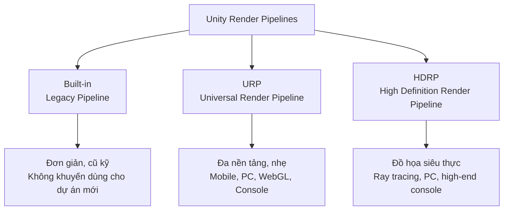
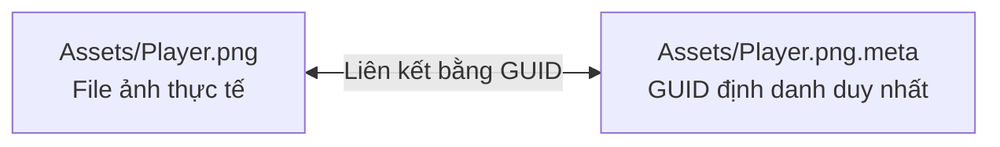

# Get Started (Khởi đầu với Unity 6.4)

> 📖 **Nguồn gốc:** Tài liệu được tổng hợp và biên soạn chọn lọc từ [Unity Manual — Get started](https://docs.unity3d.com/Manual/GettingStarted.html) dựa trên phiên bản **Unity 6.4 (LTS) ổn định**.

---

## 🎯 Ý định (Intent)

Tài liệu này hướng dẫn chi tiết quy trình chuẩn bị và khởi chạy dự án game đầu tiên bằng **Unity 6.4 (LTS)**. 

Thay vì chỉ mô tả các bước click chuột thông thường, chúng ta sẽ đi sâu vào bản chất thiết kế hệ thống của Unity: cách quản lý giấy phép (Licensing), cách lựa chọn Render Pipeline phù hợp ngay từ đầu, hiểu cấu trúc thư mục của một dự án Unity, và cách thiết lập hệ thống kiểm soát phiên bản (Git Version Control) chuẩn chỉnh để tránh lỗi mất mát tài nguyên về sau.

---

## 🔑 1. Unity Hub & Cơ chế Giấy phép (Licensing)

**Unity Hub** là ứng dụng độc lập đóng vai trò quản lý vòng đời của các phiên bản Editor, các dự án game, quản lý tài khoản và Asset Store.

### Vòng đời Giấy phép Unity 6:
Khi sử dụng Unity 6, chính sách cấp phép đã được thay đổi có lợi hơn cho nhà phát triển độc lập:
*   **Unity Personal:** Miễn phí hoàn toàn nếu doanh thu/vốn tài trợ của bạn dưới **$200,000 USD** trong 12 tháng gần nhất (phiên bản trước là $100,000 USD).
*   **Splash Screen:** Kể từ Unity 6, bạn có thể **tắt hoàn toàn logo "Made with Unity"** ở màn hình khởi động ngay trên giấy phép Personal miễn phí (điều mà trước đây bắt buộc phải mua bản Pro).

---

## ⚙️ 2. Cài đặt Unity Editor 6.4 chuẩn chỉnh

Khi cài đặt Unity 6.4 qua Unity Hub, bạn cần chọn các Module bổ trợ (Add modules) tùy theo nền tảng mục tiêu:

### Các Module khuyên dùng:
1.  **Dev Tools (Visual Studio):** Môi trường lập trình C#.
2.  **Platform Build Support:**
    *   **Windows Build Support (IL2CPP):** Để build game ra PC Windows sử dụng compiler IL2CPP (chuyển đổi code C# sang C++ để tối ưu hóa hiệu năng tối đa).
    *   **Android Build Support / iOS Build Support:** Nếu dự án hướng tới thiết bị di động (đi kèm OpenJDK, Android SDK & NDK tự động tích hợp).
    *   **WebGL Build Support:** Để build game chạy trực tiếp trên trình duyệt web.

---

## 🎨 3. Lựa chọn Template Dự án & Render Pipeline (Đường ống dựng hình)

Khi tạo dự án mới trong Unity 6.4, việc lựa chọn đúng **Render Pipeline** là quyết định quan trọng nhất vì nó ảnh hưởng đến toàn bộ Shaders, Materials và hiệu năng của game sau này.



### So sánh bản chất 3 Đường ống:
*   **Built-in Render Pipeline (Mặc định cũ):** Công nghệ render thế hệ trước của Unity. Dễ sử dụng cho người mới học nhưng không tối ưu, không hỗ trợ các tính năng shader hiện đại và đang dần bị Unity loại bỏ.
*   **URP (Universal Render Pipeline):** Đường ống dựng hình chuẩn cho Unity 6. Hỗ trợ mọi nền tảng từ di động cấu hình thấp đến PC tầm trung. Sử dụng cơ chế *Scriptable Render Pipeline (SRP)* giúp tối ưu hóa draw calls và tùy biến bộ lọc đồ họa dễ dàng qua **Shader Graph**.
*   **HDRP (High Definition Render Pipeline):** Dành riêng cho đồ họa AAA trên PC mạnh và Next-Gen Console. Sử dụng các kỹ thuật dựng hình vật lý thực tế (PBR), tính toán ánh sáng toàn cục thời gian thực, Ray-tracing và hiệu ứng khí quyển phức tạp.

---

## 📂 4. Bản chất Cấu trúc Thư mục Dự án Unity

Khi một dự án Unity được tạo ra, một loạt thư mục sẽ xuất hiện trên ổ cứng của bạn. Hiểu rõ chức năng của từng thư mục là bắt buộc để quản lý mã nguồn hiệu quả:

| Thư mục | Bản chất hoạt động | Có cần đưa lên Git/VCS? |
| :--- | :--- | :--- |
| **`Assets/`** | Chứa toàn bộ tài nguyên game: Code C#, Prefabs, Models, Audio, Scenes. Đây là **trái tim** của dự án. | **Bắt buộc (YES)** |
| **`ProjectSettings/`**| Lưu cấu hình hệ thống: Phân bổ phím Input, Vật lý, Cài đặt đồ họa, Tên game, Cấu hình build. | **Bắt buộc (YES)** |
| **`Packages/`** | Chứa tệp `manifest.json` định nghĩa các thư viện ngoài (Packages) dự án đang dùng. | **Bắt buộc (YES)** |
| **`Library/`** | Thư mục cache cục bộ của dự án. Unity tự động giải nén và chuyển đổi các tệp trong `Assets/` sang định dạng nhị phân nội bộ (internal binary format) của Engine tại đây. | **KHÔNG (NO)** - Tự sinh lại |
| **`Temp/`** | Chứa các file tạm thời khi Editor đang mở. | **KHÔNG (NO)** |
| **`Logs/`** | Nhật ký hoạt động của Editor. | **KHÔNG (NO)** |
| **`UserSettings/`** | Cấu hình giao diện làm việc cá nhân (bố cục cửa sổ, lịch sử mở file). | **KHÔNG (NO)** |

---

## 🐙 5. Thiết lập Hệ thống Kiểm soát Phiên bản (VCS/Git) chuẩn mực

Khi làm việc với Unity, nếu bạn không cấu hình Git đúng cách, bạn sẽ gặp lỗi xung đột dữ liệu liên tục và làm dung lượng kho chứa (Repository) phình to hàng chục GB do chứa các file rác của thư mục `Library`.

### Bước 1: Tạo tệp `.gitignore` chuẩn cho Unity 6.4
Đặt tệp `.gitignore` tại thư mục gốc của dự án để bỏ qua các thư mục tạm và cache:

```ini
# Bỏ qua các thư mục tạm và cache tự sinh của Unity
/[Ll]ibrary/
/[Tt]emp/
/[Oo]bj/
/[Build]/
/[Builds]/
/[Logs]/
/[UserSettings]/

# Bỏ qua các file giải pháp IDE tự sinh
/*.csproj
/*.unityproj
/*.sln
/*.suo
/*.tmp
/*.user
/*.userprefs
/*.pidb
/*.booproj
/*.svd
/*.targets

# Bỏ qua các asset tải về từ Asset Store (chỉ cần kéo lại bằng tài khoản)
/[Aa]ssets/AssetStoreTools*

# Bỏ qua file OS tự sinh
.DS_Store
Thumbs.db
```

### Bước 2: Bật tính năng Force Text Serialization (Bắt buộc)
Bản chất của các file Scene (`.unity`) và Prefab (`.prefab`) trong Unity thực chất là các file dữ liệu liên kết đối tượng.
*   **Vấn đề:** Nếu lưu dạng Binary (Nhị phân), Git sẽ không thể so sánh sự khác biệt (diff) giữa các phiên bản, dẫn đến việc mất trắng dữ liệu khi xảy ra xung đột merge.
*   **Giải pháp:** Trong Unity Editor, vào `Edit -> Project Settings -> Editor -> Asset Serialization -> Mode`, chọn **`Force Text`**. Thiết lập này ép Unity lưu toàn bộ Scene và Prefab dưới dạng văn bản cấu trúc **YAML**. Khi có xung đột, bạn có thể dễ dàng mở file bằng Notepad để giải quyết (resolve conflict).

### Bước 3: Cơ chế tệp `.meta` (Cực kỳ quan trọng)
Mỗi tệp tin bạn đưa vào thư mục `Assets/`, Unity sẽ tự động sinh ra một tệp tin đi kèm có đuôi `.meta` (Ví dụ: `PlayerController.cs` và `PlayerController.cs.meta`).



*   **Bản chất hoạt động:** File `.meta` chứa mã **GUID (Global Unique Identifier)**. Unity dùng mã này để theo dõi liên kết giữa các file. Ví dụ, nếu Scene A sử dụng Texture B, Unity sẽ lưu GUID của Texture B vào Scene A, chứ không lưu đường dẫn file.
*   **Nguy hiểm:** Nếu bạn xóa file `.meta` hoặc không đẩy nó lên Git, Unity sẽ mất dấu liên kết, dẫn đến lỗi **Missing Reference** (mất ảnh, mất chất liệu hiển thị màu hồng cánh sen) trên toàn bộ Project.
*   **Quy tắc vàng:** Luôn luôn commit cả file chính và file `.meta` đi kèm trong mỗi lần đẩy code lên Git!

---

> 📚 **Nguồn gốc:** Nội dung tham khảo từ [Unity Documentation](https://docs.unity3d.com/Manual/index.html) — Bản quyền của Unity Technologies.

| Hướng | Liên kết |
|-------|----------|
| ← Quay lại | [Tổng quan Unity Lộ trình](../../00-unity-overview.md) |
| → Tiếp theo | [Unity Editor Interface (Đang biên tập)](../../02-Editor-Interface/00-editor-interface-overview.md) |
