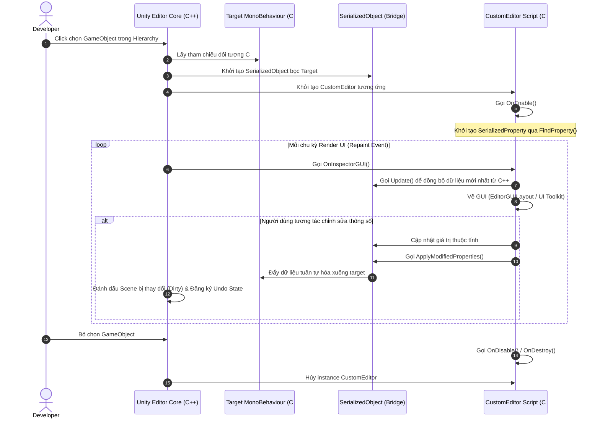

# Unity Editor Interface (Giao diện Unity Editor & Custom Inspector)

> 📖 **Nguồn gốc:** Tài liệu được tổng hợp từ [Unity Manual — Editor Interface](https://docs.unity3d.com/Manual/Editor-Interface.html) dựa trên phiên bản **Unity 6.4 (LTS) ổn định**.

---

## 🎯 Ý định (Intent)
Hiểu rõ bản chất hoạt động của giao diện Unity Editor, cơ chế serialize dữ liệu và cách mở rộng giao diện Inspector bằng việc viết mã nguồn C# Custom Editor tùy biến. Việc này giúp cải thiện hiệu suất làm việc của Designer/Artist và tối ưu hóa quy trình thiết kế màn chơi trực tiếp trong Editor.

---

## 🔑 Khái niệm Cốt lõi & Bản chất (Core Concepts & True Nature)

Giao diện Unity Editor được xây dựng trên một kiến trúc mở rộng mạnh mẽ. Hiểu sâu về cấu trúc này giúp ta tối ưu hóa đáng kể quy trình sản xuất game:

### 1. Năm Cửa sổ Cốt lõi & Bản chất Hoạt động:
*   **Hierarchy Window:** Biểu diễn sơ đồ cây phân cấp của toàn bộ các đối tượng (`GameObject`) trong Scene hiện hành. Mỗi đối tượng ở đây tương ứng với một pointer C++ ở phần core engine.
*   **Scene View:** Cửa sổ đồ họa 3D/2D cho phép nhà phát triển tương tác trực tiếp với không gian game. Đây là nơi thực hiện các phép biến đổi Transform (Position, Rotation, Scale).
*   **Game View:** Cửa sổ render hình ảnh từ Camera của trò chơi. Đây là kết quả thực tế mà người chơi sẽ thấy khi game chạy (Runtime).
*   **Project Window:** Trình quản lý tệp tin vật lý trên ổ cứng của thư mục `Assets`. Nó đồng bộ trực tiếp với hệ điều hành và quản lý tài nguyên qua các file `.meta`.
*   **Inspector Window:** Cửa sổ hiển thị chi tiết các thuộc tính và Component của `GameObject` đang được chọn.

### 2. Ranh giới C++ và C# (C++/C# Boundary) & Cơ chế Serialization:
Unity Engine có phần lõi (Core) viết bằng **C++**, trong khi script của lập trình viên viết bằng **C#**. Khi bạn làm việc trên Editor:
*   Dữ liệu của các Component thực tế nằm dưới vùng nhớ C++.
*   Để hiển thị lên Inspector, Unity thực hiện quá trình **Serialization** (Tuần tự hóa) để chuyển đổi cấu trúc dữ liệu C++ thành định dạng C# trung gian.
*   Lớp `SerializedObject` và `SerializedProperty` là cầu nối API giúp C# truy cập trực tiếp vào vùng nhớ tuần tự hóa này của C++.
*   **Quy tắc vàng khi viết Custom Editor:** Luôn luôn thao tác thông qua `SerializedProperty` thay vì sửa biến trực tiếp trên đối tượng (Direct Target Reference). Việc sử dụng `SerializedProperty` giúp Unity tự động quản lý tính năng **Undo/Redo**, hỗ trợ chỉnh sửa nhiều đối tượng cùng lúc (Multi-object editing) và tự động đánh dấu Scene bị thay đổi (Dirty state) để nhắc người dùng lưu file.

### 3. Cơ chế Extensibility (Mở rộng Editor):
Unity cung cấp hai hệ thống chính để mở rộng giao diện:
1.  **IMGUI (Immediate Mode GUI):** Hệ thống vẽ giao diện truyền thống bằng code chạy liên tục mỗi frame trong Editor thông qua hàm `OnInspectorGUI()` hoặc `OnGUI()`. Dễ viết nhanh nhưng tốn tài nguyên do vẽ lại liên tục.
2.  **UI Toolkit (Hệ thống mới):** Dựa trên XML (UXML) và CSS (USS) giống như phát triển Web. Hoạt động theo cơ chế Retained Mode (chỉ vẽ lại khi có thay đổi), tiết kiệm tài nguyên và dễ dàng thiết kế giao diện phức tạp, đẹp mắt hơn.

---

## 🎨 Cấu trúc & Vòng đời (Structure & Lifecycle)

Sơ đồ dưới đây biểu diễn vòng đời của một Custom Inspector Editor khi lập trình viên chọn một đối tượng (Selection Change) trong Unity Editor:



---

## 💻 Mã nguồn C# Scripting API (C# Example)

Dưới đây là một ví dụ thực tế hoàn chỉnh chứa một Component lưu trữ thuộc tính của người chơi (`PlayerStats`) và một Custom Editor (`PlayerStatsEditor`) đi kèm để hiển thị nút "Reset Stats to Default" trong Inspector một cách trực quan, hỗ trợ đầy đủ cơ chế Undo/Redo chuẩn của Unity 6.

Lưu ý: Mã nguồn được cấu trúc sạch sẽ, Editor script được gom trong chỉ thị tiền xử lý `#if UNITY_EDITOR` để có thể đặt chung file hoặc biên dịch độc lập mà không gây lỗi khi Build game.

```csharp
using UnityEngine;

#if UNITY_EDITOR
using UnityEditor;
#endif

namespace UnityManual.EditorInterface
{
    /// <summary>
    /// Component quản lý thông số cơ bản của người chơi.
    /// </summary>
    [AddComponentMenu("Unity Manual/Player Stats")]
    public class PlayerStats : MonoBehaviour
    {
        [Header("General Info")]
        [SerializeField] private string playerName = "New Hero";
        [SerializeField] [Range(1, 100)] private int level = 1;

        [Header("Attributes")]
        [SerializeField] private int maxHealth = 100;
        [SerializeField] private int currentHealth = 100;
        [SerializeField] private float speed = 5.5f;

        // Các thuộc tính Public để Custom Editor có thể log hoặc tương tác an toàn
        public string PlayerName => playerName;
        public int Level => level;

        /// <summary>
        /// Reset các thông số về giá trị mặc định của hệ thống.
        /// </summary>
        public void ResetToDefault()
        {
            playerName = "Default Hero";
            level = 1;
            maxHealth = 100;
            currentHealth = 100;
            speed = 5.0f;
            
            Debug.Log($"[PlayerStats] Đã khôi phục các chỉ số của {gameObject.name} về mặc định!");
        }
    }

#if UNITY_EDITOR
    /// <summary>
    /// Custom Inspector dành riêng cho component PlayerStats.
    /// Tự động cập nhật giao diện trực quan và thêm tính năng hỗ trợ Designer.
    /// </summary>
    [CustomEditor(typeof(PlayerStats))]
    [CanEditMultipleObjects] // Cho phép chỉnh sửa hàng loạt đối tượng cùng lúc
    public class PlayerStatsEditor : Editor
    {
        private SerializedProperty playerNameProp;
        private SerializedProperty levelProp;
        private SerializedProperty maxHealthProp;
        private SerializedProperty currentHealthProp;
        private SerializedProperty speedProp;

        private void OnEnable()
        {
            // Liên kết các SerializedProperty với các trường dữ liệu private của class đích thông qua tên biến
            // Cách làm này giúp bảo toàn tính năng Undo/Redo và Prefab Overrides của Unity
            playerNameProp = serializedObject.FindProperty("playerName");
            levelProp = serializedObject.FindProperty("level");
            maxHealthProp = serializedObject.FindProperty("maxHealth");
            currentHealthProp = serializedObject.FindProperty("currentHealth");
            speedProp = serializedObject.FindProperty("speed");
        }

        public override void OnInspectorGUI()
        {
            // 1. Cập nhật dữ liệu từ đối tượng C++ thực tế lên đối tượng tuần tự hóa C#
            serializedObject.Update();

            // 2. Vẽ các trường mặc định được khai báo tự động
            // Bạn có thể dùng DrawDefaultInspector(); nếu muốn vẽ toàn bộ tự động nhanh chóng.
            // Ở đây ta vẽ thủ công để tùy biến layout gọn gàng hơn:
            
            EditorGUILayout.LabelField("THÔNG TIN NHÂN VẬT", EditorStyles.boldLabel);
            EditorGUILayout.PropertyField(playerNameProp);
            EditorGUILayout.PropertyField(levelProp);

            EditorGUILayout.Space(5);
            EditorGUILayout.LabelField("CHỈ SỐ SINH TỒN", EditorStyles.boldLabel);
            EditorGUILayout.PropertyField(maxHealthProp);
            EditorGUILayout.PropertyField(currentHealthProp);
            EditorGUILayout.PropertyField(speedProp);

            // Kiểm tra logic nghiệp vụ hiển thị cảnh báo trực tiếp trên Inspector
            if (currentHealthProp.intValue > maxHealthProp.intValue)
            {
                EditorGUILayout.HelpBox("Cảnh báo: Lượng máu hiện tại đang lớn hơn lượng máu tối đa!", MessageType.Warning);
            }

            EditorGUILayout.Space(15);

            // 3. Thiết lập nút bấm Reset tùy biến
            // Đặt màu nền nút nổi bật (Sử dụng hệ màu modern dịu mắt)
            GUI.backgroundColor = new Color(0.25f, 0.72f, 0.45f); 
            
            if (GUILayout.Button("Reset Player Stats to Default", GUILayout.Height(35)))
            {
                // Thực hiện ghi nhận trạng thái Undo trước khi thay đổi dữ liệu
                Undo.RecordObjects(targets, "Reset Player Stats Values");

                // Duyệt qua tất cả các đối tượng đang được chọn (Hỗ trợ Multi-object editing)
                foreach (var singleTarget in targets)
                {
                    PlayerStats playerStats = (PlayerStats)singleTarget;
                    if (playerStats != null)
                    {
                        playerStats.ResetToDefault();
                        
                        // Đánh dấu đối tượng bị thay đổi để Editor thực hiện lưu (Dirty state)
                        EditorUtility.SetDirty(playerStats);
                    }
                }
            }
            
            // Khôi phục lại màu mặc định của GUI tránh ảnh hưởng đến các thành phần vẽ sau
            GUI.backgroundColor = Color.white;

            // 4. Áp dụng toàn bộ thay đổi từ SerializedProperty xuống cấu trúc C++ thực tế
            serializedObject.ApplyModifiedProperties();
        }
    }
#endif
}
```

---

## ⚙️ Các bước thực hiện & Lưu ý thực chiến (Best Practices)

1.  **Phân vùng mã nguồn Editor rõ ràng:**
    *   Mọi script kế thừa từ lớp `Editor`, `EditorWindow`, hoặc sử dụng namespace `UnityEditor` phải được đặt trong thư mục có tên là `Editor` (Ví dụ: `Assets/Scripts/Editor/...`).
    *   Nếu không đặt trong thư mục `Editor`, bạn buộc phải bao bọc toàn bộ code Editor bằng chỉ thị tiền xử lý `#if UNITY_EDITOR` và kết thúc bằng `#endif`. Nếu vi phạm, Unity sẽ báo lỗi biên dịch khi bạn thực hiện build game ra các nền tảng chạy độc lập (như Android, PC, WebGL).
2.  **Tuyệt đối tuân thủ cơ chế SerializedProperty:**
    *   Tránh chỉnh sửa biến trực tiếp kiểu `((PlayerStats)target).speed = 10f;` trong Custom Inspector.
    *   Sử dụng `serializedObject.FindProperty` và gán giá trị qua các thuộc tính của nó như `property.floatValue = 10f`. Điều này đảm bảo tính toàn vẹn dữ liệu cho hệ thống Prefab Overrides (hiển thị chữ đậm khi thay đổi trị số trên Prefab Variant) và cho phép người dùng nhấn Ctrl+Z để hoàn tác.
3.  **Tối ưu hiệu năng vẽ giao diện:**
    *   Hàm `OnInspectorGUI()` được gọi liên tục mỗi khi chuột di chuyển hoặc có thay đổi trên Editor.
    *   Tránh thực hiện các tác vụ nặng như tìm kiếm file `Resources.Load()`, gọi hàm `GetComponent()`, hoặc khởi tạo quá nhiều rác bộ nhớ (GC Allocations) bên trong hàm này.
4.  **Tận dụng Custom Decorator Attributes:**
    *   Trước khi viết Custom Editor phức tạp, hãy thử sử dụng các thuộc tính có sẵn của Unity như `[Header]`, `[Space]`, `[Tooltip]`, `[Range]`, `[SerializeField]`, `[Multiline]` để định hình giao diện Inspector nhanh chóng và sạch sẽ mà không tốn công viết code GUI.

---

> 📚 **Nguồn gốc:** Nội dung tham khảo từ [Unity Documentation](https://docs.unity3d.com/Manual/index.html) — Bản quyền của Unity Technologies.

| Hướng | Liên kết |
|-------|----------|
| ← Quay lại | [Khởi đầu với Unity 6.4](../01-Get-Started/00-get-started-overview.md) |
| → Tiếp theo | [Packages & Assembly Definitions (Quản lý Gói & Phân vùng Code)](../03-Packages-Management/00-packages-management-overview.md) |
