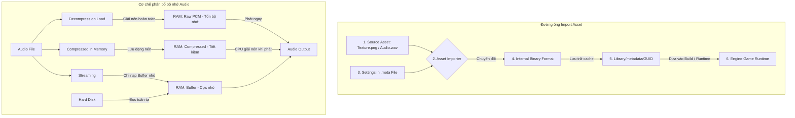

# Assets & Import Pipeline (Quản lý Tài nguyên & Đường ống Nhập khẩu)

> 📖 **Nguồn gốc:** Tài liệu được tổng hợp từ [Unity Manual — Asset Workflow](https://docs.unity3d.com/Manual/AssetWorkflow.html) dựa trên phiên bản **Unity 6.4 (LTS) ổn định**.

---

## 🎯 Ý định (Intent)
Hiểu sâu cơ chế hoạt động của đường ống nhập khẩu tài nguyên (Asset Import Pipeline v2) trong Unity. Làm chủ các giải thuật nén ảnh (Texture Compression), cơ chế nén Crunch, và phân biệt bản chất các chế độ tải âm thanh (Audio Loading Modes) trong bộ nhớ RAM. Cung cấp mã nguồn tự động hóa thiết lập import tài nguyên bằng lớp `AssetPostprocessor` nhằm tránh sai sót thủ công của đội ngũ thiết kế mỹ thuật.

---

## 🔑 Khái niệm Cốt lõi & Bản chất (Core Concepts & True Nature)

### 1. Bản chất của Asset Import Pipeline (V2):
*   Khi bạn kéo một tệp tin nguồn (như `.png`, `.wav`, `.fbx`, `.psd`) vào thư mục `Assets`, Unity **không bao giờ** sử dụng trực tiếp tệp tin đó ở Runtime.
*   Thay vào đó, **Asset Importer** sẽ đọc tệp nguồn, dựa vào cấu hình cấu hình trong file `.meta` tương ứng, và biên dịch (Compile) nó thành một định dạng nhị phân tối ưu cho phần cứng mục tiêu (ví dụ: chuyển đổi `.png` thành định dạng nén GPU thô, chuyển `.fbx` thành lưới đa giác tối ưu và animation clip).
*   Kết quả biên dịch được lưu trữ duy nhất trong thư mục bộ nhớ cache cục bộ **`Library/metadata/`** định danh bằng mã GUID của file. Khi chạy game, Unity chỉ đọc file nhị phân này từ `Library`.

### 2. Định dạng nén Texture & Cơ chế Crunch Compression:
*   **ASTC (Adaptive Scalable Texture Compression):** Chuẩn nén hiện đại dành cho Mobile (Android/iOS). Nó cho phép tùy chỉnh chất lượng linh hoạt qua kích thước block (từ 4x4 đến 12x12) giúp cân bằng hoàn hảo giữa dung lượng và độ sắc nét.
*   **BC7 (Block Compression 7):** Định dạng nén chất lượng cao tiêu chuẩn cho PC/Console (DirectX/Vulkan), hỗ trợ kênh Alpha tốt hơn và giảm thiểu tối đa hiện tượng vỡ khối hạt (color banding).
*   **Crunch Compression (Bản chất và cạm bẫy):**
    *   *Bản chất:* Crunch là giải thuật nén mất dữ liệu (lossy) xếp chồng lên trên các định dạng nén GPU tiêu chuẩn như DXT (PC) hay ETC (Mobile).
    *   *Ưu điểm:* Nó nén dung lượng file vật lý trên đĩa cứng vô cùng nhỏ, cực kỳ có lợi cho việc giảm dung lượng file cài đặt (`.apk`, `.ipa`) và giảm thời gian tải gói AssetBundles qua mạng.
    *   *Nhược điểm:* **Không tiết kiệm bộ nhớ VRAM của GPU!** Khi game tải Texture vào bộ nhớ, CPU buộc phải giải nén (Decompress) định dạng Crunch ngược về định dạng DXT hoặc ETC gốc để đưa lên VRAM. Do đó, lạm dụng Crunch sẽ tăng thời gian tải cảnh (Load Scene) và gây nghẽn CPU tạm thời.

### 3. Phân biệt Bản chất 3 Chế độ Tải Âm thanh (Audio Loading Modes):
Việc chọn sai chế độ tải âm thanh có thể làm tràn bộ nhớ RAM hoặc gây giật hình (Stuttering) khi phát tiếng:

| Chế độ tải | Bản chất hoạt động | Ưu điểm (RAM) | Nhược điểm (CPU/Disk) | Trường hợp sử dụng chuẩn |
| :--- | :--- | :--- | :--- | :--- |
| **Decompress on Load** | Âm thanh được nén ở đĩa cứng. Khi load game, Unity giải nén hoàn toàn thành dữ liệu PCM thô không nén trong RAM. | Phát ngay lập tức, không tốn CPU để giải nén lại ở Runtime. | Chiếm cực kỳ nhiều dung lượng bộ nhớ RAM. | Các âm thanh ngắn, tần suất cao (UI Click, tiếng bước chân, tiếng súng). |
| **Compressed in Memory** | Âm thanh được lưu trữ dưới dạng nén (Vorbis/MP3) ngay trong RAM. Khi gọi phát, CPU thực hiện giải nén trực tiếp trên luồng phát. | Tiết kiệm RAM đáng kể so với Decompress on Load. | Tốn một phần hiệu năng CPU để giải nén Runtime khi phát âm thanh. | Các hiệu ứng âm thanh tầm trung, độ dài vừa phải (tiếng quái vật gầm, tiếng phép thuật). |
| **Streaming** | Âm thanh không được tải vào RAM. Unity sử dụng một buffer nhỏ, đọc dữ liệu trực tiếp từ ổ cứng theo thời gian thực khi đang phát. | Hầu như không chiếm dụng bộ nhớ RAM của thiết bị. | Gây tải cho ổ cứng (Disk I/O) và độ trễ phát cao. Có thể bị trễ nếu ổ cứng chậm. | Nhạc nền (BGM), nhạc môi trường (Ambient) hoặc các đoạn hội thoại dài. |

---

## 🎨 Cấu trúc & Vòng đời (Structure & Lifecycle)

Sơ đồ mô tả quy trình tiếp nhận và xử lý một Asset của Unity Import Pipeline và cơ chế phân phối tải âm thanh trong bộ nhớ hệ thống:



---

## 💻 Mã nguồn C# Scripting API (C# Example)

Dưới đây là một Script Editor hoàn chỉnh sử dụng lớp `AssetPostprocessor` kế thừa từ Unity. Lớp này sẽ tự động can thiệp vào quá trình Import tệp ảnh (Texture) để thiết lập thông số chuẩn hóa dựa theo thư mục chứa file:
*   Nếu tệp ảnh nằm trong thư mục `/UI/` -> Tự động chuyển thành định dạng Sprite, tắt tạo Mipmaps, bật Alpha Transparency.
*   Nếu tệp ảnh nằm trong thư mục `/Textures/` -> Giữ định dạng Default, bật Mipmaps. Nếu tên file có hậu tố `_normal` hoặc `_n` -> Tự động chuyển loại Texture thành Normal Map.

```csharp
#if UNITY_EDITOR
using UnityEditor;
using UnityEngine;

namespace UnityManual.AssetsMedia
{
    /// <summary>
    /// Bộ xử lý tự động cấu hình Texture khi được Import vào dự án Unity.
    /// Giúp đồng bộ hóa cài đặt đồ họa tự động mà không cần Designer cấu hình thủ công.
    /// </summary>
    public class TextureImporterPostprocessor : AssetPostprocessor
    {
        /// <summary>
        /// Hàm hook tự động chạy TRƯỚC KHI Unity thực hiện Import và nén tệp ảnh.
        /// cho phép chỉnh sửa cấu hình của TextureImporter.
        /// </summary>
        private void OnPreprocessTexture()
        {
            // Lấy đối tượng Importer quản lý tệp tin đang xử lý
            TextureImporter textureImporter = (TextureImporter)assetImporter;
            
            // Lấy đường dẫn tương đối của file chuyển về dạng chữ thường để dễ so sánh
            string lowerPath = assetPath.ToLower();

            // 1. Quy tắc xử lý giao diện UI (nằm trong thư mục /ui/)
            if (lowerPath.Contains("/ui/"))
            {
                ConfigureUITexture(textureImporter);
            }
            // 2. Quy tắc xử lý Texture cho mô hình 3D (nằm trong thư mục /textures/)
            else if (lowerPath.Contains("/textures/"))
            {
                ConfigureModelTexture(textureImporter, lowerPath);
            }
        }

        /// <summary>
        /// Cấu hình tối ưu cho ảnh giao diện người dùng (UI)
        /// </summary>
        private void ConfigureUITexture(TextureImporter importer)
        {
            // Thiết lập loại texture là Sprite (2D and UI)
            importer.textureType = TextureImporterType.Sprite;
            importer.spriteImportMode = SpriteImportMode.Single;

            // UI không cần Mipmaps vì kích thước vẽ thường cố định hoặc co giãn dạng Vector.
            // Tắt Mipmaps giúp tiết kiệm 33% VRAM của ảnh và tránh lỗi mờ giao diện.
            importer.mipmapEnabled = false;

            // Bật xử lý kênh alpha trong suốt cho giao diện
            importer.alphaIsTransparency = true;

            // Cấu hình chất lượng nén chất lượng cao cho UI tránh bị răng cưa
            TextureImporterPlatformSettings defaultSettings = importer.GetDefaultPlatformTextureSettings();
            defaultSettings.textureCompression = TextureImporterCompression.CompressedHQ;
            defaultSettings.resizeAlgorithm = TextureResizeAlgorithm.Mitchell;
            
            importer.SetPlatformTextureSettings(defaultSettings);
            
            Debug.Log($"[Postprocessor] Đã tự động cấu hình UI Sprite cho: {assetPath}");
        }

        /// <summary>
        /// Cấu hình tối ưu cho Texture bề mặt 3D
        /// </summary>
        private void ConfigureModelTexture(TextureImporter importer, string path)
        {
            // Bật Mipmaps để GPU tự động hiển thị texture nhỏ hơn khi vật thể ở xa (tránh răng cưa răng cưa - Aliasing)
            importer.mipmapEnabled = true;
            importer.mipmapFilter = TextureImporterMipFilter.BoxFilter;

            // Phát hiện Normal Map thông qua quy ước đặt tên file (Suffix)
            if (path.Contains("_normal") || path.Contains("_n"))
            {
                importer.textureType = TextureImporterType.NormalMap;
                importer.convertToNormalMap = false; // Không tự sinh map từ ảnh xám (dự kiến ảnh đã là normal map chuẩn)
                Debug.Log($"[Postprocessor] Đã tự động cấu hình Normal Map cho: {assetPath}");
            }
            else
            {
                importer.textureType = TextureImporterType.Default;
            }

            // Tùy biến nén mặc định chất lượng trung bình/cao để tối ưu VRAM
            TextureImporterPlatformSettings defaultSettings = importer.GetDefaultPlatformTextureSettings();
            defaultSettings.textureCompression = TextureImporterCompression.Compressed;
            
            // Ví dụ cấu hình cho nền tảng cụ thể (Android sử dụng định dạng ASTC làm chuẩn)
            TextureImporterPlatformSettings androidSettings = new TextureImporterPlatformSettings
            {
                name = "Android",
                overridden = true,
                format = TextureImporterFormat.ASTC_6x6, // Tỉ lệ block 6x6 cân bằng dung lượng và chất lượng tốt
                textureCompression = TextureImporterCompression.Compressed
            };
            
            importer.SetPlatformTextureSettings(defaultSettings);
            importer.SetPlatformTextureSettings(androidSettings);
        }
    }
}
#endif
```

---

## ⚙️ Các bước thực hiện & Lưu ý thực chiến (Best Practices)

1.  **Luôn tắt "Generate Mip Maps" cho Sprite/UI:**
    *   Mipmaps là cơ chế tạo ra các bản thu nhỏ của ảnh để tối ưu render từ xa. Giao diện 2D/UI luôn được hiển thị song song trực tiếp với Camera, không có khoảng cách xa gần 3D.
    *   Do đó, bật Mipmaps cho UI vừa làm tốn thêm 33% dung lượng VRAM vô ích, vừa khiến ảnh UI bị nhòe mờ khi co giãn trên các độ phân giải màn hình khác nhau.
2.  **Ứng dụng "Audio Load Mode" chuẩn xác:**
    *   **Nhạc nền (BGM):** Luôn chọn `Streaming` kết hợp định dạng nén `Vorbis` (chất lượng khoảng 70% là đủ nghe).
    *   **Tiếng súng, Tiếng Click nút bấm:** Luôn chọn `Decompress on Load` kết hợp định dạng `ADPCM` (cho mobile) hoặc `PCM` không nén để đảm bảo phát ngay lập tức không bị trễ khung hình.
3.  **Thận trọng với Crunch Compression:**
    *   Chỉ nên dùng nén Crunch cho các Texture cảnh vật không đòi hỏi độ chi tiết quá sắc nét hoặc các asset phân phối dạng tải thêm qua Internet.
    *   Không được dùng Crunch cho Normal Map vì thuật toán nén mất dữ liệu này sẽ làm biến dạng các vector pháp tuyến, gây ra lỗi hiển thị ánh sáng kỳ dị (artifacts) trên bề mặt vật thể.
4.  **Tự động hóa bằng quy ước đặt tên (Naming Conventions):**
    *   Thống nhất quy ước đặt tên trong đội ngũ thiết kế đồ họa (ví dụ: `*_albedo.png` cho màu, `*_normal.png` cho pháp tuyến, `*_metallic.png` cho độ kim loại).
    *   Nhờ đó, mã nguồn `AssetPostprocessor` có thể quét tên file và tự động cấu hình chính xác 100%, loại bỏ hoàn toàn sai sót của con người.

---

> 📚 **Nguồn gốc:** Nội dung tham khảo từ [Unity Documentation](https://docs.unity3d.com/Manual/index.html) — Bản quyền của Unity Technologies.

| Hướng | Liên kết |
|-------|----------|
| ← Quay lại | [Packages & Assembly Definitions (Quản lý Gói & Phân vùng Code)](../03-Packages-Management/00-packages-management-overview.md) |
| → Tiếp theo | [2D Game Development (Phát triển Game 2D trong Unity)](../05-2D-Game-Dev/00-2d-game-dev-overview.md) |
