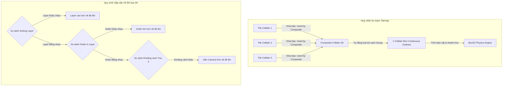

# 2D Game Development (Phát triển Game 2D trong Unity)

> 📖 **Nguồn gốc:** Tài liệu được tổng hợp từ [Unity Manual — 2D Game Development](https://docs.unity3d.com/Manual/2D.html) dựa trên phiên bản **Unity 6.4 (LTS) ổn định**.

---

## 🎯 Ý định (Intent)
Làm chủ các công cụ và cơ chế cốt lõi phục vụ phát triển game 2D trong Unity. Hiểu rõ bản chất hoạt động của Sprite Renderer, Sprite Atlas tối ưu hiệu năng render, hệ thống thiết lập thứ tự vẽ (Sorting Layers), kỹ thuật dựng bản đồ Tilemap/Grid, và phân biệt bản chất vật lý 2D (Box2D) so với 3D (PhysX). Hướng dẫn viết mã nguồn điều khiển nhân vật di chuyển vật lý 2D chuẩn mực.

---

## 🔑 Khái niệm Cốt lõi & Bản chất (Core Concepts & True Nature)

### 1. Sprite Renderer & Sprite Atlas (Tối ưu hóa Draw Calls):
*   **Sprite Renderer:** Component chịu trách nhiệm vẽ các hình ảnh 2D lên màn hình thông qua một lưới đa giác phẳng 2D (Quad).
*   **Vấn đề thắt nút cổ chai Draw Calls:** Nếu mỗi nhân vật, quái vật hay vật phẩm sử dụng một file ảnh riêng biệt, GPU sẽ phải thực hiện đổi Texture liên tục cho mỗi Sprite được vẽ. Quá trình đổi trạng thái (Texture binding) này vô cùng tốn tài nguyên và tăng lượng **Draw Calls** (yêu cầu vẽ từ CPU gửi tới GPU).
*   **Giải pháp với Sprite Atlas:** Sprite Atlas là công cụ gom nhiều file ảnh riêng lẻ thành một tấm ảnh lớn (Texture Sheet). Tại runtime, Unity chỉ cần nạp tấm ảnh lớn này lên GPU một lần duy nhất. Nhờ vậy, các Sprite Renderer sử dụng các Sprite trong Atlas có thể được gộp lại để vẽ chung trong một lần duy nhất (Dynamic Batching), giảm Draw Calls xuống mức tối thiểu và tăng vọt FPS.

### 2. Tilemap, Grid & Composite Collider 2D (Chống lỗi kẹt khe gạch):
*   **Tilemap & Grid:** Cho phép thiết kế màn chơi dạng ô lưới (grid) hiệu năng cao. Hệ thống quản lý toàn bộ các ô gạch thông qua một Renderer duy nhất thay vì sinh ra hàng ngàn GameObject riêng lẻ.
*   **Lỗi kẹt khe gạch (Friction Bumps):** Nếu bạn thêm `BoxCollider2D` hoặc `TilemapCollider2D` mặc định cho từng ô gạch, hệ thống vật lý sẽ tính toán va chạm cho từng ô độc lập. Khi nhân vật trượt trên mặt đất, các góc va chạm nhỏ giữa các ô gạch liền kề sẽ gây ra hiện tượng nhân vật bị "vấp" hoặc kẹt lại dù mặt đất trông hoàn toàn phẳng.
*   **Giải pháp với Composite Collider 2D:** Bằng cách thêm Component `Composite Collider 2D` vào Tilemap và tích hợp nó với `Tilemap Collider 2D` (chọn *Used by Composite*), Unity sẽ tự động tối ưu hóa, loại bỏ các cạnh va chạm nằm bên trong và hợp nhất tất cả các ô va chạm liền kề thành một đường biên duy nhất (Outlines). Điều này vừa giúp giảm tải tính toán cho CPU vừa giải quyết triệt để lỗi kẹt khe gạch.

### 3. Quy trình sắp xếp lớp vẽ (Sorting Order):
Vẽ đồ họa 2D trong Unity áp dụng **Thuật toán của thợ sơn (Painter's Algorithm)**: vẽ các đối tượng từ xa nhất trước, sau đó vẽ đè các đối tượng ở gần lên trên. Thứ tự quyết định đối tượng nào được vẽ đè lên tuân thủ nghiêm ngặt theo trình tự ưu tiên sau:
1.  **Sorting Layer:** Lớp sắp xếp (ví dụ: Background, Default, Foreground).
2.  **Order in Layer:** Chỉ số sắp xếp trong lớp (số càng lớn càng vẽ đè lên trên).
3.  **Distance to Camera:** Khoảng cách từ đối tượng tới Camera (Trục Z đối với hệ 2D Orthographic).
*   *Lưu ý:* `Sorting Group` là component đặc biệt dùng để gom nhóm một cụm các Sprite Renderer con (ví dụ: các bộ phận của một nhân vật) và sắp xếp chúng như một đối tượng duy nhất, tránh việc các bộ phận của nhân vật A bị xen kẽ giữa các bộ phận của nhân vật B khi đứng chồng lên nhau.

### 4. Bản chất Vật lý 2D vs Vật lý 3D:
*   **Hai Engine độc lập:** Vật lý 2D của Unity sử dụng thư viện mã nguồn mở **Box2D** của C++, trong khi vật lý 3D sử dụng **NVIDIA PhysX**.
*   **Không tương tác:** Các component vật lý 2D (`Rigidbody2D`, `Collider2D`) và 3D (`Rigidbody`, `Collider`) hoàn toàn không nhận biết được nhau và không thể xảy ra va chạm.
*   **Tối ưu hiệu năng:** Vật lý 2D chỉ tính toán trên hệ tọa độ 2 trục (X, Y) và giới hạn góc xoay duy nhất quanh trục Z. Phép toán ma trận đơn giản hơn rất nhiều so với không gian 3 chiều của PhysX giúp game 2D chạy mượt mà trên cả các thiết bị di động cấu hình rất thấp.

---

## 🎨 Cấu trúc & Vòng đời (Structure & Lifecycle)

Sơ đồ mô tả cơ chế gộp các Collider riêng lẻ của Tilemap thành một Collider hợp nhất thông qua Composite Collider 2D, cùng với trình tự quyết định vẽ đè của GPU:



---

## 💻 Mã nguồn C# Scripting API (C# Example)

Dưới đây là mã nguồn C# hoàn chỉnh điều khiển nhân vật di chuyển 2D (`PlayerController2D`) bằng vật lý. 
*   Sử dụng `Rigidbody2D` để di chuyển theo chiều ngang và thực hiện nhảy.
*   Tự động lật (Flip) hình ảnh hiển thị của `SpriteRenderer` dựa theo hướng di chuyển.
*   Thu thập dữ liệu đầu vào trong hàm `Update()` để tránh mất phản hồi phím (Input Lag/Loss), đồng thời tính toán vật lý trong hàm `FixedUpdate()` để đồng bộ với chu kỳ vật lý của Engine.

```csharp
using UnityEngine;

namespace UnityManual.TwoDGameDev
{
    /// <summary>
    /// Component điều khiển nhân vật di chuyển 2D dựa trên vật lý Rigidbody2D.
    /// Đảm bảo tính toán chính xác, mượt mà và hỗ trợ tính năng Flip Sprite.
    /// </summary>
    [RequireComponent(typeof(Rigidbody2D))]
    [RequireComponent(typeof(SpriteRenderer))]
    public class PlayerController2D : MonoBehaviour
    {
        [Header("Movement Settings")]
        [SerializeField] private float moveSpeed = 8f;
        [SerializeField] private float jumpForce = 12f;

        [Header("Ground Check Settings")]
        [SerializeField] private Transform groundCheckPoint;
        [SerializeField] private float groundCheckRadius = 0.2f;
        [SerializeField] private LayerMask groundLayer;

        // Các component nội bộ
        private Rigidbody2D rb2d;
        private SpriteRenderer spriteRenderer;

        // Các biến trạng thái di chuyển
        private float horizontalInput;
        private bool isGrounded;
        private bool shouldJump;

        private void Awake()
        {
            // Lấy tham chiếu đến các Component gắn cùng GameObject khi khởi chạy
            rb2d = GetComponent<Rigidbody2D>();
            spriteRenderer = GetComponent<SpriteRenderer>();
        }

        private void Update()
        {
            // 1. Thu thập input của người chơi trong Update (chạy mỗi Frame) để đảm bảo không bị mất nút bấm
            horizontalInput = Input.GetAxisRaw("Horizontal");

            // Kiểm tra nút Nhảy (Mặc định Space bar)
            if (Input.GetButtonDown("Jump") && isGrounded)
            {
                shouldJump = true;
            }

            // 2. Thực hiện lật (Flip) Sprite dựa trên hướng di chuyển của người chơi
            HandleSpriteFlipping();
        }

        private void FixedUpdate()
        {
            // 3. Thực hiện kiểm tra va chạm mặt đất và di chuyển vật lý trong FixedUpdate (chu kỳ vật lý cố định)
            CheckGround();
            Move();

            if (shouldJump)
            {
                Jump();
            }
        }

        /// <summary>
        /// Thực hiện quét vùng vật lý tròn để kiểm tra nhân vật đang đứng trên mặt đất hay không.
        /// </summary>
        private void CheckGround()
        {
            if (groundCheckPoint != null)
            {
                // Sử dụng Physics2D OverlapCircle để quét va chạm
                isGrounded = Physics2D.OverlapCircle(groundCheckPoint.position, groundCheckRadius, groundLayer);
            }
            else
            {
                isGrounded = false;
            }
        }

        /// <summary>
        /// Thay đổi vận tốc Rigidbody2D theo trục X để di chuyển nhân vật.
        /// </summary>
        private void Move()
        {
            // Chỉ thay đổi vận tốc trục X, giữ nguyên vận tốc trục Y (rơi tự do, nhảy)
            rb2d.velocity = new Vector2(horizontalInput * moveSpeed, rb2d.velocity.y);
        }

        /// <summary>
        /// Thực hiện tác dụng lực tức thời hướng lên để nhân vật nhảy.
        /// </summary>
        private void Jump()
        {
            // Thay đổi trực tiếp vận tốc trục Y thay vì dùng AddForce để đảm bảo nhảy có cảm giác phản hồi tức thì
            rb2d.velocity = new Vector2(rb2d.velocity.x, jumpForce);
            
            // Đánh dấu đã thực hiện nhảy xong
            shouldJump = false;
        }

        /// <summary>
        /// Lật SpriteRenderer dựa theo vận tốc di chuyển.
        /// </summary>
        private void HandleSpriteFlipping()
        {
            if (horizontalInput > 0.1f)
            {
                spriteRenderer.flipX = false; // Nhìn sang phải
            }
            else if (horizontalInput < -0.1f)
            {
                spriteRenderer.flipX = true;  // Nhìn sang trái
            }
        }

        /// <summary>
        /// Vẽ vòng tròn kiểm tra va chạm đất trên cửa sổ Scene để hỗ trợ Debug.
        /// </summary>
        private void OnDrawGizmosSelected()
        {
            if (groundCheckPoint != null)
            {
                Gizmos.color = Color.green;
                Gizmos.DrawWireSphere(groundCheckPoint.position, groundCheckRadius);
            }
        }
    }
}
```

---

## ⚙️ Các bước thực hiện & Lưu ý thực chiến (Best Practices)

1.  **Luôn đóng gói Sprite bằng Sprite Atlas:**
    *   Tạo Sprite Atlas trong thư mục dự án, kéo thả thư mục chứa Sprites vào danh sách đối tượng đóng gói của Atlas.
    *   Trước khi build, Unity sẽ tự động gộp chúng thành các bảng ảnh lớn. Hãy kiểm tra tab Preview trong Sprite Atlas để chắc chắn các ảnh không bị lãng phí khoảng trống.
2.  **Ứng dụng Composite Collider 2D cho địa hình:**
    *   Khi làm việc với Tilemap địa hình, hãy luôn đính kèm `Composite Collider 2D` cùng với `Tilemap Collider 2D`.
    *   Đặt kiểu `Body Type` của `Rigidbody2D` đi kèm thành **`Static`** để địa hình không bị rơi do trọng lực.
    *   Thiết lập thuộc tính `Geometry Type` của Composite thành **`Outlines`** để tối ưu hóa hiệu năng vật lý tốt nhất.
3.  **Tách biệt logic đọc Input và tính toán Vật lý:**
    *   Hàm `Input.GetButtonDown` trả về true chỉ duy nhất một khung hình (Frame). Nếu đặt hàm này trong `FixedUpdate`, do tần suất chạy của FixedUpdate không đồng bộ với Update, bạn sẽ thường xuyên gặp lỗi "nhấn nút nhảy nhưng nhân vật không nhảy".
    *   Quy tắc vàng: **Đọc Input trong `Update` - Thực thi lực vật lý trong `FixedUpdate`**.
4.  **Sử dụng Continuous Collision Detection cho vật thể nhanh:**
    *   Nếu nhân vật 2D hoặc đạn bay di chuyển với tốc độ quá lớn, chế độ phát hiện va chạm mặc định `Discrete` có thể dẫn đến lỗi xuyên tường (Tunneling Effect).
    *   Hãy chuyển thiết lập `Collision Detection` của `Rigidbody2D` từ **`Discrete`** sang **`Continuous`** để bật tính năng quét tia (Sweep Test) tránh xuyên thấu.

---

> 📚 **Nguồn gốc:** Nội dung tham khảo từ [Unity Documentation](https://docs.unity3d.com/Manual/index.html) — Bản quyền của Unity Technologies.

| Hướng | Liên kết |
|-------|----------|
| ← Quay lại | [Assets & Import Pipeline (Quản lý Tài nguyên & Đường ống Nhập khẩu)](../04-Assets-Media/00-assets-media-overview.md) |
| → Tiếp theo | [Artificial Intelligence (AI) & Navigation (Trí tuệ Nhân tạo & Hệ thống Điều hướng NavMesh)](../06-AI/00-ai-overview.md) |
