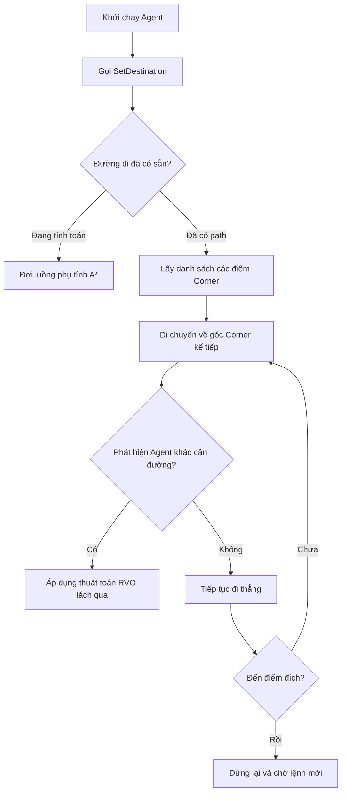

# Artificial Intelligence & Navigation (Trí tuệ Nhân tạo & Hệ thống Điều hướng NavMesh)

> 📖 **Nguồn gốc:** Tài liệu được tổng hợp từ [Unity Manual — Navigation and Pathfinding](https://docs.unity3d.com/Manual/Navigation.html) dựa trên phiên bản **Unity 6.4 (LTS) ổn định**.

---

## 🎯 Ý định (Intent)
Làm chủ hệ thống định tuyến đường đi (Pathfinding) và điều hướng (Navigation) của Unity thông qua NavMesh. Hiểu rõ cơ chế hoạt động của NavMeshAgent, cách thức tối ưu hóa NavMeshObstacle có đục lỗ (Carving) tránh nghẽn CPU, và ứng dụng Off-Mesh Link kết nối các vùng địa hình đứt gãy. Hướng dẫn viết mã nguồn C# điều khiển AI tuần tra (Patrol) và đuổi theo người chơi (Chase) tối ưu hiệu năng.

---

## 🔑 Khái niệm Cốt lõi & Bản chất (Core Concepts & True Nature)

### 1. Bản chất hoạt động của NavMesh:
*   Dưới lớp vỏ C#, hệ thống định tuyến của Unity tích hợp thư viện C++ mã nguồn mở nổi tiếng **Recast & Detour**.
*   **NavMesh (Navigation Mesh):** Là một cấu trúc dữ liệu lưới đa giác phẳng đại diện cho các bề mặt mà nhân vật có thể di chuyển được trong thế giới game. Quá trình sinh lưới này gọi là **Baking** (thực hiện trước khi build hoặc sinh thời gian thực bằng gói AI Navigation Package của Unity 6).
*   Công thức định tuyến sử dụng thuật toán tìm kiếm đường đi tối ưu **A* (A-Star)** chạy trên lưới đa giác đã Bake.

### 2. NavMeshAgent & Cơ chế tránh va chạm cục bộ (Local Avoidance):
*   **NavMeshAgent** chịu trách nhiệm điều khiển thực thể di chuyển men theo đường đi đã được tính toán.
*   Khi di chuyển, Agent không chỉ đi đường thẳng mà còn áp dụng thuật toán **RVO (Reciprocal Velocity Obstacles)** để tự động tránh né các Agent khác mà không cần thông qua hệ thống vật lý Rigidbody.
*   *Lưu ý hiệu năng:* Việc tính toán đường đi mới (Path Calculation) rất tốn tài nguyên CPU. Nếu dự án có hàng trăm Agent đồng loạt cập nhật đường đi liên tục ở mỗi Frame sẽ gây ra hiện tượng sụt giảm FPS cực kỳ nghiêm trọng.

### 3. Phân biệt NavMeshObstacle Có Carving vs Không Carving:
`NavMeshObstacle` dùng để gắn vào các đối tượng động cản đường Agent (như thùng gỗ, rào chắn):

```
       [NavMeshObstacle: Không Carving]                [NavMeshObstacle: Có Carving]
              
            Agent sử dụng Local                        Cắt một lỗ thủng vật lý trực 
            Avoidance để lách qua.                      tiếp lên cấu trúc NavMesh.
            Phù hợp vật thể di động.                    Phù hợp vật thể tĩnh lại.
```

*   **Không Carving (Mặc định):** Agent sẽ phát hiện chướng ngại vật bằng thuật toán tránh va chạm cục bộ và tự đi vòng qua. Cách này nhẹ cho CPU, phù hợp cho các vật cản di động liên tục (như chiếc xe đang chạy).
*   **Có Carving (Đục lỗ):** Khi vật cản dừng lại, nó sẽ **đục một lỗ vật lý** trực tiếp lên tấm lưới NavMesh. Lúc này, NavMesh bị thay đổi hình học tại vùng đó, ép buộc tất cả các Agent phải tính toán lại đường đi tổng thể (Global Path).
*   *Cạm bẫy hiệu năng:* Quá trình đục lỗ (Carving) bắt buộc Unity phải tính toán lại hình học một phần của NavMesh. Nếu một vật thể vừa di chuyển vừa bật Carving liên tục, CPU sẽ bị nghẽn do phải Bake lại NavMesh Runtime mỗi frame.

### 4. Off-Mesh Link (Liên kết ngoài lưới):
*   NavMesh mặc định chỉ sinh ra trên các bề mặt phẳng có độ dốc giới hạn.
*   Để Agent có thể thực hiện các hành động phi vật lý như: nhảy qua một vực sâu, leo lên một chiếc thang đứng, hoặc đi qua cổng dịch chuyển (Teleport), ta dùng **Off-Mesh Link**.
*   Lớp này định nghĩa điểm đầu và điểm cuối. Khi Agent di chuyển đến điểm đầu, nó tạm ngưng điều hướng bình thường và di chuyển chuyển tiếp (Interpolate) sang điểm cuối theo quỹ đạo thiết lập.

---

## 🎨 Cấu trúc & Vòng đời (Structure & Lifecycle)

Sơ đồ mô tả quy trình ra quyết định định tuyến và vòng lặp cập nhật đường đi của một NavMeshAgent:



---

## 💻 Mã nguồn C# Scripting API (C# Example)

Dưới đây là mã nguồn C# hoàn chỉnh viết lớp trí tuệ nhân tạo tuần tra và đuổi bắt người chơi (`EnemyAI`).
*   Sử dụng lớp `NavMeshAgent` để thiết lập đường đi.
*   **Tối ưu hóa hiệu năng cực kỳ quan trọng:** Không gọi hàm thiết lập đích `SetDestination` ở mỗi Frame trong hàm `Update()`. Thay vào đó, thiết lập một bộ đệm thời gian (`pathUpdateInterval`) để chỉ tính toán lại đường đi sau mỗi khoảng 0.5 giây.
*   Hỗ trợ chế độ Debug trực quan bằng cách vẽ bán kính phát hiện và tấn công trực tiếp lên Scene.

```csharp
using System.Collections.Generic;
using UnityEngine;
using UnityEngine.AI;

namespace UnityManual.AI
{
    /// <summary>
    /// Lớp điều khiển AI Tuần tra giữa các Waypoint và đuổi theo Player khi phát hiện.
    /// Thiết kế tối ưu hóa tần suất gọi tính toán đường đi của NavMesh.
    /// </summary>
    [RequireComponent(typeof(NavMeshAgent))]
    public class EnemyAI : MonoBehaviour
    {
        public enum AIState
        {
            Patrolling,
            Chasing,
            Attacking
        }

        [Header("AI State")]
        [SerializeField] private AIState currentState = AIState.Patrolling;

        [Header("Patrol Settings")]
        [SerializeField] private List<Transform> patrolWaypoints;
        [SerializeField] private float patrolSpeed = 3.5f;
        [SerializeField] private float waypointTolerance = 1.0f;

        [Header("Chase Settings")]
        [SerializeField] private Transform playerTarget;
        [SerializeField] private float chaseSpeed = 5.5f;
        [SerializeField] private float detectionRange = 10.0f;
        [SerializeField] private float attackRange = 2.0f;

        [Header("Optimization Settings")]
        [Tooltip("Khoảng thời gian tối thiểu giữa các lần cập nhật Path tìm đường đi (giây)")]
        [SerializeField] private float pathUpdateInterval = 0.5f;

        private NavMeshAgent agent;
        private int currentWaypointIndex = 0;
        private float lastPathUpdateTime;

        private void Awake()
        {
            agent = GetComponent<NavMeshAgent>();
        }

        private void Start()
        {
            // Thiết lập tốc độ ban đầu và đi tới điểm tuần tra đầu tiên
            agent.speed = patrolSpeed;
            lastPathUpdateTime = Random.Range(0f, pathUpdateInterval); // Phân tán thời gian khởi động tránh nghẽn CPU loạt AI cùng lúc
            
            if (patrolWaypoints != null && patrolWaypoints.Count > 0)
            {
                SetDestinationToWaypoint();
            }
        }

        private void Update()
        {
            // Tối ưu hóa hiệu năng: Chỉ đánh giá trạng thái và tính lại đường đi theo chu kỳ cố định
            if (Time.time - lastPathUpdateTime > pathUpdateInterval)
            {
                lastPathUpdateTime = Time.time;
                EvaluateState();
            }

            // Thực thi hành vi di chuyển tương ứng mỗi khung hình
            ExecuteStateBehavior();
        }

        /// <summary>
        /// Phân tích khoảng cách tới Player để chuyển đổi trạng thái FSM (Finite State Machine).
        /// </summary>
        private void EvaluateState()
        {
            if (playerTarget == null)
            {
                currentState = AIState.Patrolling;
                return;
            }

            float distanceToPlayer = Vector3.Distance(transform.position, playerTarget.position);

            if (distanceToPlayer <= attackRange)
            {
                currentState = AIState.Attacking;
            }
            else if (distanceToPlayer <= detectionRange)
            {
                currentState = AIState.Chasing;
            }
            else
            {
                currentState = AIState.Patrolling;
            }
        }

        /// <summary>
        /// Thực thi các lệnh di chuyển hoặc tấn công dựa trên trạng thái hiện tại.
        /// </summary>
        private void ExecuteStateBehavior()
        {
            switch (currentState)
            {
                case AIState.Patrolling:
                    HandlePatrol();
                    break;
                case AIState.Chasing:
                    HandleChase();
                    break;
                case AIState.Attacking:
                    HandleAttack();
                    break;
            }
        }

        /// <summary>
        /// Xử lý logic tuần tra qua các điểm Waypoint.
        /// </summary>
        private void HandlePatrol()
        {
            agent.speed = patrolSpeed;

            if (patrolWaypoints == null || patrolWaypoints.Count == 0) return;

            // Kiểm tra xem đã đến gần waypoint hiện tại chưa
            // pathPending đảm bảo đường đi đã tính xong trước khi đọc remainingDistance
            if (!agent.pathPending && agent.remainingDistance <= waypointTolerance)
            {
                // Chuyển sang Waypoint tiếp theo trong danh sách vòng tròn
                currentWaypointIndex = (currentWaypointIndex + 1) % patrolWaypoints.Count;
                SetDestinationToWaypoint();
            }
        }

        /// <summary>
        /// Thiết lập đích đến cho Agent là Waypoint hiện tại.
        /// </summary>
        private void SetDestinationToWaypoint()
        {
            Transform targetWaypoint = patrolWaypoints[currentWaypointIndex];
            if (targetWaypoint != null)
            {
                agent.SetDestination(targetWaypoint.position);
            }
        }

        /// <summary>
        /// Đuổi bám theo mục tiêu Player.
        /// </summary>
        private void HandleChase()
        {
            agent.speed = chaseSpeed;
            
            if (playerTarget != null)
            {
                // Gọi SetDestination đuổi theo mục tiêu
                agent.SetDestination(playerTarget.position);
            }
        }

        /// <summary>
        /// Trạng thái tấn công: Dừng di chuyển và quay mặt về phía Player.
        /// </summary>
        private void HandleAttack()
        {
            // Dừng việc di chuyển trên NavMeshAgent
            agent.ResetPath();

            if (playerTarget != null)
            {
                // Quay mặt về phía Player một cách mượt mà
                Vector3 direction = (playerTarget.position - transform.position).normalized;
                direction.y = 0; // Khóa trục Y tránh nghiêng người quái vật
                
                if (direction != Vector3.zero)
                {
                    Quaternion targetRotation = Quaternion.LookRotation(direction);
                    transform.rotation = Quaternion.Slerp(transform.rotation, targetRotation, Time.deltaTime * 8f);
                }
            }

            // Ghi chú: Thực hiện kích hoạt logic gây sát thương tại đây (Ví dụ: trigger animation đánh)
        }

        /// <summary>
        /// Vẽ các vòng tròn trực quan thể hiện tầm hoạt động của AI trên Scene Editor.
        /// </summary>
        private void OnDrawGizmosSelected()
        {
            // Màu vàng biểu thị tầm phát hiện Player
            Gizmos.color = Color.yellow;
            Gizmos.DrawWireSphere(transform.position, detectionRange);

            // Màu đỏ biểu thị tầm tấn công
            Gizmos.color = Color.red;
            Gizmos.DrawWireSphere(transform.position, attackRange);
        }
    }
}
```

---

## ⚙️ Các bước thực hiện & Lưu ý thực chiến (Best Practices)

1.  **Tuyệt đối tránh gọi SetDestination mỗi frame:**
    *   Hàm `SetDestination()` ép buộc engine phải thực hiện giải thuật A* tìm kiếm đường đi qua lưới đa giác phức tạp. Gọi hàm này trong `Update()` cho nhiều AI sẽ lập tức phá nát hiệu năng CPU (CPU bottleneck).
    *   Hãy sử dụng khoảng cập nhật thời gian (ví dụ: chỉ cập nhật đích sau mỗi 0.2s - 0.5s) hoặc dùng Coroutine để tối ưu.

2.  **Sử dụng Carving đúng cách cho Obstacle:**
    *   Đối với các chướng ngại vật có thể di chuyển (như chiếc xe đẩy, hòm gỗ có thể đẩy), hãy bật thuộc tính `Carve` của `NavMeshObstacle`.
    *   Tuy nhiên, hãy thiết lập **`Carve Only Stationary`** (Chỉ đục lỗ khi đứng yên). Khi đối tượng bị đẩy đi, nó sẽ tạm thời tắt cơ chế đục lỗ và chuyển sang tránh né cục bộ để tránh ép Unity Bake lại NavMesh liên tục. Khi dừng di chuyển quá một khoảng thời gian thiết lập (Time To Stationary), nó mới đục lỗ cố định trở lại.

3.  **Tách biệt Rotation điều khiển bởi Animators:**
    *   Nếu nhân vật sử dụng Root Motion (tức là chuyển động di chuyển và xoay do hoạt ảnh Animation quyết định thay vì code vật lý), hãy tắt tự động cập nhật vị trí hoặc xoay của agent bằng cách gán `agent.updatePosition = false;` hoặc `agent.updateRotation = false;`.
    *   Sau đó, lấy vận tốc mong muốn của Agent bằng `agent.desiredVelocity` để truyền vào tham số Animator giúp hoạt ảnh bước chân khớp hoàn hảo với tốc độ di chuyển trên lưới, loại bỏ lỗi trượt chân trên mặt đất (foot sliding).

4.  **Tối ưu hóa các Agent lân cận qua NavMesh Priority:**
    *   Khi nhiều Agent dồn vào một lối đi hẹp, chúng có thể chen lấn nhau gây giật cục.
    *   Hãy tinh chỉnh thông số **`Avoidance Priority`** (Mức độ ưu tiên tránh né) từ 0 đến 99. Gán chỉ số ưu tiên cao hơn cho các thủ lĩnh quái vật hoặc các nhân vật quan trọng để các quái vật nhỏ hơn chủ động nhường đường đi trước.

---

> 📚 **Nguồn gốc:** Nội dung tham khảo từ [Unity Documentation](https://docs.unity3d.com/Manual/index.html) — Bản quyền của Unity Technologies.

| Hướng | Liên kết |
|-------|----------|
| ← Quay lại | [2D Game Development (Phát triển Game 2D trong Unity)](../05-2D-Game-Dev/00-2d-game-dev-overview.md) |
| → Tiếp theo | [XR Development (Hiện thực hóa Thực tế ảo & Thực tế tăng cường)](../07-XR/00-xr-overview.md) |
