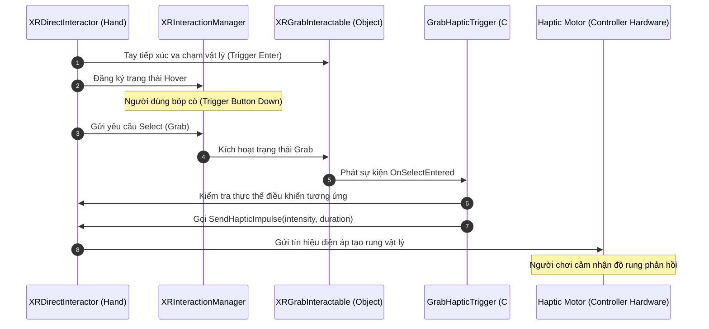

# XR Development (Hiện thực hóa Thực tế ảo & Thực tế tăng cường)

> 📖 **Nguồn gốc:** Tài liệu được tổng hợp từ [Unity Manual — XR](https://docs.unity3d.com/Manual/XR.html) và [XR Interaction Toolkit](https://docs.unity3d.com/Packages/com.unity.xr.interaction.toolkit@latest/index.html) dựa trên phiên bản **Unity 6.4 (LTS) ổn định**.

---

## 🎯 Ý định (Intent)
Tìm hiểu kiến trúc phát triển ứng dụng Thực tế ảo (VR) và Thực tế tăng cường (AR) trong Unity sử dụng chuẩn OpenXR, AR Foundation và bộ công cụ XR Interaction Toolkit (XRI). Nắm vững vai trò cấu trúc của XR Origin, cơ chế tương tác thông qua cặp đối tượng Interactor - Interactable, và kỹ thuật kích hoạt phản hồi xúc giác (Haptics) của tay cầm điều khiển khi cầm nắm vật thể.

---

## 🔑 Khái niệm Cốt lõi & Bản chất (Core Concepts & True Nature)

### 1. Chuẩn OpenXR & Bộ khung AR Foundation:
*   **OpenXR:** Là tiêu chuẩn mở xuyên nền tảng được quản lý bởi Khronos Group. Unity tích hợp OpenXR để cho phép bạn viết code một lần và triển khai lên mọi phần cứng XR thương mại như Meta Quest, HTC Vive, Valve Index, PlayStation VR2 hay Apple Vision Pro.
*   **AR Foundation:** Là một lớp trừu tượng (Abstraction Layer) do Unity xây dựng. Nó đóng vai trò dịch các tập lệnh Unity thành các API tương ứng của **ARCore** (Android) hoặc **ARKit** (iOS).
    *   `AR Session`: Quản lý toàn bộ vòng đời của một trải nghiệm AR (bật tắt camera, khởi động/dừng hệ thống theo dõi).
    *   `AR Session Origin` (Đã được hợp nhất vào `XR Origin` từ phiên bản mới): Đồng bộ hóa tọa độ thế giới thực được quét bởi camera điện thoại với thế giới ảo trong Unity.

### 2. Cấu trúc và Bản chất của XR Origin:
`XR Origin` là điểm neo trung tâm của bất kỳ dự án VR/AR nào. Nó đại diện cho vị trí vật lý của người chơi ngoài đời thực trong không gian ảo Unity:

```
[XR Origin (GameObject)]
   ├── [Camera Offset (GameObject)]
   │      ├── [Main Camera (VR Headset Display)]
   │      ├── [Left Hand Controller (GameObject & Interactor)]
   │      └── [Right Hand Controller (GameObject & Interactor)]
```

*   **Camera Offset:** Đóng vai trò cân chỉnh chiều cao. Đối với các thiết bị VR theo dõi từ mặt đất (Floor-level tracking), Camera Offset tự động nâng Camera ảo lên bằng chiều cao thực tế ngoài đời của người chơi.
*   **Trình chuyển đổi tọa độ:** Khi người chơi quay đầu hoặc di chuyển tay ngoài đời thực, phần cứng sẽ gửi dữ liệu tọa độ không gian (6 DoF). Unity nhận thông tin này và cập nhật Transform của Main Camera và Hand Controllers tương ứng bên trong Camera Offset.

### 3. XR Interaction Toolkit (XRI) - Interactor vs Interactable:
XRI chia hành vi tương tác làm ba nhóm chính quản lý bởi `XR Interaction Manager`:
*   **Interactor (Đối tượng tác động):** Gắn trên các tay cầm của người chơi để thực hiện hành động (như `XRDirectInteractor` để cầm nắm trực tiếp, `XRRayInteractor` để bắn tia chỉ định từ xa, hoặc `XRPokeInteractor` để ấn nút bấm ảo).
*   **Interactable (Đối tượng chịu tác động):** Gắn trên các vật thể trong môi trường để nhận tương tác (như `XRGrabInteractable` để cho phép cầm nắm ném, `XRSimpleInteractable` để nhận sự kiện hover/click).
*   **Interaction Manager:** Đóng vai trò "trọng tài" điều phối toàn bộ sự kiện hover (rê chuột lên), select (chọn/nắm), và activate (kích hoạt) giữa Interactors và Interactables.

### 4. Tối ưu hiệu năng XR - Bản chất của Single Pass Instanced Rendering:
*   Game XR bắt buộc phải render hai khung hình riêng biệt (cho mắt trái và mắt phải) với góc lệch nhẹ để tạo hiệu ứng 3D lập thể (Stereoscopic).
*   **Multi Pass Rendering (Cũ & Chậm):** Unity duyệt qua toàn bộ Scene vẽ lại hai lần. Việc này làm tăng gấp đôi số lượng Draw Calls và nhân đôi gánh nặng xử lý CPU.
*   **Single Pass Instanced Rendering (Chuẩn tối ưu):** Unity gửi lệnh vẽ duy nhất một lần tới GPU. GPU sẽ sử dụng tính năng phần cứng **Hardware Instancing** để nhân bản hình học đó ra cho mắt thứ hai, đồng thời ghi vào một mảng texture đôi (Array Texture). Cơ chế này giúp giảm 50% lượng Draw Calls từ CPU, là thiết lập sống còn để game VR đạt mức FPS mục tiêu cực cao (90Hz - 120Hz) trên các thiết bị kính VR di động (như Meta Quest) vốn có CPU yếu.

---

## 🎨 Cấu trúc & Vòng đời (Structure & Lifecycle)

Sơ đồ mô tả quy trình tiếp nhận sự kiện va chạm và kích hoạt rung tay cầm (Haptics) khi người chơi thực hiện thao tác cầm nắm (Grab):



---

## 💻 Mã nguồn C# Scripting API (C# Example)

Dưới đây là mã nguồn C# hoàn chỉnh (`GrabHapticTrigger`) được gắn vào một vật thể có thể cầm nắm (`XRGrabInteractable`).
*   Lắng nghe sự kiện `selectEntered` của XRI để biết khi nào vật thể được nhặt lên.
*   Xác định chính xác tay cầm nào (trái hay phải) đang thực hiện việc cầm nắm thông qua tham số sự kiện.
*   Gửi lệnh phản hồi xung lực rung vật lý (`SendHapticImpulse`) tới motor rung của tay cầm đó để tạo cảm giác xúc giác chân thực cho người chơi.

```csharp
using UnityEngine;
using UnityEngine.XR.Interaction.Toolkit;

namespace UnityManual.XR
{
    /// <summary>
    /// Component tự động kích hoạt phản hồi rung xúc giác (Haptics) trên tay cầm
    /// khi đối tượng XRGrabInteractable được người chơi nhặt lên.
    /// </summary>
    [RequireComponent(typeof(XRGrabInteractable))]
    public class GrabHapticTrigger : MonoBehaviour
    {
        [Header("Haptic Settings")]
        [Tooltip("Cường độ rung của tay cầm (Từ 0.0 đến 1.0)")]
        [SerializeField] [Range(0f, 1f)] private float hapticIntensity = 0.5f;

        [Tooltip("Thời gian rung của tay cầm tính bằng giây")]
        [SerializeField] private float hapticDuration = 0.15f;

        private XRGrabInteractable grabInteractable;

        private void Awake()
        {
            // Lấy tham chiếu đến component XRGrabInteractable gắn cùng đối tượng
            grabInteractable = GetComponent<XRGrabInteractable>();
        }

        private void OnEnable()
        {
            // Đăng ký lắng nghe sự kiện khi vật thể bắt đầu được chọn/cầm nắm (Select Entered)
            grabInteractable.selectEntered.AddListener(OnObjectGrabbed);
        }

        private void OnDisable()
        {
            // Hủy đăng ký sự kiện khi Component bị tắt để tránh lỗi rò rỉ bộ nhớ (Memory Leak)
            grabInteractable.selectEntered.RemoveListener(OnObjectGrabbed);
        }

        /// <summary>
        /// Callback được gọi tự động bởi XRI khi vật thể này được nhặt lên.
        /// </summary>
        /// <param name="args">Thông tin chi tiết về sự kiện tương tác</param>
        private void OnObjectGrabbed(SelectEnterEventArgs args)
        {
            // Lấy tham chiếu tới Interactor thực hiện hành động nắm giữ
            IXRSelectInteractor interactor = args.interactorObject;

            // Kiểm tra xem Interactor này có phải là kiểu Base Controller Interactor hay không
            // (vì chỉ các interactor gắn với tay cầm vật lý mới hỗ trợ haptics)
            if (interactor is XRBaseControllerInteractor controllerInteractor)
            {
                // Gọi hàm kích hoạt rung tay cầm điều khiển
                TriggerControllerHaptics(controllerInteractor.xrController);
            }
        }

        /// <summary>
        /// Kích hoạt motor rung trên thiết bị điều khiển tương ứng.
        /// </summary>
        private void TriggerControllerHaptics(XRBaseController controller)
        {
            if (controller != null)
            {
                // SendHapticImpulse gửi tín hiệu rung tới phần cứng
                // intensity: Cường độ rung
                // duration: Thời gian kéo dài (giây)
                controller.SendHapticImpulse(hapticIntensity, hapticDuration);
                
                Debug.Log($"[XR Haptics] Đã gửi tín hiệu rung tới tay cầm: {controller.gameObject.name} | Cường độ: {hapticIntensity}");
            }
        }
    }
}
```

---

## ⚙️ Các bước thực hiện & Lưu ý thực chiến (Best Practices)

1.  **Luôn bật Single Pass Instanced Rendering:**
    *   Vào `Project Settings -> XR Plug-in Management -> OpenXR` (hoặc nền tảng tương ứng).
    *   Thiết lập **`Play Mode XR Rendering Mode`** và **`Stereo Rendering Mode`** thành **`Single Pass Instanced`**. Đây là tối ưu hóa cấu hình đồ họa quan quan trọng nhất cho mọi dự án VR.

2.  **Ứng dụng mô hình Action-Based Input thay vì Device-Based:**
    *   Tránh đọc trực tiếp nút bấm vật lý như `Input.GetKey(KeyCode.JoystickButton0)`.
    *   Sử dụng hệ thống **Input System mới** kết hợp với **Action-Based Controller** của XRI. Lập trình viên định nghĩa các Action như "Grab", "Use", "Teleport" và liên kết các phím bấm thông qua file cấu hình Input Actions. Điều này giúp code độc lập hoàn toàn với thiết bị phần cứng cụ thể.

3.  **Tối ưu hóa va chạm vật lý cho vật thể cầm nắm:**
    *   Khi người chơi cầm nắm một vật thể ảo và di chuyển tay va vào tường ảo, nếu không xử lý tốt, vật thể sẽ đi xuyên qua tường hoặc giật nảy liên tục.
    *   Hãy cấu hình thông số **`Movement Type`** trong `XRGrabInteractable`:
        *   **Instantaneous:** Di chuyển vật thể lập tức theo tay (nhẹ nhất, nhưng xuyên tường).
        *   **Kinematic:** Di chuyển bằng vận tốc Kinematic (hạn chế xuyên tường).
        *   **Velocity Tracking:** Di chuyển vật thể bằng cách tính toán và áp dụng lực vật lý kéo vật thể theo tay (chống xuyên tường tốt nhất, tương tác vật lý thật nhất, phù hợp vũ khí cận chiến).

4.  **Kiểm soát số lượng Draw Calls cực kỳ nghiêm ngặt:**
    *   Các kính VR độc lập (như Quest 2/3) có chip xử lý di động giới hạn. Để đạt được 72/90 FPS ổn định tránh gây buồn nôn cho người chơi, hãy giới hạn số lượng Draw Calls dưới **100 - 150** và số lượng lưới đa giác (Triangles) dưới **100,000 - 200,000** hiển thị trên khung hình. Sử dụng kỹ thuật Static/Dynamic Batching và tối giản hóa Shaders.

---

> 📚 **Nguồn gốc:** Nội dung tham khảo từ [Unity Documentation](https://docs.unity3d.com/Manual/index.html) — Bản quyền của Unity Technologies.

| Hướng | Liên kết |
|-------|----------|
| ← Quay lại | [Artificial Intelligence (AI) & Navigation (Trí tuệ Nhân tạo & Hệ thống Điều hướng NavMesh)](../06-AI/00-ai-overview.md) |
| → Tiếp theo | [Multiplayer & Networking (Lập trình Game Nhiều người chơi với Netcode)](../08-Multiplayer/00-multiplayer-overview.md) |
