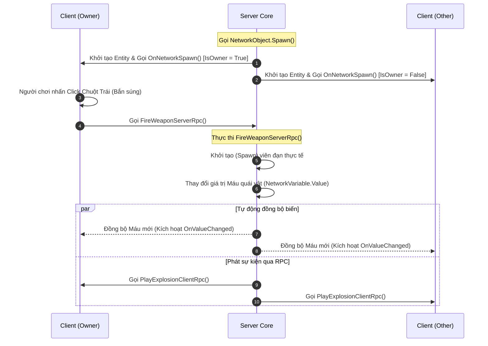

# Multiplayer & Networking (Lập trình Game Nhiều người chơi với Netcode)

> 📖 **Nguồn gốc:** Tài liệu được tổng hợp từ [Unity Manual — Multiplayer](https://docs.unity3d.com/Manual/multiplayer.html) và [Netcode for GameObjects Documentation](https://docs.unity3d.com/Packages/com.unity.netcode.gameobjects@latest/index.html) dựa trên phiên bản **Unity 6.4 (LTS) ổn định**.

---

## 🎯 Ý định (Intent)
Làm chủ kiến trúc lập trình game nhiều người chơi (Multiplayer) trong Unity thông qua thư viện chính chủ **Netcode for GameObjects (NGO)**. Hiểu rõ bản chất hoạt động của NetworkManager, cơ chế đồng bộ hóa trạng thái qua NetworkVariable, cách điều hướng dòng chảy dữ liệu sự kiện qua RPCs (ServerRpc/ClientRpc), phân biệt cơ chế thẩm quyền (Server Authority vs Client Authority), và viết mã nguồn hoàn chỉnh đồng bộ di chuyển, máu, bắn đạn vật lý.

---

## 🔑 Khái niệm Cốt lõi & Bản chất (Core Concepts & True Nature)

### 1. Vai trò của NetworkManager & NetworkObject:
*   **NetworkManager:** Là trái tim của toàn bộ hệ thống mạng. Nó quản lý vòng đời kết nối, bắt tay mạng (Handshake), cấu hình giao thức truyền tải (như **Unity Transport Package - UTP**), quản lý danh sách Client kết nối, và đăng ký các Prefabs đồng bộ mạng (Network Prefabs).
*   **NetworkObject:** Mọi GameObject muốn xuất hiện và đồng bộ qua mạng bắt buộc phải đính kèm component này. Nó cấp một mã định danh mạng duy nhất (**NetworkObjectId**) giúp Server và toàn bộ Client biết họ đang thao tác trên cùng một thực thể giống nhau trong trò chơi.

### 2. Bản chất Đồng bộ hóa Trạng thái qua NetworkVariable:
*   **Đồng bộ dựa trên trạng thái (State-based Sync):** `NetworkVariable` dùng để đồng bộ các thông số liên tục thay đổi theo thời gian (như Máu, Vàng, Cấp độ).
*   **Bản chất hoạt động:** Nó chỉ gửi gói tin khi giá trị thực sự thay đổi (Delta-compression) và tự động đồng bộ giá trị mới nhất cho các Client mới kết nối (Late-joiners).
*   **Ủy quyền Server (Server-Authoritative):** Mặc định, chỉ có Server mới có quyền thay đổi giá trị của `NetworkVariable` (`WritePermission = Server`). Client chỉ có quyền đọc giá trị để cập nhật UI cục bộ. Mọi nỗ lực ghi đè giá trị từ phía Client sẽ lập tức sinh ngoại lệ Runtime để chống gian lận (Hack/Cheat).

### 3. Phân biệt Bản chất của RPCs (Remote Procedure Calls):
RPC là cơ chế đồng bộ dựa trên sự kiện (Event-based Sync). Nó được dùng để gửi các sự kiện xảy ra tức thời (như gõ Chat, kích hoạt hiệu ứng nổ, bắn súng):

```
┌──────────────────────────────────────┐                   ┌──────────────────────────────────────┐
│            CLIENT (Owner)            │                   │                SERVER                │
└──────────────────┬───────────────────┘                   └──────────────────┬───────────────────┘
                   │                                                          │
                   │ ─── 1. Client gọi FireWeaponServerRpc() ────────────────> │
                   │                                                          │ (Thực thi logic trên Server)
                   │                                                          │ (Spawn đạn, trừ đạn, kiểm tra)
                   │                                                          │
                   │ <── 2. Server gọi PlayMuzzleFlashClientRpc() ────────────│
                   │                                                          │
     (Thực thi hiệu ứng trên Client)                                          │
```

*   **ServerRpc (Client gọi, Server thực thi):**
    *   Client gửi một yêu cầu hành động lên Server.
    *   Hàm được thực thi hoàn toàn trên Server.
    *   Mặc định yêu cầu Client gọi phải có quyền sở hữu đối tượng (`RequireOwnership = true`).
*   **ClientRpc (Server gọi, tất cả Client thực thi):**
    *   Server phát một thông điệp sự kiện tới tất cả các Client đang kết nối.
    *   Hàm được thực thi song song trên máy của tất cả Client.
    *   Thường dùng cho các hiệu ứng hình ảnh/âm thanh mà không ảnh hưởng trực tiếp đến chỉ số Gameplay cốt lõi.

### 4. Cơ chế Ủy quyền (Authority):
*   **Server-Authoritative (Ủy quyền Server):** Server tính toán và quyết định mọi thứ (Vị trí nhân vật, sát thương, kết quả trúng đạn). Client chỉ gửi Input phím bấm và vẽ lại hình ảnh nhận về từ Server. Cách này bảo mật tuyệt đối nhưng gây cảm giác trễ (Input Latency) cho người chơi nếu đường truyền kém.
*   **Client-Authoritative (Ủy quyền Client):** Client tự tính toán vị trí di chuyển của mình và đẩy tọa độ lên Server để phát tán cho các máy khác. Trải nghiệm di chuyển sẽ mượt mà tức thì, nhưng rất dễ bị hack (ví dụ hack tốc độ di chuyển hoặc hack bay lên trời). Để cân bằng, các game AAA sử dụng giải thuật **Client-Side Prediction & Server Reconciliation** (Client dự đoán trước di chuyển, Server đối chiếu và kéo giật vị trí về nếu phát hiện sai lệch).

---

## 🎨 Cấu trúc & Vòng đời (Structure & Lifecycle)

Sơ đồ thể hiện chu kỳ sống của một đối tượng được đồng bộ mạng, từ lúc Spawn cho đến khi trao đổi dữ liệu qua RPC và NetworkVariable:



---

## 💻 Mã nguồn C# Scripting API (C# Example)

Dưới đây là mã nguồn C# hoàn chỉnh (`MultiplayerPlayerController`) viết trên nền tảng Netcode for GameObjects của Unity 6.
*   Kế thừa lớp `NetworkBehaviour` thay vì `MonoBehaviour`.
*   Sử dụng `IsOwner` kiểm tra thẩm quyền điều khiển di chuyển của client nội bộ.
*   Định nghĩa `NetworkVariable<int>` đồng bộ máu nhân vật (Server có quyền ghi, mọi client có quyền đọc để cập nhật thanh máu).
*   Sử dụng `ServerRpc` để gửi yêu cầu bắn đạn và sinh đối tượng đạn qua mạng từ phía Server.

```csharp
using Unity.Netcode;
using UnityEngine;

namespace UnityManual.Multiplayer
{
    /// <summary>
    /// Component quản lý di chuyển, bắn đạn và đồng bộ máu nhân vật trong môi trường Multiplayer.
    /// Kế thừa từ NetworkBehaviour để tích hợp các API của Netcode for GameObjects.
    /// </summary>
    [RequireComponent(typeof(NetworkObject))]
    public class MultiplayerPlayerController : NetworkBehaviour
    {
        [Header("Movement Settings")]
        [SerializeField] private float moveSpeed = 5.0f;

        [Header("Weapon Settings")]
        [SerializeField] private Transform firePoint;
        [SerializeField] private GameObject projectilePrefab;

        // Định nghĩa NetworkVariable đồng bộ hóa lượng máu.
        // Quyền đọc: Mọi Client đều đọc được (Everyone).
        // Quyền ghi: Chỉ có Server mới có quyền thay đổi giá trị (Server).
        [Header("Player Stats")]
        private readonly NetworkVariable<int> health = new NetworkVariable<int>(
            100, 
            NetworkVariableReadPermission.Everyone, 
            NetworkVariableWritePermission.Server
        );

        // Thuộc tính công khai giúp các script khác đọc giá trị máu hiện tại
        public int CurrentHealth => health.Value;

        /// <summary>
        /// Hàm khởi chạy mạng tự động của NGO thay cho hàm Start mặc định.
        /// </summary>
        public override void OnNetworkSpawn()
        {
            // Đăng ký callback khi biến Health thay đổi giá trị để cập nhật UI hoặc hiệu ứng
            health.OnValueChanged += OnHealthValueChanged;

            if (IsOwner)
            {
                Debug.Log($"[Netcode] Đã Spawn nhân vật của tôi với NetID: {NetworkObjectId}");
            }
            else
            {
                Debug.Log($"[Netcode] Đã Spawn nhân vật của người chơi khác với NetID: {NetworkObjectId}");
            }
        }

        /// <summary>
        /// Hàm gọi khi thực thể bị hủy trên mạng.
        /// </summary>
        public override void OnNetworkDespawn()
        {
            // Hủy đăng ký sự kiện tránh lỗi rò rỉ bộ nhớ
            health.OnValueChanged -= OnHealthValueChanged;
        }

        private void Update()
        {
            // 1. CHẶN THỰC THI: Nếu không phải chủ sở hữu (IsOwner = false),
            // tuyệt đối không xử lý Input và di chuyển để tránh việc phím bấm điều khiển nhầm nhân vật của người chơi khác.
            if (!IsOwner) return;

            // Xử lý di chuyển cục bộ cho Owner
            HandleMovement();

            // Nhấp chuột trái để bắn đạn
            if (Input.GetButtonDown("Fire1"))
            {
                // 2. GỬI SỰ KIỆN: Gọi ServerRpc để yêu cầu Server thực hiện bắn đạn
                FireWeaponServerRpc();
            }
        }

        /// <summary>
        /// Di chuyển nhân vật dựa theo Input phím bấm.
        /// </summary>
        private void HandleMovement()
        {
            float horizontal = Input.GetAxis("Horizontal");
            float vertical = Input.GetAxis("Vertical");

            Vector3 moveDirection = new Vector3(horizontal, 0f, vertical).normalized;

            if (moveDirection.magnitude > 0.1f)
            {
                transform.Translate(moveDirection * (moveSpeed * Time.deltaTime), Space.World);
            }
        }

        /// <summary>
        /// ServerRpc xử lý logic bắn súng.
        /// Được kích hoạt bởi Client nhưng chỉ biên dịch và thực thi trên Server.
        /// </summary>
        [ServerRpc]
        private void FireWeaponServerRpc(ServerRpcParams rpcParams = default)
        {
            // Lấy ClientId của người gửi yêu cầu ServerRpc để xác thực danh tính
            ulong senderClientId = rpcParams.Receive.SenderClientId;
            Debug.Log($"[Server] Nhận yêu cầu bắn đạn từ Client: {senderClientId}");

            // Thực hiện các kiểm tra bảo mật phía Server (Ví dụ: Kiểm tra lượng đạn còn lại, trạng thái chết...)
            
            // Server thực hiện sinh (Instantiate) Prefab đạn
            if (projectilePrefab != null && firePoint != null)
            {
                GameObject projectile = Instantiate(projectilePrefab, firePoint.position, firePoint.rotation);
                
                // Lấy component NetworkObject gắn trên viên đạn
                NetworkObject bulletNetObj = projectile.GetComponent<NetworkObject>();
                
                if (bulletNetObj != null)
                {
                    // Thực hiện Spawn mạng để viên đạn xuất hiện đồng loạt trên máy của mọi người chơi khác
                    bulletNetObj.Spawn();
                }
            }
        }

        /// <summary>
        /// Hàm gây sát thương nhân vật, chỉ được gọi từ phía Server.
        /// </summary>
        public void ApplyDamage(int damageAmount)
        {
            // Đảm bảo chỉ có Server có quyền xử lý thay đổi chỉ số Gameplay
            if (!IsServer) return;

            // Thay đổi giá trị máu, tự động kích hoạt OnValueChanged truyền đi toàn mạng
            health.Value = Mathf.Max(0, health.Value - damageAmount);

            Debug.Log($"[Server] Nhân vật {NetworkObjectId} bị trừ {damageAmount} máu. Máu hiện tại: {health.Value}");

            if (health.Value <= 0)
            {
                Debug.Log($"[Server] Nhân vật {NetworkObjectId} đã chết!");
                
                // Despawn đối tượng khỏi mạng, tự động hủy GameObject trên mọi máy khách
                GetComponent<NetworkObject>().Despawn();
            }
        }

        /// <summary>
        /// Callback tự động chạy trên mọi máy khách khi lượng máu được Server cập nhật mới.
        /// </summary>
        private void OnHealthValueChanged(int previousValue, int newValue)
        {
            Debug.Log($"[Client - NetID {NetworkObjectId}] Máu thay đổi từ {previousValue} xuống {newValue}");
            
            // Ví dụ: Cập nhật giao diện thanh máu (Slider HP UI) hoặc sinh hiệu ứng máu phun tại đây
        }
    }
}
```

---

## ⚙️ Các bước thực hiện & Lưu ý thực chiến (Best Practices)

1.  **Phân định rạch ròi giữa Trạng thái và Sự kiện:**
    *   **Dùng `NetworkVariable`:** Cho các thuộc tính cấu thành trạng thái bền vững của đối tượng (Máu, Giáp, Cấp độ, Vàng, Vị trí tọa độ, Tên hiển thị).
    *   **Dùng `RPC`:** Cho các sự kiện xảy ra tức thời mang tính chất nhất thời, không cần lưu trữ lịch sử lâu dài (Tiếng nổ súng, Hiệu ứng máu, Lệnh chat, Yêu cầu dịch chuyển tức thời).
    *   *Tránh sai lầm:* Dùng RPC để cộng trừ máu hoặc dịch chuyển vị trí nhân vật mà không lưu biến. Điều này sẽ khiến những người chơi tham gia muộn (Late Joiners) không nhận được trạng thái đúng.

2.  **Tối ưu hóa băng thông bằng cách giảm Tick Rate:**
    *   Mặc định, nếu không cấu hình, NetworkManager sẽ cố gắng đồng bộ dữ liệu mạng ở mỗi Frame vẽ màn hình. Việc này làm quá tải băng thông mạng (Network bandwidth bottleneck).
    *   Hãy vào component `NetworkManager` trong Scene chính, tinh chỉnh thuộc tính **`Network Tick Rate`** xuống khoảng **20 đến 30 Ticks/giây** (giá trị chuẩn cho game MMO/Coop) thay vì 60+ Hz.

3.  **Khai báo bắt buộc Network Prefabs trong NetworkManager:**
    *   Mọi đối tượng muốn Spawn mạng bằng hàm `NetworkObject.Spawn()` (như đạn bay, quái vật triệu hồi) bắt buộc phải được khai báo trước trong danh sách **`Network Prefabs`** của `NetworkManager`.
    *   Nếu không khai báo trước, khi Server gọi Spawn, Client sẽ không thể tìm thấy Prefab tương ứng để khởi tạo và sẽ báo lỗi crash kết nối.

4.  **Sử dụng Client-Authoritative cho chuyển động nếu cần mượt mà:**
    *   Nếu làm game bắn súng góc nhìn thứ nhất (FPS) hoặc game hành động tốc độ cao, việc sử dụng Server-Authoritative hoàn toàn cho di chuyển sẽ mang lại trải nghiệm rất tệ vì người chơi phải đợi gói tin khứ hồi từ Server về rồi mới thấy nhân vật bước đi.
    *   Hãy gắn component `ClientNetworkTransform` (Cung cấp bởi gói phụ trợ của Netcode) cho nhân vật để cho phép Client tự di chuyển nhân vật cục bộ ngay lập tức và đồng bộ vị trí ngược lại lên Server.

---

> 📚 **Nguồn gốc:** Nội dung tham khảo từ [Unity Documentation](https://docs.unity3d.com/Manual/index.html) — Bản quyền của Unity Technologies.

| Hướng | Liên kết |
|-------|----------|
| ← Quay lại | [XR Development (Hiện thực hóa Thực tế ảo & Thực tế tăng cường)](../07-XR/00-xr-overview.md) |
| → Tiếp theo | [Input System (Giới thiệu Input)](../15-Input/01-introduction-to-input.md) |
