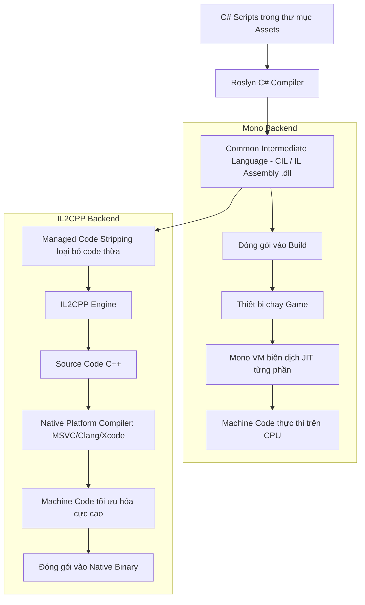

# Platform Development (Phát triển Đa nền tảng trong Unity 6)

> 📖 **Nguồn gốc:** Tổng hợp và biên soạn chọn lọc từ [Unity Manual — Platform Development](https://docs.unity3d.com/Manual/PlatformSpecific.html) based on Unity 6.4 (LTS).

---

## 🎯 Ý định (Intent)

Mục tiêu của chương này là cung cấp cái nhìn chi tiết và toàn diện nhất về cách hoạt động của hệ thống phát triển đa nền tảng trong **Unity 6.4 (LTS)**. Lập trình viên sẽ hiểu sâu về cơ chế biên dịch mã nguồn (JIT vs AOT), sự khác biệt bản chất giữa hai scripting backends **Mono** và **IL2CPP**, cơ chế cắt tỉa mã nguồn (**Code Stripping**) để tối ưu hóa bộ nhớ, và cách sử dụng các chỉ thị biên dịch có điều kiện (**Conditional Compilation**) để viết code tối ưu cho từng thiết bị cụ thể (như Android, iOS, WebGL).

---

## 🔑 Khái niệm Cốt lõi & Bản chất (Core Concepts & True Nature)

### 1. Scripting Backends: Mono vs IL2CPP

Khi xây dựng trò chơi trong Unity, mã nguồn C# của bạn không chạy trực tiếp trên phần cứng của thiết bị. Thay vào đó, nó được dịch qua một trong hai "hậu phương" biên dịch (Scripting Backends):

#### A. Mono (Just-In-Time - JIT Compilation)
*   **Bản chất:** Trình biên dịch Roslyn của Unity dịch code C# thành mã trung gian **Common Intermediate Language (CIL/IL)** và đóng gói vào các tệp `.dll`. Khi game chạy trên thiết bị, một máy ảo Mono (Virtual Machine) sẽ đọc mã IL này và biên dịch nó thành mã máy (Machine Code) tương ứng với CPU tại thời điểm chạy (Runtime).
*   **Ưu điểm:** Tốc độ build cực nhanh vì chỉ cần tạo file IL `.dll`. Rất hữu ích cho quá trình phát triển, kiểm thử nhanh (iteration).
*   **Nhược điểm:** Hiệu năng runtime chậm hơn vì CPU vừa phải gánh việc chạy game vừa phải gánh việc biên dịch code CIL sang mã máy. Đồng thời, các file `.dll` rất dễ bị dịch ngược (decompilation), để lộ mã nguồn gốc.
*   **Nền tảng hỗ trợ:** Chủ yếu dùng cho môi trường Editor, các bản build thử nghiệm trên PC/Stand-alone. Không được hỗ trợ trên iOS và một số thiết bị Console.

#### B. IL2CPP (Ahead-Of-Time - AOT Compilation)
*   **Bản chất:** Quá trình biên dịch diễn ra theo hai bước lớn trước khi trò chơi được đóng gói:
    1. Trình biên dịch Roslyn biên dịch code C# thành mã trung gian IL.
    2. Công cụ **IL2CPP** của Unity chuyển đổi toàn bộ mã IL đó thành mã nguồn **C++**.
    3. Mã C++ này sau đó được biên dịch bằng một trình biên dịch C++ native của nền tảng đích (ví dụ: MSVC trên Windows, Xcode Clang trên iOS, Clang trên Android) để tạo ra mã máy gốc cực kỳ tối ưu.
*   **Ưu điểm:**
    *   **Hiệu năng vượt trội:** Code chạy nhanh hơn đáng kể vì được tối ưu hóa sâu bởi các trình biên dịch C++ hiện đại.
    *   **Bảo mật cực cao:** Rất khó dịch ngược vì toàn bộ logic C# đã bị chuyển thành mã máy nhị phân C++ phức tạp.
    *   **Tính tuân thủ nền tảng:** Là bắt buộc đối với iOS (Apple cấm thực thi JIT code), WebGL, và các hệ máy Console (Sony PlayStation, Nintendo Switch, Microsoft Xbox).
*   **Nhược điểm:** Tốc độ build rất chậm vì phải trải qua nhiều bước biên dịch chéo phức tạp qua C++.

```
Biên dịch Mono:   [C# Code] ──Roslyn──> [IL (.dll)] ──Mono VM (Runtime)──> [Machine Code]
Biên dịch IL2CPP: [C# Code] ──Roslyn──> [IL] ──IL2CPP──> [C++ Code] ──Native Compiler──> [Machine Code]
```

---

### 2. Cơ chế Code Stripping (Cắt tỉa code)

Khi sử dụng IL2CPP, Unity kích hoạt tính năng **Managed Code Stripping** để giảm kích thước của tệp nhị phân cuối cùng.
*   **Cơ chế hoạt động:** Trình biên dịch phân tích tĩnh (Static Analysis) toàn bộ code của bạn, bắt đầu từ các lớp `MonoBehaviour` được liên kết trong Scene và các script. Nó sẽ tìm và xóa bỏ tất cả các class, method, struct trong các thư viện của Unity hoặc các package bên thứ ba mà bạn không hề gọi tới trong code.
*   **Vấn đề với Reflection:** Nếu bạn gọi một hàm hoặc khởi tạo một class một cách gián tiếp thông qua chuỗi ký tự (**Reflection** - ví dụ: `Type.GetType("MyNamespace.MyClass")`), trình phân tích tĩnh của Unity sẽ hiểu lầm rằng class đó không được dùng và tự động cắt tỉa (strip) nó đi. Kết quả là game sẽ crash khi chạy trên thiết bị thực tế với lỗi `TypeLoadException` hoặc `MissingMethodException`.
*   **Giải pháp (Tệp `link.xml`):** Để bảo vệ các đoạn code dùng Reflection, bạn phải tạo một tệp XML tên là `link.xml` đặt trong thư mục `Assets/` để khai báo cho Unity biết không được phép cắt tỉa các class hay assembly cụ thể đó.

---

### 3. Phân biệt Chỉ thị Biên dịch (#if) và runtime check (Application.platform)

Khi viết code chạy đa nền tảng, việc phân biệt cách compiler xử lý hai cơ chế này là tối quan trọng:

*   **Platform-Conditional Compilation (Chỉ thị Tiền xử lý - Preprocessor Directives):**
    ```csharp
    #if UNITY_ANDROID
        // Đoạn code này CHỈ được biên dịch khi mục tiêu là Android.
        // Trên các nền tảng khác (như iOS, PC), trình biên dịch hoàn toàn BỎ QUA đoạn này.
        // File Assembly build ra không chứa bất kỳ byte code nào của đoạn này.
    #endif
    ```
    *Bản chất:* Xảy ra ở mức độ biên dịch. Rất an toàn khi dùng các thư viện hoặc API đặc thù của một hệ điều hành (ví dụ: `UnityEngine.Android`), không sợ bị lỗi build thiếu thư viện trên hệ điều hành khác.

*   **Runtime Platform Checks (Kiểm tra khi chạy):**
    ```csharp
    if (Application.platform == RuntimePlatform.Android)
    {
        // Toàn bộ đoạn code này VẪN được biên dịch vào file game cuối cùng ở MỌI nền tảng.
        // Khi game chạy, CPU mới thực hiện kiểm tra biểu thức điều kiện if.
    }
    ```
    *Bản chất:* Xảy ra ở mức độ chạy game (Runtime). Nếu bên trong khối lệnh có gọi các API độc quyền của Android, game sẽ bị **lỗi biên dịch (Compilation Error)** ngay lập tức khi bạn chuyển Target Build sang iOS/Windows, vì Compiler trên iOS không thể tìm thấy định nghĩa của thư viện Android đó.

---

## 🎨 Cấu trúc & Vòng đời (Structure or Lifecycle)

Dưới đây là sơ đồ luồng biên dịch chi tiết của dự án Unity tùy thuộc vào việc chọn Scripting Backend là Mono hay IL2CPP:



---

## 💻 Mã nguồn C# Scripting API (C# Example)

Dưới đây là một script quản lý nền tảng thực chiến (`PlatformManager.cs`), minh họa cách sử dụng các chỉ thị biên dịch có điều kiện (`#if`) để gọi các API hệ thống đặc thù của Android và iOS (như xử lý nút Back trên Android, yêu cầu đánh giá ứng dụng, cấu hình tốc độ khung hình và cách tắt ứng dụng an toàn phù hợp với quy chuẩn Apple Store / Google Play).

```csharp
using UnityEngine;

#if UNITY_IOS
using UnityEngine.iOS; // Namespace chỉ tồn tại trên môi trường build iOS
#elif UNITY_ANDROID
using UnityEngine.Android; // Namespace chỉ tồn tại trên môi trường build Android
#endif

public class PlatformManager : MonoBehaviour
{
    private void Start()
    {
        ConfigurePlatformSettings();
    }

    private void Update()
    {
        HandlePlatformInputs();
    }

    /// <summary>
    /// Cấu hình các thiết lập hệ thống đặc thù cho từng nền tảng khi khởi động game.
    /// </summary>
    private void ConfigurePlatformSettings()
    {
        // 1. Cấu hình tốc độ khung hình (Frame Rate)
        #if UNITY_IOS || UNITY_ANDROID
            // Trên thiết bị di động, khóa FPS ở mức 60 để tránh hao pin và nóng máy
            Application.targetFrameRate = 60;
            Debug.Log("[PlatformManager] Mobile Platform detected. Framerate capped to 60 FPS.");
        #elif UNITY_STANDALONE
            // Trên PC, không giới hạn FPS (hoặc chạy theo tần số quét màn hình)
            Application.targetFrameRate = -1;
            Debug.Log("[PlatformManager] Standalone PC Platform detected. Uncapped Framerate.");
        #elif UNITY_WEBGL
            // WebGL dựa vào cơ chế VSync của trình duyệt
            Application.targetFrameRate = 30;
            Debug.Log("[PlatformManager] WebGL Platform detected. Framerate managed by browser.");
        #endif

        // 2. Yêu cầu quyền truy cập đặc thù
        #if UNITY_ANDROID
            // Ví dụ: Kiểm tra và yêu cầu quyền chụp ảnh bằng Camera trên Android
            if (!Permission.HasUserAuthorizedPermission(Permission.Camera))
            {
                Permission.RequestUserPermission(Permission.Camera);
            }
        #elif UNITY_IOS
            // Trên iOS, bạn có thể thiết lập các tính năng như không cho phép backup iCloud cho một số tệp tin tạm
            Device.SetNoBackupFlag(Application.persistentDataPath);
        #endif
    }

    /// <summary>
    /// Xử lý các phím bấm vật lý hoặc sự kiện hệ thống đặc thù khi game đang chạy.
    /// </summary>
    private void HandlePlatformInputs()
    {
        #if UNITY_ANDROID
            // Trên Android, phím Escape (hoặc nút Back trên thanh điều hướng) hoạt động như nút quay lại menu/thoát game
            if (Input.GetKeyDown(KeyCode.Escape))
            {
                Debug.Log("[PlatformManager] Android Escape/Back button pressed.");
                TriggerExitConfirmation();
            }
        #elif UNITY_STANDALONE
            // Trên PC, thoát game nhanh bằng tổ hợp Alt + F4 hoặc nút Escape
            if (Input.GetKeyDown(KeyCode.Escape))
            {
                QuitGameGracefully();
            }
        #endif
    }

    /// <summary>
    /// Thực hiện việc hiển thị hộp thoại xác nhận thoát game (Đặc thù Mobile).
    /// </summary>
    private void TriggerExitConfirmation()
    {
        // Ở đây bạn có thể hiển thị UI xác nhận thoát.
        // Nếu người chơi nhấn "Đồng ý", ta gọi hàm thoát:
        QuitGameGracefully();
    }

    /// <summary>
    /// Hàm thoát game được thiết kế an toàn cho từng nền tảng để tránh bị từ chối phát hành (Rejection).
    /// </summary>
    public void QuitGameGracefully()
    {
        Debug.Log("[PlatformManager] Attempting to quit application...");

        #if UNITY_EDITOR
            // Trong Editor, chỉ cần dừng chế độ Play Mode
            UnityEditor.EditorApplication.isPlaying = false;
        #elif UNITY_ANDROID
            // Trên Android, cho phép gọi hàm thoát trực tiếp
            Application.Quit();
        #elif UNITY_IOS
            // CẢNH BÁO CỰC KỲ QUAN TRỌNG:
            // Apple nghiêm cấm việc lập trình thoát ứng dụng bằng code (gọi Application.Quit() trên iOS sẽ khiến game bị crash bất ngờ,
            // Apple App Store sẽ reject game ngay lập tức vì vi phạm iOS Human Interface Guidelines).
            // Cách xử lý đúng: Không cung cấp nút "Thoát Game" trên UI iOS, hoặc chỉ đưa ra thông báo hướng dẫn người dùng nhấn nút Home vật lý.
            Debug.LogWarning("[PlatformManager] iOS does not allow programmatic quitting. Inform the player to use Home button instead.");
        #else
            // Các nền tảng Standalone PC khác thoát bình thường
            Application.Quit();
        #endif
    }

    /// <summary>
    /// Gọi API yêu cầu Đánh giá Game (App Rating) chuẩn mực.
    /// </summary>
    public void RequestAppRating()
    {
        #if UNITY_IOS
            // Gọi API native của Apple Store Rating
            Device.RequestStoreReview();
            Debug.Log("[PlatformManager] Requested iOS Store Review Dialog.");
        #elif UNITY_ANDROID
            // Trên Android, yêu cầu sử dụng Google Play In-App Review API thông qua Package bổ sung
            Debug.Log("[PlatformManager] Google Play Review requires Google Play Core Library integration.");
        #else
            Debug.Log("[PlatformManager] App rating is not supported on this platform.");
        #endif
    }
}
```

---

## ⚙️ Các bước thực hiện & Lưu ý thực chiến (Best Practices & Implementation Steps)

1. **Sử dụng `#if` cho các API độc quyền**: Luôn sử dụng tiền xử lý `#if UNITY_ANDROID` hoặc `#if UNITY_IOS` cho bất kỳ namespace, class, hoặc method nào chỉ tồn tại riêng trên hệ điều hành đó nhằm tránh lỗi compile build chéo.
2. **Thiết lập tệp `link.xml` bảo vệ Reflection**: Nếu dự án sử dụng các thư viện serialize dữ liệu (như Newtonsoft.Json, Protocol Buffers) hoặc các framework Dependency Injection (như Zenject), luôn tạo một file `link.xml` ở root `Assets/` để khai báo giữ lại (preserve) các assembly cần thiết, tránh bị IL2CPP Code Stripping xóa nhầm.
3. **Quản lý define symbols tùy chỉnh**: Sử dụng bảng điều khiển `Project Settings -> Player -> Scripting Define Symbols` để tạo các cờ tùy biến của riêng bạn (ví dụ: `ENABLE_LOGS`, `CHEATS_ENABLED`, `BETA_BUILD`), giúp quản lý bật tắt tính năng trên nhiều bản build khác nhau.
4. **Tách biệt code Editor khỏi Runtime**: Các class thuộc namespace `UnityEditor` chỉ hoạt động bên trong Unity Editor. Hãy đặt toàn bộ script Editor vào thư mục có tên `Editor/` hoặc bao bọc chúng bằng `#if UNITY_EDITOR`, nếu không quá trình build game thành phẩm sẽ thất bại.
5. **Ưu tiên IL2CPP cho bản phát hành chính thức**: Mặc dù Mono giúp kiểm thử nhanh trong quá trình phát triển, hãy luôn chuyển sang IL2CPP ở bản build phát hành (Release Build) để tối ưu hiệu năng CPU và tuân thủ chính sách bảo mật của các chợ ứng dụng.

---
> 📚 **Nguồn gốc:** Nội dung tham khảo từ [Unity Documentation](https://docs.unity3d.com/Manual/index.html) — Bản quyền của Unity Technologies.

| Hướng | Liên kết |
|-------|----------|
| ← Quay lại | [Tổng quan Unity Lộ trình](../../00-unity-overview.md) |
| → Tiếp theo | [GameObjects & Components (Tiếp theo)](../../01-Manual/10-GameObjects/00-gameobjects-overview.md) |
