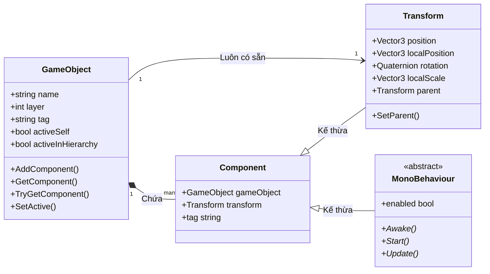

# GameObjects & Components (Thành phần & Thực thể trong Unity 6)

> 📖 **Nguồn gốc:** Tổng hợp và biên soạn chọn lọc từ [Unity Manual — GameObjects](https://docs.unity3d.com/Manual/GameObjects.html) based on Unity 6.4 (LTS).

---

## 🎯 Ý định (Intent)

Mục tiêu của chương này là đi sâu vào bản chất kiến trúc của **GameObject** và **Component** – nền tảng cốt lõi của mô hình thiết kế thực thể thành phần (Entity-Component Model) trong Unity. Lập trình viên sẽ hiểu được cấu trúc nhị phân phân tách giữa lớp vỏ C# (Managed Layer) và phần lõi C++ (Native Layer), giải mã chi phí hiệu năng của phép kiểm tra Null vật lý (`== null`), và nắm vững kỹ thuật thao tác lập trình C# tối ưu để sinh sản, phân cấp và quản lý vòng đời đối tượng.

---

## 🔑 Khái niệm Cốt lõi & Bản chất (Core Concepts & True Nature)

### 1. Mô hình Entity-Component trong Unity

Không giống như các mô hình OOP truyền thống dựa trên kế thừa sâu (Deep Inheritance), Unity sử dụng mô hình **Composition (Thành phần hóa)**:
*   **GameObject (Entity):** Bản chất chỉ là một chiếc hộp rỗng (container), đóng vai trò định danh duy nhất (ID) và chứa một danh sách các Component. Một GameObject không tự có hành vi hay dữ liệu đồ họa, ngoại trừ thành phần tối thiểu bắt buộc là **Transform** (quản lý vị trí, góc quay, tỉ lệ).
*   **Component (Behavior & Data):** Là các khối chức năng được gắn vào GameObject. Ví dụ: `MeshFilter` chứa dữ liệu hình học, `MeshRenderer` đảm nhận việc vẽ hình lên màn hình, `Rigidbody` chứa các thông số vật lý và `MonoBehaviour` (script của bạn) điều khiển logic game.

---

### 2. Ranh giới C# (Managed) vs C++ (Native)

Một trong những bí mật lớn nhất ảnh hưởng đến hiệu năng Unity nằm ở ranh giới giữa hai môi trường quản lý:

```
[ Lớp quản lý C# (Managed Heap) ]          [ Lớp gốc Engine C++ (Native Memory) ]
┌───────────────────────────────┐          ┌───────────────────────────────────┐
│ GameObject Wrapper (C# Object)│ ───────> │  Native GameObject (C++ Instance) │
│ - Chỉ chứa con trỏ IntPtr ───┼──────────┼─> - Dữ liệu thực tế               │
│ - Overridden == Operator      │          │  - Danh sách Component nhị phân   │
└───────────────────────────────┘          └───────────────────────────────────┘
                                Ranh giới C# / C++
```

*   **Bản chất:** Lõi của Unity Engine (đồ họa, vật lý, âm thanh, quản lý bộ nhớ) được viết hoàn toàn bằng **C++**. Khi bạn tạo một GameObject hay Component trong C#, bạn thực chất chỉ tạo ra một đối tượng C# siêu nhẹ đóng vai trò là "lớp vỏ" (**Wrapper**). Bên trong lớp vỏ này chỉ chứa một con trỏ (`IntPtr`) trỏ đến đối tượng C++ thực tế nằm ở vùng nhớ Native Memory.
*   **Hệ quả hiệu năng:** Mỗi lần bạn gọi một thuộc tính từ C# (ví dụ: `transform.position` hoặc `gameObject.name`), Unity phải thực hiện thao tác chuyển giao dữ liệu qua ranh giới C#/C++ (gọi là **Marshalling** hoặc **Interop/Native-to-Managed Transition**). Việc chuyển giao này tiêu tốn chu kỳ CPU nhiều hơn đáng kể so với việc đọc một biến C# thông thường.

---

### 3. Bản chất của phép kiểm tra Null (`== null`) trong Unity

Trong C# chuẩn, phép kiểm tra `myObject == null` cực kỳ nhanh vì nó chỉ kiểm tra xem con trỏ bộ nhớ ở Managed Heap có trỏ vào `null` hay không. Tuy nhiên, đối với các đối tượng kế thừa từ `UnityEngine.Object` (GameObject, Component, ScriptableObject), Unity đã ghi đè (**Override**) toán tử `==`.

*   **Tại sao toán tử `==` bị ghi đè?**
    Khi bạn gọi `Destroy(gameObject)`, Unity sẽ lập tức giải phóng đối tượng C++ ở vùng nhớ Native để giải phóng tài nguyên đồ họa/vật lý ngay lập tức. Tuy nhiên, Garbage Collector (Bộ dọn rác) của C# chưa dọn dẹp lớp vỏ C# ngay lập tức mà phải đợi đến chu kỳ dọn rác tiếp theo. Lúc này, lớp vỏ C# vẫn tồn tại nhưng đối tượng C++ bên dưới đã bị hủy.
*   **Cơ chế hoạt động:** Phép so sánh `myComponent == null` của Unity sẽ thực hiện:
    1. Kiểm tra xem đối tượng C# wrapper có thực sự null hay không.
    2. Nếu không null, nó sẽ thực hiện gọi xuống tầng Native C++ để kiểm tra xem đối tượng C++ tương ứng đã bị hủy (Destroyed) hay chưa.
*   **Hậu quả:** Việc gọi xuống tầng Native này gây ra chi phí hiệu năng rất lớn. Nếu bạn viết `if (myComponent == null)` hàng ngàn lần mỗi khung hình trong các hàm cập nhật liên tục (`Update()`), game sẽ bị sụt giảm FPS đáng kể.
*   **Mẹo tối ưu:**
    *   Sử dụng toán tử so sánh hệ thống `System.Object.ReferenceEquals(myComponent, null)` nếu bạn chỉ muốn kiểm tra xem biến C# có được khởi tạo hay chưa (không phát hiện được đối tượng Native đã bị `Destroy`).
    *   Sử dụng toán tử kiểm tra kiểu mới `if (myComponent is null)` trong C# hiện đại để bỏ qua việc gọi xuống C++ (chỉ kiểm tra biến C#).

---

### 4. Cơ chế Sinh sản & Phân cấp (Instantiate, Parent, Active State)

*   **`Instantiate`:** Sao chép một Prefab hoặc GameObject hiện có. Đây là một thao tác cực kỳ đắt đỏ vì Unity phải:
    1. Cấp phát bộ nhớ ở cả vùng C++ và C#.
    2. Đọc và phân tích cú pháp dữ liệu cấu trúc (YAML/Binary) của Prefab.
    3. Đăng ký đối tượng vào các hệ thống quản lý Scene, Physics và Render.
*   **Parenting (`transform.SetParent`):**
    Khi bạn thay đổi cha của một GameObject bằng `transform.SetParent(parent, worldPositionStays)`:
    *   Nếu `worldPositionStays` là `true` (mặc định), Unity phải tính toán ngược lại ma trận Transform (Local Position, Rotation, Scale) của đối tượng con dựa trên ma trận Transform của đối tượng cha mới để giữ nguyên vị trí vật lý của nó trong thế giới toàn cục. Thao tác tính toán ma trận này rất tốn hiệu năng đối với các phân cấp sâu.
*   **Active State (`SetActive` vs `enabled`):**
    *   `SetActive(bool)`: Bật/tắt toàn bộ GameObject. Khi gọi `SetActive(false)`, Unity sẽ tắt đệ quy toàn bộ các Component bên trong nó và tất cả các GameObject con. Điều này kích hoạt hàng loạt hàm vòng đời (`OnDisable`) và buộc hệ thống Vật lý/Render phải tái cấu trúc lại cấu trúc dữ liệu.
    *   `enabled = bool`: Chỉ bật/tắt một Component cụ thể (như `MeshRenderer` hoặc một Custom Script). GameObject và các thành phần khác vẫn hoạt động bình thường. Sử dụng `enabled` tiết kiệm hiệu năng hơn rất nhiều so với `SetActive`.

---

## 🎨 Cấu trúc & Vòng đời (Structure or Lifecycle)

Sơ đồ mô tả mối quan hệ phân cấp giữa GameObject và các Component cơ bản:



---

## 💻 Mã nguồn C# Scripting API (C# Example)

Script dưới đây (`GameObjectSpawner.cs`) minh họa cách quản lý GameObject chuyên nghiệp: tạo mới đối tượng, thiết lập phân cấp cha-con bằng `SetParent`, sử dụng phương pháp truy vấn thành phần tối ưu `TryGetComponent` thay vì `GetComponent`, quản lý trạng thái active, và kiểm tra hiệu năng so sánh Null Check.

```csharp
using System.Diagnostics;
using UnityEngine;

public class GameObjectSpawner : MonoBehaviour
{
    [Header("Prefab Configuration")]
    [SerializeField] private GameObject cubePrefab;
    [SerializeField] private int spawnCount = 10;

    [Header("Hierarchy Settings")]
    [SerializeField] private Transform spawnRoot;

    private GameObject[] spawnedObjects;

    private void Start()
    {
        spawnedObjects = new GameObject[spawnCount];
        SpawnAndSetupHierarchy();
        TestNullCheckPerformance();
    }

    /// <summary>
    /// Thực hiện sinh sản đối tượng, quản lý phân cấp và thêm/lấy component tối ưu.
    /// </summary>
    private void SpawnAndSetupHierarchy()
    {
        if (cubePrefab == null)
        {
            UnityEngine.Debug.LogError("[Spawner] Cube Prefab is null! Cannot spawn.");
            return;
        }

        for (int i = 0; i < spawnCount; i++)
        {
            // 1. Tạo vị trí ngẫu nhiên
            Vector3 randomPos = new Vector3(i * 2.0f, 0, 0);

            // 2. Instantiate đối tượng (Giữ nguyên vị trí toàn cục khi tạo)
            GameObject newCube = Instantiate(cubePrefab, randomPos, Quaternion.identity);
            newCube.name = $"Procedural_Cube_{i}";

            // 3. Thiết lập phân cấp (Parenting)
            if (spawnRoot != null)
            {
                // worldPositionStays = true: Giữ nguyên tọa độ thế giới (chỉ tính toán lại local transform)
                // worldPositionStays = false: Đưa tọa độ thế giới của Cube trở thành tọa độ local tương đối của Parent
                newCube.transform.SetParent(spawnRoot, true);
            }

            // 4. Thử nghiệm lấy Component sử dụng TryGetComponent (Không gây rác bộ nhớ)
            // Thay vì dùng: Rigidbody rb = newCube.GetComponent<Rigidbody>(); (Tạo ra Garbage nếu component không tồn tại)
            if (newCube.TryGetComponent<Rigidbody>(out Rigidbody rb))
            {
                rb.useGravity = false;
                rb.isKinematic = true;
            }
            else
            {
                // Nếu không có, tiến hành thêm mới một cách chủ động
                Rigidbody addedRb = newCube.AddComponent<Rigidbody>();
                addedRb.useGravity = true;
                addedRb.isKinematic = false;
                UnityEngine.Debug.Log($"[Spawner] Added Rigidbody dynamically to {newCube.name}");
            }

            // 5. Lưu lại danh sách quản lý
            spawnedObjects[i] = newCube;
        }
    }

    /// <summary>
    /// Hàm bật/tắt toàn bộ danh sách đối tượng procedural.
    /// </summary>
    public void ToggleObjectsState(bool isActive)
    {
        if (spawnedObjects == null) return;

        foreach (GameObject obj in spawnedObjects)
        {
            if (obj != null)
            {
                // SetActive(false) tắt toàn bộ GameObject cùng các script đi kèm
                obj.SetActive(isActive);
            }
        }
    }

    /// <summary>
    /// Đánh giá sự khác biệt hiệu năng giữa so sánh Null thông thường của Unity và System Reference Check.
    /// </summary>
    private void TestNullCheckPerformance()
    {
        if (spawnedObjects == null || spawnedObjects.Length == 0) return;
        GameObject testTarget = spawnedObjects[0];

        int iterations = 100000;
        Stopwatch sw = new Stopwatch();

        // Đo thời gian phép kiểm tra Null của Unity (Ghi đè toán tử ==)
        sw.Start();
        for (int i = 0; i < iterations; i++)
        {
            if (testTarget == null)
            {
                // Thực thi giả lập
            }
        }
        sw.Stop();
        long unityNullTime = sw.ElapsedTicks;

        // Đo thời gian phép kiểm tra Null bằng ReferenceEquals (Bỏ qua cầu nối C++)
        sw.Reset();
        sw.Start();
        for (int i = 0; i < iterations; i++)
        {
            if (System.Object.ReferenceEquals(testTarget, null))
            {
                // Thực thi giả lập
            }
        }
        sw.Stop();
        long systemNullTime = sw.ElapsedTicks;

        UnityEngine.Debug.Log($"[Spawner] Null check performance comparison ({iterations} iterations):");
        UnityEngine.Debug.Log($"-> Unity custom '== null': {unityNullTime} ticks (gây chuyển vùng C++/C#).");
        UnityEngine.Debug.Log($"-> System 'ReferenceEquals': {systemNullTime} ticks (chỉ chạy trên C# Managed).");
        UnityEngine.Debug.Log($"-> Tốc độ chênh lệch: {(float)unityNullTime / systemNullTime:F2} lần.");
    }
}

---

## ⚙️ Các bước thực hiện & Lưu ý thực chiến (Best Practices & Implementation Steps)

1. **Ưu tiên sử dụng `TryGetComponent`**: Khi kiểm tra và lấy Component từ một đối tượng khác, luôn dùng `TryGetComponent` thay vì `GetComponent` để tránh phát sinh rác bộ nhớ (Garbage Collection Allocation) khi chạy trong Editor.
2. **Không gọi `GetComponent` trong vòng lặp thường xuyên**: Tuyệt đối tránh gọi `GetComponent` hoặc so sánh Null với toán tử `==` trong hàm `Update()` hoặc `FixedUpdate()`. Hãy thực hiện caching tham chiếu ở hàm `Awake()` hoặc `Start()`.
3. **Tránh đổi cha (`SetParent`) sâu trong runtime**: Giới hạn tối đa việc gọi `transform.SetParent` đối với các GameObject có cây phân cấp sâu khi đang chơi, nhằm giảm thiểu tải trọng tính toán lại ma trận ma sát biến đổi và ma trận toàn cục.
4. **Áp dụng mô hình Object Pooling**: Đối với các thực thể sinh/hủy liên tục (như vỏ đạn, hiệu ứng cháy nổ, quái vật nhỏ), hãy dùng giải pháp Object Pool (sử dụng thư viện `UnityEngine.Pool` được tích hợp sẵn từ Unity 2021+) để tái sử dụng đối tượng thay vì gọi `Instantiate` và `Destroy` liên tục.
5. **Ưu tiên vô hiệu hóa thành phần (`enabled = false`)**: Nếu chỉ muốn ẩn mô hình hoặc dừng chạy logic của một đối tượng đơn lẻ, hãy tắt Component `Renderer` hoặc script tương ứng thay vì tắt toàn bộ GameObject bằng `SetActive(false)`, điều này giúp tránh kích hoạt đệ quy chu kỳ bật/tắt của toàn bộ phân cấp con.

---
> 📚 **Nguồn gốc:** Nội dung tham khảo từ [Unity Documentation](https://docs.unity3d.com/Manual/index.html) — Bản quyền của Unity Technologies.

| Hướng | Liên kết |
|-------|----------|
| ← Quay lại | [Platform Development (Quay lại)](../../01-Manual/09-Platform-Dev/00-platform-dev-overview.md) |
| → Tiếp theo | [Scenes (Tiếp theo)](../../01-Manual/11-Scenes/00-scenes-overview.md) |
