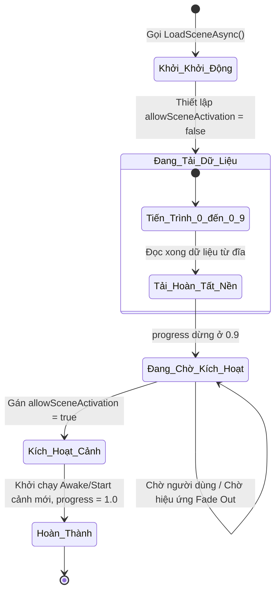

# Scenes & Scene Management (Quản lý Cảnh chơi trong Unity 6)

> 📖 **Nguồn gốc:** Tổng hợp và biên soạn chọn lọc từ [Unity Manual — Scenes](https://docs.unity3d.com/Manual/CreatingScenes.html) based on Unity 6.4 (LTS).

---

## 🎯 Ý định (Intent)

Mục tiêu của chương này là cung cấp kiến thức chuyên sâu về cách hoạt động của hệ thống quản lý Cảnh chơi (**Scenes**) trong **Unity 6.4 (LTS)**. Lập trình viên sẽ nắm vững sự khác biệt giữa cơ chế tải cảnh đè dữ liệu (**Single Mode**) và tải cảnh xếp chồng (**Additive Mode**), hiểu rõ cơ chế tải bất đồng bộ phi chặn luồng (**Asynchronous Loading**), cách giữ lại các đối tượng quản lý toàn cục qua phân cảnh bằng `DontDestroyOnLoad`, và cách lập trình một trình quản lý màn hình chờ tải game (Loading Screen) mượt mà.

---

## 🔑 Khái niệm Cốt lõi & Bản chất (Core Concepts & True Nature)

### 1. Bản chất của một Scene trong Unity

Về mặt vật lý trên ổ cứng, một Scene (tệp `.unity`) thực chất là một tệp văn bản định dạng YAML (nếu đã bật Force Text Serialization). Tệp này lưu giữ danh sách cấu trúc phân cấp tuần tự của toàn bộ GameObject, các Component đi kèm và các tham số ánh sáng (Lighting Settings), thông số sương mù (RenderSettings) của riêng cảnh đó.
*   Khi bạn load một Scene, Unity Engine sẽ đọc tệp này, phân tích cú pháp (Parsing), cấp phát vùng nhớ Native C++ và tạo ra các đối tượng tương ứng trên RAM.

---

### 2. So sánh Chế độ Tải Cảnh: Single vs Additive

Unity cung cấp hai chế độ tải cảnh thông qua enum `LoadSceneMode`:

#### A. Single Mode (`LoadSceneMode.Single`)
*   **Bản chất:** Unity sẽ giải phóng toàn bộ tài nguyên, hủy (Destroy) tất cả các GameObject ở tất cả các cảnh đang mở trước đó, giải phóng bộ nhớ RAM (kích hoạt Garbage Collector của C#), sau đó mới tiến hành load cảnh mới vào.
*   **Vấn đề:** Do phải dọn dẹp hàng loạt và nạp mới cùng lúc, game thường bị đứng hình (stutter/freeze) trong tích tắc. Không phù hợp cho các game có thế giới mở hoặc các game cần chuyển cảnh mượt mà.

#### B. Additive Mode (`LoadSceneMode.Additive`)
*   **Bản chất:** Unity nạp cảnh mới và xếp chồng nó vào phân cấp quản lý hiện tại mà **không hề chạm tới hay hủy bỏ** các cảnh đang chạy.
*   **Ứng dụng:** 
    *   **Phân chia thế giới (Open World Streaming):** Chia nhỏ thế giới game thành các vùng (Grid/Chunks). Khi người chơi di chuyển đến đâu, game tự động load thêm vùng đó và unload các vùng phía sau lưng mà không làm gián đoạn trò chơi.
    *   **Tách biệt giao diện (UI Separation):** Giữ cảnh UI độc lập chạy liên tục ở chế độ Additive, trong khi cảnh màn chơi (Gameplay) có thể load/unload bên dưới.

---

### 3. Cơ chế Tải Bất Đồng Bộ (Asynchronous Loading)

Khi bạn gọi `SceneManager.LoadScene`, luồng chính (Main Thread) của Unity sẽ bị chặn đứng để tập trung đọc dữ liệu từ ổ cứng và khởi tạo đối tượng. Trò chơi sẽ bị đóng băng hoàn toàn cho đến khi nạp xong.

Để giải quyết vấn đề này, Unity cung cấp phương thức bất đồng bộ:
`SceneManager.LoadSceneAsync(string sceneName, LoadSceneMode mode)`
*   **Bản chất:** Unity tạo ra một tác vụ nền ở luồng phụ (Worker Thread) để đọc dữ liệu từ đĩa cứng và chuẩn bị sẵn sàng dữ liệu. Luồng chính của game vẫn chạy bình thường ở mức 60 FPS (hoặc hơn), giúp bạn hiển thị hiệu ứng xoay loading hay thanh tiến trình mượt mà.
*   **Vòng đời tiến trình của `AsyncOperation`:**
    *   `progress`: Trả về giá trị tiến độ từ `0.0` đến `1.0`.
    *   **Điểm lưu ý đặc biệt:** Khi cảnh đang được tải, thuộc tính `progress` chỉ chạy từ `0.0` đến **`0.9`**. Ở mức `0.9`, Unity đã tải xong toàn bộ dữ liệu lên bộ nhớ tạm nhưng **chưa kích hoạt** cảnh đó để hiển thị. Nó sẽ đứng chờ ở đó.
    *   `allowSceneActivation`: Nếu thuộc tính này được gán bằng `false`, Unity sẽ giữ cảnh ở trạng thái chờ kích hoạt (giữ `progress` ở `0.9`). Khi bạn đổi thành `true`, Unity sẽ hoàn tất 10% còn lại (kích hoạt cảnh, chạy hàm `Awake` của cảnh mới) và chuyển `progress` lên `1.0`, chính thức chuyển cảnh.

---

### 4. DontDestroyOnLoad & Cạm bẫy trùng lặp Singleton

Khi sử dụng `DontDestroyOnLoad(gameObject)`, bạn đang yêu cầu Unity di chuyển GameObject đó sang một phân cảnh nội bộ đặc biệt tên là **`DontDestroyOnLoad Scene`**. Phân cảnh này không bị ảnh hưởng bởi quá trình dọn dẹp của `LoadSceneMode.Single`.

*   **Vấn đề trùng lặp Manager:**
    Giả sử bạn có một `GameManager` đặt trong Scene 1. Khi Scene 1 load lần đầu, `GameManager` được khởi tạo và chuyển vào vùng `DontDestroyOnLoad`. Khi người chơi chơi xong, quay về Menu chính, rồi lại nhấn nút Start để load lại Scene 1. Lúc này, do Scene 1 chứa sẵn một `GameManager` trong file thiết kế, Unity sẽ khởi tạo thêm một `GameManager` thứ hai. Bạn sẽ có 2 GameManager cùng chạy song song, gây ra lỗi xung đột logic nghiêm trọng.
*   **Giải pháp:** Áp dụng mô hình **Singleton** chuẩn mực, tự kiểm tra sự tồn tại trong hàm `Awake()` và hủy ngay lập tức thực thể mới sinh ra nếu đã có một thực thể cũ tồn tại trong vùng nhớ.

---

## 🎨 Cấu trúc & Vòng đời (Structure or Lifecycle)

Sơ đồ trạng thái của tiến trình tải cảnh bất đồng bộ với tính năng khóa kích hoạt `allowSceneActivation`:



---

## 💻 Mã nguồn C# Scripting API (C# Example)

Dưới đây là một script hoàn chỉnh (`SceneLoader.cs`) dùng để quản lý quá trình chuyển cảnh. Script này xử lý việc load bất đồng bộ, tính toán phần trăm hiển thị mượt mà từ `0` đến `100%` bằng cách chuẩn hóa khoảng tiến độ `0.0 - 0.9` của Unity, và hỗ trợ hiệu ứng chuyển cảnh mượt mà trước khi kích hoạt Scene mới.

```csharp
using System.Collections;
using UnityEngine;
using UnityEngine.SceneManagement;
using UnityEngine.UI;

public class SceneLoader : MonoBehaviour
{
    // Áp dụng mô hình Singleton để dễ dàng truy cập từ bất kỳ script nào
    public static SceneLoader Instance { get; private set; }

    [Header("UI Components")]
    [SerializeField] private GameObject loadingScreenCanvas;
    [SerializeField] private Slider progressBar;
    [SerializeField] private TMPro.TextMeshProUGUI progressText;
    [SerializeField] private TMPro.TextMeshProUGUI promptText;

    [Header("Settings")]
    [SerializeField] private float minLoadingTime = 1.5f; // Thời gian hiển thị loading tối thiểu để tránh nháy màn hình
    [SerializeField] private CanvasGroup fadeCanvasGroup;
    [SerializeField] private float fadeDuration = 0.5f;

    private void Awake()
    {
        // Quản lý Singleton chuẩn mực tránh trùng lặp khi quay lại Scene cũ
        if (Instance != null && Instance != this)
        {
            Destroy(gameObject);
            return;
        }

        Instance = this;
        DontDestroyOnLoad(gameObject); // Giữ trình quản lý loading này xuyên suốt game

        // Đảm bảo ẩn màn hình loading lúc ban đầu
        if (loadingScreenCanvas != null)
        {
            loadingScreenCanvas.SetActive(false);
        }
        
        if (fadeCanvasGroup != null)
        {
            fadeCanvasGroup.alpha = 0f;
        }
    }

    /// <summary>
    /// API công khai để gọi tải cảnh bất đồng bộ từ các script khác.
    /// </summary>
    /// <param name="sceneName">Tên chính xác của Scene cần tải (Phải có trong Build Settings)</param>
    public void LoadSceneAsync(string sceneName)
    {
        StartCoroutine(LoadSceneCoroutine(sceneName));
    }

    private IEnumerator LoadSceneCoroutine(string sceneName)
    {
        if (loadingScreenCanvas == null)
        {
            Debug.LogError("[SceneLoader] Loading Screen Canvas is not assigned!");
            yield break;
        }

        // 1. Kích hoạt màn hình loading và đặt lại các thông số
        loadingScreenCanvas.SetActive(true);
        if (progressBar != null) progressBar.value = 0f;
        if (progressText != null) progressText.text = "0%";
        if (promptText != null) promptText.gameObject.SetActive(false);

        // 2. Thực hiện hiệu ứng Fade In màn hình đen/loading
        if (fadeCanvasGroup != null)
        {
            yield return StartCoroutine(FadeCanvas(0f, 1f));
        }

        // 3. Khởi tạo tác vụ tải cảnh bất đồng bộ nền
        AsyncOperation asyncLoad = SceneManager.LoadSceneAsync(sceneName, LoadSceneMode.Single);
        
        // Cực kỳ quan trọng: Ngăn không cho cảnh tự động kích hoạt ngay khi tải xong
        asyncLoad.allowSceneActivation = false;

        float elapsedTime = 0f;

        // 4. Vòng lặp cập nhật tiến độ loading
        while (!asyncLoad.isDone)
        {
            elapsedTime += Time.unscaledDeltaTime; // Sử dụng unscaledDeltaTime đề phòng game đang pause (timeScale = 0)

            // Tiến độ thực tế của Unity chạy từ 0 đến 0.9 khi chưa kích hoạt
            // Ta chuẩn hóa giá trị này về khoảng 0.0 đến 1.0
            float rawProgress = Mathf.Clamp01(asyncLoad.progress / 0.9f);
            
            // Tính toán tiến độ hiển thị mượt mà dựa trên thời gian trôi qua tối thiểu (Visual Padding)
            float visualProgress = Mathf.Min(rawProgress, elapsedTime / minLoadingTime);

            if (progressBar != null)
            {
                progressBar.value = visualProgress;
            }

            if (progressText != null)
            {
                progressText.text = $"{(visualProgress * 100f):F0}%";
            }

            // Khi cả tiến độ thực tế và tiến độ hiển thị trực quan đều đạt tối đa (100% / 1.0)
            if (asyncLoad.progress >= 0.9f && visualProgress >= 1.0f)
            {
                if (promptText != null)
                {
                    promptText.gameObject.SetActive(true);
                    promptText.text = "Nhấn phím bất kỳ để tiếp tục...";
                }

                // Chờ người chơi nhấn phím để chính thức chuyển cảnh
                if (Input.anyKeyDown)
                {
                    // 5. Cho phép kích hoạt cảnh
                    asyncLoad.allowSceneActivation = true;
                }
            }

            yield return null;
        }

        // 6. Thực hiện hiệu ứng Fade Out màn hình đen sau khi cảnh mới đã hiển thị
        if (fadeCanvasGroup != null)
        {
            yield return StartCoroutine(FadeCanvas(1f, 0f));
        }

        // 7. Tắt canvas loading để trả lại màn hình chơi game
        loadingScreenCanvas.SetActive(false);
    }

    /// <summary>
    /// Coroutine hỗ trợ hiệu ứng mờ dần (Fading) sử dụng CanvasGroup.
    /// </summary>
    private IEnumerator FadeCanvas(float startAlpha, float endAlpha)
    {
        float timer = 0f;
        while (timer < fadeDuration)
        {
            timer += Time.unscaledDeltaTime;
            fadeCanvasGroup.alpha = Mathf.Lerp(startAlpha, endAlpha, timer / fadeDuration);
            yield return null;
        }
        fadeCanvasGroup.alpha = endAlpha;
    }
}

---

## ⚙️ Các bước thực hiện & Lưu ý thực chiến (Best Practices & Implementation Steps)

1. **Luôn sử dụng Tải Bất Đồng Bộ (`LoadSceneAsync`)**: Đối với bất kỳ cảnh chơi nào ngoài màn hình Menu chính siêu nhẹ, luôn dùng tải bất đồng bộ để tránh hiện tượng đứng hình (freeze) luồng xử lý đồ họa chính.
2. **Giải phóng sự kiện để tránh rò rỉ bộ nhớ**: Khi chuyển cảnh bằng chế độ `Single`, đảm bảo bạn đã hủy đăng ký (`-=`) tất cả các C# Events hoặc Actions liên kết đến các đối tượng tĩnh (Static) hoặc các Manager nằm trong vùng `DontDestroyOnLoad`. Nếu không, các đối tượng ở cảnh cũ sẽ không thể bị Garbage Collector dọn dẹp, dẫn đến rò rỉ RAM.
3. **Quản lý Singleton chặt chẽ**: Đảm bảo toàn bộ các Manager sử dụng `DontDestroyOnLoad` đều tự hủy bản sao trùng lặp trong hàm `Awake()`, tránh sự tích tụ vô hạn các bản thể đối tượng khi người chơi liên tục chuyển đổi qua lại giữa các cảnh.
4. **Kiến trúc Scene xếp chồng (Additive UI)**: Thiết kế cảnh chơi theo dạng modular: Cảnh UI HUD riêng, cảnh hệ thống ánh sáng riêng, cảnh màn chơi (Level) riêng và nạp xếp chồng bằng `LoadSceneMode.Additive` để dễ bảo trì và tái sử dụng.
5. **Đồng bộ hóa kích hoạt cảnh với Visual transitions**: Gán `allowSceneActivation = false` khi load cảnh nền để đợi hiệu ứng chuyển cảnh (như màn hình mờ đen dần hoặc hiệu ứng camera quay chậm) hoàn thành xuất sắc rồi mới gán lại bằng `true` nhằm đem lại trải nghiệm điện ảnh mượt mà nhất.

---
> 📚 **Nguồn gốc:** Nội dung tham khảo từ [Unity Documentation](https://docs.unity3d.com/Manual/index.html) — Bản quyền của Unity Technologies.

| Hướng | Liên kết |
|-------|----------|
| ← Quay lại | [GameObjects & Components (Quay lại)](../../01-Manual/10-GameObjects/00-gameobjects-overview.md) |
| → Tiếp theo | [Cameras (Tiếp theo)](../../01-Manual/12-Cameras/00-cameras-overview.md) |
