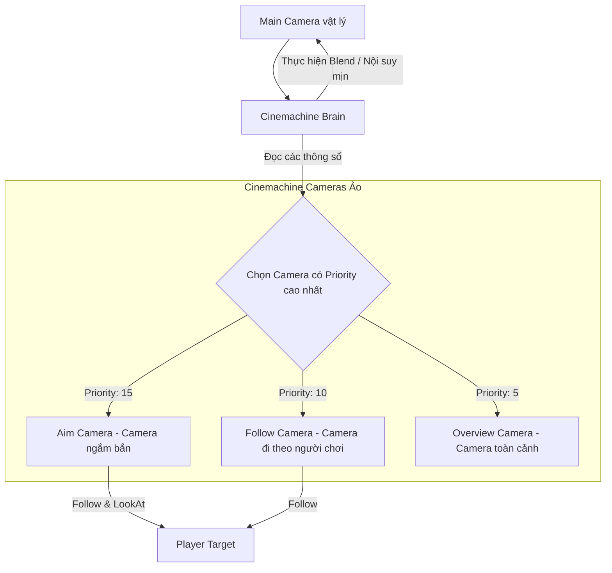

# Cameras & Cinemachine (Hệ thống Camera & Cinemachine trong Unity 6)

> 📖 **Nguồn gốc:** Tổng hợp và biên soạn chọn lọc từ [Unity Manual — Cameras](https://docs.unity3d.com/Manual/CamerasOverview.html) và Cinemachine v3 Documentation based on Unity 6.4 (LTS).

---

## 🎯 Ý định (Intent)

Mục tiêu của chương này là giải thích chi tiết bản chất kỹ thuật của hệ thống Camera trong Unity và cách tích hợp bộ công cụ quản lý camera chuyên nghiệp **Cinemachine** (phiên bản v3 tích hợp trong Unity 6). Lập trình viên sẽ nắm vững các khái niệm dựng hình nâng cao như các loại phép chiếu (Projection), Tọa độ hiển thị (Viewport), cơ chế chọn lọc lớp vật thể vẽ (**Culling Mask & Layers**), hoạt động điều phối của Cinemachine Brain và cách điều khiển mục tiêu camera động theo trạng thái trò chơi qua mã nguồn C#.

---

## 🔑 Khái niệm Cốt lõi & Bản chất (Core Concepts & True Nature)

### 1. Cách Camera Dựng Hình và Ranh giới Z-Buffer

Camera là công cụ chuyển đổi không gian 3D của thế giới game (World Space) thành không gian 2D trên màn hình của người chơi (Screen Space). Hai chế độ chiếu chính bao gồm:
*   **Perspective Projection (Phép chiếu phối cảnh):** Điểm nhìn hội tụ tạo thành một hình chóp cụt (**Frustum**). Vật thể ở xa sẽ nhỏ hơn vật thể ở gần. Được định nghĩa bởi góc nhìn **Field of View (FOV)**.
*   **Orthographic Projection (Phép chiếu song song/chính trực):** Vùng nhìn là một hình hộp chữ nhật. Khoảng cách từ vật thể đến camera không làm thay đổi kích thước hiển thị. Thường dùng cho game 2D hoặc game 3D phong cách Isometric. Được định nghĩa bởi kích thước **Size**.

#### Lỗi Z-Fighting và Clipping Planes
*   **Near & Far Clipping Planes:** Định nghĩa khoảng cách tối thiểu và tối đa mà camera có thể vẽ.
*   **Bản chất:** Unity sử dụng bộ đệm độ sâu **Z-Buffer** (Depth Buffer) để xác định vật thể nào nằm trước và vật thể nào nằm sau nhằm vẽ đè lên nhau cho đúng. Z-Buffer có độ chính xác hữu hạn (thường là 24-bit).
*   **Nguy hiểm:** Nếu bạn đặt `Near Plane` quá nhỏ (ví dụ: `0.0001f`) hoặc `Far Plane` quá lớn (ví dụ: `100000f`), phân bổ độ chính xác của Z-Buffer sẽ bị loãng. Các vật thể nằm rất gần nhau ở xa sẽ xảy ra hiện tượng **Z-Fighting** (màn hình nhấp nháy liên tục do card đồ họa không thể phân biệt vật thể nào đứng trước vật thể nào).

---

### 2. Viewport Coordinates (Tọa độ Khung nhìn)

Tọa độ Viewport được chuẩn hóa trong khoảng từ `(0, 0)` (góc dưới bên trái) đến `(1, 1)` (góc trên bên phải). Bằng cách điều chỉnh thuộc tính **Viewport Rect** của Camera, bạn có thể phân chia màn hình:
*   **Split-Screen:** Dành cho game Co-op 2 người chơi trên cùng một máy (thiết lập 2 camera với Viewport Rect lần lượt là `(X:0, Y:0, W:0.5, H:1)` và `(X:0.5, Y:0, W:0.5, H:1)`).
*   **Picture-in-Picture:** Hiển thị camera hành trình nhỏ ở góc màn hình (như gương chiếu hậu trong game đua xe).

---

### 3. Culling Mask & Optimization (Lọc lớp dựng hình)

Mỗi GameObject được gán cho một **Layer** (Lớp). Camera sử dụng thuộc tính **Culling Mask** để quyết định xem nó có vẽ các GameObject thuộc Layer đó hay không.
*   **Tối ưu hóa:** 
    *   Tắt các Layer chứa vật thể nhỏ nhặt, cỏ cây (Foliage) đối với các camera phụ (như Camera vẽ Bản đồ nhỏ - Minimap). Điều này giảm số lượng **Draw Calls** (yêu cầu vẽ gửi đến GPU) giúp tăng đáng kể hiệu năng game.
    *   Sử dụng một Camera phụ chỉ để vẽ vũ khí của người chơi ở góc nhìn thứ nhất (FPS Weapon Layer) đè lên camera môi trường chính để tránh hiện tượng súng bị đâm xuyên qua tường (Weapon Clipping).

---

### 4. Kiến trúc Cinemachine v3 trong Unity 6

Trong các phiên bản Unity hiện đại, việc viết code di chuyển camera thủ công là không tối ưu. **Cinemachine** là giải pháp chuẩn mực công nghiệp hoạt động dựa trên mô hình tách biệt dữ liệu:

```
┌────────────────────────────────────────────────────────┐
│                   Cinemachine Brain                    │ (Gắn trên Main Camera vật lý)
└──────────────────────────┬─────────────────────────────┘
                           │ Đọc dữ liệu biến đổi
                           v
┌────────────────────────────────────────────────────────┐
│              Active Cinemachine Camera                 │ (Ảo - Không render trực tiếp)
│ - Cấu hình Ống kính (Lens)                             │
│ - Mục tiêu Theo dõi (Follow) và Nhìn vào (LookAt)      │
│ - Mức độ ưu tiên (Priority)                            │
└────────────────────────────────────────────────────────┘
```

*   **Cinemachine Brain:** Gắn trực tiếp lên Main Camera vật lý của Unity. Nó đóng vai trò "Bộ não" kiểm soát, liên tục theo dõi tất cả các Cinemachine Cameras trong Scene. Nó tự động thực hiện nội suy vị trí/góc quay (Blend) để di chuyển Main Camera theo Virtual Camera nào có **Priority** (Mức độ ưu tiên) cao nhất.
*   **Cinemachine Camera (Virtual Camera):** Là các đối tượng ảo siêu nhẹ. Chúng không thực hiện render dữ liệu lên màn hình, chỉ lưu trữ các thông số thiết lập góc quay (Follow target, LookAt target, Noise, Lens size).
*   *Lưu ý Unity 6:* Kể từ Cinemachine v3 (Unity 6.4), lớp đối tượng chính được gọi là **`CinemachineCamera`** (thay thế cho `CinemachineVirtualCamera` ở v2 cũ, mặc dù cơ chế hoạt động tương đương nhưng cấu trúc component modular hơn).

---

## 🎨 Cấu trúc & Vòng đời (Structure or Lifecycle)

Mô hình luồng tương tác giữa Cinemachine Brain và các Cinemachine Cameras:



---

## 💻 Mã nguồn C# Scripting API (C# Example)

Đoạn code dưới đây (`CameraStateController.cs`) sử dụng API chính thức của **Cinemachine v3** (`Unity.Cinemachine`) để quản lý việc chuyển đổi camera động dựa trên trạng thái của nhân vật (Di chuyển bình thường, Ngắm bắn, Tập trung vào Boss).

```csharp
using UnityEngine;
using Unity.Cinemachine; // Namespace chính thức của Cinemachine v3 trong Unity 6

public enum CameraState
{
    DefaultFollow,
    Aiming,
    BossCutscene
}

public class CameraStateController : MonoBehaviour
{
    [Header("Cinemachine Cameras")]
    [SerializeField] private CinemachineCamera followCamera;
    [SerializeField] private CinemachineCamera aimCamera;
    [SerializeField] private CinemachineCamera bossFocusCamera;

    [Header("Targets")]
    [SerializeField] private Transform playerTransform;
    [SerializeField] private Transform bossTransform;

    private CinemachineCamera activeCamera;

    private void Start()
    {
        InitializeCameras();
    }

    /// <summary>
    /// Thiết lập ban đầu cho các camera ảo.
    /// </summary>
    private void InitializeCameras()
    {
        if (followCamera == null || aimCamera == null || bossFocusCamera == null)
        {
            Debug.LogError("[CameraController] One or more Cinemachine Cameras are not assigned!");
            return;
        }

        // Thiết lập theo dõi mục tiêu động thông qua mã nguồn
        followCamera.Follow = playerTransform;
        followCamera.LookAt = playerTransform;

        aimCamera.Follow = playerTransform;
        aimCamera.LookAt = playerTransform;

        bossFocusCamera.Follow = playerTransform;
        bossFocusCamera.LookAt = bossTransform; // Camera nhìn vào Boss nhưng đi theo Player

        // Khởi động với trạng thái mặc định
        SwitchCameraState(CameraState.DefaultFollow);
    }

    /// <summary>
    /// Thay đổi trạng thái camera bằng cách điều chỉnh trọng số Priority.
    /// Cinemachine Brain sẽ tự động chuyển đổi mượt mà đến camera có độ ưu tiên cao nhất.
    /// </summary>
    public void SwitchCameraState(CameraState newState)
    {
        // Đặt lại tất cả camera về mức ưu tiên thấp mặc định (ví dụ: 10)
        followCamera.Priority = 10;
        aimCamera.Priority = 10;
        bossFocusCamera.Priority = 10;

        switch (newState)
        {
            case CameraState.DefaultFollow:
                followCamera.Priority = 20; // Độ ưu tiên cao nhất sẽ được chọn làm Active Camera
                activeCamera = followCamera;
                Debug.Log("[CameraController] Switched to Default Follow Camera.");
                break;

            case CameraState.Aiming:
                aimCamera.Priority = 25; // Nâng mức ưu tiên cao hơn
                activeCamera = aimCamera;
                Debug.Log("[CameraController] Switched to Aiming Camera (Close-up / Over-the-shoulder).");
                break;

            case CameraState.BossCutscene:
                bossFocusCamera.Priority = 30; // Cắt cảnh hoặc tập trung Boss có độ ưu tiên cao tuyệt đối
                activeCamera = bossFocusCamera;
                Debug.Log("[CameraController] Switched to Boss Focus Camera.");
                break;
        }
    }

    /// <summary>
    /// API động để thay đổi mục tiêu theo dõi của camera hiện tại (ví dụ khi đổi nhân vật điều khiển).
    /// </summary>
    public void ChangeActiveCameraTarget(Transform newTarget)
    {
        if (activeCamera != null)
        {
            activeCamera.Follow = newTarget;
            activeCamera.LookAt = newTarget;
            Debug.Log($"[CameraController] Changed active camera target to {newTarget.name}");
        }
    }

    // Thử nghiệm nhanh chuyển đổi bằng phím bấm mẫu
    private void Update()
    {
        if (Input.GetKeyDown(KeyCode.Alpha1))
        {
            SwitchCameraState(CameraState.DefaultFollow);
        }
        else if (Input.GetKeyDown(KeyCode.Alpha2))
        {
            SwitchCameraState(CameraState.Aiming);
        }
        else if (Input.GetKeyDown(KeyCode.Alpha3))
        {
            SwitchCameraState(CameraState.BossCutscene);
        }
    }
}

---

## ⚙️ Các bước thực hiện & Lưu ý thực chiến (Best Practices & Implementation Steps)

1. **Ngăn chặn triệt để lỗi Z-Fighting**: Luôn giữ tỷ lệ giữa `Near Clipping Plane` và `Far Clipping Plane` ở mức hợp lý. Đừng bao giờ đặt Near quá nhỏ (như `0.0001f`) và Far quá lớn, hãy bắt đầu với `Near = 0.3f` và chỉ tăng Far vừa đủ bao quát tầm nhìn của màn chơi.
2. **Tuân thủ nguyên tắc Cinemachine**: Khi đã tích hợp Cinemachine, hãy để Cinemachine Brain toàn quyền kiểm soát Main Camera. Tuyệt đối không viết script thay đổi trực tiếp `transform.position` hay `transform.rotation` của Main Camera.
3. **Sử dụng Culling Mask tối ưu hóa GPU**: Thiết lập Camera phụ (như Camera render gương chiếu hậu hoặc camera bản đồ nhỏ) chỉ render các layer thiết yếu. Việc lọc bỏ các layer chứa hạt hiệu ứng (VFX), cỏ cây và vật thể độ chi tiết cao sẽ giảm tải đáng kể số lượng Draw Calls.
4. **Tận dụng Cinemachine Target Group**: Đối với các trò chơi đối kháng hoặc Co-op nhiều người chơi trên cùng màn hình, hãy dùng `CinemachineTargetGroup` gán làm mục tiêu theo dõi. Cinemachine sẽ tự động di chuyển và zoom ống kính để đảm bảo tất cả người chơi đều nằm trong khung hình.
5. **Né tránh vật cản bằng Cinemachine Obstacle Clip**: Luôn thêm extension `Cinemachine Decollider` hoặc `Cinemachine Collider` lên camera ảo góc nhìn thứ ba (3rd Person) để tự động đẩy camera lên phía trước khi có bức tường che khuất nhân vật, ngăn camera đi xuyên qua map.

---
> 📚 **Nguồn gốc:** Nội dung tham khảo từ [Unity Documentation](https://docs.unity3d.com/Manual/index.html) — Bản quyền của Unity Technologies.

| Hướng | Liên kết |
|-------|----------|
| ← Quay lại | [Scenes (Quay lại)](../../01-Manual/11-Scenes/00-scenes-overview.md) |
| → Tiếp theo | [World Building (Tiếp theo)](../../01-Manual/13-World-Building/00-world-building-overview.md) |
