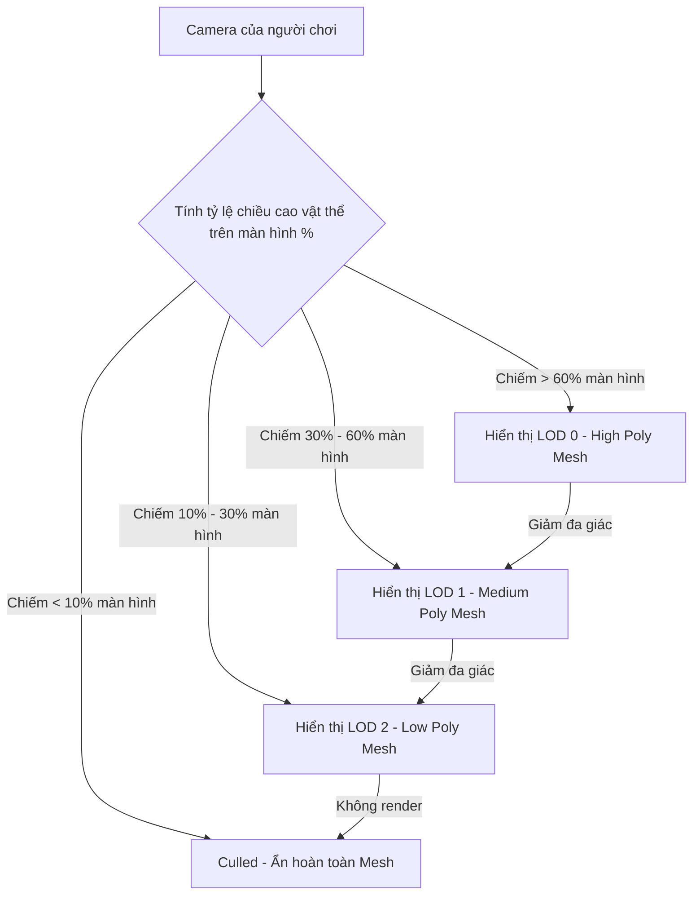

# World Building (Xây dựng Thế giới trong Unity 6)

> 📖 **Nguồn gốc:** Tổng hợp và biên soạn chọn lọc từ [Unity Manual — World Building](https://docs.unity3d.com/Manual/CreatingEnvironments.html) based on Unity 6.4 (LTS).

---

## 🎯 Ý định (Intent)

Mục tiêu của chương này là cung cấp kiến thức toàn diện về các công cụ thiết kế không gian màn chơi (Level Design) trong **Unity 6.4 (LTS)**. Lập trình viên và nhà thiết kế màn chơi sẽ hiểu sâu bản chất hệ thống địa hình **Terrain**, công cụ dựng hình thô **ProBuilder**, cơ chế tối ưu hóa đồ họa môi trường tĩnh thông qua **Static Batching Flags**, hệ thống đa chi tiết khoảng cách **LOD Group**, và cách viết các công cụ mở rộng Editor (Editor Scripting) để tự động hóa việc sắp xếp màn chơi.

---

## 🔑 Khái niệm Cốt lõi & Bản chất (Core Concepts & True Nature)

### 1. Bộ công cụ thiết kế thế giới trong Unity 6

*   **Terrain System (Hệ thống địa hình):** 
    *   *Bản chất:* Địa hình của Unity được xây dựng trên cơ sở dữ liệu **Heightmap** (Bản đồ độ cao). Cao độ của mặt đất được lưu dưới dạng một ảnh xám (Grayscale texture) 16-bit, trong đó giá trị màu trắng tương ứng với điểm cao nhất và màu đen tương ứng với điểm thấp nhất.
    *   *Ưu điểm:* Hệ thống tự động chia nhỏ Mesh địa hình thành các mảng nhỏ (Patch) và áp dụng cơ chế LOD động (giảm số đa giác ở xa camera) giúp tối ưu hóa bộ nhớ và tăng tốc độ vẽ cho card đồ họa.
*   **ProBuilder (Thiết kế 3D nhanh):**
    *   *Bản chất:* Cho phép bạn dựng mô hình 3D trực tiếp ngay trong giao diện Unity Editor. Bạn có thể kéo đẩy vertex, cạnh (edge), mặt (face), bo góc (bevel), đùn hình (extrude) và phân bổ UV nhanh.
    *   *Ứng dụng:* Thường dùng cho giai đoạn **Grayboxing** (Dựng khung thô bằng các khối xám để thử nghiệm gameplay trước khi có tài nguyên đồ họa hoàn chỉnh từ họa sĩ).
*   **3D Tilemap (Mảng gạch 3D):**
    *   *Bản chất:* Sử dụng một Grid (Lưới tọa độ) để xếp chồng các khối mô hình 3D (Tile) lặp đi lặp lại. Giúp xây dựng màn chơi dạng mô-đun (modular levels) nhanh chóng.

---

### 2. Tối ưu hóa thế giới tĩnh: Static Flags & Batching

Để dựng một thế giới rộng lớn với hàng vạn vật thể (như nhà cửa, cây cối, đá cuội) chạy mượt mà ở tốc độ 60+ FPS, ta bắt buộc phải hiểu cơ chế **Batching (Gộp nhóm lệnh vẽ)**.

Trong Inspector của mọi GameObject, có một ô chọn tên là **Static**. Khi bạn nhấn nút mũi tên bên cạnh, bạn sẽ thấy nhiều cờ (Flags) khác nhau, đặc biệt là **Batching Static**:
*   **Static Batching (Gộp lưới tĩnh):**
    *   *Cơ chế hoạt động:* Trước khi đóng gói game (Build Time) hoặc khi khởi chạy game, Unity tìm tất cả các GameObject được đánh dấu là `Batching Static` có cùng chất liệu (Material). Unity sẽ tự động gom các Mesh độc lập của chúng và gộp lại thành một **Mesh khổng lồ duy nhất**.
    *   *Hệ quả:* Thay vì gửi hàng trăm lệnh vẽ riêng lẻ (Draw Calls) cho từng vật thể nhỏ tới GPU, Unity chỉ cần gửi **một lệnh vẽ duy nhất** cho Mesh khổng lồ này.
    *   *Đánh đổi:* Static Batching tiêu hao rất nhiều RAM hệ thống vì nó phải tạo và lưu trữ Mesh gộp mới trong bộ nhớ, song song với việc giữ lại các Mesh gốc trong tệp tài sản.

---

### 3. Hệ thống LOD Group (Level of Detail - Đa cấp chi tiết)

GPU sẽ bị quá tải nếu phải xử lý một mô hình 3D chứa 100,000 đa giác (Polygons) khi mô hình đó nằm ở khoảng cách rất xa camera (chỉ chiếm 2 pixel trên màn hình).

*   **Giải pháp LOD Group:** Component `LODGroup` cho phép bạn liên kết nhiều phiên bản Mesh có độ chi tiết giảm dần của cùng một vật thể:
    *   **LOD 0:** Phiên bản Mesh gốc đầy đủ chi tiết nhất (khi Camera đứng siêu gần).
    *   **LOD 1:** Phiên bản Mesh lược bớt đa giác (Camera đứng xa vừa).
    *   **LOD 2:** Phiên bản Mesh cực kỳ thô (Camera đứng rất xa).
    *   **Culled:** Camera đứng quá xa, Unity ẩn hoàn toàn mô hình để tiết kiệm 100% tài nguyên vẽ.
*   **Cách thức hoạt động:** Unity tự động tính toán tỷ lệ phần trăm diện tích vật thể chiếm dụng trên chiều cao màn hình (Screen Height Percentage) và tự động tráo đổi Mesh phù hợp.

---

## 🎨 Cấu trúc & Vòng đời (Structure or Lifecycle)

Sơ đồ chuyển đổi hiển thị lưới của thành phần LOD Group dựa trên khoảng cách camera:



---

## 💻 Mã nguồn C# Scripting API (C# Example)

Việc sắp xếp thủ công hàng trăm Prefab trên lưới trong quá trình xây dựng thế giới là rất mất thời gian. Dưới đây là một script Editor Utility chuyên nghiệp (`GridPlacementEditor.cs`). Script này tạo một công cụ menu bổ sung trong Unity Editor (`Tools -> World Building -> Place Prefabs Grid`), tự động sắp xếp các GameObject được chọn theo một mạng lưới 3 chiều, tự động gán nhãn **Static Flags** để tối ưu hóa Static Batching, và tự động liên kết thành phần **LOD Group** cho các đối tượng.

```csharp
using UnityEngine;

#if UNITY_EDITOR
using UnityEditor;

public class GridPlacementEditor : EditorWindow
{
    private GameObject prefabToSpawn;
    private int rows = 5;
    private int columns = 5;
    private float spacing = 3.0f;
    private bool markAsBatchingStatic = true;

    [MenuItem("Tools/World Building/Grid Placement Tool")]
    public static void ShowWindow()
    {
        // Hiển thị cửa sổ công cụ tùy chỉnh trong Editor
        GetWindow<GridPlacementEditor>("Grid Placement Tool");
    }

    private void OnGUI()
    {
        GUILayout.Label("Thiết lập Sinh thế giới dạng Lưới", EditorStyles.boldLabel);

        prefabToSpawn = (GameObject)EditorGUILayout.ObjectField("Prefab cần xếp", prefabToSpawn, typeof(GameObject), false);
        rows = EditorGUILayout.IntField("Số Hàng (Rows)", rows);
        columns = EditorGUILayout.IntField("Số Cột (Columns)", columns);
        spacing = EditorGUILayout.FloatField("Khoảng cách (Spacing)", spacing);
        markAsBatchingStatic = EditorGUILayout.Toggle("Đặt Batching Static?", markAsBatchingStatic);

        if (GUILayout.Button("Sắp Xếp Lưới (Generate Grid)"))
        {
            GenerateGrid();
        }
    }

    private void GenerateGrid()
    {
        if (prefabToSpawn == null)
        {
            EditorUtility.DisplayDialog("Lỗi", "Vui lòng gán Prefab trước khi sinh lưới!", "Đóng");
            return;
        }

        // Tạo một GameObject cha để chứa cả lưới cho gọn Hierarchy
        GameObject parentRoot = new GameObject($"Procedural_Grid_{prefabToSpawn.name}");
        Undo.RegisterCreatedObjectUndo(parentRoot, "Generate Prefab Grid");

        for (int r = 0; r < rows; r++)
        {
            for (int c = 0; c < columns; c++)
            {
                // 1. Tính toán tọa độ lưới
                Vector3 spawnPosition = new Vector3(r * spacing, 0, c * spacing);

                // 2. Instantiate Prefab bằng công cụ của Editor để giữ liên kết Prefab gốc (không dùng Instantiate runtime)
                GameObject spawnedObj = (GameObject)PrefabUtility.InstantiatePrefab(prefabToSpawn);
                spawnedObj.transform.position = spawnPosition;
                spawnedObj.transform.SetParent(parentRoot.transform);

                // Ghi nhận lịch sử để có thể nhấn Ctrl + Z trong Editor để hoàn tác
                Undo.RegisterCreatedObjectUndo(spawnedObj, "Spawn Grid Element");

                // 3. Tự động thiết lập Static Flags tối ưu hóa Draw Calls
                if (markAsBatchingStatic)
                {
                    // Thiết lập cờ Batching Static và Occluder Static
                    GameObjectUtility.SetStaticEditorFlags(
                        spawnedObj,
                        StaticEditorFlags.BatchingStatic | StaticEditorFlags.OccludeeStatic | StaticEditorFlags.OccluderStatic
                    );
                }

                // 4. Kiểm tra hoặc thiết lập thành phần LOD Group
                ConfigureLODGroup(spawnedObj);
            }
        }

        Debug.Log($"[GridPlacementTool] Generated {rows * columns} objects successfully under {parentRoot.name}.");
    }

    /// <summary>
    /// Tự động kiểm tra và thiết lập LOD Group mẫu cho các vật thể được tạo ra.
    /// </summary>
    private void ConfigureLODGroup(GameObject target)
    {
        // Kiểm tra xem đối tượng có sẵn component LODGroup chưa
        if (!target.TryGetComponent<LODGroup>(out LODGroup lodGroup))
        {
            // Nếu chưa có, ta có thể tự động thêm vào
            lodGroup = target.AddComponent<LODGroup>();

            // Lấy tất cả MeshRenderer con để tự động gán vào LOD 0
            MeshRenderer[] renderers = target.GetComponentsInChildren<MeshRenderer>();
            
            if (renderers.Length > 0)
            {
                // Thiết lập một cấp LOD mẫu
                LOD[] lods = new LOD[1];
                lods[0] = new LOD(0.5f, renderers); // LOD0 chiếm từ 50% màn hình trở lên
                
                lodGroup.SetLODs(lods);
                lodGroup.RecalculateBounds();
            }
        }
    }
}
#endif

---

## ⚙️ Các bước thực hiện & Lưu ý thực chiến (Best Practices & Implementation Steps)

1. **Thiết lập Static Flags tối đa**: Luôn gán cờ `Batching Static` kết hợp cùng `Occluder/Occludee Static` cho mọi vật thể địa hình và kiến trúc đứng yên để tối ưu hóa lệnh vẽ và tận dụng cơ chế ẩn vật thể khuất (Occlusion Culling).
2. **Hạn chế số lượng cấp độ LOD**: Chỉ nên thiết kế tối đa từ 2 đến 3 cấp độ LOD (LOD 0 cho cự ly gần, LOD 1 cho cự ly trung bình, LOD 2 cho cự ly xa) để tránh làm dung lượng gói game phình to quá mức do phải chứa quá nhiều Mesh trùng lặp.
3. **Tuân thủ quy chuẩn đặt tên file 3D**: Khi xuất mô hình từ Blender hoặc Maya, hãy đặt tên hậu tố rõ ràng (như `MyRock_LOD0`, `MyRock_LOD1`). Unity sẽ tự động phát hiện các hậu tố này khi import và tự sinh component `LODGroup` được liên kết sẵn các Mesh tương ứng.
4. **Giới hạn ProBuilder ở bước làm Prototype**: ProBuilder rất mạnh trong việc tạo mẫu nhanh không gian chơi (Graybox). Tuy nhiên, hãy nhớ thay thế chúng bằng các file Mesh FBX đã qua tối ưu hóa lưới đa giác trước khi phát hành phiên bản game chính thức.
5. **Nướng Occlusion Culling cho game góc nhìn thứ nhất/thứ ba**: Với các game di chuyển trong môi trường nhiều vật cản (như mê cung, thành phố, hang động), việc nướng cấu trúc ẩn vật thể khuất sẽ giúp GPU hoàn toàn bỏ qua các phòng và tòa nhà phía sau tầm mắt, tăng hiệu suất xử lý đồ họa gấp nhiều lần.

---
> 📚 **Nguồn gốc:** Nội dung tham khảo từ [Unity Documentation](https://docs.unity3d.com/Manual/index.html) — Bản quyền của Unity Technologies.

| Hướng | Liên kết |
|-------|----------|
| ← Quay lại | [Cameras (Quay lại)](../../01-Manual/12-Cameras/00-cameras-overview.md) |
| → Tiếp theo | [Physics (Tiếp theo)](../../01-Manual/14-Physics/00-physics-overview.md) |
