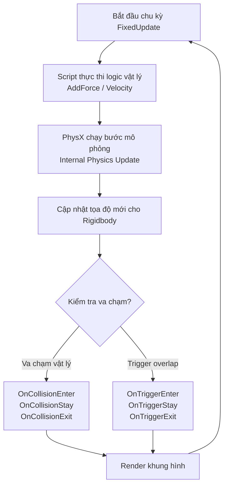

# Physics & Collision (Hệ thống Vật lý & Va chạm trong Unity 6)

> 📖 **Nguồn gốc:** Tổng hợp và biên soạn chọn lọc từ [Unity Manual — Physics](https://docs.unity3d.com/Manual/PhysicsSection.html) based on Unity 6.4 (LTS).

---

## 🎯 Ý định (Intent)

Mục tiêu của chương này là đi sâu vào bản chất hoạt động của hệ thống vật lý 3D (**NVIDIA PhysX**) được tích hợp trong **Unity 6.4 (LTS)**. Lập trình viên sẽ phân biệt được vai trò của **Rigidbody** và **Collider**, hiểu sâu cơ chế tính toán ma sát của **Physics Material**, làm chủ kỹ thuật bắn tia **Raycasting** tối ưu hóa, và làm quen với luồng cập nhật vật lý chuẩn chỉnh độc lập giữa hàm `FixedUpdate` và `Update`.

---

## 🔑 Khái niệm Cốt lõi & Bản chất (Core Concepts & True Nature)

### 1. Rigidbody vs Colliders: Cơ cấu Vật lý & Va chạm

Hệ thống vật lý chia tách rạch ròi giữa hành vi động lực học và hình học va chạm:
*   **Rigidbody (Khối lượng & Lực):** Thành phần cấp quyền cho GameObject chịu tác động của trọng lực, lực đẩy, mô-men xoắn và ma sát không khí.
    *   *Kinematic Rigidbody (`isKinematic = true`):* Đối tượng vật lý không chịu tác động của lực hay va chạm từ bên ngoài, mà di chuyển hoàn toàn bằng code (qua Transform hoặc Script). Tuy nhiên, nó vẫn có khả năng đẩy các Rigidbody động khác và vẫn kích hoạt đầy đủ các sự kiện va chạm.
*   **Collider (Hình dáng va chạm):** Định nghĩa ranh giới hình học để phát hiện va chạm.
    *   *Primitive Colliders (Sơ cấp):* `BoxCollider`, `SphereCollider`, `CapsuleCollider`. Các hình này được tính toán va chạm bằng các công thức hình học giải tích siêu nhẹ. Luôn ưu tiên dùng các Collider này.
    *   *Mesh Collider (Lưới va chạm phức tạp):* Sử dụng trực tiếp lưới đa giác của mô hình 3D để làm ranh giới va chạm. Rất tốn tài nguyên CPU để tính toán giao điểm va chạm.
    *   *Cảnh báo Convex:* Nếu một Mesh Collider được gắn trên một GameObject có di chuyển (không phải vật tĩnh), bạn bắt buộc phải bật thuộc tính **Convex** (giới hạn lưới đa giác dưới 255 tam giác và không có góc lõm). Nếu không, PhysX sẽ từ chối tính toán va chạm giữa Mesh Collider này với các Mesh Collider khác.
*   **Trigger Colliders (`isTrigger = true`):** Khi bật cờ này, đối tượng sẽ không cản trở chuyển động của vật thể khác (đi xuyên qua nhau), nhưng Unity vẫn theo dõi và phát đi các sự kiện kiểm tra giao nhau qua các hàm `OnTriggerEnter`, `OnTriggerStay`, `OnTriggerExit`.

---

### 2. Vòng lặp cập nhật vật lý: FixedUpdate vs Update

Một sai lầm kinh điển của lập trình viên mới là áp dụng lực vật lý trong hàm `Update()`.

```
Vòng lặp đồ họa:   [Update] (Thời gian không đều) ──> [Render Khung hình] ──> [Hiển thị]
Vòng lặp vật lý:   [FixedUpdate] (0.02s cố định) ──> [PhysX Simulation Step] ──> [Collision Events]
```

*   **`Update()`:** Chạy một lần mỗi khung hình. Tốc độ khung hình biến thiên liên tục tùy thuộc vào độ nặng đồ họa của cảnh và cấu hình máy. Khoảng thời gian giữa 2 khung hình (`Time.deltaTime`) hoàn toàn không ổn định.
*   **`FixedUpdate()`:** Chạy ở các chu kỳ thời gian cố định tuyệt đối (mặc định là `0.02` giây một lần, tức 50Hz).
*   **Tại sao lực vật lý phải nằm trong `FixedUpdate`?**
    PhysX giải các phương trình vi phân chuyển động theo từng bước thời gian cố định (**Fixed Time Step**). Nếu bạn gọi `Rigidbody.AddForce` trong `Update`, lực sẽ được cộng vào theo tần suất không đều (máy mạnh FPS cao lực cộng nhiều, máy yếu FPS thấp lực cộng ít), dẫn đến việc nhân vật nhảy cao hơn hoặc bay xa hơn trên các máy có cấu hình khác nhau.

---

### 3. Raycasting & Tối ưu hóa quét tia

**Raycast** là việc bắn một tia toán học từ một điểm gốc theo một hướng nhất định với chiều dài giới hạn để dò tìm xem có va chạm với Collider nào không.
*   *Bản chất:* PhysX sử dụng cấu trúc cây gia tốc phân cấp không gian **AABB (Axis-Aligned Bounding Box Tree)** để tìm kiếm nhanh các Collider nằm trên đường đi của tia.
*   *Tối ưu hóa:* 
    *   Luôn giới hạn khoảng cách tối đa của tia (`maxDistance`), tránh bắn tia vô tận.
    *   Luôn sử dụng bộ lọc lớp **`LayerMask`** để tia Raycast bỏ qua các vật thể không cần thiết (như các Trigger vùng ẩn, UI, cỏ cây), chỉ tập trung dò các Layer chính (như `Default`, `Ground`, `Obstacles`).

---

### 4. Physics Materials (Chất liệu vật lý)

Được dùng để cấu hình ma sát (**Friction**) và độ nảy (**Bounciness / Restitution**) của bề mặt Collider khi chúng va chạm nhau. Khi hai vật thể chạm nhau, PhysX sẽ kết hợp các Physics Material của cả hai dựa trên các thuật toán hòa trộn (Average, Minimum, Multiply, Maximum) để tính toán phản lực chân thực nhất.

---

## 🎨 Cấu trúc & Vòng đời (Structure or Lifecycle)

Luồng xử lý sự kiện trong vòng lặp vật lý của Unity:



---

## 💻 Mã nguồn C# Scripting API (C# Example)

Script dưới đây (`RaycastShooter.cs`) minh họa một bộ điều khiển súng góc nhìn thứ nhất (FPS Raycast Weapon). Khi bắn, tia Raycast được phóng từ giữa màn hình Camera, lọc lớp va chạm bằng `LayerMask`. Nếu bắn trúng vật thể có `Rigidbody`, súng sẽ truyền xung lực vật lý tại đúng điểm chạm (`AddForceAtPosition`) và sinh sản các lỗ đạn (Decal) định hướng chính xác theo vector pháp tuyến (`hit.normal`).

```csharp
using UnityEngine;

public class RaycastShooter : MonoBehaviour
{
    [Header("Weapon Configurations")]
    [SerializeField] private Camera playerCamera;
    [SerializeField] private float fireRate = 0.15f;
    [SerializeField] private float weaponRange = 100f;
    [SerializeField] private float hitForce = 15f; // Xung lực truyền vào đối tượng bị bắn trúng

    [Header("Raycast Targeting")]
    [SerializeField] private LayerMask shootableLayers; // Layer lọc chỉ bắn trúng kẻ địch/môi trường

    [Header("Visual Effects")]
    [SerializeField] private GameObject impactDecalPrefab; // Prefab lỗ đạn/hiệu ứng nổ nhỏ
    [SerializeField] private float decalDestroyTime = 3.0f;

    private float nextFireTime;

    private void Update()
    {
        // Nhận nút bấm bắn trong Update để tránh mất sự kiện nhấn chuột nhanh
        if (Input.GetButton("Fire1") && Time.time >= nextFireTime)
        {
            nextFireTime = Time.time + fireRate;
            ShootWeapon();
        }
    }

    /// <summary>
    /// Thực hiện cơ chế bắn súng bằng Raycast và truyền tương tác vật lý.
    /// </summary>
    private void ShootWeapon()
    {
        if (playerCamera == null)
        {
            Debug.LogError("[Shooter] Player Camera is not assigned!");
            return;
        }

        // 1. Xác định tâm màn hình để phóng tia
        Vector3 rayOrigin = playerCamera.ViewportToWorldPoint(new Vector3(0.5f, 0.5f, 0f));
        Vector3 rayDirection = playerCamera.transform.forward;

        // 2. Thực hiện Raycast dò va chạm
        RaycastHit hit;

        // Phóng tia dò va chạm chỉ tập trung vào shootableLayers
        if (Physics.Raycast(rayOrigin, rayDirection, out hit, weaponRange, shootableLayers))
        {
            Debug.Log($"[Shooter] Hit: {hit.collider.name} at location {hit.point}");

            // 3. Tương tác vật lý: Áp dụng lực va chạm tại điểm tiếp xúc (Hit Point)
            // Lấy Rigidbody của vật bị trúng đạn (nếu có)
            if (hit.collider.TryGetComponent<Rigidbody>(out Rigidbody rb))
            {
                // Tính toán hướng lực đẩy: Theo hướng của tia bắn
                Vector3 forceDirection = rayDirection * hitForce;

                // Áp lực tại điểm bắn trúng (ForceMode.Impulse: Truyền lực tức thì dạng va chạm)
                rb.AddForceAtPosition(forceDirection, hit.point, ForceMode.Impulse);
            }

            // 4. Sinh sản hiệu ứng hình ảnh va chạm (Decal)
            if (impactDecalPrefab != null)
            {
                // Tạo decal ngay tại điểm chạm hit.point
                // Hướng của decal được xoay để đối diện ngược lại với vector pháp tuyến bề mặt (hit.normal)
                Quaternion decalRotation = Quaternion.LookRotation(hit.normal);

                GameObject decalInstance = Instantiate(impactDecalPrefab, hit.point + (hit.normal * 0.001f), decalRotation);
                
                // Gắn decal làm con của vật thể bị bắn trúng để nó di chuyển theo vật thể đó (ví dụ: hòm gỗ di động)
                decalInstance.transform.SetParent(hit.collider.transform);

                // Tự động hủy decal sau vài giây để giải phóng bộ nhớ
                Destroy(decalInstance, decalDestroyTime);
            }
        }
        else
        {
            Debug.Log("[Shooter] Shot missed. No hit detected.");
        }
    }

    // Vẽ tia Debug đỏ trong giao diện Scene để dễ lập trình phát triển
    private void OnDrawGizmos()
    {
        if (playerCamera != null)
        {
            Gizmos.color = Color.red;
            Vector3 startPoint = playerCamera.transform.position;
            Vector3 endPoint = startPoint + (playerCamera.transform.forward * weaponRange);
            Gizmos.DrawLine(startPoint, endPoint);
        }
    }
}

---

## ⚙️ Các bước thực hiện & Lưu ý thực chiến (Best Practices & Implementation Steps)

1. **Thực thi lực vật lý trong `FixedUpdate`**: Mọi thao tác tác động lực vật lý như `Rigidbody.AddForce`, `AddTorque` hoặc thay đổi vận tốc trực tiếp qua các thuộc tính của Unity 6 như **`Rigidbody.linearVelocity`** và **`Rigidbody.angularVelocity`** bắt buộc phải thực hiện trong `FixedUpdate` để đảm bảo hoạt động độc lập với tốc độ khung hình.
2. **Ưu tiên Collider dạng cơ bản (Primitives)**: Hạn chế tối đa sử dụng `MeshCollider`. Đối với các vật thể có cấu tạo phức tạp, hãy tạo cấu trúc gộp va chạm (**Compound Collider**) bằng cách gắn nhiều Collider cơ bản (Box, Sphere, Capsule) vào các GameObject con nằm dưới GameObject cha chứa `Rigidbody`.
3. **Luôn gắn Rigidbody cho Collider di động**: Nếu một GameObject có Collider di chuyển (ví dụ: bục nâng di động, cánh cửa tự động mở), hãy luôn gắn cho nó một component Rigidbody và đánh dấu `isKinematic = true`. Việc di chuyển Collider tĩnh (Static Collider - không có Rigidbody) sẽ ép PhysX phải dựng lại toàn bộ cây gia tốc phân cấp không gian (AABB Tree), gây sụt giảm hiệu năng xử lý CPU nghiêm trọng.
4. **Luôn lọc LayerMask khi Raycast**: Không bao giờ gọi hàm `Physics.Raycast` mà không khai báo `LayerMask`. Chỉ định rõ ràng lớp va chạm sẽ giúp PhysX loại bỏ ngay lập tức 90% vật thể không liên quan, tăng tốc độ tính toán quét tia lên gấp nhiều lần.
5. **Kích hoạt Nội suy Vật lý (Interpolation)**: Đối với các nhân vật di chuyển chính được camera theo dõi (hoặc xe cộ chạy nhanh), hãy chuyển thuộc tính **Interpolate** trên Rigidbody thành `Interpolate`. Thiết lập này giúp Unity nội suy vị trí vật lý đồng bộ mượt mà với luồng xử lý đồ họa chính, triệt tiêu hoàn toàn hiện tượng camera bị giật (Jitter).

---
> 📚 **Nguồn gốc:** Nội dung tham khảo từ [Unity Documentation](https://docs.unity3d.com/Manual/index.html) — Bản quyền của Unity Technologies.

| Hướng | Liên kết |
|-------|----------|
| ← Quay lại | [World Building (Quay lại)](../../01-Manual/13-World-Building/00-world-building-overview.md) |
| → Tiếp theo | [Input (Tiếp theo)](../../01-Manual/15-Input/01-introduction-to-input.md) |
