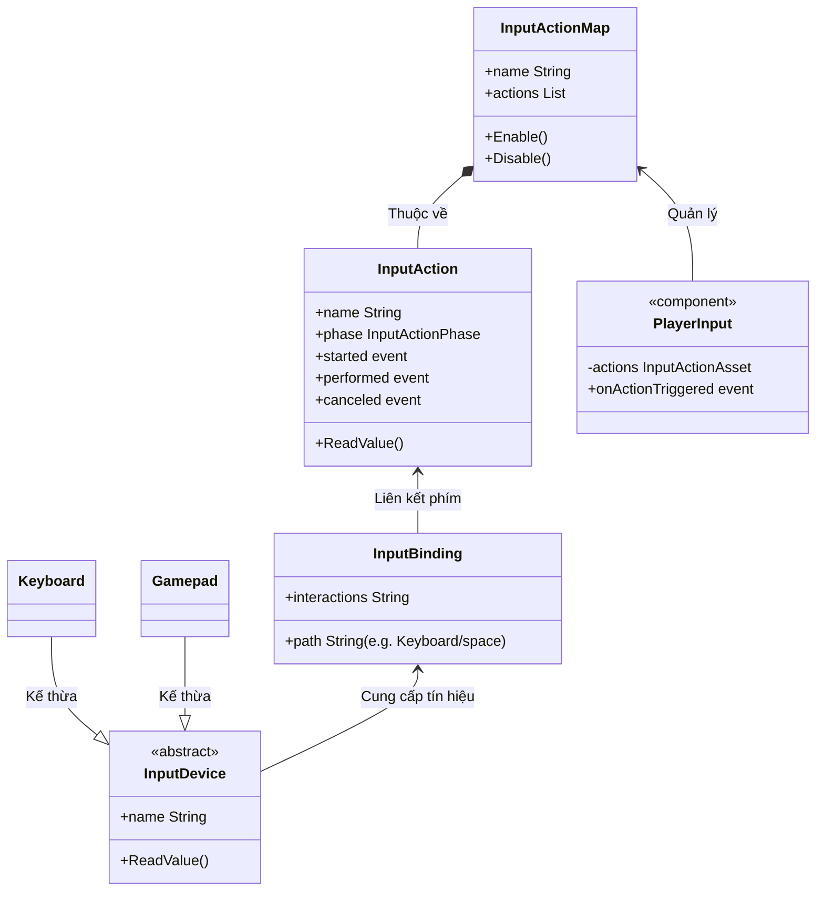

# Introduction to Input (Giới thiệu về Input trong Unity)

> 📖 **Nguồn gốc:** Tổng hợp, chọn lọc và biên soạn chuyên sâu từ tài liệu chính thống [Unity Manual — Input](https://docs.unity3d.com/Manual/Input.html) phiên bản **Unity 6.4 (LTS)**.

---

## 🎯 Ý định (Intent)

Hệ thống **Input** (Đầu vào) trong Unity chịu trách nhiệm tiếp nhận, xử lý và phân phối các tín hiệu điều khiển từ thiết bị phần cứng của người chơi (Bàn phím, Chuột, Tay cầm Gamepad, Màn hình cảm ứng, thiết bị VR/XR) vào trong logic của trò chơi.

Mục tiêu của chương này là giúp bạn hiểu rõ **bản chất kiến trúc** bên dưới của hệ thống xử lý đầu vào, so sánh tường minh giữa hai thế hệ **Legacy Input Manager** và **New Input System** trong phiên bản **Unity 6.4**, và cách lập trình C# chuẩn mực để tối ưu hóa hiệu năng cũng như trải nghiệm người chơi.

---

## ❌ Vấn đề (Problem): Luồng đi vật lý của sự kiện Input

Để hiểu tại sao hệ thống Input hoạt động như vậy, hãy nhìn vào hành trình của một nút bấm từ ngón tay người chơi đến màn hình:

```
[Phần cứng: Phím Space] 
       │ (Nhấn nút)
       v
[Hệ điều hành: Windows/OS] -> Tạo Sự kiện Input (OS Event Loop: Win32 Message, Cocoa Event)
       │ (Gửi sự kiện đến Window của Game)
       v
[Unity Engine Runtime (C++)] -> Đọc sự kiện ở luồng Native (Native Input Event Queue)
       │ (Buffer sự kiện và đưa vào vòng lặp game)
       v
[Unity Player Loop] -> Input System Update (Đầu khung hình)
       │ (Phân phối dữ liệu sang Scripting Layer C#)
       v
[C# Scripting API] -> Đọc trạng thái qua Input class hoặc gọi Callback Event
       │ (Thay đổi vận tốc Rigidbody)
       v
[Physics & Rendering Engine] -> Vẽ hình nhân vật nhảy lên màn hình
```

Nếu một engine game không thiết kế tốt tầng tiếp nhận này, trò chơi sẽ gặp các lỗi nghiêm trọng:
*   **Input Lag (Độ trễ):** Sự kiện bị hoãn lại qua nhiều khung hình trước khi script nhận được.
*   **Input Loss (Mất nút):** Người chơi nhấn phím rất nhanh (double tap) nhưng game không nhận diện được do khung hình bị tụt (Lag).
*   **Frame rate Dependency (Phụ thuộc tốc độ khung hình):** Tốc độ di chuyển hoặc khả năng nhận phím thay đổi khi game chạy ở 30 FPS so với 120 FPS.

---

## ✅ Giải pháp (Solution)

Unity cung cấp hai giải pháp xử lý Input song song trong phiên bản Unity 6.4:

1.  **Legacy Input Manager (`UnityEngine.Input`):** Sử dụng cơ chế **Polling (Truy vấn liên tục)**. Cứ mỗi khung hình, script sẽ hỏi trực tiếp Engine: *"Phím Space có đang được nhấn không?"*.
2.  **New Input System (`UnityEngine.InputSystem`):** Sử dụng cơ chế **Event-Driven (Hướng sự kiện)**. Trình quản lý sẽ thông báo cho script: *"Phím Space vừa được nhấn, hãy kích hoạt hành động nhảy!"*.

---

## 🎨 Cấu trúc (Structure) của New Input System

Kiến trúc của **New Input System** được thiết kế để tách biệt hoàn toàn phần cứng vật lý khỏi mã nguồn xử lý logic (Loose Coupling) thông qua các lớp trừu tượng:



### Giải nghĩa các thành phần:
*   **Input Device:** Đại diện cho thiết bị vật lý.
*   **Input Binding:** Định nghĩa đường dẫn thiết bị cụ thể liên kết đến một hành động (ví dụ: phím `W` trên Keyboard hoặc `Left Stick` hướng lên trên Gamepad).
*   **Input Action:** Đại diện cho hành động logic trong game (ví dụ: `Jump`, `Move`, `Shoot`). Mã nguồn của bạn chỉ tương tác với Action này mà không cần biết người chơi đang dùng bàn phím hay tay cầm.
*   **Action Map:** Nhóm các Action liên quan (ví dụ: nhóm `Player` cho di chuyển, nhóm `UI` cho di chuyển chuột trong menu). Có thể kích hoạt hoặc tắt cả nhóm tùy ngữ cảnh game.
*   **Player Input:** Component của Unity giúp liên kết các sự kiện của Action Map trực tiếp vào các hàm C# thông qua Unity Events trên Inspector.

---

## 💻 Mã giả & Scripting API (C# Unity 6.4)

Dưới đây là 4 cách lập trình tiếp nhận Input trong Unity 6.4, đi từ phương pháp truyền thống đến hiện đại:

### Cách 1: Sử dụng Legacy Input Manager (Polling truyền thống)
Cách này đơn giản, phù hợp để làm prototype nhanh nhưng khó mở rộng.

```csharp
using UnityEngine;

public class LegacyInputExample : MonoBehaviour
{
    [SerializeField] private float speed = 5.0f;

    void Update()
    {
        // Polling (truy vấn liên tục) ở mỗi khung hình Update
        float moveHorizontal = Input.GetAxis("Horizontal"); // Trả về giá trị từ -1.0f đến 1.0f
        float moveVertical = Input.GetAxis("Vertical");

        Vector3 movement = new Vector3(moveHorizontal, 0.0f, moveVertical);
        transform.Translate(movement * speed * Time.deltaTime);

        // Kiểm tra nút nhấn đơn lẻ
        if (Input.GetButtonDown("Jump"))
        {
            PerformJump();
        }
    }

    private void PerformJump()
    {
        Debug.Log("Nhảy lên sử dụng Legacy Input!");
    }
}
```

### Cách 2: Đọc trực tiếp thiết bị trong New Input System (Direct Polling)
New Input System cũng hỗ trợ đọc trực tiếp trạng thái phần cứng mà không cần qua file cấu hình Action Asset.

```csharp
using UnityEngine;
using UnityEngine.InputSystem; // Bắt buộc import namespace mới

public class DirectNewInputExample : MonoBehaviour
{
    [SerializeField] private float speed = 5.0f;

    void Update()
    {
        // Kiểm tra thiết bị có đang hoạt động không
        if (Keyboard.current == null) return;

        // Đọc giá trị trực tiếp từ phím cứng
        Vector2 moveInput = Vector2.zero;
        if (Keyboard.current.wKey.isPressed) moveInput.y = 1;
        if (Keyboard.current.sKey.isPressed) moveInput.y = -1;
        if (Keyboard.current.aKey.isPressed) moveInput.x = -1;
        if (Keyboard.current.dKey.isPressed) moveInput.x = 1;

        Vector3 movement = new Vector3(moveInput.x, 0.0f, moveInput.y);
        transform.Translate(movement * speed * Time.deltaTime);

        // Kiểm tra phím vừa nhấn xuống trong khung hình hiện tại
        if (Keyboard.current.spaceKey.wasPressedThisFrame)
        {
            PerformJump();
        }
    }

    private void PerformJump()
    {
        Debug.Log("Nhảy lên sử dụng New Input (Đọc trực tiếp thiết bị)!");
    }
}
```

### Cách 3: Lập trình hướng sự kiện qua C# Class tự động tạo từ InputAction Asset (Khuyên dùng cho Code sạch)
Đây là cách làm chuyên nghiệp nhất, tối ưu hiệu năng và tách biệt hoàn toàn cấu hình phím với mã nguồn.

1.  Tạo tệp `.inputactions` trong Unity Editor (ví dụ đặt tên là `GameControls`).
2.  Bật tính năng **Generate C# Class** trên file đó để Unity tự động sinh ra class `GameControls.cs`.
3.  Viết code đăng ký sự kiện như sau:

```csharp
using UnityEngine;
using UnityEngine.InputSystem;

public class EventNewInputExample : MonoBehaviour
{
    private GameControls controls; // Class tự sinh ra từ Action Asset
    private Vector2 moveInput;

    private void Awake()
    {
        controls = new GameControls();

        // Đăng ký callback events
        // started: Nút vừa nhấn xuống
        // performed: Nhấn giữ hoặc giá trị thay đổi (cho cần analog)
        // canceled: Thả nút ra
        controls.Player.Move.performed += ctx => moveInput = ctx.ReadValue<Vector2>();
        controls.Player.Move.canceled += ctx => moveInput = Vector2.zero;

        controls.Player.Jump.started += OnJumpTriggered;
    }

    private void OnEnable()
    {
        controls.Player.Enable(); // Bật Action Map "Player"
    }

    private void OnDisable()
    {
        controls.Player.Disable(); // Tắt Action Map để tránh rò rỉ bộ nhớ
    }

    private void OnDestroy()
    {
        // Hủy đăng ký sự kiện khi GameObject bị phá hủy
        controls.Player.Jump.started -= OnJumpTriggered;
    }

    void Update()
    {
        Vector3 movement = new Vector3(moveInput.x, 0.0f, moveInput.y);
        transform.Translate(movement * 5.0f * Time.deltaTime);
    }

    private void OnJumpTriggered(InputAction.CallbackContext context)
    {
        Debug.Log("Nhảy lên qua Event-driven C# Actions!");
    }
}
```

### Cách 4: Sử dụng Component `PlayerInput` kết nối UnityEvent (Dễ dùng cho Game Designer)
Phù hợp khi làm việc nhóm, cho phép kéo thả hàm trực tiếp trên Unity Inspector mà không cần viết dòng code đăng ký sự kiện nào.

```csharp
using UnityEngine;
using UnityEngine.InputSystem;

public class DesignerInputExample : MonoBehaviour
{
    private Vector2 moveInput;

    // Hàm này sẽ được kéo thả gán vào sự kiện OnMove của Component PlayerInput trên Inspector
    public void OnMove(InputValue value)
    {
        moveInput = value.Get<Vector2>();
    }

    // Hàm này gán vào OnJump trên Inspector
    public void OnJump()
    {
        Debug.Log("Nhảy lên qua PlayerInput UnityEvent!");
    }

    void Update()
    {
        Vector3 movement = new Vector3(moveInput.x, 0.0f, moveInput.y);
        transform.Translate(movement * 5.0f * Time.deltaTime);
    }
}
```

---

## ⚙️ Khả năng áp dụng (Applicability)

| Tiêu chí so sánh | Legacy Input Manager | New Input System (Khuyên dùng) |
| :--- | :--- | :--- |
| **Cơ chế hoạt động** | Polling-based (Truy vấn thụ động) | Event-driven (Chủ động phát sự kiện) |
| **Độ khớp nối (Coupling)** | Rất chặt (Hardcoded phím vào script) | Rất lỏng (Mã nguồn chỉ giao tiếp qua Action) |
| **Hỗ trợ chơi nhiều người (Local Co-op)**| Cực kỳ phức tạp, phải cấu hình tay cầm thủ công | Tự động phân phối thiết bị qua `PlayerInputManager` |
| **Đổi nút trong game (Rebinding)** | Rất khó hiện thực, đòi hỏi viết file cấu hình riêng | Hỗ trợ sẵn API `RebindingOperation` của thư viện |
| **Khả năng viết Unit Test** | Gần như bất khả thi nếu không chạy giả lập Editor | Rất dễ viết test bằng cách chèn sự kiện giả lập |

---

## ⚠️ Giải pháp thực chiến: Lỗi mất nút hoặc trùng nút giữa Update và FixedUpdate (Vật lý Rigidbody)

Đây là **vấn đề kinh điển** khiến nhiều lập trình viên Unity đau đầu khi xử lý lực nhảy vật lý:

### Triệu chứng lỗi:
*   Bạn viết code nhảy sử dụng `Rigidbody.AddForce` trong hàm `FixedUpdate()` vì nó liên quan đến vật lý.
*   Nếu bạn gọi `Input.GetButtonDown("Jump")` trực tiếp trong `FixedUpdate()`, đôi khi người chơi bấm nút Space nhưng nhân vật không hề nhảy lên (Mất nút).
*   Đôi khi người chơi chỉ bấm một lần nhưng nhân vật lại nhảy liên tục 2 lần (Trùng nút).

### Bản chất nguyên nhân:
1.  `Update()` chạy theo tốc độ làm tươi màn hình (ví dụ game chạy 120 FPS -> Update chạy 120 lần/giây).
2.  `FixedUpdate()` chạy theo chu kỳ thời gian cố định độc lập (mặc định là 50 lần/giây, tức mỗi 0.02 giây).
3.  Cờ hiệu `GetButtonDown` hoặc sự kiện nút nhấn chỉ tồn tại trong **duy nhất một khung hình `Update()`**. 
    *   Nếu trong 1 khung hình `Update()`, không có chu kỳ `FixedUpdate()` nào chạy qua -> Tín hiệu nhảy bị xóa bỏ trước khi vật lý kịp đọc -> **Mất nút**.
    *   Nếu game bị lag, Update chạy chậm (20 FPS), FixedUpdate vẫn chạy đều (50 FPS). Có nghĩa là giữa 2 khung hình Update sẽ có 2 đến 3 chu kỳ FixedUpdate chạy liên tiếp. Do cờ hiệu nhảy vẫn giữ giá trị `true` cho đến khung Update tiếp theo, cả 3 chu kỳ FixedUpdate đều đọc được giá trị `true` và cộng lực liên tiếp 3 lần -> **Trùng lực nhảy**.

### Giải pháp xử lý chuẩn mực:
Đọc Input trong `Update()` (bắt trọn 100% sự kiện bấm nút nhanh nhất) và lưu trữ trạng thái vào biến cờ hiệu. Thực thi và **tiêu thụ ngay** biến cờ hiệu đó trong `FixedUpdate()`.

```csharp
using UnityEngine;
using UnityEngine.InputSystem;

[RequireComponent(typeof(Rigidbody))]
public class PhysicsJumpSolver : MonoBehaviour
{
    [SerializeField] private float jumpForce = 5.0f;
    private Rigidbody rb;
    private GameControls controls;
    
    // Cờ hiệu lưu trạng thái input
    private bool isJumpPending = false;

    private void Awake()
    {
        rb = GetComponent<Rigidbody>();
        controls = new GameControls();
        
        // Đăng ký sự kiện: bấm nút là đặt cờ hiệu thành true
        controls.Player.Jump.started += ctx => isJumpPending = true;
    }

    private void OnEnable() => controls.Player.Enable();
    private void OnDisable() => controls.Player.Disable();

    void Update()
    {
        // Nếu dùng Legacy Input, bạn viết thế này:
        // if (Input.GetButtonDown("Jump")) { isJumpPending = true; }
    }

    // FixedUpdate chạy đồng bộ với chu kỳ vật lý
    void FixedUpdate()
    {
        // Nếu có cờ hiệu nhảy đang chờ xử lý
        if (isJumpPending)
        {
            // Thực thi lực nhảy vật lý
            rb.AddForce(Vector3.up * jumpForce, ForceMode.Impulse);
            
            // TIÊU THỤ CỜ HIỆU: Reset ngay lập tức về false để tránh trùng lực khung hình tiếp theo
            isJumpPending = false;
        }
    }
}
```

---

> 📚 **Nguồn gốc:** Nội dung tham khảo từ [Unity Documentation](https://docs.unity3d.com/Manual/index.html) — Bản quyền của Unity Technologies.

| Hướng | Liên kết |
|-------|----------|
| ← Quay lại | [Tổng quan Unity Lộ trình](../../00-unity-overview.md) |
| → Tiếp theo | [Get Started (Đang biên tập)](../../01-Manual/01-Get-Started/00-get-started-overview.md) |
