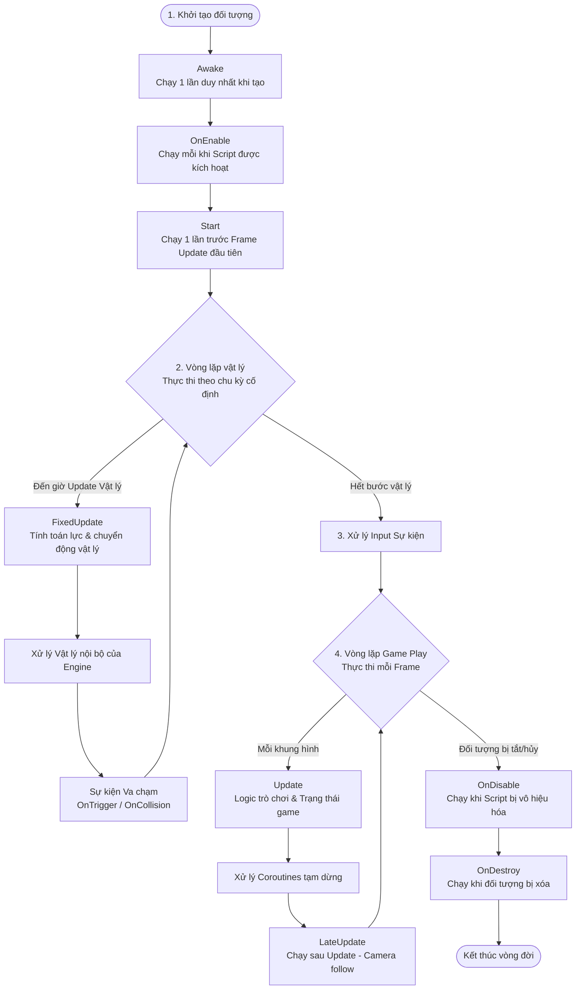

# MonoBehaviour Lifecycle (Vòng đời MonoBehaviour)

> 📖 **Nguồn gốc:** Tài liệu được tổng hợp và biên soạn chi tiết từ [Unity Manual — Order of execution for event functions](https://docs.unity3d.com/Manual/ExecutionOrder.html) dựa trên phiên bản **Unity 6.4 (LTS) ổn định**.

---

## 🎯 Ý định (Intent)

Lớp `MonoBehaviour` là lớp cơ sở (Base Class) mà tất cả các tập lệnh C# trong Unity kế thừa nếu muốn gắn vào `GameObject` dưới dạng một Component. Unity quản lý vòng đời của `MonoBehaviour` thông qua một chuỗi các hàm sự kiện (Event Functions) được gọi theo một **thứ tự thực thi nghiêm ngặt** trong vòng lặp game chính (Player Loop). 

Hiểu rõ sơ đồ này giúp lập trình viên tránh được các lỗi liên quan đến bất đồng bộ tài nguyên (ví dụ: truy cập một đối tượng chưa khởi tạo dẫn đến lỗi `NullReferenceException`) và viết code tối ưu hiệu năng.

---

## 🎨 Thứ tự thực thi sự kiện (Event Loop Structure)

Vòng lặp chính của Unity bao gồm các giai đoạn lớn được thực thi tuần tự như sau:



---

## 🔍 Chi tiết các giai đoạn cốt lõi

### 1. Giai đoạn khởi tạo (Initialization)
*   **`Awake()`**: 
    *   Được gọi ngay sau khi GameObject được tạo ra (thông qua nạp Scene hoặc Instantiate).
    *   *Mục đích:* Dùng để thiết lập các tham chiếu cục bộ bên trong bản thân GameObject (ví dụ: `GetComponent()`, khởi tạo danh sách nội bộ).
    *   *Lưu ý:* Luôn được gọi kể cả khi component `MonoBehaviour` đó đang bị tắt (disabled).
*   **`OnEnable()`**:
    *   Được gọi ngay khi Script được kích hoạt hoạt động.
    *   *Mục đích:* Dùng để đăng ký lắng nghe các sự kiện (Events/Delegates).
*   **`Start()`**:
    *   Được gọi trước khung hình (frame) đầu tiên mà Script chạy Update.
    *   *Mục đích:* Dùng để kết nối, lấy dữ liệu từ các GameObject khác trong Scene (ví dụ: tìm GameManager, thiết lập liên kết cross-object).

> [!IMPORTANT]
> **Quy tắc vàng phân chia giữa Awake và Start:**
> Luôn khởi tạo biến nội bộ của chính class trong `Awake()`. Luôn truy xuất biến hoặc gọi hàm từ các Script khác trong `Start()`. Điều này đảm bảo rằng khi bạn gọi sang một Script khác trong `Start()`, đối tượng kia chắc chắn đã chạy qua `Awake()` và đã tự cấu hình xong tham chiếu của nó.

### 2. Vòng lặp Vật lý (Physics Loop)
Khác với vòng lặp vẽ đồ họa (Frame Update), vòng lặp vật lý chạy ở một chu kỳ thời gian cố định độc lập với tốc độ khung hình (mặc định là `0.02` giây một lần).
*   **`FixedUpdate()`**: 
    *   Tất cả các tính năng liên quan đến tác dụng lực (`AddForce`), di chuyển vật lý (`velocity`) của Rigidbody bắt buộc phải đặt trong hàm này.
    *   *Thời gian:* Sử dụng `Time.fixedDeltaTime` thay vì `Time.deltaTime` để tính toán gia tốc vật lý.
*   **Sự kiện va chạm**: `OnCollisionEnter`, `OnTriggerStay`, `OnCollisionExit`, v.v... được gọi ngay sau bước xử lý vật lý nội bộ của Engine.

### 3. Vòng lặp Game Play (Game Logic Loop)
Chạy dựa trên tần suất kết xuất khung hình của card đồ họa (Frame-rate dependent).
*   **`Update()`**: 
    *   Được gọi một lần trên mỗi khung hình. Tần suất gọi phụ thuộc vào cấu hình phần cứng của thiết bị (máy mạnh chạy nhiều FPS sẽ gọi nhiều lần hơn).
    *   *Mục đích:* Nhận Input từ người chơi, tính toán bộ đếm thời gian (Timers), di chuyển các đối tượng phi vật lý.
    *   *Thời gian:* Bắt buộc nhân các hệ số di chuyển với `Time.deltaTime` để đảm bảo chuyển động mượt mà đồng nhất trên mọi thiết bị (Framerate Independence).
*   **`LateUpdate()`**:
    *   Được gọi một lần trên mỗi khung hình, đảm bảo xảy ra **sau khi tất cả** các hàm `Update()` khác trên toàn Scene đã kết thúc.
    *   *Mục đích:* Thích hợp nhất cho camera theo sau nhân vật (Camera Follow). Nhân vật di chuyển trong `Update()`, camera dịch chuyển theo trong `LateUpdate()` để loại bỏ hiện tượng rung giật hình ảnh (jittering).

### 4. Giai đoạn Hủy đối tượng (Decommissioning)
*   **`OnDisable()`**: Được gọi khi script bị tắt hoặc GameObject bị ẩn (`SetActive(false)`). Thích hợp hủy đăng ký lắng nghe sự kiện để tránh rò rỉ bộ nhớ (memory leak).
*   **`OnDestroy()`**: Được gọi trước khi đối tượng bị giải phóng hoàn toàn khỏi RAM bởi hàm `Destroy()`.

---

## 🎮 Mã nguồn thực chiến (Unity C#)

Dưới đây là một Script mẫu thể hiện chi tiết cách áp dụng thứ tự vòng đời MonoBehaviour trong dự án thực tế, tích hợp xử lý vật lý chuẩn và camera tracking.

```csharp
using UnityEngine;

public class PlayerLifecycleDemo : MonoBehaviour
{
    [Header("Movement Options")]
    [SerializeField] private float speed = 5f;
    [SerializeField] private Transform cameraTarget;

    private Rigidbody rb;
    private Vector3 movementInput;
    private float customTimer;

    // ==========================================
    // Giai đoạn 1: KHỞI TẠO
    // ==========================================
    
    private void Awake()
    {
        // 1. Chỉ thiết lập tham chiếu nội bộ trong Awake
        rb = GetComponent<Rigidbody>();
        Debug.Log("[Lifecycle] Awake: Cache Rigidbody thành công.");
    }

    private void OnEnable()
    {
        // 2. Đăng ký nhận sự kiện từ hệ thống khi component được kích hoạt
        Debug.Log("[Lifecycle] OnEnable: Đăng ký lắng nghe sự kiện.");
    }

    private void Start()
    {
        // 3. Kết nối với các thành phần bên ngoài trong Start
        customTimer = 0f;
        Debug.Log("[Lifecycle] Start: Trò chơi bắt đầu.");
    }

    // ==========================================
    // Giai đoạn 2: VÒNG LẶP SỰ KIỆN
    // ==========================================

    private void Update()
    {
        // A. Nhận dữ liệu Input (Bắt buộc phải làm ở Update để tránh mất sự kiện nhấn phím)
        float x = Input.GetAxisRaw("Horizontal");
        float z = Input.GetAxisRaw("Vertical");
        movementInput = new Vector3(x, 0f, z).normalized;

        // B. Tính toán bộ đếm thời gian sử dụng Time.deltaTime (biến thiên theo khung hình)
        customTimer += Time.deltaTime;

        if (Input.GetKeyDown(KeyCode.Space))
        {
            Debug.Log($"[Lifecycle] Update: Nhấn phím Space tại giây thứ: {customTimer:F2}");
        }
    }

    private void FixedUpdate()
    {
        // C. Xử lý di chuyển vật lý (Bắt buộc phải làm ở FixedUpdate)
        // Sử dụng Time.fixedDeltaTime đại diện cho chu kỳ cố định của vật lý
        if (rb != null)
        {
            Vector3 velocity = movementInput * speed;
            rb.MovePosition(rb.position + velocity * Time.fixedDeltaTime);
        }
    }

    private void LateUpdate()
    {
        // D. Xử lý Camera theo chân nhân vật (Bắt buộc làm ở LateUpdate)
        if (cameraTarget != null)
        {
            // Đặt vị trí camera bám sát Target
            cameraTarget.position = transform.position + new Vector3(0f, 5f, -10f);
        }
    }

    // ==========================================
    // Giai đoạn 3: KẾT THÚC VÒNG ĐỜI
    // ==========================================

    private void OnDisable()
    {
        // Hủy đăng ký sự kiện tránh lỗi Memory Leak
        Debug.Log("[Lifecycle] OnDisable: Đã hủy đăng ký sự kiện.");
    }

    private void OnDestroy()
    {
        // Dọn dẹp tài nguyên rác trước khi đối tượng biến mất hoàn toàn
        Debug.Log("[Lifecycle] OnDestroy: Giải phóng bộ nhớ của script.");
    }
}
```

---
> 📚 **Nguồn gốc:** Nội dung tham khảo từ [Unity Documentation](https://docs.unity3d.com/Manual/index.html) — Bản quyền của Unity Technologies.

| Hướng | Liên kết |
|-------|----------|
| ← Quay lại | [UnityEngine Core API (Lập trình cốt lõi)](./01-core-api.md) |
| → Tiếp theo | [UnityEngine.InputSystem API (Input mới)](./03-inputsystem-api.md) |
