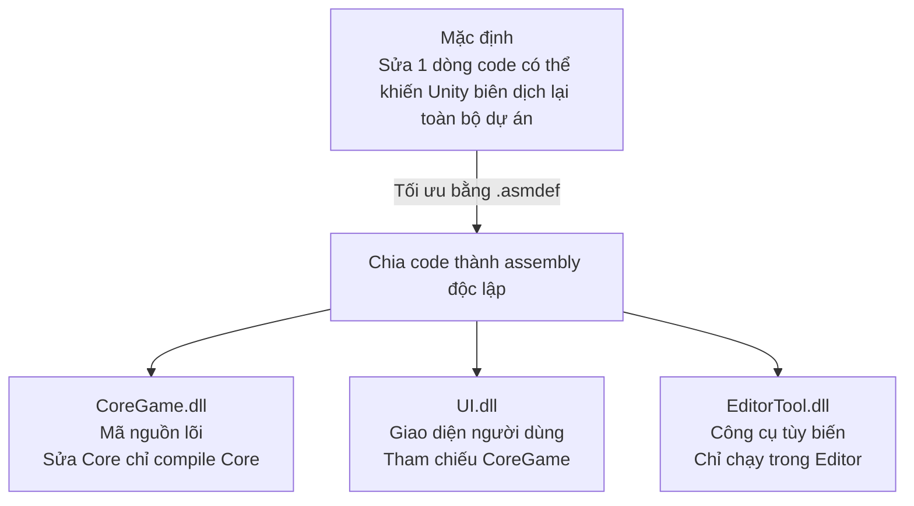

# Assembly Definitions & Packages (Quản lý Cấu trúc Biên dịch và Gói)

> 📖 **Nguồn gốc:** Tài liệu được tổng hợp và biên soạn chi tiết từ [Unity Manual — Assembly definitions](https://docs.unity3d.com/Manual/ScriptCompilationAssemblyDefinitionFiles.html) tương thích với **Unity 6.4 (LTS) ổn định**.

---

## 🎯 Ý định (Intent)

Khi quy mô dự án game tăng lên, lượng code C# của bạn sẽ phình to ra hàng trăm ngàn dòng. Mặc định, Unity biên dịch toàn bộ mã nguồn của dự án vào duy nhất một tệp tin thư viện chung có tên là `Assembly-CSharp.dll`. Việc này khiến thời gian biên dịch lại mỗi khi sửa code cực kỳ lâu. 

Tài liệu này hướng dẫn cách sử dụng **Assembly Definitions (`.asmdef`)** để chia nhỏ mã nguồn thành các module biên dịch độc lập và cách quản lý các gói thư viện mở rộng từ các Registry ngoài.

---

## ⚙️ 1. Assembly Definitions (.asmdef)

`Assembly Definition` (`.asmdef`) là tệp tin cấu hình JSON đặc thù của Unity xác định phạm vi của một cụm mã nguồn để biên dịch nó thành một file `.dll` riêng biệt.



### Các lợi ích cốt lõi của Assembly Definition:
1.  **Tăng tốc độ Biên dịch (Compilation Time):** Khi bạn thay đổi code trong module `UI.asmdef`, Unity chỉ cần biên dịch lại file `UI.dll` đó, hoàn toàn bỏ qua phần core game hay các plugin ngoài giúp tiết kiệm hàng chục giây mỗi lần chỉnh sửa.
2.  **Ràng buộc Kiến trúc (Architecture Isolation):** Giúp tránh lỗi thiết kế spaghetti. Ví dụ: bạn có thể cấu hình không cho phép các lớp trong thư viện Core Game gọi ngược đến các lớp UI để đảm bảo tính phân lớp của dự án (UI references Core, Core cannot reference UI).
3.  **Tách biệt mã Editor-only:** Tạo một file `.asmdef` riêng cho thư mục `Editor` và cấu hình thuộc tính **Platform: Editor**. Việc này thay thế hoàn toàn cho việc đặt script trong thư mục `Editor` truyền thống.

---

## 📦 2. Scoped Registries & Package Manifest

Unity Package Manager (UPM) sử dụng tệp tin cấu hình `Packages/manifest.json` để quản lý các gói tài nguyên bổ sung của dự án.
*   **Scoped Registries:** Cho phép bạn liên kết dự án với các cổng phân phối Package cộng đồng của bên thứ ba (như **OpenUPM**) để tải các thư viện mở rộng phi chính thức một cách an toàn và tự động cập nhật qua Package Manager UI.

---

## 🎮 Mã nguồn thực chiến (Cấu hình JSON)

Dưới đây là nội dung mẫu cấu hình của một file **`CoreGame.asmdef`** (quản lý code game lõi sử dụng New Input System package) và tệp tin **`Packages/manifest.json`** có cấu hình Scoped Registry cho OpenUPM.

### File 1: Tệp cấu hình Assembly `CoreGame.asmdef` (Lưu dưới dạng văn bản JSON)
```json
{
    "name": "CoreGame",
    "rootNamespace": "Game.Core",
    "references": [
        "GUID:75469ad4d38634e559750d17036d5f7c"
    ],
    "includePlatforms": [],
    "excludePlatforms": [],
    "allowUnsafeCode": false,
    "overrideReferences": false,
    "precompiledReferences": [],
    "autoReferenced": true,
    "defineConstraints": [],
    "versionDefines": [],
    "noEngineReferences": false
}
```
*Giải nghĩa:* Thuộc tính `"references"` chứa mã GUID trỏ đến `Unity.InputSystem.asmdef` để báo hiệu module CoreGame của bạn có quyền sử dụng các API của Input System mới.

### File 2: Cấu hình `Packages/manifest.json` hỗ trợ nạp OpenUPM Registry
```json
{
  "scopedRegistries": [
    {
      "name": "OpenUPM",
      "url": "https://package.openupm.com",
      "scopes": [
        "com.openupm",
        "com.neuecc.uni-task"
      ]
    }
  ],
  "dependencies": {
    "com.unity.inputsystem": "1.7.0",
    "com.unity.textmeshpro": "3.0.6",
    "com.neuecc.uni-task": "2.5.0",
    "com.unity.modules.ui": "1.0.0"
  }
}
```
*Giải nghĩa:* Cấu hình trên thêm Registry **OpenUPM** vào Package Manager và tự động cài đặt gói tối ưu hóa đa luồng nổi tiếng **UniTask** (`com.neuecc.uni-task`) trực tiếp từ internet.

---
> 📚 **Nguồn gốc:** Nội dung tham khảo từ [Unity Documentation](https://docs.unity3d.com/Manual/index.html) — Bản quyền của Unity Technologies.

| Hướng | Liên kết |
|-------|----------|
| ← Quay lại | [Unity.VisualScripting API (Visual Script)](./01-visual-scripting.md) |
| → Tiếp theo | [Quay lại Lộ trình Tổng quan](../../00-unity-overview.md) |
